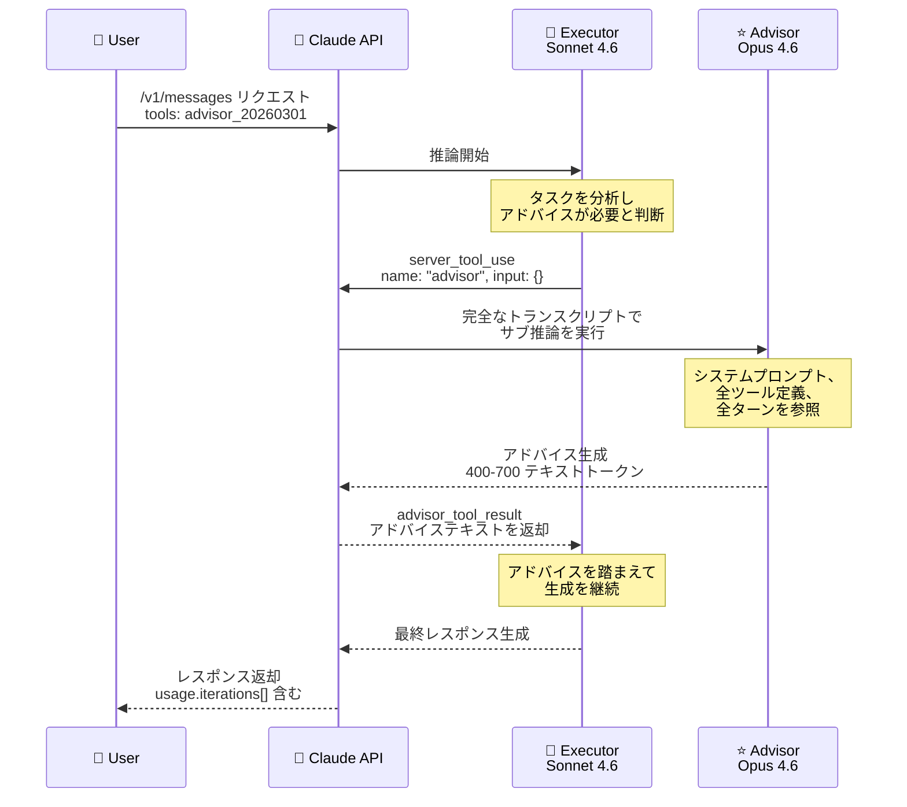

# Claude API 新機能: Advisor Tool (パブリックベータ) -- エグゼキューターモデルにアドバイザーモデルの知性を融合

## メタデータ

| 項目 | 内容 |
|------|------|
| 発表日 | 2026-04-09 |
| ソース | Claude API Release Notes |
| カテゴリ | API 新機能 |
| 公式リンク | https://platform.claude.com/docs/en/agents-and-tools/tool-use/advisor-tool |

## 概要

Anthropic は Claude API の新機能として **Advisor Tool** をパブリックベータで公開した。この機能は、高速で低コストな**エグゼキューターモデル** (Sonnet 4.6、Haiku 4.5 など) が生成途中でより高性能な**アドバイザーモデル** (Opus 4.6) に戦略的な指針を求めることを可能にする。アドバイザーは会話全体のトランスクリプトを読み取り、計画や軌道修正 (通常 400 - 700 テキストトークン、シンキング含め 1,400 - 1,800 トークン) を生成し、エグゼキューターがそのアドバイスを踏まえて処理を継続する。

この仕組みにより、コーディングエージェント、コンピューター操作、マルチステップの調査パイプラインなど、長期間にわたるエージェントワークロードにおいて、アドバイザーモデル単体に近い品質を、エグゼキューターモデルのレートで実現できる。すべての処理は単一の `/v1/messages` リクエスト内で完結し、追加のラウンドトリップは不要である。

## 詳細

### 背景

大規模言語モデルを活用したエージェントシステムでは、タスクの大部分が機械的な処理であっても、適切な計画立案が品質を大きく左右する。従来はタスク全体を最高性能モデル (Opus 4.6) で処理するか、低コストモデル (Sonnet 4.6、Haiku 4.5) で妥協するかの二択であった。Advisor Tool はこの課題を解決するために設計された、新しいモデル連携パターンである。

エグゼキューターモデルが「いつアドバイスを求めるか」を自律的に判断し、通常のツール呼び出しと同じインターフェースでアドバイザーを起動する。これにより、開発者は複雑なオーケストレーションロジックを実装することなく、コストと品質の最適なバランスを実現できる。

### 主な変更点

1. **新しいツールタイプの追加**: `advisor_20260301` タイプのサーバーサイドツールが Messages API に追加された
2. **モデル間連携**: エグゼキューターモデルとアドバイザーモデルのペアリングにより、単一リクエスト内でマルチモデル推論が可能に
3. **自律的な呼び出し判断**: エグゼキューターモデルがタスクの複雑さに応じてアドバイザーの呼び出しタイミングを自動で決定
4. **ベータヘッダー**: `advisor-tool-2026-03-01` をリクエストに含めることで利用可能
5. **Zero Data Retention (ZDR) 対応**: ZDR 契約がある組織では、データは API レスポンス返却後に保存されない

### 技術的な詳細

#### 動作の仕組み (4 ステップ)

Advisor Tool は以下の 4 ステップで動作する。

1. **エグゼキューターの呼び出し**: エグゼキューターが `server_tool_use` ブロックを生成する。`name` は `"advisor"`、`input` は空オブジェクト。タイミングはエグゼキューターが決定し、コンテキストはサーバーが供給する
2. **アドバイザーの推論**: Anthropic がサーバーサイドでアドバイザーモデルに対して別途推論を実行する。アドバイザーはシステムプロンプト、全ツール定義、全ターン、全ツール結果を含む完全なトランスクリプトを参照する
3. **アドバイスの返却**: アドバイザーの応答が `advisor_tool_result` ブロックとしてエグゼキューターに返される。シンキングブロックはドロップされ、アドバイステキストのみが到達する
4. **エグゼキューターの継続**: エグゼキューターがアドバイスを踏まえて生成を継続する

#### モデル互換性

アドバイザーはエグゼキューターと同等以上の性能を持つモデルである必要がある。

| エグゼキューターモデル | アドバイザーモデル |
|------------------------|-------------------|
| Claude Haiku 4.5 (`claude-haiku-4-5-20251001`) | Claude Opus 4.6 (`claude-opus-4-6`) |
| Claude Sonnet 4.6 (`claude-sonnet-4-6`) | Claude Opus 4.6 (`claude-opus-4-6`) |
| Claude Opus 4.6 (`claude-opus-4-6`) | Claude Opus 4.6 (`claude-opus-4-6`) |

無効なペアを指定した場合、API は `400 invalid_request_error` を返す。

#### ツールパラメータ

| パラメータ | 型 | デフォルト | 説明 |
|-----------|-----|-----------|------|
| `type` | string | 必須 | `"advisor_20260301"` を指定 |
| `name` | string | 必須 | `"advisor"` を指定 |
| `model` | string | 必須 | アドバイザーモデル ID (例: `"claude-opus-4-6"`)。このモデルのレートで課金される |
| `max_uses` | integer | 無制限 | 1 リクエストあたりのアドバイザー呼び出し上限。上限到達後は `advisor_tool_result_error` (`error_code: "max_uses_exceeded"`) が返される |
| `caching` | object \| null | `null` (無効) | アドバイザーのトランスクリプトに対するプロンプトキャッシングを有効化。形式: `{"type": "ephemeral", "ttl": "5m" \| "1h"}` |

#### レスポンス構造

アドバイザー呼び出しが成功した場合、`server_tool_use` ブロックに続いて `advisor_tool_result` ブロックが返される。

```json
{
  "role": "assistant",
  "content": [
    {
      "type": "text",
      "text": "Let me consult the advisor on this."
    },
    {
      "type": "server_tool_use",
      "id": "srvtoolu_abc123",
      "name": "advisor",
      "input": {}
    },
    {
      "type": "advisor_tool_result",
      "tool_use_id": "srvtoolu_abc123",
      "content": {
        "type": "advisor_result",
        "text": "Use a channel-based coordination pattern..."
      }
    },
    {
      "type": "text",
      "text": "Here's the implementation..."
    }
  ]
}
```

`advisor_tool_result.content` はディスクリミネーテッドユニオンであり、`advisor_result` (平文テキスト) または `advisor_redacted_result` (暗号化コンテンツ) のいずれかとなる。

#### エラーハンドリング

アドバイザー呼び出しが失敗した場合でも、リクエスト自体は失敗しない。エグゼキューターがエラーを確認し、アドバイスなしで処理を継続する。

| エラーコード | 意味 |
|-------------|------|
| `max_uses_exceeded` | `max_uses` の上限に到達 |
| `too_many_requests` | アドバイザーのサブ推論がレートリミットに該当 |
| `overloaded` | アドバイザーのサブ推論がキャパシティ上限に到達 |
| `prompt_too_long` | トランスクリプトがアドバイザーモデルのコンテキストウィンドウを超過 |
| `execution_time_exceeded` | アドバイザーのサブ推論がタイムアウト |
| `unavailable` | その他のアドバイザー障害 |

#### 課金

- アドバイザー呼び出しはアドバイザーモデルのレートで別途課金される
- 使用量は `usage.iterations[]` 配列で報告される
- トップレベルの `usage` フィールドはエグゼキュータートークンのみを反映する
- `iterations` 内の `type: "advisor_message"` はアドバイザーモデルのレートで課金、`type: "message"` はエグゼキューターモデルのレートで課金
- トップレベルの `max_tokens` はエグゼキューター出力にのみ適用され、アドバイザーのサブ推論トークンには適用されない

#### ストリーミング

アドバイザーのサブ推論はストリーミングされない。`server_tool_use` ブロックのクローズ (`content_block_stop`) 後にストリームが一時停止し、アドバイザーの処理完了後に `advisor_tool_result` が単一の `content_block_start` イベントとして到着する。一時停止中は約 30 秒ごとに SSE `ping` キープアライブが送信される。

#### プロンプトキャッシング

2 つの独立したキャッシングレイヤーが存在する。

- **エグゼキューター側キャッシング**: `advisor_tool_result` ブロックに対して通常の `cache_control` ブレークポイントを配置可能
- **アドバイザー側キャッシング**: ツール定義の `caching` パラメータで有効化。会話内の複数回のアドバイザー呼び出し間でプロンプトキャッシングが機能する。3 回以上のアドバイザー呼び出しで損益分岐点に達する

## 開発者への影響

### 対象

- **エージェントシステムを構築している開発者**: コーディングエージェント、コンピューター操作エージェント、マルチステップ調査パイプラインなどを開発中の開発者
- **コスト最適化を求める開発者**: 現在 Opus 4.6 を使用しているが、コスト削減を図りたい開発者 (Sonnet エグゼキューター + Opus アドバイザーで同等品質を低コストで実現)
- **品質向上を求める開発者**: 現在 Haiku 4.5 や Sonnet 4.6 を使用しており、品質を向上させたい開発者

### 必要なアクション

1. **ベータヘッダーの追加**: リクエストに `anthropic-beta: advisor-tool-2026-03-01` ヘッダーを含める
2. **ツール定義の追加**: `tools` 配列に `advisor_20260301` タイプのツールを追加する
3. **SDK の更新**: 最新の Anthropic SDK にアップデートすることを推奨 (Python、TypeScript、Go、C#、PHP、Ruby に対応)
4. **マルチターン会話の対応**: `advisor_tool_result` ブロックを含む完全なアシスタントコンテンツを後続のターンで API に返す必要がある
5. **課金ロジックの更新**: `usage.iterations[]` を使用したコスト追跡ロジックの実装を検討する

### 移行ガイド (該当する場合)

既存のエージェントシステムに Advisor Tool を統合する手順を以下に示す。

1. **ツール配列への追加**: 既存の `tools` 配列に Advisor Tool の定義を追加する。Web Search やカスタムツールと組み合わせ可能

```python
tools = [
    {
        "type": "web_search_20250305",
        "name": "web_search",
        "max_uses": 5,
    },
    {
        "type": "advisor_20260301",
        "name": "advisor",
        "model": "claude-opus-4-6",
    },
    # 既存のカスタムツール
]
```

2. **会話レベルの上限管理**: Advisor Tool には組み込みの会話レベル上限がないため、クライアント側でアドバイザー呼び出し回数をカウントし、上限に達したら `tools` 配列からアドバイザーを削除し、メッセージ履歴から `advisor_tool_result` ブロックを除去する

3. **システムプロンプトの調整**: コーディングタスクでは、公式ドキュメントで推奨されるタイミングガイダンスをシステムプロンプトに追加することで、アドバイザーの効果を最大化できる

4. **コスト最適化**: `max_uses` パラメータでリクエストあたりの上限を設定し、3 回以上の呼び出しが見込まれる長い会話では `caching` を有効化する

## コード例

### Python (基本的な使用方法)

```python
import anthropic

client = anthropic.Anthropic()

response = client.beta.messages.create(
    model="claude-sonnet-4-6",
    max_tokens=4096,
    betas=["advisor-tool-2026-03-01"],
    tools=[
        {
            "type": "advisor_20260301",
            "name": "advisor",
            "model": "claude-opus-4-6",
        }
    ],
    messages=[
        {
            "role": "user",
            "content": "Build a concurrent worker pool in Go with graceful shutdown.",
        }
    ],
)

print(response)
```

### Python (マルチターン会話)

```python
import anthropic

client = anthropic.Anthropic()

tools = [
    {
        "type": "advisor_20260301",
        "name": "advisor",
        "model": "claude-opus-4-6",
    }
]

messages = [
    {
        "role": "user",
        "content": "Build a concurrent worker pool in Go with graceful shutdown.",
    }
]

response = client.beta.messages.create(
    model="claude-sonnet-4-6",
    max_tokens=4096,
    betas=["advisor-tool-2026-03-01"],
    tools=tools,
    messages=messages,
)

# advisor_tool_result ブロックを含む完全なレスポンスを追加
messages.append({"role": "assistant", "content": response.content})

# 会話を継続
messages.append({"role": "user", "content": "Now add a max-in-flight limit of 10."})

response = client.beta.messages.create(
    model="claude-sonnet-4-6",
    max_tokens=4096,
    betas=["advisor-tool-2026-03-01"],
    tools=tools,
    messages=messages,
)
```

### Shell (curl)

```bash
curl https://api.anthropic.com/v1/messages \
    --header "x-api-key: $ANTHROPIC_API_KEY" \
    --header "anthropic-version: 2023-06-01" \
    --header "anthropic-beta: advisor-tool-2026-03-01" \
    --header "content-type: application/json" \
    --data '{
        "model": "claude-sonnet-4-6",
        "max_tokens": 4096,
        "tools": [
            {
                "type": "advisor_20260301",
                "name": "advisor",
                "model": "claude-opus-4-6"
            }
        ],
        "messages": [{
            "role": "user",
            "content": "Build a concurrent worker pool in Go with graceful shutdown."
        }]
    }'
```

## アーキテクチャ図



## 関連リンク

- [Advisor Tool 公式ドキュメント](https://platform.claude.com/docs/en/agents-and-tools/tool-use/advisor-tool)
- [Server Tools ドキュメント](https://platform.claude.com/docs/en/agents-and-tools/tool-use/server-tools)
- [Claude API Release Notes](https://platform.claude.com/docs/en/release-notes/overview)
- [Messages API リファレンス](https://platform.claude.com/docs/en/api/messages)
- [プロンプトキャッシング](https://platform.claude.com/docs/en/build-with-claude/prompt-caching)
- [Token Counting](https://platform.claude.com/docs/en/build-with-claude/token-counting)
- [Batch Processing](https://platform.claude.com/docs/en/build-with-claude/batch-processing)

## まとめ

Advisor Tool は、エージェントシステムにおけるコストと品質のトレードオフに対する革新的なアプローチである。従来の「全タスクを最高性能モデルで処理」または「低コストモデルで妥協」という二択から脱却し、エグゼキューターモデルが必要なタイミングでのみアドバイザーモデルの知性を活用するというハイブリッドパターンを提供する。

特筆すべき設計上の特徴は以下のとおりである。

- **単一リクエスト内で完結**: `/v1/messages` の 1 回のリクエストで全処理が完了し、開発者側での追加的なオーケストレーションが不要
- **自律的な判断**: エグゼキューターがアドバイザーの呼び出しタイミングを自動的に判断するため、複雑な分岐ロジックが不要
- **柔軟なコスト制御**: `max_uses` パラメータやクライアント側のカウントにより、精密なコスト管理が可能
- **既存ツールとの共存**: Web Search やカスタムツールと同じ `tools` 配列で共存可能

Sonnet 4.6 エグゼキューター + Opus 4.6 アドバイザーの組み合わせでは、Opus 単体に近い品質をより低いコストで達成できるとされており、特にコーディングエージェントやマルチステップの調査ワークロードにおいて大きな効果が期待される。現在パブリックベータとして提供されており、ベータヘッダー `advisor-tool-2026-03-01` を付与することで利用を開始できる。
