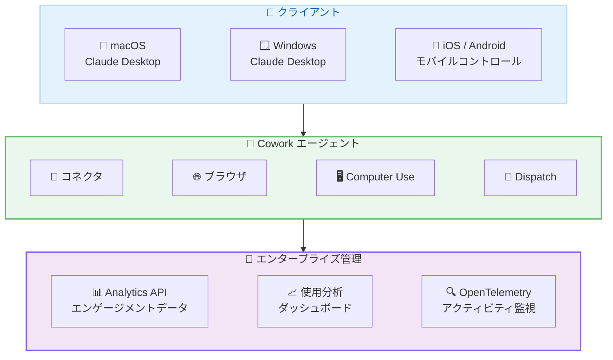

# Claude Cowork が一般提供 (GA) に: macOS / Windows 対応と新しいエンタープライズ機能

## メタデータ

| 項目 | 内容 |
|------|------|
| 発表日 | 2026-04-09 |
| ソース | Claude Apps Release Notes |
| カテゴリ | プロダクトアップデート |
| 公式リンク | https://support.claude.com/en/articles/12138966-release-notes |

## 概要

Anthropic は 2026 年 4 月 9 日、Claude Cowork を一般提供 (GA) として正式リリースしました。Claude Cowork は Claude Desktop アプリを通じて macOS および Windows の両プラットフォームで利用可能になりました。2026 年 3 月頃からリサーチプレビューとして提供されていた本機能が、GA に移行するとともに、Analytics API でのエンゲージメントデータアクセス、Team / Enterprise プラン向け使用分析ダッシュボード、OpenTelemetry によるアクティビティ監視の 3 つの新機能が追加されました。

## 詳細

### 背景

Claude Cowork は、Claude がユーザーのデスクトップ上で協働作業を行うエージェント環境です。コネクタ、ブラウザ操作、Computer Use (画面操作) などのツールを組み合わせてタスクを自律的に遂行します。また、Dispatch 機能によりスマートフォンからタスクを割り当て、ユーザーが離席中でも Claude がコンピュータを操作してタスクを実行できます。

Cowork は 2026 年 3 月頃にリサーチプレビューとして公開され、当初は macOS のみの対応でした。その後、モバイルコントロール (2026 年 3 月 17 日) や Computer Use の統合 (2026 年 3 月 23 日) など、段階的に機能が拡充されてきました。今回の GA リリースにより、Windows への対応が追加されるとともに、エンタープライズ向けの管理・監視機能が整備されました。

### 主な変更点

1. **Claude Cowork の GA リリース**: リサーチプレビューから一般提供に移行し、Claude Desktop アプリを通じて macOS と Windows の両方で利用可能になりました

2. **Analytics API での Cowork データアクセス**: Analytics API を通じて Cowork のエンゲージメントと採用データにアクセスできるようになりました。管理者は組織内での Cowork の利用状況をプログラムで取得し、ダッシュボードやレポートに統合できます

3. **使用分析ダッシュボード**: Team および Enterprise プラン向けに、Cowork の使用分析ダッシュボードが提供されます。組織全体の利用動向、ユーザーごとの使用状況、タスクの種類と完了率などを可視化できます

4. **OpenTelemetry サポート**: OpenTelemetry によるアクティビティ監視が追加されました。既存の監視インフラストラクチャと統合することで、Cowork のパフォーマンスや動作状況をリアルタイムに追跡できます

### 技術的な詳細

#### プラットフォーム対応状況

| プラットフォーム | ステータス | 備考 |
|-----------------|-----------|------|
| macOS | GA | Claude Desktop アプリ経由 |
| Windows | GA (新規) | Claude Desktop アプリ経由 |
| iOS / Android | モバイルコントロール | 永続スレッドでタスク管理 |

#### エンタープライズ機能の概要

| 機能 | 対象プラン | 用途 |
|------|-----------|------|
| Analytics API | Enterprise | エンゲージメントデータの取得 |
| 使用分析ダッシュボード | Team / Enterprise | 使用状況の可視化 |
| OpenTelemetry サポート | Enterprise | アクティビティ監視 |

#### Analytics API

Analytics API により、Cowork のエンゲージメントと採用データをプログラムで取得できます。組織の管理者は、以下のようなデータにアクセス可能です。

- ユーザーごとの Cowork 利用頻度
- タスクの種類別の実行回数
- 組織全体の採用率と利用トレンド

このデータを社内の BI ツールやダッシュボードに統合することで、Cowork の導入効果を定量的に評価できます。

#### OpenTelemetry サポート

OpenTelemetry によるアクティビティ監視では、Cowork のエージェント動作に関するテレメトリデータを標準的なフォーマットで出力します。Datadog、Grafana、New Relic などの既存の監視プラットフォームと統合することで、以下の監視が可能になります。

- エージェントの実行時間とパフォーマンス
- ツール選択の分布 (コネクタ、ブラウザ、Computer Use)
- エラー発生率とリトライ回数

## アーキテクチャ図

### Claude Cowork GA の全体構成

### リサーチプレビューから GA への進化

```mermaid
flowchart LR
    RP(["🔬 リサーチプレビュー<br/>2026 年 3 月"]) --> MC["📱 モバイルコントロール<br/>3 月 17 日"]
    MC --> CU["🖥️ Computer Use 統合<br/>3 月 23 日"]
    CU --> GA(["✅ GA リリース<br/>4 月 9 日"])

    subgraph GAFeatures["🆕 GA で追加された機能"]
        direction LR
        Win["🪟 Windows 対応"]
        API["📊 Analytics API"]
        Dash["📈 使用分析"]
        OTel["🔍 OpenTelemetry"]
        Win ~~~ API ~~~ Dash ~~~ OTel
    end

    GA --> GAFeatures

    classDef preview fill:#FFF3E0,stroke:#FF9800,stroke-width:2px,color:#333333
    classDef milestone fill:#E8F1FF,stroke:#4A90E2,stroke-width:2px,color:#333333
    classDef ga fill:#E9F7EC,stroke:#66BB6A,stroke-width:2px,color:#333333
    classDef features fill:none,stroke:#CCCCCC,stroke-width:2px,color:#666666

    class RP preview
    class MC,CU milestone
    class GA ga
    class GAFeatures features
```

## 開発者への影響

### 対象

- Claude Desktop アプリを macOS または Windows で利用しているユーザー
- Cowork をリサーチプレビューで利用していたユーザー
- Team / Enterprise プランで組織的に Claude を導入している管理者
- 既存の監視インフラストラクチャに Claude の利用状況を統合したいエンジニア

### 必要なアクション

以下の手順で GA 版の Claude Cowork を利用できます。

1. **Claude Desktop アプリの更新**: macOS または Windows の Claude Desktop アプリを最新バージョンに更新してください
2. **Windows ユーザー**: 新たに Windows 版の Claude Desktop アプリで Cowork が利用可能です。最新版をインストールしてください
3. **Team / Enterprise 管理者**: 使用分析ダッシュボードから組織内の Cowork 利用状況を確認できます
4. **Analytics API の利用**: Enterprise プランの管理者は Analytics API を通じて Cowork のエンゲージメントデータをプログラムで取得可能です
5. **OpenTelemetry の設定**: 既存の監視プラットフォームと統合する場合は、OpenTelemetry のセットアップドキュメントを参照してください

## 関連リンク

- [Claude Apps Release Notes](https://support.claude.com/en/articles/12138966-release-notes)
- [Claude Enterprise Analytics API](https://support.claude.com/en/articles/claude-enterprise-analytics-api)
- [Usage Analytics](https://support.claude.com/en/articles/view-usage-analytics)
- [OpenTelemetry Support for Claude Cowork](https://support.claude.com/en/articles/monitor-claude-cowork-otel)
- [Claude Cowork Blog Post](https://www.anthropic.com/news/computer-use-cowork-dispatch)

## まとめ

Claude Cowork がリサーチプレビューを経て一般提供 (GA) となりました。2026 年 3 月のリサーチプレビュー開始から約 1 か月での GA 移行であり、その間にモバイルコントロール、Computer Use 統合、Windows 対応と、急速に機能が拡充されてきました。

今回の GA リリースで最も注目すべき点は、エンタープライズ向け機能の充実です。Analytics API によるエンゲージメントデータの取得、Team / Enterprise プラン向けの使用分析ダッシュボード、OpenTelemetry によるアクティビティ監視の 3 つが追加されたことで、組織的な導入と運用管理の基盤が整いました。これらの機能により、管理者は Cowork の利用状況を定量的に把握し、既存の監視インフラストラクチャと統合して運用できるようになります。

また、Windows 対応の追加により、macOS に限定されていた利用環境が大幅に拡大しました。Windows ユーザーも Claude Desktop アプリを通じて Cowork のすべての機能を利用できるようになります。

Cowork は、コネクタ、ブラウザ操作、Computer Use の 3 層構造によるインテリジェントなツール選択、Dispatch によるリモートタスク管理、永続スレッドによるマルチデバイス対応など、包括的なエージェント環境として成熟しつつあります。GA リリースとエンタープライズ機能の追加により、個人利用だけでなく組織レベルでの本格的な導入が進むことが期待されます。
