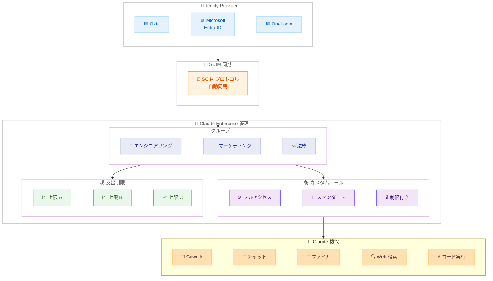

# Enterprise プラン向けロールベースアクセス制御 (RBAC) -- グループ、カスタムロール、SCIM 連携による細粒度アクセス管理

## メタデータ

| 項目 | 内容 |
|------|------|
| 発表日 | 2026-04-09 |
| ソース | Claude Apps Release Notes |
| カテゴリ | エンタープライズ機能 |
| 公式リンク | https://support.claude.com/en/articles/12138966-release-notes |

## 概要

Anthropic は Enterprise プラン向けに**ロールベースアクセス制御 (RBAC)** を正式に導入した。この機能により、管理者はユーザーをグループに整理し、各グループにカスタムロールを割り当てることで、Claude の各機能へのアクセスをきめ細かく制御できるようになる。グループの管理は手動操作に加え、SCIM (System for Cross-domain Identity Management) を介した IdP (Identity Provider) からの自動同期にも対応している。

これにより、大規模な組織においても部門ごとの要件に応じた機能制限や、Claude Cowork の特定チーム向け有効化、グループ単位の支出制限管理が可能となり、セキュリティとガバナンスの要件を満たしながら組織全体での Claude 導入を段階的に拡大できる。

## 詳細

### 背景

Enterprise 環境において AI ツールを組織的に導入する際、以下のような課題が存在していた。

- **全ユーザーに同一権限が付与される問題**: 従来の Enterprise プランでは、組織内の全ユーザーが同じ Claude 機能セットにアクセスできる構成が基本であり、部門ごとの利用方針に合わせた制限が困難であった
- **手動管理の限界**: ユーザー数が増加するにつれ、個別のアクセス管理が運用負荷として顕在化していた
- **IdP との連携不足**: 既存の ID 基盤 (Okta、Microsoft Entra ID、OneLogin など) で管理されているグループ情報を Claude 側に反映する自動化手段が限られていた
- **支出管理の粒度不足**: 組織全体の利用上限は設定できても、部門やチーム単位での支出制御ができなかった

RBAC の導入は、これらの課題を包括的に解決し、Enterprise 顧客がセキュリティポリシーとコスト管理を両立しながら Claude の導入範囲を拡大できるようにするものである。

### 主な変更点

1. **グループ管理**: 管理者がユーザーをグループに整理できるようになった。手動でのグループ作成・ユーザー割り当てに加え、SCIM プロトコルを通じた IdP からの自動同期にも対応している
2. **カスタムロールの作成**: Claude の各機能 (Cowork、API アクセス、ファイルアップロードなど) に対するアクセス権限を定義するカスタムロールを作成し、各グループに割り当てることが可能になった
3. **部門ごとの機能制限**: 部門やチームの業務要件に応じて、利用可能な Claude 機能を制限できる。例えば、エンジニアリングチームには Claude Cowork を有効化しつつ、マーケティングチームにはチャット機能のみを許可するといった構成が可能
4. **SCIM 連携によるグループ自動同期**: Okta、Microsoft Entra ID、OneLogin などの主要な IdP と SCIM プロトコルで連携し、IdP 側で管理しているグループ構成を Claude に自動反映する
5. **Claude Cowork のチームレベル制御**: Claude Cowork (旧 Artifacts を含む協調作業機能) を特定チームに対してのみ有効化または無効化できる
6. **グループ単位の支出制限**: グループごとに利用上限を設定し、部門予算に応じたコスト管理が可能になった

### 技術的な詳細

#### RBAC アーキテクチャ

Enterprise RBAC は以下の 3 層構造で設計されている。

- **ユーザー層**: 組織に所属する個々のユーザー
- **グループ層**: ユーザーをまとめる論理的なグループ (部門、チーム、プロジェクトなど)
- **ロール層**: Claude の機能アクセスを定義するカスタムロール

各ユーザーは 1 つ以上のグループに所属し、各グループには 1 つのカスタムロールが割り当てられる。ユーザーが複数のグループに所属する場合、最も権限の広いロールが適用される (許可的マージ)。

#### SCIM 連携

SCIM (System for Cross-domain Identity Management) は、ユーザーとグループの情報を IdP と Claude 間で自動同期するための業界標準プロトコルである。以下の機能が提供される。

- **グループの自動作成・更新・削除**: IdP 側でグループを変更すると、Claude 側に自動反映される
- **ユーザーの自動プロビジョニング・デプロビジョニング**: 新規ユーザーの追加や退職者の無効化が IdP の操作だけで完結する
- **リアルタイム同期**: IdP での変更が即座に Claude 側に反映される

#### カスタムロールで制御可能な機能

カスタムロールでは、以下の Claude 機能に対するアクセス許可を個別に設定できる。

- Claude チャット (基本的な対話機能)
- Claude Cowork (協調作業機能)
- ファイルアップロードと分析
- Web 検索
- コードの実行とプレビュー
- インテグレーション (外部サービス連携)

#### 支出制限の管理

グループ単位の支出制限では、以下の設定が可能である。

- 月間利用上限の設定
- 利用状況のモニタリング
- 上限到達時の通知と自動制限

## アーキテクチャ図

## 開発者への影響

### 対象

- **Enterprise プランの管理者**: 組織全体のアクセスポリシーを設計・運用する IT 管理者やセキュリティチーム
- **部門マネージャー**: 自チームの Claude 利用範囲と予算を管理する責任者
- **IdP 管理者**: Okta、Microsoft Entra ID、OneLogin などの ID 基盤を管理する担当者
- **コンプライアンス担当者**: 組織のセキュリティポリシーに基づいた AI ツールのガバナンスを担当する人材

### 必要なアクション

1. **アクセスポリシーの設計**: 組織の部門構成と各部門の Claude 利用要件を整理し、必要なグループとカスタムロールの構成を設計する
2. **SCIM 連携の設定** (推奨): 既存の IdP と Claude の SCIM 連携を設定し、グループの自動同期を有効化する。手動管理と比較して運用負荷が大幅に削減される
3. **カスタムロールの作成**: 設計したポリシーに基づいてカスタムロールを作成し、各グループに割り当てる
4. **支出制限の設定**: 部門予算に応じて各グループの支出上限を設定する
5. **段階的なロールアウト**: 小規模なパイロットチームから開始し、利用状況を確認しながら徐々に対象チームを拡大することを推奨する

## 関連リンク

- [Claude Apps Release Notes](https://support.claude.com/en/articles/12138966-release-notes)
- [Setting up role-based permissions](https://support.claude.com/en/articles/role-based-permissions)
- [Managing group spend limits](https://support.claude.com/en/articles/managing-group-spend-limits)
- [Managing custom roles](https://support.claude.com/en/articles/managing-custom-roles)

## まとめ

Enterprise プラン向け RBAC の導入は、大規模組織における Claude の本格展開を支える重要な基盤機能である。以下の点が特に注目に値する。

- **IdP 連携による運用自動化**: SCIM プロトコルを通じた既存 ID 基盤との連携により、ユーザーやグループの管理が IdP 側の操作だけで完結する。手動管理の負荷を大幅に削減し、ヒューマンエラーのリスクを低減できる
- **細粒度のアクセス制御**: カスタムロールにより、Claude Cowork、Web 検索、ファイルアップロードなどの機能を個別に制御できる。部門の業務要件やセキュリティポリシーに合わせた柔軟な構成が可能である
- **段階的な導入の支援**: チームレベルでの Cowork 有効化や部門ごとの機能制限により、組織全体に一括導入するのではなく、パイロットチームから段階的に利用範囲を拡大する運用が容易になった
- **コストガバナンス**: グループ単位の支出制限により、部門予算に応じた利用管理が可能となり、予期しないコスト超過を防止できる

この機能は Enterprise プランの管理者コンソールから即座に利用可能であり、既存の Enterprise 契約に追加料金なく含まれている。組織の規模や複雑さに関わらず、セキュリティ要件を満たしながら Claude の活用を推進するための不可欠なツールとなるだろう。
