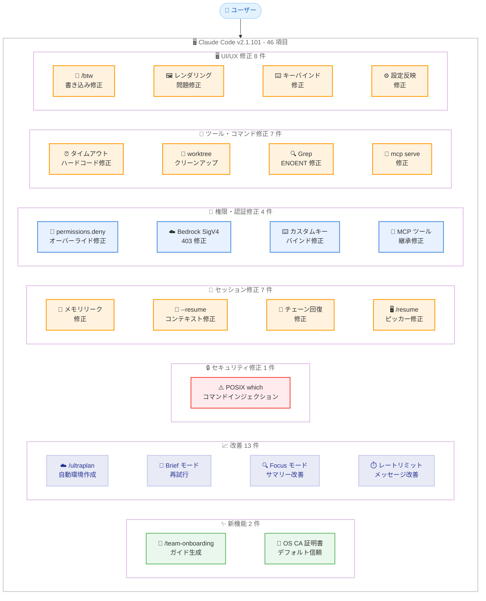
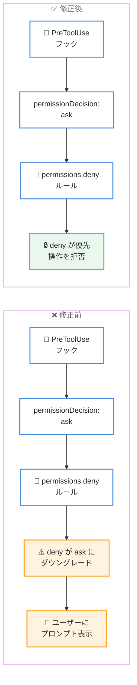
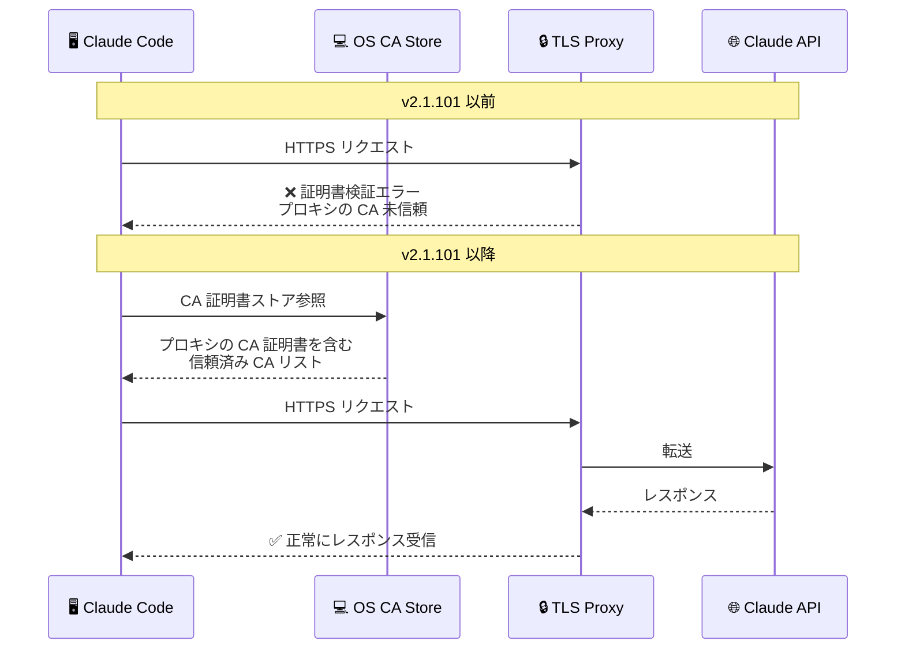

# Claude Code v2.1.101 リリース: 46 項目の大型アップデート、エンタープライズ TLS プロキシ対応とセキュリティ修正を含む 31 件のバグ修正

## メタデータ

| 項目 | 内容 |
|------|------|
| 発表日 | 2026-04-10 |
| ソース | Claude Code Changelog |
| カテゴリ | Claude Code アップデート |
| 公式リンク | https://github.com/anthropics/claude-code/blob/main/CHANGELOG.md |

## 概要

Claude Code v2.1.101 が 2026 年 4 月 10 日にリリースされました。本リリースは新機能 2 件、改善 13 件、バグ修正 31 件 (うちセキュリティ修正 1 件) を含む全 46 項目の大型アップデートです。新機能としては `/team-onboarding` コマンドによるチームメンバー向けオンボーディングガイド生成と、OS CA 証明書ストアのデフォルト信頼によるエンタープライズ TLS プロキシの追加設定不要化が追加されました。改善面では `/ultraplan` のクラウド環境自動作成、Brief モードの再試行改善、Focus モードの自己完結サマリー強化、レートリミットリトライメッセージの可視化向上、SDK `query()` のリソースリーク防止など 13 件の改善が行われています。バグ修正では POSIX `which` フォールバックにおけるコマンドインジェクション脆弱性の修正、長時間セッションのメモリリーク修正、`--resume` / `--continue` の複数の会話コンテキスト喪失問題の修正、Bedrock SigV4 認証の 403 エラー修正、`permissions.deny` ルールが PreToolUse フックの `permissionDecision` を正しくオーバーライドしない問題の修正など、安定性とセキュリティの両面で重要な修正が多数含まれています。

## 詳細

### 背景

Claude Code は Anthropic が提供する CLI ベースの AI 開発支援ツールです。v2.1.101 は同日リリースされた v2.1.98 に続くアップデートであり、エンタープライズ環境での利用を容易にする新機能と、セッション管理・権限システム・プラグイン周りの広範なバグ修正を含みます。特に `/team-onboarding` コマンドはチーム導入を支援する新しいアプローチであり、OS CA 証明書ストアのデフォルト信頼はエンタープライズ TLS プロキシ環境での設定負荷を大幅に削減します。バグ修正の多くは `--resume` / `--continue` によるセッション復元の信頼性向上に集中しており、大規模セッションでの安定性が改善されています。

### 主な変更点

#### 新機能 (Added) - 2 件

- **`/team-onboarding` コマンド**: ローカルの Claude Code 使用状況からチームメンバー向けのオンボーディングガイドを自動生成するコマンドが追加されました。新しいチームメンバーが Claude Code を素早く活用開始できるよう支援します
- **OS CA 証明書ストアのデフォルト信頼**: エンタープライズ TLS プロキシが追加設定なしで動作するようになりました。`CLAUDE_CODE_CERT_STORE=bundled` を設定することでバンドルされた CA のみを使用する従来の動作に戻すことも可能です

#### 改善 (Improved) - 13 件

- **`/ultraplan` のクラウド環境自動作成**: `/ultraplan` およびその他のリモートセッション機能が、Web セットアップを事前に行わなくてもデフォルトのクラウド環境を自動作成するようになりました
- **Brief モードの再試行**: Claude がプレーンテキストで応答した場合に構造化メッセージとして 1 回再試行するようになりました
- **Focus モードのサマリー改善**: ユーザーが最終メッセージのみ閲覧することを Claude が認識し、より自己完結的なサマリーを生成するようになりました
- **ツール未利用エラーの改善**: モデルが現在のコンテキストで利用できないツールを呼び出した際、その理由と対処方法を説明するようになりました
- **レートリミットリトライメッセージの改善**: 不透明な秒数カウントダウンの代わりに、どのリミットに達したか、いつリセットされるかを表示するようになりました
- **拒否エラーメッセージの改善**: API が提供する説明がある場合、それをエラーメッセージに含めるようになりました
- **`claude -p --resume <name>` の改善**: `/rename` や `--name` で設定されたセッションタイトルを受け付けるようになりました
- **設定ファイルの耐障害性向上**: `settings.json` 内の認識されないフックイベント名があってもファイル全体が無視されなくなりました
- **管理設定のプラグインフック**: `allowManagedHooksOnly` が設定されている場合でも、管理設定で強制有効化されたプラグインのフックが実行されるようになりました
- **`/plugin` とマーケットプレイス更新警告**: マーケットプレイスの更新確認が失敗した場合、サイレントにスキップする代わりに警告を表示するようになりました
- **Plan モードの Ultraplan オプション非表示**: ユーザーの組織や認証設定で Claude Code Web にアクセスできない場合、「Refine with Ultraplan」オプションが非表示になるようになりました
- **ベータトレーシングの改善**: `OTEL_LOG_USER_PROMPTS`、`OTEL_LOG_TOOL_DETAILS`、`OTEL_LOG_TOOL_CONTENT` を尊重するようになり、オプトインしない限り機密性の高いスパン属性が出力されなくなりました
- **SDK `query()` のリソースクリーンアップ**: コンシューマーが `for await` から `break` した場合や `await using` を使用した場合に、サブプロセスと一時ファイルが適切にクリーンアップされるようになりました

#### セキュリティ修正 (Fixed - Security) - 1 件

- **POSIX `which` フォールバックのコマンドインジェクション脆弱性修正**: LSP バイナリ検出で使用される POSIX `which` フォールバックにおけるコマンドインジェクション脆弱性が修正されました

#### セッション管理の修正 (Fixed - Session) - 7 件

- **長時間セッションのメモリリーク修正**: 仮想スクローラー内でメッセージリストの履歴コピーが数十個保持されるメモリリークが修正されました
- **`--resume` / `--continue` の会話コンテキスト喪失修正**: 大規模セッションでローダーが行き止まりブランチにアンカーし、ライブ会話のコンテキストが失われる問題が修正されました
- **`--resume` のチェーン回復修正**: サブエージェントメッセージがメインチェーンの書き込みギャップ付近に着地した場合に、無関係なサブエージェント会話にブリッジしてしまう問題が修正されました
- **`--resume` のクラッシュ修正**: 永続化された Edit/Write ツール結果に `file_path` が欠落している場合のクラッシュが修正されました
- **`/resume` ピッカーの複数問題修正**: 他プロジェクトのセッションが表示されない狭いデフォルトビュー、Windows Terminal でのプレビュー到達不能、worktree での誤った cwd、セッション未発見エラーが stderr に表示されない問題、ターミナルタイトルが設定されない問題、再開ヒントがプロンプト入力と重なる問題が修正されました
- **`claude --continue -p` のセッション継続修正**: `-p` や SDK で作成されたセッションを正しく継続するようになりました
- **`--setting-sources` の会話履歴削除修正**: `user` を含まない `--setting-sources` 使用時にバックグラウンドクリーンアップが `cleanupPeriodDays` を無視して 30 日より古い会話履歴を削除する問題が修正されました

#### 権限・認証の修正 (Fixed - Permissions & Auth) - 4 件

- **`permissions.deny` ルールのオーバーライド修正**: PreToolUse フックの `permissionDecision: "ask"` が `permissions.deny` ルールをダウングレードしてプロンプト表示に変更する問題が修正されました。deny ルールが正しく優先されるようになりました
- **Bedrock SigV4 認証の 403 エラー修正**: `ANTHROPIC_AUTH_TOKEN`、`apiKeyHelper`、または `ANTHROPIC_CUSTOM_HEADERS` で Authorization ヘッダーを設定した場合に Bedrock SigV4 認証が 403 で失敗する問題が修正されました
- **カスタムキーバインドのサードパーティプロバイダ対応**: `~/.claude/keybindings.json` のカスタムキーバインドが Bedrock、Vertex、その他のサードパーティプロバイダで読み込まれない問題が修正されました
- **サブエージェントの MCP ツール継承修正**: 動的に注入された MCP サーバーからのツールをサブエージェントが継承しない問題が修正されました

#### ツール・コマンドの修正 (Fixed - Tools & Commands) - 7 件

- **リクエストタイムアウトのハードコード修正**: `API_TIMEOUT_MS` の設定に関わらず 5 分でリクエストを中断するハードコードされたタイムアウトが修正されました。ローカル LLM、Extended Thinking、低速ゲートウェイでの利用が改善されます
- **`claude -w <name>` の "already exists" エラー修正**: 前のセッションの worktree クリーンアップが古いディレクトリを残した場合のエラーが修正されました
- **Bash `mktemp` エラー修正**: 再起動直後にサンドボックス化された Bash コマンドが `mktemp: No such file or directory` で失敗する問題が修正されました
- **`claude mcp serve` のツール呼び出し修正**: `outputSchema` を検証する MCP クライアントで "Tool execution failed" が発生する問題が修正されました
- **`RemoteTrigger` ツールの修正**: `run` アクションが空のボディを送信してサーバーに拒否される問題が修正されました
- **Grep ツールの ENOENT 修正**: 埋め込み ripgrep バイナリパスが古くなった場合 (VS Code 拡張機能の自動更新、macOS App Translocation) に発生する ENOENT エラーが修正され、システムの `rg` にフォールバックしてセッション中に自己修復するようになりました
- **ワーカーツリー内サブエージェントのアクセス修正**: 分離された worktree で実行されるサブエージェントが自身の worktree 内のファイルへの Read/Edit アクセスを拒否される問題が修正されました

#### UI/UX の修正 (Fixed - UI/UX) - 8 件

- **`/btw` のディスク書き込み修正**: `/btw` を使用するたびに会話全体がディスクにコピーされる問題が修正されました
- **`/context` の表示不整合修正**: Free space と Messages breakdown の表示がヘッダーのパーセンテージと一致しない問題が修正されました
- **キーバインドの修正**: `ctrl+]`、`ctrl+\`、`ctrl+^` が C0 制御バイトを送信するターミナル (Terminal.app、デフォルト iTerm2、xterm) で発火しない問題が修正されました
- **`/login` の OAuth URL 表示修正**: パディングによりマウスでの URL 選択が妨げられる問題が修正されました
- **レンダリング問題の修正**: 非フルスクリーンモードでのフリッカー、長時間セッションでのターミナルスクロールバック消失、マウススクロールエスケープシーケンスがプロンプトにテキストとして漏れる問題が修正されました
- **`settings.json` の型エラー修正**: 環境変数の値が文字列ではなく数値の場合のクラッシュが修正されました
- **設定反映の修正**: `/add-dir --remember` や `/config` などのアプリ内設定書き込みがインメモリスナップショットを更新しないため、セッション中に削除されたディレクトリのアクセスが取り消されない問題が修正されました
- **[VS Code] ファイル添付のクリア修正**: 最後のエディタタブを閉じた際にチャット入力下のファイル添付がクリアされない問題が修正されました

#### プラグインの修正 (Fixed - Plugins) - 2 件

- **複数のプラグイン問題の修正**: 重複する `name:` フロントマターでスラッシュコマンドが誤ったプラグインに解決される問題、`/plugin update` が `ENAMETOOLONG` で失敗する問題、Discover がインストール済みプラグインを表示する問題、ディレクトリソースプラグインが古いバージョンキャッシュからロードされる問題、スキルが `context: fork` と `agent` フロントマターフィールドを尊重しない問題が修正されました
- **`/mcp` メニューの修正**: `headersHelper` で設定された MCP サーバーに対して OAuth 固有のアクションが提供される問題が修正され、代わりに Reconnect が表示されるようになりました

#### Remote Control の修正 (Fixed - Remote Control) - 2 件

- **複数の Remote Control 問題の修正**: セッションクラッシュ時に worktree が削除される問題、接続失敗がトランスクリプトに永続化されない問題、ローカルセッションで Brief モードの "Disconnected" インジケーターが誤表示される問題、SSH 環境で `CLAUDE_CODE_ORGANIZATION_UUID` のみが設定されている場合に `/remote-control` が失敗する問題が修正されました
- **`/insights` レポートリンク修正**: レスポンスにレポートファイルリンクが含まれないことがある問題が修正されました

### 技術的な詳細

#### OS CA 証明書ストアのデフォルト信頼

エンタープライズ環境では TLS インスペクションプロキシが一般的であり、これまでは Claude Code がプロキシの CA 証明書を認識しないために接続エラーが発生するケースがありました。v2.1.101 では OS の CA 証明書ストアをデフォルトで信頼するようになり、エンタープライズ TLS プロキシが追加設定なしで動作します。バンドルされた CA のみを使用する従来の動作が必要な場合は、環境変数 `CLAUDE_CODE_CERT_STORE=bundled` を設定します。

#### POSIX `which` フォールバックのコマンドインジェクション修正

LSP バイナリ検出に使用される POSIX `which` フォールバック処理にコマンドインジェクション脆弱性が存在していました。悪意のある入力を含むバイナリ名が `which` コマンドに渡された場合、任意のコマンドが実行される可能性がありました。この修正により入力のサニタイズが適切に行われるようになりました。

#### `permissions.deny` ルールの優先度修正

`permissions.deny` に設定されたルールは、PreToolUse フックが `permissionDecision: "ask"` を返した場合でもオーバーライドされるべきですが、修正前はフックの `ask` 決定により deny ルールがプロンプト表示にダウングレードされていました。これにより、管理者が明示的に拒否したツール操作がユーザーの承認で実行可能になるリスクがありました。修正後は deny ルールが常に優先されます。

#### Bedrock SigV4 認証の修正

AWS Bedrock の SigV4 認証プロセスでは、リクエストヘッダーが署名計算に含まれます。`ANTHROPIC_AUTH_TOKEN`、`apiKeyHelper`、または `ANTHROPIC_CUSTOM_HEADERS` により Authorization ヘッダーが設定されている場合、SigV4 署名と競合して 403 Forbidden エラーが発生していました。修正後は、Bedrock 使用時にこれらのヘッダーが署名プロセスと適切に統合されるようになりました。

#### SDK `query()` のリソースクリーンアップ

SDK の `query()` メソッドは非同期イテレータを返しますが、コンシューマーが `for await` ループから `break` した場合や `await using` 構文を使用した場合に、サブプロセスと一時ファイルが適切にクリーンアップされない問題がありました。これによりリソースリークが発生する可能性がありました。修正後は、イテレータの終了時に自動的にクリーンアップが実行されます。

#### メモリリークの修正

仮想スクローラーのメッセージリスト管理において、メッセージの更新ごとにリスト全体の履歴コピーが保持される問題がありました。長時間セッションでは数十個の履歴コピーが蓄積し、メモリ使用量が大幅に増加していました。修正後は古い履歴コピーが適切にガベージコレクションの対象となります。

## アーキテクチャ図

### v2.1.101 変更点の全体像



### permissions.deny ルールの修正フロー



### エンタープライズ TLS プロキシ対応のフロー



## 開発者への影響

### 対象

- **全ての Claude Code ユーザー**: セキュリティ修正 (コマンドインジェクション脆弱性) と多数のバグ修正が含まれるため、全ユーザーにアップデートを推奨します
- **エンタープライズ環境のユーザー**: OS CA 証明書ストアのデフォルト信頼により、TLS インスペクションプロキシ環境での設定が不要になります
- **チームリーダー / チーム管理者**: `/team-onboarding` コマンドにより、新メンバーのオンボーディングが効率化されます
- **AWS Bedrock ユーザー**: SigV4 認証の 403 エラー修正と、カスタムキーバインドの読み込み問題修正の恩恵を受けます
- **Google Vertex AI ユーザー**: カスタムキーバインドのサードパーティプロバイダ対応修正が適用されます
- **長時間セッションを利用するユーザー**: メモリリーク修正とレンダリング問題修正により安定性が向上します
- **`--resume` / `--continue` を頻繁に使用するユーザー**: セッション復元の信頼性が大幅に改善されました
- **ローカル LLM / 低速ゲートウェイ利用者**: ハードコードされた 5 分タイムアウトの修正により、`API_TIMEOUT_MS` が正しく適用されます
- **SDK 利用者**: `query()` のリソースリーク防止により、長時間稼働するアプリケーションの安定性が向上します
- **権限管理者**: `permissions.deny` ルールが PreToolUse フックに正しく優先されるようになりました
- **プラグイン開発者**: プラグインの複数の問題修正とスキルのフロントマターフィールド対応が改善されました

### 必要なアクション

以下のコマンドで最新バージョンに更新できます。

```bash
# npm でのアップデート
npm update -g @anthropic-ai/claude-code

# Homebrew でのアップデート
brew upgrade claude-code

# 現在のバージョン確認
claude --version
```

**速やかな対応が必要な項目:**

- **全ユーザー**: POSIX `which` フォールバックのコマンドインジェクション脆弱性修正が含まれるため、速やかなアップデートを推奨します
- **権限管理者**: `permissions.deny` ルールが PreToolUse フックの `permissionDecision: "ask"` にダウングレードされていた問題が修正されました。deny ルールが意図通りに動作しているか確認してください
- **Bedrock ユーザー**: `ANTHROPIC_AUTH_TOKEN`、`apiKeyHelper`、`ANTHROPIC_CUSTOM_HEADERS` を使用している場合、SigV4 認証が正しく動作するようになりました

**確認が推奨される項目:**

- **チーム導入**: `/team-onboarding` コマンドを試して、チームメンバー向けのオンボーディングガイドを確認してください
- **エンタープライズ環境**: TLS プロキシ環境で追加の CA 証明書設定が不要になったことを確認してください
- **設定ファイル**: `settings.json` に認識されないフックイベント名が含まれていた場合、ファイル全体が無視されなくなりました

### 移行ガイド (該当する場合)

#### エンタープライズ TLS プロキシ環境

v2.1.101 以降、OS CA 証明書ストアがデフォルトで信頼されます。以前のバージョンでカスタム CA 証明書を設定していた場合は以下を確認してください。

```bash
# 新しいデフォルト動作: OS CA 証明書ストアを信頼
# 追加設定不要

# バンドルされた CA のみを使用する場合 (従来の動作)
export CLAUDE_CODE_CERT_STORE=bundled
```

#### ローカル LLM / 低速ゲートウェイのタイムアウト設定

ハードコードされた 5 分タイムアウトが修正されたため、`API_TIMEOUT_MS` が正しく適用されるようになりました。

```bash
# ローカル LLM など、レスポンスに時間がかかる場合
# 10 分 (600000ms) のタイムアウトを設定
export API_TIMEOUT_MS=600000
```

#### `permissions.deny` ルールの確認

PreToolUse フックとの併用時に deny ルールが正しく動作するようになりました。

```json
{
  "permissions": {
    "deny": [
      "Bash(cmd:rm -rf /)",
      "Write(file_path:/etc/*)"
    ]
  }
}
```

修正後は、PreToolUse フックが `permissionDecision: "ask"` を返しても deny ルールが優先されます。

## コード例

### /team-onboarding コマンドの使用

```bash
# Claude Code 内で /team-onboarding を実行
# ローカルの使用状況からチームメンバー向けガイドが生成される
claude

# Claude Code のプロンプトで以下を入力
> /team-onboarding
```

### OS CA 証明書ストアの設定

```bash
# デフォルト: OS CA 証明書ストアを信頼 (追加設定不要)
claude

# バンドルされた CA のみを使用する場合
CLAUDE_CODE_CERT_STORE=bundled claude
```

### SDK query() のリソースクリーンアップ

```typescript
import { query } from "@anthropic-ai/claude-code";

// for await から break した場合、リソースが自動クリーンアップされる
for await (const message of query({ prompt: "質問内容" })) {
  if (message.type === "result") {
    console.log(message.result);
    break; // サブプロセスと一時ファイルが自動的にクリーンアップされる
  }
}

// await using を使用した場合も同様
{
  await using session = query({ prompt: "質問内容" });
  // スコープ終了時に自動クリーンアップ
}
```

### セッションのタイトル指定と再開

```bash
# セッションにタイトルを付けて実行
claude -p --name "feature-review" "コードをレビューしてください"

# タイトルでセッションを再開 (v2.1.101 で改善)
claude -p --resume "feature-review"
```

### API タイムアウトの設定

```bash
# ローカル LLM や低速ゲートウェイでの使用
# 5 分のハードコードタイムアウトが修正され、
# API_TIMEOUT_MS が正しく適用される
API_TIMEOUT_MS=600000 claude
```

## 関連リンク

- [Claude Code Changelog](https://github.com/anthropics/claude-code/blob/main/CHANGELOG.md)
- [Claude Code GitHub リポジトリ](https://github.com/anthropics/claude-code)
- [Claude Code v2.1.98](./2026-04-10-claude-code-v2-1-98.md)
- [Claude Code v2.1.97](./2026-04-08-claude-code-v2-1-97.md)
- [Claude Code v2.1.96](./2026-04-08-claude-code-v2-1-96.md)
- [Claude Code v2.1.94](./2026-04-07-claude-code-v2-1-94.md)

## まとめ

Claude Code v2.1.101 は、新機能 2 件、改善 13 件、バグ修正 31 件 (うちセキュリティ修正 1 件) を含む全 46 項目の大型リリースです。変更は大きく 4 つの領域にわたります。

第一に、**エンタープライズ対応の強化**が行われました。OS CA 証明書ストアをデフォルトで信頼するようになり、エンタープライズ TLS インスペクションプロキシ環境での追加設定が不要になりました。また `/team-onboarding` コマンドにより、チーム内での Claude Code 導入が効率化されます。

第二に、**13 件の改善**により日常的な使用体験が向上しています。`/ultraplan` のクラウド環境自動作成、Brief モードの再試行、Focus モードの自己完結サマリー、レートリミットリトライメッセージの可視化向上、拒否エラーメッセージの改善、設定ファイルの耐障害性向上、OTEL トレーシングの機密データ制御など、幅広い改善が含まれています。SDK `query()` のリソースクリーンアップにより、プログラマティックな利用時のリソースリークも防止されます。

第三に、**セキュリティと権限管理の修正**が行われました。POSIX `which` フォールバックのコマンドインジェクション脆弱性が修正され、`permissions.deny` ルールが PreToolUse フックに正しく優先されるようになりました。Bedrock SigV4 認証の 403 エラーも修正され、AWS 環境での認証の信頼性が向上しています。

第四に、**セッション管理とツールの信頼性が大幅に改善**されました。長時間セッションのメモリリーク修正、`--resume` / `--continue` の複数の会話コンテキスト喪失問題の修正、`/resume` ピッカーの 6 つの問題修正、ハードコードされた 5 分タイムアウトの修正など、セッション復元とツール実行の安定性が包括的に向上しています。Grep ツールの自己修復機能、サブエージェントの MCP ツール継承修正、プラグインの複数問題修正も含まれています。

全ての Claude Code ユーザーに対してアップデートを推奨します。特にエンタープライズ環境のユーザーは TLS プロキシ対応の恩恵を受け、Bedrock ユーザーは SigV4 認証の修正により安定した利用が可能になります。セキュリティ修正と権限管理の修正も含まれるため、速やかな適用が望ましいリリースです。
