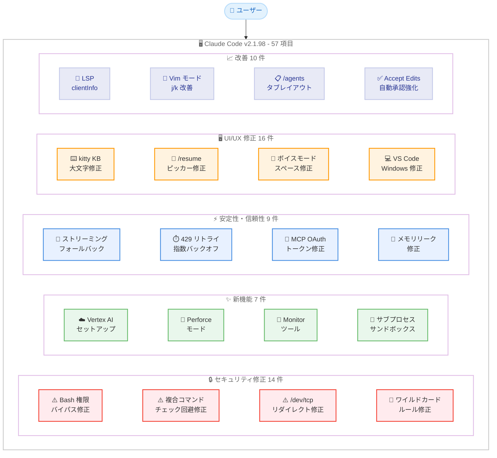
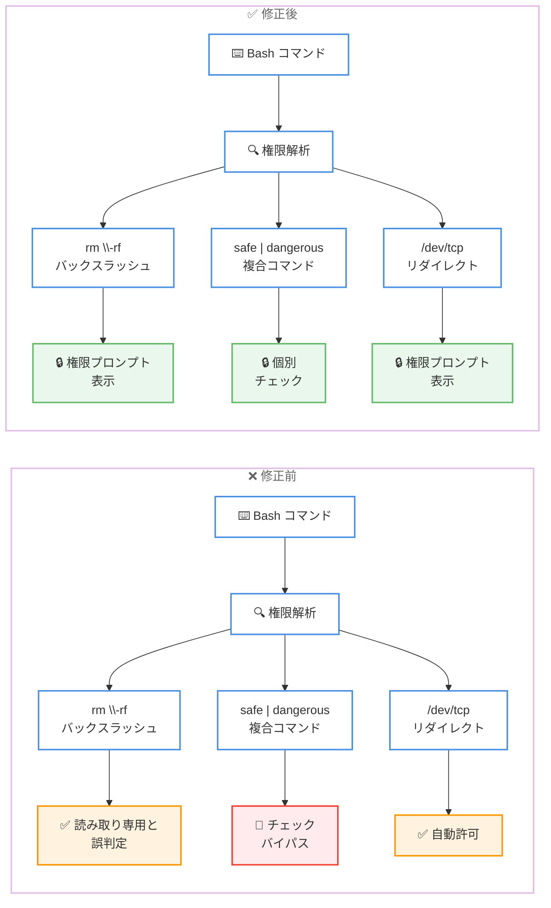
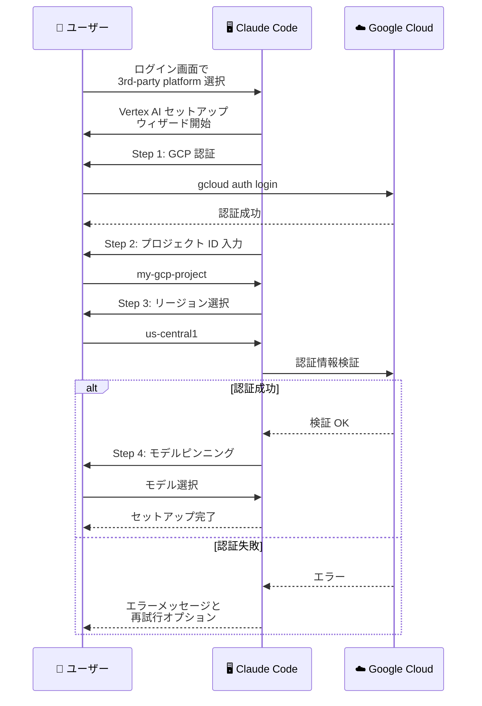

# Claude Code v2.1.98 リリース: 57 項目の大規模アップデート、14 件のセキュリティ修正と Google Vertex AI セットアップウィザード

## メタデータ

| 項目 | 内容 |
|------|------|
| 発表日 | 2026-04-10 |
| ソース | Claude Code Changelog |
| カテゴリ | Claude Code アップデート |
| 公式リンク | https://github.com/anthropics/claude-code/blob/main/CHANGELOG.md |

## 概要

Claude Code v2.1.98 が 2026 年 4 月 10 日にリリースされました。本リリースは新機能 7 件、改善 10 件、バグ修正 43 件以上を含む全 57 項目の大規模アップデートです。最大の注目点は **14 件のセキュリティ修正**であり、Bash ツールの権限バイパス、複合コマンドのセキュリティチェック回避、`/dev/tcp` や `/dev/udp` へのリダイレクト許可漏れなど、任意コード実行につながる重大な脆弱性が修正されています。新機能としては、Google Vertex AI のインタラクティブセットアップウィザード、`CLAUDE_CODE_PERFORCE_MODE` 環境変数による Perforce 対応、バックグラウンドスクリプトの Monitor ツール、PID namespace 分離によるサブプロセスサンドボックスが追加されました。安定性面では、ストリーミングレスポンスのタイムアウト時フォールバック、429 リトライの指数バックオフ改善、MCP OAuth トークンリフレッシュの修正が行われています。全ての Claude Code ユーザーに対して、特にセキュリティ修正の重要性から、速やかなアップデートを強く推奨します。

## 詳細

### 背景

Claude Code は Anthropic が提供する CLI ベースの AI 開発支援ツールです。v2.1.98 は v2.1.97 からの継続的なアップデートですが、57 項目という規模は近年のリリースの中でも最大級です。特に 14 件のセキュリティ修正は、権限システムの根本的な堅牢化を目的としており、Bash ツールの権限バイパス、複合コマンドのチェック回避、ワイルドカードルールのマッチング不備など、自動モードやバイパスパーミッションモードで任意コード実行につながる可能性のある脆弱性が包括的に修正されています。新機能面では Google Vertex AI や Perforce への対応が追加され、エンタープライズ環境での利用範囲が拡大しています。

### 主な変更点

#### 新機能 (Added) - 7 件

- **Google Vertex AI セットアップウィザード**: ログイン画面の「3rd-party platform」選択時にインタラクティブな Google Vertex AI セットアップウィザードが利用可能になりました。GCP 認証、プロジェクトとリージョンの設定、認証情報の検証、モデルピンニングを対話的にガイドします
- **`CLAUDE_CODE_PERFORCE_MODE` 環境変数**: この環境変数を設定すると、Edit/Write/NotebookEdit が読み取り専用ファイルに対して黙って上書きする代わりに `p4 edit` のヒントを表示してエラーを返すようになります。Perforce を使用するプロジェクトでの安全性が向上します
- **Monitor ツール**: バックグラウンドスクリプトからイベントをストリーミングするための新しい Monitor ツールが追加されました
- **サブプロセスサンドボックス**: `CLAUDE_CODE_SUBPROCESS_ENV_SCRUB` 設定時に Linux 上で PID namespace 分離によるサブプロセスサンドボックスが有効になります。また `CLAUDE_CODE_SCRIPT_CAPS` 環境変数でセッションごとのスクリプト実行回数を制限できます
- **`--exclude-dynamic-system-prompt-sections` フラグ**: print モードでの新フラグで、動的なシステムプロンプトセクションを除外することにより、異なるユーザー間でのプロンプトキャッシュ効率が改善されます
- **`workspace.git_worktree` ステータスライン JSON 入力**: 現在のディレクトリがリンクされた git worktree 内にある場合、ステータスライン JSON 入力に `workspace.git_worktree` が設定されるようになりました
- **W3C `TRACEPARENT` 環境変数**: OTEL トレーシング有効時に Bash ツールのサブプロセスに W3C `TRACEPARENT` 環境変数が設定され、子プロセスのスパンが Claude Code のトレースツリーに正しく紐付けられるようになりました

#### 変更・改善 (Changed / Improved) - 10 件

- **LSP `clientInfo` 識別**: Claude Code が言語サーバーへの initialize リクエストで `clientInfo` を通じて自身を識別するようになりました
- **フッターインジケーターの改善**: Focus、通知などのインジケーターが狭いターミナル幅でもモードインジケーター行に留まり、折り返さなくなりました
- **`/reload-plugins` の改善**: プラグイン提供のスキルを再起動なしで取得できるようになりました
- **Vim モードの改善**: NORMAL モードでの `j`/`k` キーが履歴ナビゲーションとフッターピルの選択に対応しました
- **トランスクリプト精度の向上**: エントリがストリーミングプレースホルダーではなく最終トークン使用量を保持するようになりました
- **`/claude-api` スキルの更新**: Claude API に加えて Managed Agents もカバーするようになりました
- **`/resume` フィルターヒントの改善**: ラベルの改善とプロジェクト名、worktree 名、ブランチ名の表示が追加されました
- **`/agents` のタブレイアウト**: Running タブと Library タブによるタブ付きレイアウトに改善されました
- **Accept Edits モードの自動承認強化**: 安全な環境変数がプレフィックスされたファイルシステムコマンドを自動承認するようになりました
- **フックエラーの改善**: 自己診断のために stderr の最初の行が含まれるようになりました
- **OTEL トレーシングの改善**: インタラクションスパンがフルターンを正しくラップするようになりました
- **`DISABLE_COMPACT` 時の `/compact` ヒント非表示**: `DISABLE_COMPACT` が設定されている場合、`/compact` のヒントが表示されなくなりました

#### セキュリティ修正 (Fixed - Security) - 14 件

以下のセキュリティ修正は全て重要であり、特に自動モード (`--dangerously-skip-permissions`) やバイパスパーミッションモードを使用している環境では速やかな適用が必須です。

1. **Bash ツール権限バイパスの修正**: バックスラッシュエスケープされたフラグが読み取り専用として自動許可され、任意コード実行につながる脆弱性を修正しました
2. **複合 Bash コマンドのセキュリティチェック回避修正**: 複合 Bash コマンドが自動モードおよびバイパスパーミッションモードで強制権限プロンプトのセキュリティチェックおよび明示的な ask ルールをバイパスする問題を修正しました
3. **環境変数プレフィックス付きコマンドの権限チェック**: 読み取り専用コマンドに環境変数プレフィックスが付いている場合、既知の安全な変数 (`LANG`、`TZ`、`NO_COLOR` など) 以外ではプロンプトが表示されるようになりました
4. **`/dev/tcp` および `/dev/udp` リダイレクトの権限チェック**: `/dev/tcp/...` や `/dev/udp/...` へのリダイレクトが自動許可される代わりに権限プロンプトが表示されるようになりました
5. **`--dangerously-skip-permissions` のサイレントダウングレード修正**: Bash 経由で保護パスへの書き込みを承認した後、`--dangerously-skip-permissions` がサイレントに accept-edits モードにダウングレードされる問題を修正しました
6. **managed-settings の allow ルール即時反映**: 管理者が削除した managed-settings の allow ルールがプロセス再起動まで有効なまま残る問題を修正しました
7. **`permissions.additionalDirectories` のセッション中反映**: `permissions.additionalDirectories` の変更がセッション中に適用されない問題を修正しました
8. **`additionalDirectories` と `--add-dir` の競合修正**: `additionalDirectories` からディレクトリを削除した際、`--add-dir` で渡された同じディレクトリへのアクセスまで取り消される問題を修正しました
9. **Bash ワイルドカード権限ルールのマッチング修正**: `Bash(cmd:*)` や `Bash(git commit *)` のワイルドカード権限ルールが余分なスペースやタブを含むコマンドにマッチしない問題を修正しました
10. **`Bash(...)` deny ルールのダウングレード修正**: `cd` を含むパイプコマンドで deny ルールがプロンプトにダウングレードされる問題を修正しました
11. **Bash 権限の誤検出修正**: `cut -d /`、`paste -d /`、`column -s /`、`awk '{print $1}' file`、およびファイル名に `%` を含む場合の誤った権限プロンプトを修正しました
12. **JavaScript プロトタイププロパティ名の権限ルール修正**: `toString` などの名前を持つ権限ルールにより `settings.json` がサイレントに無視される問題を修正しました
13. **エージェントチームメンバーの権限継承修正**: `--dangerously-skip-permissions` 使用時にエージェントチームメンバーがリーダーの権限モードを継承しない問題を修正しました
14. **`grep -f` / `rg -f` の権限チェック**: Bash の `grep -f FILE` / `rg -f FILE` で作業ディレクトリ外のパターンファイルを読み取る際に権限プロンプトが表示されるようになりました

#### 安定性・信頼性の修正 (Fixed - Stability & Reliability) - 9 件

- **ストリーミングレスポンスのフォールバック**: ストリーミングレスポンスが停止した場合、タイムアウトする代わりに非ストリーミングモードにフォールバックするようになりました
- **429 リトライの指数バックオフ改善**: サーバーが小さな `Retry-After` 値を返した場合に全リトライが約 13 秒で消費されてしまう問題を修正。指数バックオフが最小値として適用されるようになりました
- **MCP OAuth トークンリフレッシュ修正**: `oauth.authServerMetadataUrl` が再起動後のトークンリフレッシュ時に正しく参照されない問題を修正しました。ADFS などの IdP で影響がありました
- **Remote Control メモリリーク修正**: Remote Control の権限ハンドラーエントリがセッションの存続期間中保持されるメモリリークを修正しました
- **バックグラウンドサブエージェントのエラー報告**: エラーで失敗したバックグラウンドサブエージェントが部分的な進捗を親エージェントに報告するようになりました
- **Stop/SubagentStop フックの長時間セッション対応**: 長時間セッションでプロンプトタイプ Stop/SubagentStop のフックが失敗する問題を修正しました
- **サブエージェント worktree クリーンアップの改善**: 未追跡ファイルを含む worktree が誤って削除される問題を修正しました
- **`sandbox.network.allowMachLookup` の macOS 対応**: macOS で `sandbox.network.allowMachLookup` が正しく適用されるようになりました
- **`CLAUDE_CODE_MAX_CONTEXT_TOKENS` と `DISABLE_COMPACT` の連携修正**: `CLAUDE_CODE_MAX_CONTEXT_TOKENS` が `DISABLE_COMPACT` 設定を正しく尊重するようになりました

#### UI/UX の修正 (Fixed - UI/UX) - 16 件

- **kitty キーボードプロトコルでの大文字入力修正**: xterm および VS Code 統合ターミナルで kitty キーボードプロトコルが有効な場合に大文字が小文字に変換される問題を修正しました
- **macOS テキスト置換の修正**: macOS のテキスト置換機能がトリガーワードの代わりに置換テキストを挿入するよう修正しました
- **フルスクリーンモードの MCP ツール結果クラッシュ修正**: フルスクリーンモードで MCP ツール結果にホバーした際のクラッシュを修正しました
- **フルスクリーンモードの URL コピー修正**: フルスクリーンモードで折り返された URL をコピーする際に改行位置にスペースが挿入される問題を修正しました
- **`--resume` 時の大容量ファイル diff 修正**: `--resume` 時に 10 KB を超えるファイルの edit diff が UI から消失する問題を修正しました
- **`/resume` ピッカーの複数問題修正**: `/resume` ピッカーに関する複数の問題が修正されました
- **`/export` の絶対パスと `~` 対応**: `/export` が絶対パスと `~` を正しく処理するようになりました
- **`/effort max` の将来モデル ID 対応**: `/effort max` が不明または将来のモデル ID で拒否される問題を修正しました
- **スラッシュコマンドピッカーの YAML ブーリアン修正**: プラグインのフロントマター `name` が YAML のブーリアンキーワードの場合にスラッシュコマンドピッカーが壊れる問題を修正しました
- **レートリミットアップセルテキストの表示修正**: メッセージ再マウント後にレートリミットのアップセルテキストが非表示になる問題を修正しました
- **MCP ツールの `_meta` トークン制限バイパス**: `_meta["anthropic/maxResultSizeChars"]` を持つ MCP ツールがトークンベースの永続化レイヤーをバイパスしない問題を修正しました
- **ボイスモードのスペース文字リーク修正**: プッシュトゥトークキーを再ホールドした際に大量のスペース文字がリークする問題を修正しました
- **`DISABLE_AUTOUPDATER` の完全対応**: `DISABLE_AUTOUPDATER` が npm レジストリのバージョンチェックを完全に抑制するようになりました
- **フィードバックサーベイの表示修正**: フィードバックサーベイ非表示時のレンダリング問題を修正しました
- **VS Code Windows での git-bash エラー修正**: VS Code for Windows で発生していた誤った「requires git-bash」エラーを修正しました

### 技術的な詳細

#### セキュリティ修正の技術的背景

本リリースの 14 件のセキュリティ修正は、Claude Code の権限システムにおける複数のバイパス経路を包括的に封鎖するものです。

**Bash ツール権限バイパス (バックスラッシュエスケープ)**: Bash ツールでバックスラッシュエスケープされたフラグ (例: `rm \-rf`) が読み取り専用コマンドとして自動許可されていました。これにより、エスケープされたフラグを含む任意のコマンドが権限チェックを回避して実行される可能性がありました。

**複合コマンドのセキュリティチェック回避**: パイプ (`|`)、セミコロン (`;`)、`&&` などで連結された複合 Bash コマンドが、自動モードおよびバイパスパーミッションモードにおいて個別コマンドに対する強制権限プロンプトやセキュリティチェックをバイパスしていました。これにより、安全なコマンドと危険なコマンドを組み合わせることで権限チェックを回避できる可能性がありました。

**`/dev/tcp` および `/dev/udp` リダイレクト**: Bash の特殊ファイル `/dev/tcp/HOST/PORT` や `/dev/udp/HOST/PORT` へのリダイレクトが自動許可されていたため、意図しないネットワーク接続が権限チェックなしで実行される可能性がありました。

**ワイルドカード権限ルールのマッチング**: `Bash(cmd:*)` や `Bash(git commit *)` のようなワイルドカードルールがコマンド内の余分なスペースやタブにより正しくマッチしない問題がありました。これにより、意図したルールが適用されない場合がありました。

#### Google Vertex AI セットアップウィザード

新しいインタラクティブウィザードは、以下のステップで Google Vertex AI の設定を対話的にガイドします。

1. **GCP 認証**: `gcloud auth login` を使用した認証の確認と設定
2. **プロジェクト設定**: GCP プロジェクト ID の入力と検証
3. **リージョン設定**: Vertex AI が利用可能なリージョンの選択
4. **認証情報検証**: 設定された認証情報でのアクセス確認
5. **モデルピンニング**: 使用するモデルの固定設定

#### サブプロセスサンドボックス

`CLAUDE_CODE_SUBPROCESS_ENV_SCRUB` 環境変数を設定すると、Linux 上で PID namespace 分離が有効になり、サブプロセスのセキュリティが強化されます。さらに `CLAUDE_CODE_SCRIPT_CAPS` 環境変数でセッションごとのスクリプト実行回数を制限でき、悪意のあるスクリプトの反復実行を防止できます。

#### Perforce 対応

`CLAUDE_CODE_PERFORCE_MODE` を設定することで、Perforce を使用するプロジェクトでの作業が安全になります。Edit、Write、NotebookEdit ツールが読み取り専用ファイルを検出した場合、黙って上書きする代わりに `p4 edit` コマンドの実行を促すエラーメッセージを返します。

#### 429 リトライの指数バックオフ改善

v2.1.97 で導入された指数バックオフが引き続き改善されています。サーバーが小さな `Retry-After` 値 (例: 1 秒) を返した場合でも、指数バックオフの計算値が最小値として適用されるため、リトライ間隔が適切に拡大されます。これにより、全リトライが短時間で消費される問題が解消されました。

## アーキテクチャ図

### v2.1.98 変更点の全体像



### セキュリティ修正: Bash 権限バイパスの封鎖フロー



### Google Vertex AI セットアップウィザードのフロー



## 開発者への影響

### 対象

- **全ての Claude Code ユーザー**: 14 件のセキュリティ修正は全ユーザーに影響します。特に `--dangerously-skip-permissions` や自動モードを使用している環境では重要度が最も高い修正です
- **Google Cloud / Vertex AI ユーザー**: 新しいセットアップウィザードにより Vertex AI の設定が大幅に簡素化されます
- **Perforce ユーザー**: `CLAUDE_CODE_PERFORCE_MODE` により、Perforce 管理下のファイルへの意図しない上書きを防止できます
- **エンタープライズ環境のユーザー**: サブプロセスサンドボックスとスクリプト実行回数制限により、セキュリティポリシーへの準拠が容易になります
- **MCP サーバーを利用するユーザー**: OAuth トークンリフレッシュの修正やメモリリーク修正の恩恵を受けます
- **kitty ターミナルユーザー**: kitty キーボードプロトコルでの大文字入力問題が修正されました
- **macOS ユーザー**: テキスト置換機能の修正とサンドボックス改善が行われました
- **Windows / VS Code ユーザー**: git-bash エラーの誤検出が修正されました
- **Vim モードユーザー**: `j`/`k` キーの改善により操作性が向上します

### 必要なアクション

以下のコマンドで最新バージョンに更新できます。

```bash
# npm でのアップデート
npm update -g @anthropic-ai/claude-code

# Homebrew でのアップデート
brew upgrade claude-code

# 現在のバージョン確認
claude --version
```

**速やかな対応が必要な項目:**

- **全ユーザー**: 14 件のセキュリティ修正が含まれるため、速やかなアップデートを強く推奨します。特に Bash ツールの権限バイパス、複合コマンドのチェック回避、`/dev/tcp` リダイレクトの自動許可は、任意コード実行につながる重大な脆弱性です
- **自動モードユーザー**: `--dangerously-skip-permissions` のサイレントダウングレード修正と、エージェントチームメンバーの権限継承修正を確認してください
- **権限ルール使用者**: `toString` 等の JavaScript プロトタイププロパティ名を権限ルールに使用していた場合、`settings.json` がサイレントに無視されていた可能性があります。設定が正しく適用されているか確認してください

**確認が推奨される項目:**

- **Vertex AI ユーザー**: 新しいセットアップウィザードを試してみてください
- **Perforce ユーザー**: `CLAUDE_CODE_PERFORCE_MODE` 環境変数を設定して安全性を向上させてください
- **セキュリティ重視の環境**: `CLAUDE_CODE_SUBPROCESS_ENV_SCRUB` と `CLAUDE_CODE_SCRIPT_CAPS` の設定を検討してください

### 移行ガイド (該当する場合)

#### Bash 権限ルールの確認

ワイルドカード権限ルールのマッチングが修正されたため、既存のルールが正しく動作しているか確認してください。

```json
{
  "permissions": {
    "allow": [
      "Bash(cmd:git commit *)",
      "Bash(cmd:npm test *)"
    ]
  }
}
```

修正後は、コマンド内の余分なスペースやタブがあっても正しくマッチするようになりました。

#### Perforce モードの設定

Perforce を使用するプロジェクトでは、以下の環境変数を設定します。

```bash
export CLAUDE_CODE_PERFORCE_MODE=1
```

#### サブプロセスサンドボックスの設定

Linux 環境でサブプロセスのセキュリティを強化する場合は以下を設定します。

```bash
# PID namespace 分離を有効化
export CLAUDE_CODE_SUBPROCESS_ENV_SCRUB=1

# セッションごとのスクリプト実行回数を制限
export CLAUDE_CODE_SCRIPT_CAPS=100
```

## コード例

### Google Vertex AI のセットアップ

```bash
# Claude Code を起動し、ログイン画面で
# "3rd-party platform" を選択すると
# Vertex AI セットアップウィザードが開始されます
claude

# 事前に GCP CLI での認証が必要
gcloud auth login
gcloud config set project YOUR_PROJECT_ID
```

### Perforce モードの使用

```bash
# Perforce モードを有効化して Claude Code を起動
CLAUDE_CODE_PERFORCE_MODE=1 claude

# 読み取り専用ファイルに対する Edit/Write が
# "p4 edit" のヒントを表示してエラーを返す
```

### サブプロセスサンドボックスの設定

```bash
# PID namespace 分離とスクリプト実行回数制限を設定
export CLAUDE_CODE_SUBPROCESS_ENV_SCRUB=1
export CLAUDE_CODE_SCRIPT_CAPS=50

claude
```

### プロンプトキャッシュの最適化

```bash
# 動的なシステムプロンプトセクションを除外して
# クロスユーザーのプロンプトキャッシュを改善
claude --print --exclude-dynamic-system-prompt-sections "質問内容"
```

### Monitor ツールによるバックグラウンドイベントのストリーミング

```bash
# Claude Code 内でバックグラウンドスクリプトを実行し
# Monitor ツールでイベントをリアルタイム監視
# (Claude Code のツール呼び出しとして利用)
```

### OTEL トレーシングとの連携

```bash
# OTEL トレーシングを有効にして起動
# サブプロセスに W3C TRACEPARENT が自動設定される
OTEL_EXPORTER_OTLP_ENDPOINT=http://localhost:4317 claude
```

## 関連リンク

- [Claude Code Changelog](https://github.com/anthropics/claude-code/blob/main/CHANGELOG.md)
- [Claude Code GitHub リポジトリ](https://github.com/anthropics/claude-code)
- [Claude Code v2.1.97](./2026-04-08-claude-code-v2-1-97.md)
- [Claude Code v2.1.96](./2026-04-08-claude-code-v2-1-96.md)
- [Claude Code v2.1.94](./2026-04-07-claude-code-v2-1-94.md)
- [Claude Code v2.1.92](./2026-04-04-claude-code-v2-1-92.md)
- [Google Cloud Vertex AI ドキュメント](https://cloud.google.com/vertex-ai/docs)

## まとめ

Claude Code v2.1.98 は、新機能 7 件、改善 10 件、バグ修正 43 件以上を含む全 57 項目の大規模リリースです。変更は大きく 5 つの領域にわたります。

第一に、**14 件のセキュリティ修正**が本リリースの最重要ポイントです。Bash ツールのバックスラッシュエスケープによる権限バイパス、複合コマンドのセキュリティチェック回避、`/dev/tcp` や `/dev/udp` へのリダイレクト自動許可、ワイルドカード権限ルールのマッチング不備など、任意コード実行につながる可能性のある重大な脆弱性が包括的に修正されています。自動モードやバイパスパーミッションモードを使用している環境では特に影響が大きく、速やかなアップデートが必須です。

第二に、**7 件の新機能**が追加されました。Google Vertex AI のインタラクティブセットアップウィザードにより、エンタープライズ環境での Vertex AI 設定が大幅に簡素化されます。`CLAUDE_CODE_PERFORCE_MODE` による Perforce 対応、PID namespace 分離によるサブプロセスサンドボックス、バックグラウンドスクリプト用の Monitor ツールなど、エンタープライズユースケースを強化する機能が充実しています。

第三に、**安定性・信頼性の改善** 9 件が行われました。ストリーミングレスポンスのタイムアウト時に非ストリーミングモードへフォールバックする機能、429 リトライの指数バックオフ改善、MCP OAuth トークンリフレッシュの修正、Remote Control のメモリリーク修正など、長時間セッションの安定性が向上しています。

第四に、**16 件の UI/UX 修正**が行われました。kitty キーボードプロトコルでの大文字入力、macOS テキスト置換、フルスクリーンモードのクラッシュ、`/resume` ピッカーの複数問題、ボイスモードのスペース文字リーク、VS Code Windows の git-bash エラーなど、幅広いプラットフォームと環境での問題が解消されています。

第五に、**10 件の改善**により日常的な使用体験が向上しています。LSP `clientInfo` による言語サーバー識別、Vim モードの `j`/`k` ナビゲーション改善、`/agents` のタブレイアウト、Accept Edits モードの自動承認強化、`/reload-plugins` でのスキル再読み込み、OTEL トレーシングの改善など、開発ワークフロー全体の品質が向上しています。

全ての Claude Code ユーザーに対して速やかなアップデートを強く推奨します。特にセキュリティ修正は任意コード実行に関わる重大な脆弱性の修正を含むため、自動モードやバイパスパーミッションモードを使用している環境では最優先で適用してください。
