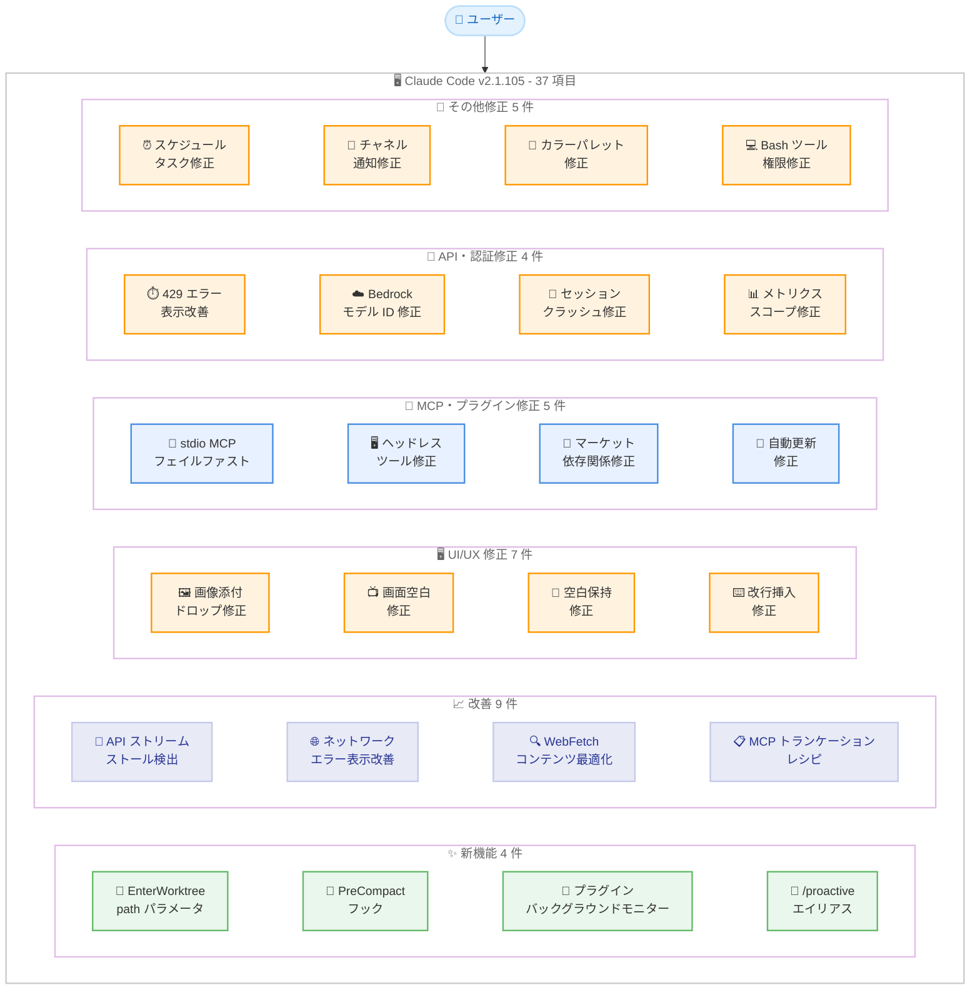
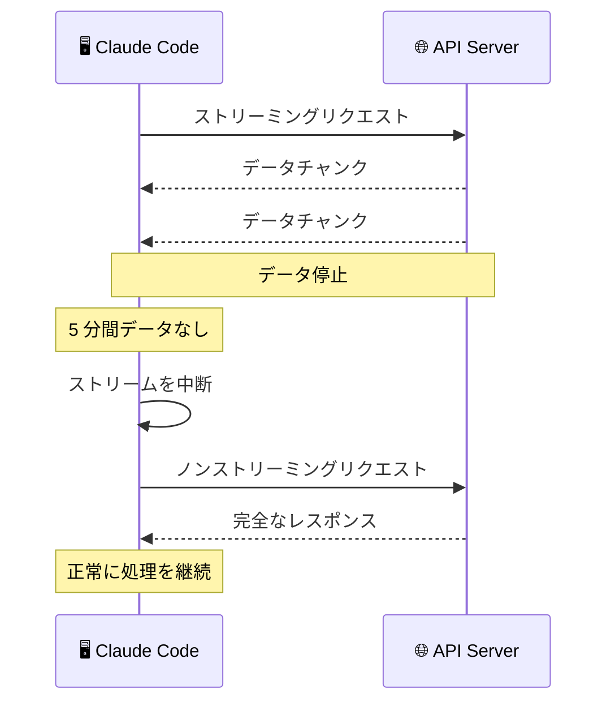
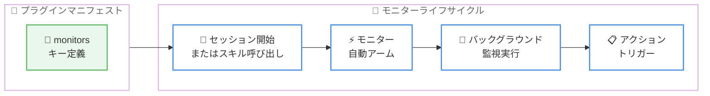

# Claude Code v2.1.105 リリース: プラグインバックグラウンドモニター、PreCompact フック、ストリーム安定性改善を含む 37 件の変更

## メタデータ

| 項目 | 内容 |
|------|------|
| 発表日 | 2026-04-13 |
| ソース | Claude Code Changelog |
| カテゴリ | Claude Code アップデート |
| 公式リンク | https://github.com/anthropics/claude-code/blob/main/CHANGELOG.md |

## 概要

Claude Code v2.1.105 が 2026 年 4 月 13 日にリリースされました。前バージョン v2.1.101 (2026 年 4 月 10 日) から 3 日後のリリースであり、中間に v2.1.104 (2026 年 4 月 12 日) がホットフィックスとしてリリースされています。本リリースは新機能 4 件、改善 9 件、バグ修正 24 件の合計 37 項目を含む大規模アップデートです。

新機能として、`EnterWorktree` ツールへの `path` パラメータ追加、PreCompact フックによるコンパクション制御、プラグイン向けバックグラウンドモニターサポート、`/proactive` コマンドエイリアスが追加されました。改善面では、API ストリームのストール検出と自動リトライ、ネットワークエラーメッセージの即時表示、`WebFetch` の `<style>` / `<script>` タグ除去によるコンテンツバジェットの効率化、MCP 大容量出力のフォーマット別トランケーションレシピなどが含まれています。

バグ修正ではキューメッセージへの画像添付のドロップ修正、フルスクリーンモードでの先頭空白の保持、MCP サーバーの安定性向上、Team/Enterprise ユーザー向けチャネル通知の修正、マーケットプレイスプラグインの依存関係自動インストールと自動更新の修正など、幅広い領域で安定性が向上しています。

## 詳細

### 背景

Claude Code は Anthropic が提供する CLI ベースの AI 開発支援ツールです。v2.1.105 は v2.1.101 に続くメジャーアップデートであり、プラグインシステムの拡張、ワークツリー管理の柔軟性向上、ストリーム処理の堅牢化、MCP 接続の信頼性改善が主要なテーマです。v2.1.104 はホットフィックスとして 2026 年 4 月 12 日にリリースされましたが、Changelog には記載されていません。

### 主な変更点

#### 新機能 (Added) - 4 件

- **`EnterWorktree` ツールに `path` パラメータ追加**: 既存のワークツリーに直接切り替えるための `path` パラメータが `EnterWorktree` ツールに追加されました。現在のリポジトリの既存ワークツリーを指定して即座に切り替えることが可能になります
- **PreCompact フックサポート**: フックがコンパクションをブロックできるようになりました。終了コード 2 または `{"decision":"block"}` を返すことで、自動コンパクションの実行を制御できます
- **プラグインバックグラウンドモニター**: プラグインマニフェストにトップレベルの `monitors` キーを追加することで、セッション開始時またはスキル呼び出し時に自動的にバックグラウンドモニターを起動できるようになりました
- **`/proactive` コマンドエイリアス**: `/proactive` が `/loop` のエイリアスとして追加されました

#### 改善 (Improved) - 9 件

- **API ストリームのストール検出**: 5 分間データが受信されないストリームを自動的に中断し、ストリーミングではなくノンストリーミングでリトライするようになりました。無限ハングを防止します
- **ネットワークエラーメッセージの改善**: 接続エラー時にサイレントスピナーの代わりにリトライメッセージを即座に表示するようになりました
- **ファイル書き込み表示の改善**: 長い 1 行の書き込み (圧縮 JSON など) が UI 上でトランケーションされるようになり、多数のページにわたるスクロールが不要になりました
- **`/doctor` レイアウトの改善**: ステータスアイコンが追加され、`f` キーを押すことで報告された問題を Claude に修正させることが可能になりました
- **`/config` ラベルの改善**: ラベルと説明文がより明確になりました
- **スキル説明文の上限引き上げ**: リスティング時の文字数上限が 250 文字から 1,536 文字に引き上げられ、説明文がトランケーションされる場合には起動時に警告が表示されるようになりました
- **`WebFetch` のコンテンツ最適化**: 取得ページから `<style>` および `<script>` タグの内容が除去されるようになりました。CSS を多用するページでコンテンツバジェットが実際のテキストに到達する前に枯渇する問題が解消されます
- **古いエージェントワークツリーのクリーンアップ改善**: PR がスカッシュマージされたワークツリーが無期限に保持されず、適切にクリーンアップされるようになりました
- **MCP 大容量出力のトランケーションプロンプト改善**: フォーマット別のレシピが提供されるようになりました (JSON の場合は `jq`、テキストの場合は計算された Read チャンクサイズなど)

#### バグ修正 (Fixed) - 24 件

**UI/UX 修正 - 7 件:**

- **キューメッセージの画像添付修正**: Claude が作業中に送信されたキューメッセージに添付された画像がドロップされる問題が修正されました
- **プロンプト入力折り返し時の画面空白修正**: 長い会話でプロンプト入力が 2 行目に折り返される際に画面が空白になる問題が修正されました
- **フルスクリーンモードの先頭空白コピー修正**: フルスクリーンモードで複数行のアシスタント応答を選択した際に先頭の空白がコピーされる問題が修正されました
- **アシスタントメッセージの先頭空白トリミング修正**: アシスタントメッセージの先頭空白がトリミングされ、ASCII アートやインデントされたダイアグラムが崩れる問題が修正されました
- **Bash 出力の文字化け修正**: Python の `rich` / `loguru` ロギングなどがクリック可能なファイルリンクを出力する際に Bash 出力が文字化けする問題が修正されました
- **改行挿入のキーバインド修正**: ESC プレフィックス alt エンコーディングを使用するターミナルで `alt+enter` による改行挿入が機能しない問題、および `Ctrl+J` による改行挿入が機能しない問題が修正されました (v2.1.100 でのリグレッション)
- **`/help` の表示修正**: ターミナル高さが低い場合にタブバー、Shortcuts 見出し、フッターが表示されなくなる問題が修正されました

**ワークツリー・セッション修正 - 3 件:**

- **`EnterWorktree` / `ExitWorktree` の重複テキスト修正**: ツール表示における "Creating worktree" テキストの重複が修正されました
- **フォーカスモードのキューメッセージ修正**: キューに入れられたユーザープロンプトがフォーカスモードから消失する問題が修正されました
- **セッション再開ヒントの表示修正**: `/resume`、`--worktree`、`/branch` の後に終了した際に "Resume this session with..." ヒントが表示されない問題が修正されました

**MCP・プラグイン修正 - 5 件:**

- **stdio MCP サーバーの不正出力修正**: MCP サーバーが不正な (非 JSON の) 出力を送信した場合、セッションがハングする代わりに "Connection closed" でフェイルファストするようになりました
- **ヘッドレスセッションの MCP ツール修正**: ヘッドレス / リモートトリガーセッションの最初のターンで MCP サーバーが非同期接続する際にツールが利用できない問題が修正されました
- **マーケットプレイスプラグインの依存関係インストール修正**: `package.json` とロックファイルを持つマーケットプレイスプラグインのインストール / 更新後に依存関係が自動インストールされない問題が修正されました
- **マーケットプレイス自動更新の修正**: プラグインプロセスが更新中にファイルを開いたまま保持している場合に、公式マーケットプレイスが壊れた状態になる問題が修正されました
- **`keybindings.json` の不正エントリ検出**: 不正なキーバインドエントリがサイレントにロードされる代わりに、明確なエラーメッセージで拒否されるようになりました

**API・認証修正 - 4 件:**

- **429 レートリミットエラー表示の改善**: API キー、Bedrock、Vertex ユーザーに対して、生の JSON ダンプの代わりにクリーンなメッセージが表示されるようになりました
- **Bedrock `/model` ピッカーの修正**: 非 US リージョンの AWS Bedrock で推論プロファイルディスカバリが進行中の場合に無効な `us.*` モデル ID が `settings.json` に保存される問題が修正されました
- **セッション再開時のクラッシュ修正**: 不正なテキストブロックを含むセッションを再開した際のクラッシュが修正されました
- **`CLAUDE_CODE_DISABLE_NONESSENTIAL_TRAFFIC` のスコープ修正**: 1 つのプロジェクトの設定で全プロジェクトの使用量メトリクスが恒久的に無効化される問題が修正されました

**スケジュール・通知修正 - 2 件:**

- **ワンショットスケジュールタスクの再発防止**: ファイルウォッチャーが実行後のクリーンアップを検出できない場合にタスクが繰り返し再実行される問題が修正されました
- **Team/Enterprise チャネル通知の修正**: 最初のメッセージ以降のインバウンドチャネル通知がサイレントにドロップされる問題が修正されました

**その他の修正 - 3 件:**

- **フィードバック調査ショートカットの誤発火修正**: プロンプト末尾で入力された文字がフィードバック調査のショートカットキーとして発火する問題が修正されました
- **SSH/mosh 環境のカラーパレット修正**: Ghostty、Kitty、Alacritty、WezTerm、foot、rio、Contour で SSH/mosh 経由接続時に 16 色パレットが色あせる問題が修正されました
- **Bash ツールの権限モード提案修正**: プランモード終了時に `acceptEdits` パーミッションモードを提案することで、より高い権限レベルからダウングレードされる問題が修正されました

### 技術的な詳細

#### PreCompact フックのコンパクション制御

Claude Code のコンパクション (会話コンテキストの圧縮) は自動的に実行されますが、v2.1.105 では PreCompact フックを使用してコンパクションの実行をブロックできるようになりました。フックが終了コード 2 で終了するか、`{"decision":"block"}` を返した場合、コンパクションはスキップされます。これにより、特定の条件下でコンテキストの圧縮を防止し、重要な情報の保持を保証できます。

#### プラグインバックグラウンドモニター

プラグインマニフェストにトップレベルの `monitors` キーを追加することで、バックグラウンドモニターを定義できるようになりました。モニターはセッション開始時またはスキル呼び出し時に自動的にアームされ、バックグラウンドでの監視タスクを実行します。これにより、プラグインがセッション中に継続的にステータスを監視し、必要に応じてアクションを実行できるようになります。

#### API ストリームのストール検出とリトライ

従来、API ストリームがデータを送信せずに停止した場合、クライアントは無限にハングする可能性がありました。v2.1.105 では 5 分間データが受信されない場合にストリームを自動的に中断し、ノンストリーミングモードでリクエストをリトライします。これにより、ネットワークの不安定な環境でも操作の継続性が保証されます。

#### WebFetch のコンテンツ最適化

`WebFetch` ツールが取得した HTML ページから `<style>` および `<script>` タグの内容を除去するようになりました。CSS を多用するページでは、これらのタグがコンテンツバジェットの大部分を消費し、実際のテキストコンテンツが取得できないケースがありました。この改善により、ページの本文テキストが優先的に取得されます。

#### MCP サーバー接続の安定性向上

2 つの MCP 関連の修正が行われました。第一に、stdio MCP サーバーが不正な (非 JSON の) 出力を送信した場合、セッション全体がハングする代わりに "Connection closed" で即座に失敗するようになりました。第二に、ヘッドレス / リモートトリガーセッションの最初のターンで MCP サーバーが非同期接続する際にツールが利用できない問題が修正されました。これにより、MCP 接続のエッジケースでの信頼性が大幅に向上しています。

## アーキテクチャ図

### v2.1.105 変更点の全体像



### API ストリームのストール検出フロー



### プラグインバックグラウンドモニターのライフサイクル



## 開発者への影響

### 対象

- **全ての Claude Code ユーザー**: 24 件のバグ修正と 9 件の改善により、全体的な安定性と使用体験が向上しています。アップデートを推奨します
- **プラグイン開発者**: バックグラウンドモニターサポートにより、セッション中の継続的な監視機能をプラグインに組み込めるようになりました。マーケットプレイスプラグインの依存関係インストールと自動更新の修正も含まれています
- **ワークツリーを活用するユーザー**: `EnterWorktree` の `path` パラメータにより、既存ワークツリーへの切り替えが効率化されました。古いワークツリーのクリーンアップも改善されています
- **フック / 自動化を利用するユーザー**: PreCompact フックによりコンパクションの実行を制御できるようになりました
- **MCP サーバーを利用するユーザー**: stdio MCP サーバーの不正出力対応、ヘッドレスセッションのツール可用性、大容量出力のトランケーションレシピなど、MCP 接続の信頼性が大幅に向上しています
- **AWS Bedrock ユーザー**: 非 US リージョンでの `/model` ピッカーのモデル ID 保存問題が修正されました
- **Team/Enterprise ユーザー**: インバウンドチャネル通知が最初のメッセージ以降もドロップされなくなりました
- **SSH/mosh 経由で接続するユーザー**: Ghostty、Kitty、Alacritty、WezTerm、foot、rio、Contour でのカラーパレット修正の恩恵を受けます

### 必要なアクション

以下のコマンドで最新バージョンに更新できます。

```bash
# npm でのアップデート
npm update -g @anthropic-ai/claude-code

# Homebrew でのアップデート
brew upgrade claude-code

# 現在のバージョン確認
claude --version
```

**確認が推奨される項目:**

- **プラグイン開発者**: `monitors` マニフェストキーを活用してバックグラウンドモニター機能を検討してください
- **フック利用者**: PreCompact フックでコンパクションを制御する必要がある場合は、終了コード 2 または `{"decision":"block"}` を使用してください
- **Bedrock 非 US リージョン利用者**: `settings.json` に無効な `us.*` モデル ID が保存されていないか確認してください。必要に応じて `/model` ピッカーで再選択してください

### 移行ガイド (該当する場合)

#### PreCompact フックの設定

コンパクションの実行を制御するフックを設定できます。

```json
{
  "hooks": {
    "PreCompact": [
      {
        "matcher": "",
        "hooks": [
          {
            "type": "command",
            "command": "/path/to/check-compact.sh"
          }
        ]
      }
    ]
  }
}
```

フックスクリプトの終了コードによってコンパクションの動作が変わります。

```bash
#!/bin/bash
# コンパクションをブロックする場合
exit 2

# または JSON レスポンスで制御
echo '{"decision":"block"}'
exit 0
```

#### プラグインバックグラウンドモニターの設定

プラグインマニフェストにトップレベルの `monitors` キーを追加します。

```json
{
  "name": "my-plugin",
  "monitors": {
    "my-monitor": {
      "description": "バックグラウンドで状態を監視"
    }
  }
}
```

#### EnterWorktree の path パラメータ

既存のワークツリーに直接切り替えできるようになりました。

```bash
# Claude Code のプロンプトで EnterWorktree ツールが
# path パラメータを使用して既存ワークツリーに切り替え可能
# エージェントが自動的にこのパラメータを活用します
```

## コード例

### PreCompact フックの実装

```bash
#!/bin/bash
# pre-compact-check.sh
# コンパクション前に重要なコンテキストの有無をチェック

# 条件に基づいてコンパクションをブロック
if [ -f ".no-compact" ]; then
  echo '{"decision":"block"}'
  exit 0
fi

# コンパクションを許可
exit 0
```

### settings.json でのフック設定

```json
{
  "hooks": {
    "PreCompact": [
      {
        "matcher": "",
        "hooks": [
          {
            "type": "command",
            "command": "bash /path/to/pre-compact-check.sh"
          }
        ]
      }
    ]
  }
}
```

### Bedrock 非 US リージョンでのモデル再選択

```bash
# settings.json に無効なモデル ID が保存されている場合
# Claude Code 内で /model を実行して再選択
claude

# Claude Code のプロンプトで以下を入力
> /model
# 正しいリージョンのモデルを選択
```

## 関連リンク

- [Claude Code Changelog](https://github.com/anthropics/claude-code/blob/main/CHANGELOG.md)
- [Claude Code GitHub リポジトリ](https://github.com/anthropics/claude-code)
- [Claude Code v2.1.101](./2026-04-10-claude-code-v2-1-101.md)
- [Claude Code v2.1.98](./2026-04-10-claude-code-v2-1-98.md)
- [Claude Code v2.1.97](./2026-04-08-claude-code-v2-1-97.md)

## まとめ

Claude Code v2.1.105 は、新機能 4 件、改善 9 件、バグ修正 24 件の合計 37 項目を含む大規模リリースです。変更は大きく 4 つの領域にわたります。

第一に、**プラグインシステムの拡張**が行われました。バックグラウンドモニターサポートにより、プラグインがセッション中に継続的な監視機能を提供できるようになりました。マーケットプレイスプラグインの依存関係自動インストールと自動更新の信頼性も向上しています。

第二に、**ワークツリー管理の柔軟性が向上**しました。`EnterWorktree` ツールの `path` パラメータにより既存ワークツリーへの直接切り替えが可能になり、スカッシュマージされた PR のワークツリーが適切にクリーンアップされるようになりました。

第三に、**ストリーム処理とネットワーク通信の堅牢化**が行われました。5 分間のストール検出による自動リトライ、接続エラーメッセージの即時表示、429 レートリミットエラーのクリーンな表示により、不安定なネットワーク環境での使用体験が大幅に改善されています。

第四に、**MCP 接続の信頼性が向上**しました。stdio MCP サーバーの不正出力に対するフェイルファスト、ヘッドレスセッションでのツール可用性の確保、大容量出力に対するフォーマット別トランケーションレシピの提供により、MCP エコシステムとの統合がより堅牢になっています。

その他にも、PreCompact フックによるコンパクション制御、`WebFetch` のコンテンツ最適化、Team/Enterprise チャネル通知の修正、SSH/mosh 環境のカラーパレット修正など、幅広い改善とバグ修正が含まれています。全ての Claude Code ユーザーに対してアップデートを推奨します。
