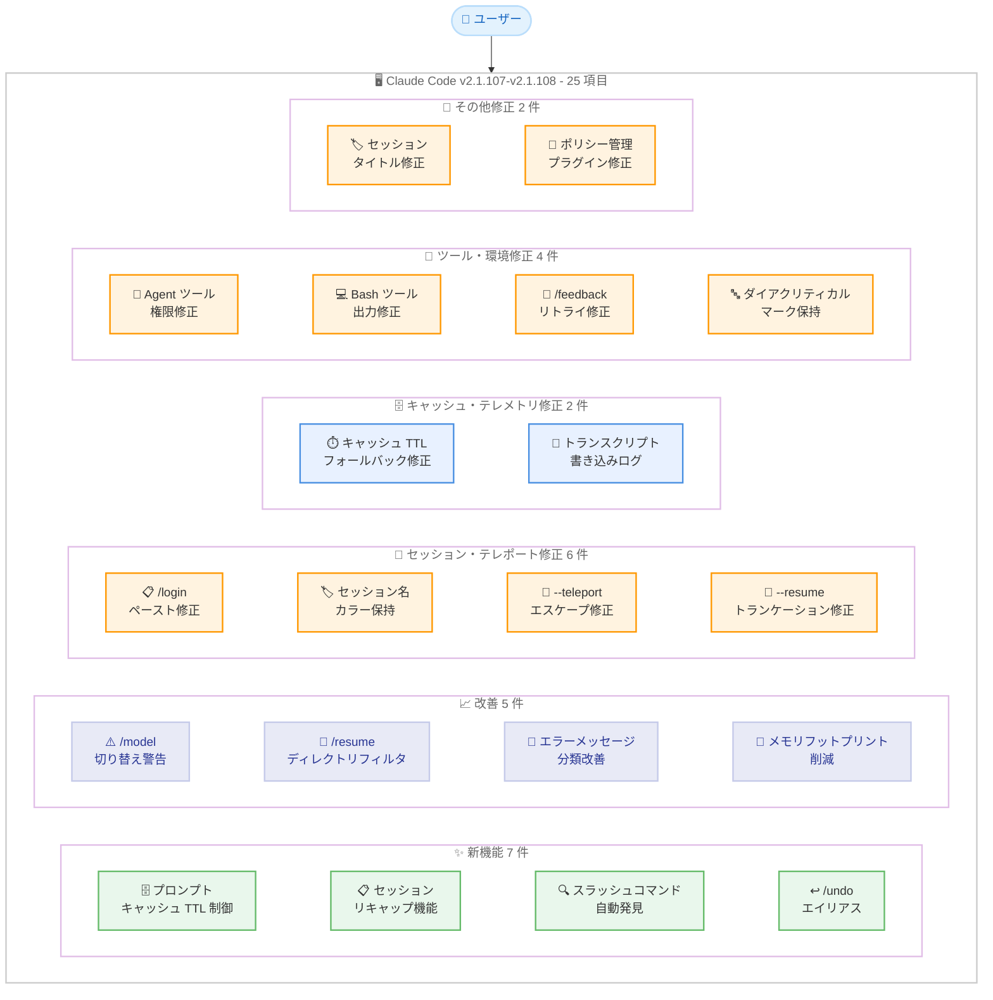
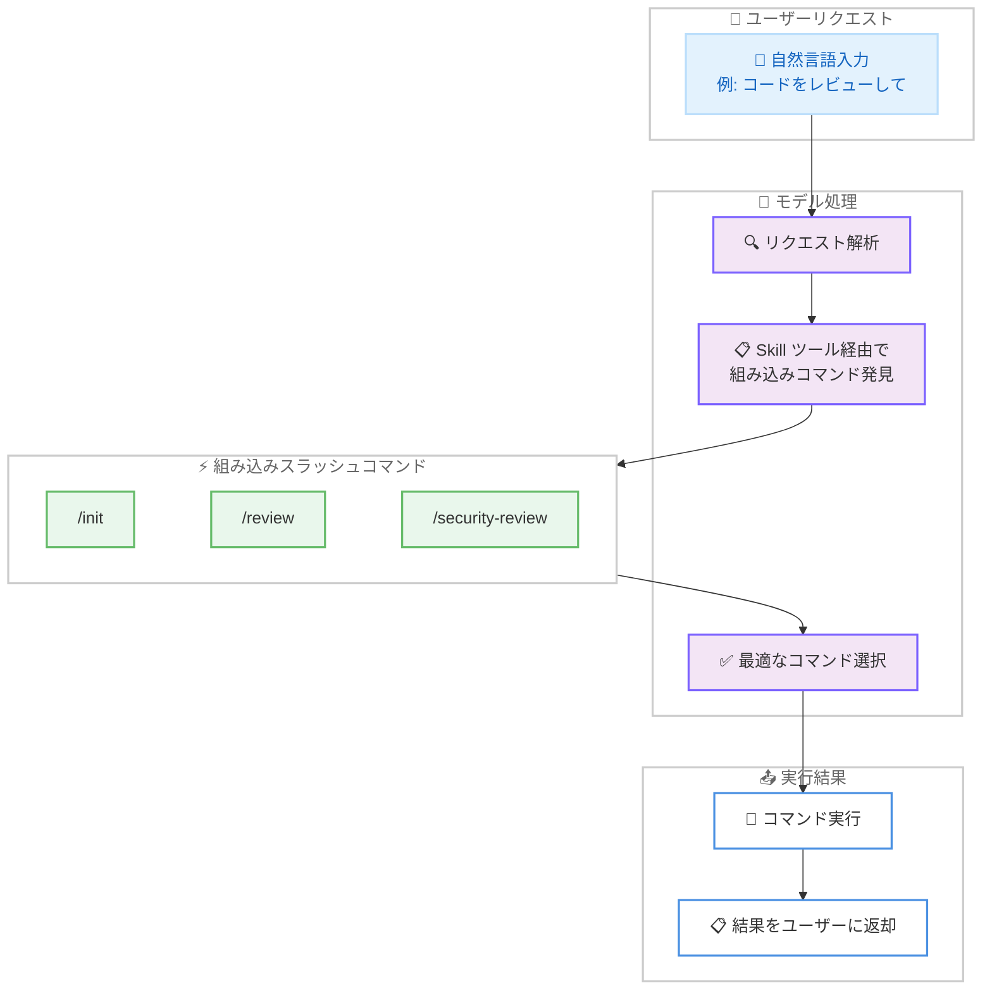
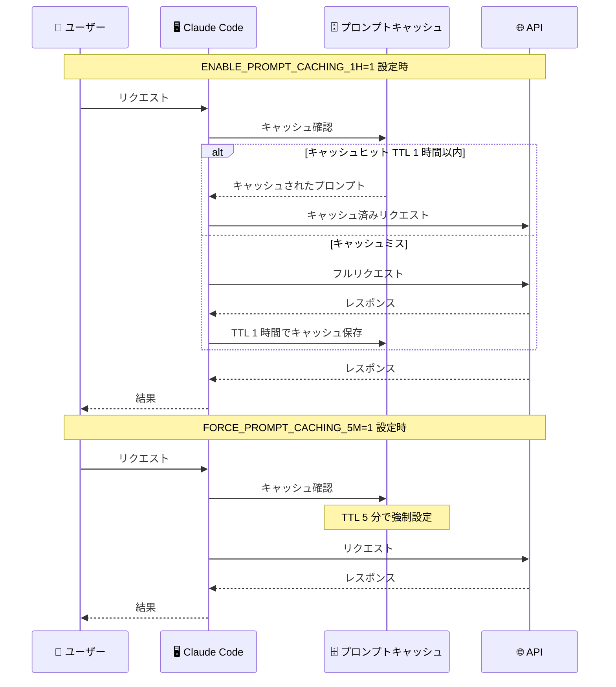

# Claude Code v2.1.107-v2.1.108 リリース: プロンプトキャッシュ制御、セッションリキャップ機能、スラッシュコマンド自動発見を含む 25 件の変更

## メタデータ

| 項目 | 内容 |
|------|------|
| 発表日 | 2026-04-14 |
| ソース | Claude Code Changelog |
| カテゴリ | Claude Code アップデート |
| 公式リンク | https://github.com/anthropics/claude-code/blob/main/CHANGELOG.md |

## 概要

Claude Code v2.1.107 および v2.1.108 が 2026 年 4 月 14 日にリリースされました。前バージョン v2.1.105 (2026 年 4 月 13 日) から 1 日後のリリースです。v2.1.107 は軽微な 1 件の改善のみ、v2.1.108 は新機能 6 件、改善 4 件、バグ修正 14 件の合計 24 件を含み、2 バージョン合わせて 25 項目のアップデートとなります。

主要な新機能として、プロンプトキャッシュの TTL を制御する環境変数 (`ENABLE_PROMPT_CACHING_1H`、`FORCE_PROMPT_CACHING_5M`) の追加、セッションに戻った際にコンテキストを提供するリキャップ機能 (`/recap`)、モデルが `/init`、`/review`、`/security-review` などの組み込みスラッシュコマンドを Skill ツール経由で自動発見・実行できる機能が追加されました。改善面では、`/model` での会話途中のモデル切り替え警告、`/resume` ピッカーのディレクトリフィルタリング、エラーメッセージの分類改善、言語グラマーのオンデマンド読み込みによるメモリフットプリント削減が含まれています。バグ修正ではセッション復元・テレポート関連の 6 件を含む 14 件の修正により、全体的な安定性が向上しています。

## 詳細

### 背景

Claude Code は Anthropic が提供する CLI ベースの AI 開発支援ツールです。v2.1.107 と v2.1.108 は同日にリリースされ、前日の v2.1.105 に続くアップデートです。本リリースではプロンプトキャッシュの柔軟な制御、セッションコンテキストの維持、スラッシュコマンドの自動発見という 3 つの新しいパラダイムが導入されました。また、v2.1.105 でのリグレッション修正を含む 14 件のバグ修正により、セッション管理の信頼性が大幅に改善されています。

### 主な変更点

#### v2.1.107 - 1 件

- **Thinking ヒントの早期表示**: 長時間の操作中に Thinking ヒントがより早く表示されるようになりました

#### v2.1.108 - 新機能 (Added) - 6 件

- **プロンプトキャッシュ TTL 制御の環境変数**: `ENABLE_PROMPT_CACHING_1H` 環境変数により、API キー、Bedrock、Vertex、Foundry で 1 時間のプロンプトキャッシュ TTL をオプトインできるようになりました。従来の `ENABLE_PROMPT_CACHING_1H_BEDROCK` は非推奨ですが引き続き動作します。また `FORCE_PROMPT_CACHING_5M` により 5 分間の TTL を強制することも可能です
- **セッションリキャップ機能**: セッションに戻った際にコンテキストを提供するリキャップ機能が追加されました。`/config` で設定可能であり、`/recap` コマンドで手動実行もできます。テレメトリが無効化されている場合は `CLAUDE_CODE_ENABLE_AWAY_SUMMARY` 環境変数で強制的に有効化できます
- **スラッシュコマンドの Skill ツール経由での自動発見**: モデルが Skill ツールを通じて `/init`、`/review`、`/security-review` などの組み込みスラッシュコマンドを自動的に発見し実行できるようになりました
- **`/undo` エイリアス**: `/undo` が `/rewind` のエイリアスとして追加されました
- **詳細トランスクリプトの Verbose インジケーター**: `Ctrl+O` で詳細トランスクリプトを表示する際に "verbose" インジケーターが表示されるようになりました
- **プロンプトキャッシュ無効化時の起動警告**: `DISABLE_PROMPT_CACHING*` 環境変数でプロンプトキャッシュが無効化されている場合、起動時に警告が表示されるようになりました

#### v2.1.108 - 改善 (Improved) - 4 件

- **`/model` のモデル切り替え警告**: 会話途中でモデルを切り替える前に警告が表示されるようになりました。次のレスポンスでは会話履歴全体をキャッシュなしで再読み込みするため、コスト増加の可能性があることを事前に通知します
- **`/resume` ピッカーのディレクトリフィルタリング**: デフォルトで現在のディレクトリのセッションのみ表示されるようになりました。`Ctrl+A` を押すことで全プロジェクトのセッションを表示できます
- **エラーメッセージの分類改善**: サーバーレートリミットとプラン使用量リミットが区別されるようになりました。5xx/529 エラーでは status.claude.com へのリンクが表示されます。未知のスラッシュコマンドでは最も近いコマンドが提案されます
- **メモリフットプリントの削減**: ファイルの読み取り、編集、シンタックスハイライトで使用される言語グラマーがオンデマンドで読み込まれるようになり、メモリ使用量が削減されました

#### v2.1.108 - バグ修正 (Fixed) - 14 件

**セッション・テレポート修正 - 6 件:**

- **`/login` コードプロンプトのペースト修正**: `/login` のコードプロンプトでペーストが機能しない問題が修正されました (v2.1.105 でのリグレッション)
- **`claude --resume <session-id>` のセッション名・カラー修正**: `--resume` 使用時にセッションの `/rename` で設定したカスタム名とカラーが失われる問題が修正されました
- **`--teleport` のターミナルエスケープコード修正**: `--teleport` 後にターミナルエスケープコードがプロンプト入力に文字化けとして表示される問題が修正されました
- **`--teleport` と `--resume <id>` の前提条件エラー修正**: ダーティな Git ツリーやセッション未発見などの前提条件エラーが、エラーメッセージを表示せずサイレントに終了する問題が修正されました
- **`--resume` のセッショントランケーション修正**: トランスクリプトに自己参照メッセージが含まれる場合にセッションがトランケーションされる問題が修正されました
- **Remote Control セッションタイトルの上書き修正**: Web UI で設定した Remote Control セッションタイトルが、3 番目のメッセージ以降に自動生成タイトルで上書きされる問題が修正されました

**キャッシュ・テレメトリ修正 - 2 件:**

- **`DISABLE_TELEMETRY` 設定時のキャッシュ TTL 修正**: `DISABLE_TELEMETRY` を設定したサブスクライバーが 1 時間のキャッシュ TTL ではなく 5 分のキャッシュ TTL にフォールバックする問題が修正されました
- **トランスクリプト書き込みエラーのログ修正**: ディスク容量不足などによるトランスクリプト書き込み失敗がサイレントにドロップされる代わりに、ログに記録されるようになりました

**ツール・環境修正 - 4 件:**

- **Agent ツールの自動モード権限修正**: 安全性分類器のトランスクリプトがコンテキストウィンドウを超えた場合に、Agent ツールが自動モードで権限を要求する問題が修正されました
- **Bash ツールの出力修正**: `CLAUDE_ENV_FILE` (例: `~/.zprofile`) が `#` コメント行で終わる場合に Bash ツールが出力を生成しない問題が修正されました
- **`/feedback` のリトライ修正**: 送信失敗後に説明を編集せずに Enter キーを押して再送信できるようになりました
- **ダイアクリティカルマークの保持**: `language` 設定が構成されている場合にレスポンスからアクセント、ウムラウト、セディーユなどのダイアクリティカルマークが削除される問題が修正されました

**その他の修正 - 2 件:**

- **セッションタイトルのプレースホルダー修正**: 最初のメッセージが短い挨拶の場合にセッションタイトルにプレースホルダーのサンプルテキストが表示される問題が修正されました
- **ポリシー管理プラグインの自動更新修正**: 最初にインストールされたプロジェクトとは異なるプロジェクトから実行した場合に、ポリシー管理プラグインが自動更新されない問題が修正されました

### 技術的な詳細

#### プロンプトキャッシュ TTL 制御

プロンプトキャッシュは Claude Code のパフォーマンスとコスト効率に大きく影響する機能です。v2.1.108 では 2 つの新しい環境変数が導入されました。

`ENABLE_PROMPT_CACHING_1H` は API キー、Bedrock、Vertex、Foundry のすべてのバックエンドで 1 時間のキャッシュ TTL を有効化します。従来は Bedrock 専用の `ENABLE_PROMPT_CACHING_1H_BEDROCK` のみ存在しましたが、新しい統一的な環境変数でバックエンドを問わず制御できるようになりました。`FORCE_PROMPT_CACHING_5M` は 5 分間の短い TTL を強制的に設定します。これはデバッグやテスト目的で活用できます。

また、`DISABLE_TELEMETRY` を設定したサブスクライバーがキャッシュ TTL のフォールバック問題で 5 分に制限されていた問題も修正され、テレメトリ設定に関わらず意図した TTL が適用されるようになりました。

#### セッションリキャップ機能

リキャップ機能はセッションに戻った際の「コンテキスト喪失」問題を解決します。長時間離席した後にセッションに戻ると、直前の作業内容を思い出すのに時間がかかることがあります。リキャップ機能はセッションのコンテキストを要約し、ユーザーが素早く作業に復帰できるよう支援します。

設定は `/config` から行えます。手動で任意のタイミングでリキャップを実行するには `/recap` コマンドを使用します。テレメトリが無効化されている環境では `CLAUDE_CODE_ENABLE_AWAY_SUMMARY` 環境変数で強制的に有効化できます。

#### スラッシュコマンドの Skill ツール経由での自動発見

従来、モデルは組み込みスラッシュコマンドの存在を直接認識できず、ユーザーが明示的にコマンドを入力する必要がありました。v2.1.108 では Skill ツールのメカニズムを活用して、モデルが `/init`、`/review`、`/security-review` などの組み込みスラッシュコマンドを自動的に発見し、適切なタイミングで実行できるようになりました。これにより、ユーザーが「コードをレビューして」と自然言語で依頼した場合に、モデルが `/review` コマンドを自動的に選択・実行するといった動作が可能になります。

#### 言語グラマーのオンデマンド読み込み

ファイルの読み取り、編集、シンタックスハイライト処理では、プログラミング言語ごとのグラマー (文法定義) が必要です。従来はこれらのグラマーがセッション開始時に一括で読み込まれていましたが、v2.1.108 ではオンデマンドで必要な言語のグラマーのみが読み込まれるようになりました。これにより、特に多数の言語グラマーが登録されている環境でメモリフットプリントが削減されます。

#### セッション復元とテレポートの安定性向上

v2.1.108 では `--resume` と `--teleport` に関する 6 件のバグ修正が行われました。セッション名・カラーの保持、前提条件エラーの適切な表示、自己参照メッセージによるトランケーション防止、Remote Control タイトルの保護、ターミナルエスケープコードの処理、ペースト機能のリグレッション修正など、セッション復元の信頼性が包括的に改善されています。

## アーキテクチャ図

### v2.1.107-v2.1.108 変更点の全体像



### スラッシュコマンドの Skill ツール経由での自動発見フロー



### プロンプトキャッシュ TTL 制御フロー



## 開発者への影響

### 対象

- **全ての Claude Code ユーザー**: 14 件のバグ修正と 5 件の改善により、全体的な安定性と使用体験が向上しています。言語グラマーのオンデマンド読み込みによるメモリフットプリント削減の恩恵も受けます
- **API キー / Bedrock / Vertex / Foundry ユーザー**: `ENABLE_PROMPT_CACHING_1H` により全バックエンドで統一的にプロンプトキャッシュの 1 時間 TTL を有効化できます。従来の `ENABLE_PROMPT_CACHING_1H_BEDROCK` は非推奨になりました
- **テレメトリ無効化ユーザー**: `DISABLE_TELEMETRY` 設定時のキャッシュ TTL フォールバック問題が修正されました。リキャップ機能を利用するには `CLAUDE_CODE_ENABLE_AWAY_SUMMARY` を設定してください
- **セッション復元を頻繁に使用するユーザー**: `--resume` と `--teleport` に関する 6 件のバグ修正により、セッション復元の信頼性が大幅に改善されました
- **多言語環境のユーザー**: `language` 設定使用時にダイアクリティカルマークが削除される問題が修正されました。アクセント、ウムラウト、セディーユなどを含む言語を使用するユーザーに影響します
- **Remote Control ユーザー**: Web UI で設定したセッションタイトルが自動生成タイトルで上書きされなくなりました

### 必要なアクション

以下のコマンドで最新バージョンに更新できます。

```bash
# npm でのアップデート
npm update -g @anthropic-ai/claude-code

# Homebrew でのアップデート
brew upgrade claude-code

# 現在のバージョン確認
claude --version
```

**確認が推奨される項目:**

- **Bedrock ユーザー**: `ENABLE_PROMPT_CACHING_1H_BEDROCK` を使用している場合、新しい統一的な `ENABLE_PROMPT_CACHING_1H` への移行を検討してください。従来の環境変数は引き続き動作しますが非推奨です
- **リキャップ機能**: `/config` からリキャップ機能を有効化し、セッション復帰時のコンテキスト提供を活用してください
- **プロンプトキャッシュ無効化**: `DISABLE_PROMPT_CACHING*` 環境変数を設定している場合、起動時に警告が表示されるようになりました。意図的な設定であることを確認してください

### 移行ガイド (該当する場合)

#### プロンプトキャッシュ環境変数の移行

従来の Bedrock 専用環境変数から統一的な環境変数への移行を推奨します。

```bash
# 従来 (非推奨だが引き続き動作)
export ENABLE_PROMPT_CACHING_1H_BEDROCK=1

# 新しい統一的な環境変数 (推奨)
# API キー、Bedrock、Vertex、Foundry のすべてで有効
export ENABLE_PROMPT_CACHING_1H=1
```

#### リキャップ機能の有効化

テレメトリが有効な場合は `/config` から設定できます。テレメトリ無効化環境では環境変数を使用します。

```bash
# テレメトリ無効化環境でリキャップ機能を有効化
export CLAUDE_CODE_ENABLE_AWAY_SUMMARY=1
```

## コード例

### プロンプトキャッシュ TTL の制御

```bash
# 1 時間のプロンプトキャッシュ TTL を有効化
# API キー、Bedrock、Vertex、Foundry のすべてで有効
export ENABLE_PROMPT_CACHING_1H=1
claude

# 5 分間の TTL を強制 (デバッグ / テスト用)
export FORCE_PROMPT_CACHING_5M=1
claude

# キャッシュが無効化されている場合は起動時に警告が表示される
# 意図的に無効化する場合
export DISABLE_PROMPT_CACHING=1
claude
# Warning: Prompt caching is disabled via DISABLE_PROMPT_CACHING
```

### リキャップ機能の使用

```bash
# セッション内で手動リキャップを実行
# Claude Code のプロンプトで以下を入力
> /recap
# セッションのコンテキスト要約が表示される

# /config からリキャップ機能を設定
> /config
# リキャップ機能のオン/オフを切り替え

# テレメトリ無効化環境で強制有効化
CLAUDE_CODE_ENABLE_AWAY_SUMMARY=1 claude
```

### /undo エイリアスの使用

```bash
# /rewind と同じ動作
# Claude Code のプロンプトで以下を入力
> /undo
# 直前の変更を巻き戻し

# 従来の /rewind も引き続き使用可能
> /rewind
```

### /resume ピッカーのディレクトリフィルタリング

```bash
# Claude Code 内でセッションを再開
> /resume
# デフォルトで現在のディレクトリのセッションのみ表示

# Ctrl+A で全プロジェクトのセッションを表示
# Ctrl+A を押下
# 全プロジェクトのセッション一覧が表示される
```

### エラーメッセージの改善例

```bash
# 未知のスラッシュコマンド入力時
> /reviw
# Did you mean: /review?

# サーバーレートリミットの場合
# Error: Server rate limit exceeded (distinct from plan usage limit)

# 5xx/529 エラーの場合
# Error: Service unavailable. Check https://status.claude.com for status
```

## 関連リンク

- [Claude Code Changelog](https://github.com/anthropics/claude-code/blob/main/CHANGELOG.md)
- [Claude Code GitHub リポジトリ](https://github.com/anthropics/claude-code)
- [Claude Code v2.1.105](./2026-04-13-claude-code-v2-1-105.md)
- [Claude Code v2.1.101](./2026-04-10-claude-code-v2-1-101.md)
- [Claude Code v2.1.98](./2026-04-10-claude-code-v2-1-98.md)
- [Claude Code v2.1.97](./2026-04-08-claude-code-v2-1-97.md)

## まとめ

Claude Code v2.1.107 および v2.1.108 は、v2.1.107 の 1 件と v2.1.108 の新機能 6 件、改善 4 件、バグ修正 14 件を合わせた全 25 項目のリリースです。変更は大きく 4 つの領域にわたります。

第一に、**プロンプトキャッシュの柔軟な制御**が導入されました。`ENABLE_PROMPT_CACHING_1H` による全バックエンド統一の 1 時間 TTL、`FORCE_PROMPT_CACHING_5M` による 5 分 TTL の強制、キャッシュ無効化時の起動警告、そして `DISABLE_TELEMETRY` 設定時のフォールバック修正により、プロンプトキャッシュの運用がより透明かつ柔軟になりました。

第二に、**セッションコンテキストの維持機能**が追加されました。リキャップ機能により、セッションに戻った際に作業コンテキストの要約が提供され、効率的な作業復帰が可能になります。`/config` での設定、`/recap` での手動実行、`CLAUDE_CODE_ENABLE_AWAY_SUMMARY` によるテレメトリ無効化環境での強制有効化と、柔軟な利用方法が用意されています。

第三に、**スラッシュコマンドの自動発見**により、モデルの能力が拡張されました。Skill ツール経由で `/init`、`/review`、`/security-review` などの組み込みコマンドを自動発見・実行できるようになり、ユーザーが自然言語でリクエストするだけで最適なコマンドが選択されます。未知のスラッシュコマンド入力時の類似コマンド提案と合わせて、コマンドの発見可能性が大幅に向上しています。

第四に、**セッション復元の信頼性と全体的なパフォーマンス**が改善されました。`--resume` と `--teleport` に関する 6 件のバグ修正でセッション復元の安定性が向上し、言語グラマーのオンデマンド読み込みによるメモリフットプリント削減、`/model` での会話途中モデル切り替え時のコスト警告、エラーメッセージの分類改善など、日常的な使用体験が全体的に向上しています。

全ての Claude Code ユーザーに対してアップデートを推奨します。特にプロンプトキャッシュの TTL 制御とリキャップ機能は、長時間作業の効率性とコスト管理に直接的な影響を与える重要な機能追加です。
