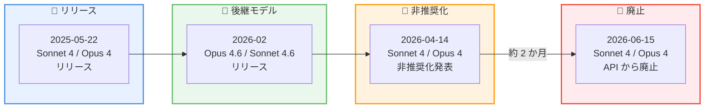
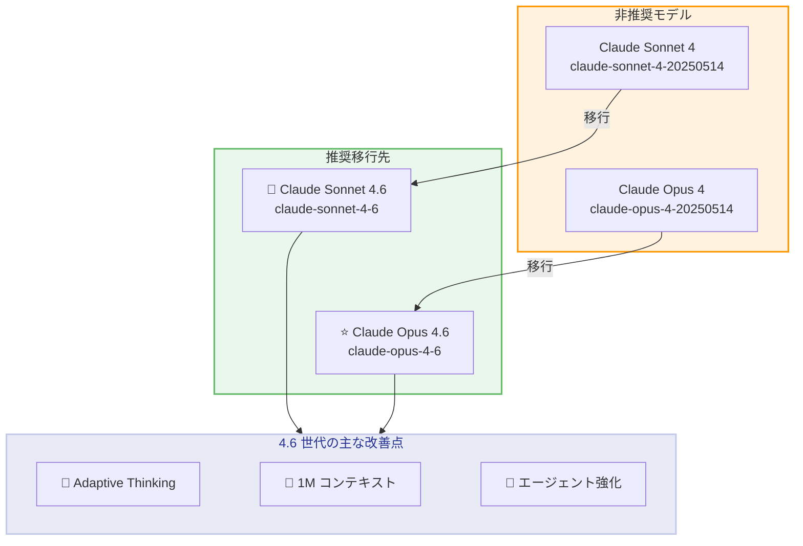

# Claude Sonnet 4 / Opus 4 の非推奨化を発表 -- 2026 年 6 月 15 日に廃止、4.6 世代への移行を推奨

## メタデータ

| 項目 | 内容 |
|------|------|
| 発表日 | 2026-04-14 |
| ソース | Claude Developer Platform Release Notes |
| カテゴリ | API モデル非推奨化 |
| 公式リンク | [Model Deprecations](https://platform.claude.com/docs/en/about-claude/model-deprecations) |

## 概要

Anthropic は 2026 年 4 月 14 日、Claude Sonnet 4 (`claude-sonnet-4-20250514`) および Claude Opus 4 (`claude-opus-4-20250514`) の非推奨化 (deprecation) を発表しました。両モデルは 2026 年 6 月 15 日に Claude API から廃止 (retirement) される予定です。移行先として、それぞれ Claude Sonnet 4.6 (`claude-sonnet-4-6`) および Claude Opus 4.6 (`claude-opus-4-6`) が推奨されています。

これらのモデルは 2025 年 5 月 22 日にリリースされた Claude 4 世代の初代モデルであり、約 1 年の稼働期間を経て次世代の 4.6 モデルにバトンを渡す形となります。開発者には約 2 か月の移行期間が設けられており、この間にモデル ID の更新、動作テスト、および破壊的変更への対応を完了する必要があります。

## 詳細

### 背景

Claude 4 世代の初代モデルである Sonnet 4 と Opus 4 は、2025 年 5 月 14 日付のモデルバージョンとしてリリースされました。その後、Anthropic は継続的にモデルを改良し、2026 年 2 月に次世代の 4.6 モデルをリリースしています。

- **Claude Opus 4.6**: 2026 年 2 月 5 日リリース。Adaptive Thinking、Compaction API、データレジデンシーなどの新機能を搭載
- **Claude Sonnet 4.6**: 2026 年 2 月 17 日リリース。改善されたエージェント検索機能、トークン効率の向上を実現

Anthropic のモデル非推奨化ポリシーでは、公開モデルの廃止には少なくとも 60 日前の通知が義務付けられています。今回の発表から廃止日までは約 62 日間であり、ポリシーに準拠したスケジュールとなっています。

### 主な変更点

1. **Claude Sonnet 4 の非推奨化**: `claude-sonnet-4-20250514` が Deprecated ステータスに変更。2026 年 6 月 15 日以降、このモデル ID へのリクエストは失敗します
2. **Claude Opus 4 の非推奨化**: `claude-opus-4-20250514` が Deprecated ステータスに変更。同じく 2026 年 6 月 15 日に廃止されます
3. **推奨移行先の指定**: Sonnet 4 には `claude-sonnet-4-6`、Opus 4 には `claude-opus-4-6` がそれぞれ推奨されています

### 技術的な詳細

#### 非推奨化スケジュール

| 廃止日 | 非推奨モデル | 推奨移行先 |
|--------|-------------|-----------|
| 2026 年 6 月 15 日 | `claude-sonnet-4-20250514` | `claude-sonnet-4-6` |
| 2026 年 6 月 15 日 | `claude-opus-4-20250514` | `claude-opus-4-6` |

#### モデル比較: Sonnet 4 vs Sonnet 4.6

| 項目 | Sonnet 4 | Sonnet 4.6 |
|------|----------|------------|
| モデル ID | `claude-sonnet-4-20250514` | `claude-sonnet-4-6` |
| ステータス | Deprecated | Active |
| コンテキストウィンドウ | 200k トークン (1M はベータ) | 1M トークン (標準) |
| 入力価格 | $3 / 100 万トークン | $3 / 100 万トークン |
| 出力価格 | $15 / 100 万トークン | $15 / 100 万トークン |
| Adaptive Thinking | 非対応 | 対応 (推奨) |
| アシスタントプレフィル | 対応 | 非対応 (400 エラー) |
| エージェント検索 | -- | 改善済み |
| トークン効率 | -- | 向上 |

#### モデル比較: Opus 4 vs Opus 4.6

| 項目 | Opus 4 | Opus 4.6 |
|------|--------|----------|
| モデル ID | `claude-opus-4-20250514` | `claude-opus-4-6` |
| ステータス | Deprecated | Active |
| コンテキストウィンドウ | 200k トークン (1M はベータ) | 1M トークン (標準) |
| 入力価格 | $15 / 100 万トークン | $15 / 100 万トークン |
| 出力価格 | $75 / 100 万トークン | $75 / 100 万トークン |
| Adaptive Thinking | 非対応 | 対応 (推奨) |
| アシスタントプレフィル | 対応 | 非対応 (400 エラー) |
| Compaction API | 非対応 | 対応 |
| データレジデンシー | 非対応 | 対応 |

#### 最近の非推奨化履歴

Anthropic は継続的に旧モデルの非推奨化を進めています。

| 発表日 | 対象モデル | 廃止日 | 状態 |
|--------|-----------|--------|------|
| 2025-06-30 | Claude Opus 3 | 2026-01-05 | 廃止済み |
| 2025-10-28 | Claude Sonnet 3.7 | 2026-02-19 | 廃止済み |
| 2025-12-19 | Claude Haiku 3.5 | 2026-02-19 | 廃止済み |
| 2026-02-19 | Claude Haiku 3 | 2026-04-20 | 非推奨 |
| **2026-04-14** | **Claude Sonnet 4 / Opus 4** | **2026-06-15** | **非推奨** |

## 開発者への影響

### 対象

- Claude Sonnet 4 (`claude-sonnet-4-20250514`) を使用しているすべてのアプリケーション
- Claude Opus 4 (`claude-opus-4-20250514`) を使用しているすべてのアプリケーション
- これらのモデルを Amazon Bedrock、Google Vertex AI、Microsoft Foundry 経由で利用している開発者

### 必要なアクション

**2026 年 6 月 15 日までに以下の対応が必要です。**

1. **モデル ID の更新**: コードベース内のすべてのモデル ID を新しい 4.6 モデルに変更
2. **アシスタントプレフィルの削除**: 4.6 モデルではアシスタントメッセージのプレフィルが 400 エラーを返すため、構造化出力や `output_config.format` に移行
3. **Adaptive Thinking への移行**: `thinking: {type: "enabled", budget_tokens: N}` は非推奨。`thinking: {type: "adaptive"}` と effort パラメータへの移行を推奨
4. **新モデルでのテスト**: 本番環境に適用する前に、開発環境で十分なテストを実施
5. **SDK のアップデート**: 最新の Anthropic SDK にアップデートして、新しいモデル ID と機能に対応
6. **Opus 4.6 の動作差異を確認**: Adaptive Thinking の推奨、プレフィル非対応、ツールパラメータの JSON エスケープ差異などを把握

### 移行ガイド

#### モデル ID の変更

| 変更前 | 変更後 |
|--------|--------|
| `claude-sonnet-4-20250514` | `claude-sonnet-4-6` |
| `claude-opus-4-20250514` | `claude-opus-4-6` |

#### 破壊的変更のまとめ

| 変更内容 | 影響度 | 対応 |
|----------|--------|------|
| アシスタントプレフィル非対応 | 高 | 構造化出力または `output_config.format` に移行 |
| ツールパラメータの JSON エスケープ差異 | 中 | 標準 JSON パーサーを使用していれば影響なし |

#### 推奨変更のまとめ

| 変更内容 | 優先度 | 対応 |
|----------|--------|------|
| Adaptive Thinking への移行 | 高 | `thinking: {type: "adaptive"}` に変更 |
| effort ベータヘッダーの削除 | 中 | `betas=["effort-2025-11-24"]` を削除 |
| interleaved thinking ベータヘッダーの削除 | 中 | `betas=["interleaved-thinking-2025-05-14"]` を削除 |
| `output_format` から `output_config.format` への移行 | 中 | パラメータ名を変更 |

## コード例

### Python: Sonnet 4 から Sonnet 4.6 への移行

**変更前 (Sonnet 4)**:

```python
import anthropic

client = anthropic.Anthropic()

message = client.messages.create(
    model="claude-sonnet-4-20250514",
    max_tokens=8192,
    messages=[
        {
            "role": "user",
            "content": "TypeScript で REST API サーバーを作成してください。"
        }
    ]
)

print(message.content[0].text)
```

**変更後 (Sonnet 4.6)**:

```python
import anthropic

client = anthropic.Anthropic()

message = client.messages.create(
    model="claude-sonnet-4-6",
    max_tokens=8192,
    thinking={"type": "adaptive"},
    output_config={"effort": "medium"},
    messages=[
        {
            "role": "user",
            "content": "TypeScript で REST API サーバーを作成してください。"
        }
    ]
)

print(message.content[0].text)
```

### Python: Opus 4 から Opus 4.6 への移行

**変更前 (Opus 4)**:

```python
import anthropic

client = anthropic.Anthropic()

# Opus 4 ではアシスタントプレフィルが使用可能だった
message = client.messages.create(
    model="claude-opus-4-20250514",
    max_tokens=16000,
    messages=[
        {
            "role": "user",
            "content": "この論文を分析してください。"
        },
        {
            "role": "assistant",
            "content": "## 分析結果\n\n"
        }
    ]
)
```

**変更後 (Opus 4.6)**:

```python
import anthropic

client = anthropic.Anthropic()

# Opus 4.6 ではプレフィル不可。システムプロンプトで出力形式を指定
message = client.messages.create(
    model="claude-opus-4-6",
    max_tokens=16000,
    thinking={"type": "adaptive"},
    output_config={"effort": "high"},
    system="回答は必ず '## 分析結果' という見出しから開始してください。",
    messages=[
        {
            "role": "user",
            "content": "この論文を分析してください。"
        }
    ]
)
```

### curl: Sonnet 4.6 へのリクエスト例

```bash
curl https://api.anthropic.com/v1/messages \
     --header "x-api-key: $ANTHROPIC_API_KEY" \
     --header "anthropic-version: 2023-06-01" \
     --header "content-type: application/json" \
     --data \
'{
    "model": "claude-sonnet-4-6",
    "max_tokens": 8192,
    "thinking": {
        "type": "adaptive"
    },
    "output_config": {
        "effort": "medium"
    },
    "messages": [
        {
            "role": "user",
            "content": "TypeScript で REST API サーバーを作成してください。"
        }
    ]
}'
```

### curl: Opus 4.6 へのリクエスト例

```bash
curl https://api.anthropic.com/v1/messages \
     --header "x-api-key: $ANTHROPIC_API_KEY" \
     --header "anthropic-version: 2023-06-01" \
     --header "content-type: application/json" \
     --data \
'{
    "model": "claude-opus-4-6",
    "max_tokens": 16000,
    "thinking": {
        "type": "adaptive"
    },
    "output_config": {
        "effort": "high"
    },
    "messages": [
        {
            "role": "user",
            "content": "この論文を分析してください。"
        }
    ]
}'
```

## アーキテクチャ図

### 非推奨化タイムライン



### 移行パス



## 関連リンク

- [Claude Model Deprecations](https://platform.claude.com/docs/en/about-claude/model-deprecations)
- [Claude Developer Platform Release Notes](https://platform.claude.com/docs/en/release-notes/overview)
- [Migration Guide](https://platform.claude.com/docs/en/about-claude/models/migration-guide)
- [Claude Models Overview](https://platform.claude.com/docs/en/about-claude/models/overview)
- [Adaptive Thinking](https://platform.claude.com/docs/en/build-with-claude/adaptive-thinking)
- [Effort Parameter](https://platform.claude.com/docs/en/build-with-claude/effort)
- [Structured Outputs](https://platform.claude.com/docs/en/build-with-claude/structured-outputs)

## まとめ

Claude Sonnet 4 と Claude Opus 4 の非推奨化は、Anthropic のモデルライフサイクル管理の一環として実施されます。2026 年 6 月 15 日の廃止日までに約 2 か月の移行期間が設けられており、開発者はこの間にモデル ID の更新と動作検証を完了する必要があります。

移行先の 4.6 世代モデルは、1M トークンの標準コンテキストウィンドウ、Adaptive Thinking、改善されたエージェント機能など、多くの機能強化が含まれています。一方で、アシスタントメッセージのプレフィルが非対応になるという破壊的変更があるため、プレフィルを使用しているアプリケーションは構造化出力やシステムプロンプトへの移行が必須です。

価格はいずれも据え置きのため、移行によるコスト増加はありません。早期にテスト環境での検証を開始し、廃止日に余裕を持って移行を完了することを推奨します。
