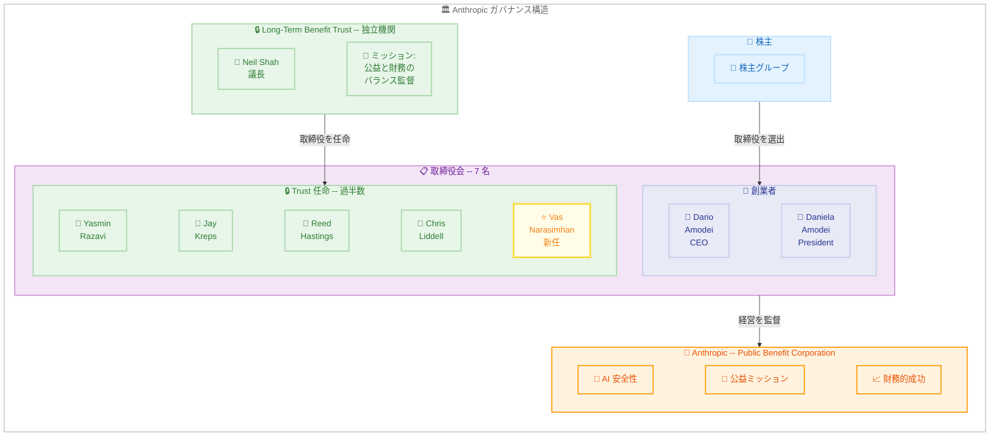

# Anthropic Long-Term Benefit Trust が Vas Narasimhan を取締役に任命 -- Trust 任命取締役が取締役会の過半数に

## メタデータ

| 項目 | 内容 |
|------|------|
| 発表日 | 2026-04-14 |
| ソース | Anthropic News |
| カテゴリ | 人事・ガバナンス |
| 公式リンク | https://www.anthropic.com/news/narasimhan-board |

## 概要

Anthropic は 2026 年 4 月 14 日、Anthropic Long-Term Benefit Trust (LTBT) が Vas Narasimhan を取締役会メンバーに任命したことを発表しました。Narasimhan は医師・科学者であり、世界有数の革新的医薬品企業である Novartis の CEO を務めています。ヘルスケアおよびライフサイエンスが AI によって最も人々の生活の質を向上させうる分野の 1 つであるという Anthropic の信念を共有する人物です。

この任命により、Trust が指名した取締役が取締役会の過半数を占めることになり、Anthropic のガバナンス構造における重要な転換点となります。Public Benefit Corporation としての Anthropic が、財務的成功と公益ミッションの責任あるバランスを維持するための体制がさらに強化されました。

## 詳細

### 背景

Anthropic は Public Benefit Corporation (公益法人) として設立されており、株主利益だけでなく社会的な公益を追求する企業構造を採用しています。この構造の中核を担うのが Long-Term Benefit Trust (LTBT) です。

LTBT は Anthropic から独立した機関であり、そのメンバーは Anthropic に対する金銭的利害関係を持ちません。LTBT の役割は、Anthropic のガバナンスが財務的成功と公益ミッションの責任あるバランスを保つよう、取締役を任命することです。取締役会は株主と LTBT の双方によって選出されます。

AI 技術が急速に進歩する中、安全性と公益を重視したガバナンスの重要性はますます高まっています。特に、高度に規制された産業で安全かつ大規模に革新的技術を人々に届けてきた経験を持つリーダーの参加は、Anthropic の取締役会にとって戦略的に重要な強化となります。

### 主な変更点

1. **Vas Narasimhan の取締役就任**: Novartis CEO であり医師・科学者である Narasimhan が、LTBT により取締役に任命された
2. **Trust 任命取締役が過半数に**: この任命により、LTBT が指名した取締役が取締役会の過半数を占めることになり、公益ミッションの監督体制が強化された
3. **取締役会の構成更新**: 現在の取締役会メンバーは以下の 7 名となった。
   - Dario Amodei (共同創業者・CEO)
   - Daniela Amodei (共同創業者・President)
   - Yasmin Razavi
   - Jay Kreps
   - Reed Hastings
   - Chris Liddell
   - Vas Narasimhan (新任)

### ガバナンス構造の詳細

#### Anthropic の公益法人構造

Anthropic は Delaware 州の Public Benefit Corporation として設立されています。この法人形態では、取締役は株主利益だけでなく、定款に定められた公益目的も考慮して意思決定を行う法的義務を負います。

#### Long-Term Benefit Trust の役割

LTBT は以下の特徴を持つ独立機関です。

- **経済的独立性**: メンバーは Anthropic に対する金銭的利害関係を持たない
- **取締役任命権**: 株主とともに取締役会メンバーを選出する権限を持つ
- **公益監督**: 企業のガバナンスが財務的成功と公益ミッションのバランスを保つことを監督する

LTBT の議長は Neil "Buddy" Shah が務めています。

#### Vas Narasimhan の経歴

Narasimhan は以下の実績と役職を持つ人物です。

- **Novartis CEO**: 世界有数の革新的医薬品企業のトップとして、35 以上の新薬の開発・承認を監督
- **グローバルヘルス**: インド、アフリカ、南米で HIV/AIDS、マラリア、結核プログラムに従事
- **学術的栄誉**: 米国国立医学アカデミー (National Academy of Medicine) の選出メンバー
- **外交・政策**: 米国外交問題評議会 (Council on Foreign Relations) のメンバー
- **教育機関**: シカゴ大学理事会メンバー、ハーバード大学医学大学院フェロー会議メンバー

## 業界への影響

### 対象

- **AI ガバナンスに関心を持つ政策立案者・規制当局**: Anthropic のガバナンスモデルは、AI 企業の公益性担保の先進事例として注目される
- **ヘルスケア・ライフサイエンス業界関係者**: Novartis CEO の参画により、AI とヘルスケアの融合がさらに加速する可能性がある
- **Anthropic の顧客および投資家**: Trust 任命取締役の過半数化は、Anthropic の長期的な公益志向を裏付けるシグナルとなる
- **AI 安全性研究者・コミュニティ**: 独立した監督機関による取締役過半数の確保は、AI 安全性ガバナンスの具体的な実装として評価される

### 注目すべきポイント

- **規制産業の知見**: Narasimhan は「最も規制の厳しい産業の 1 つ」で 35 以上の新薬の開発・承認を監督した実績を持つ。Daniela Amodei は「強力な新技術を安全かつ大規模に人々に届けることは、Anthropic が毎日考えていること」であり、Narasimhan はまさにそれを長年実践してきたと述べている
- **Trust 取締役の過半数化**: LTBT 任命の取締役が過半数を占めることで、Anthropic の取締役会における公益ミッションの位置づけがさらに強化される。これは AI 企業のガバナンスにおいて先例となる構造である
- **ヘルスケア AI への戦略的整合**: 2026 年 4 月 9 日に発表された Claude for Healthcare との連続性を考えると、ヘルスケア分野に深い知見を持つ取締役の参加は、この分野における Anthropic の戦略的方向性を補強するものと捉えられる

## アーキテクチャ図

## 関連リンク

- [公式発表: Anthropic's Long-Term Benefit Trust appoints Vas Narasimhan to Board of Directors](https://www.anthropic.com/news/narasimhan-board)
- [Anthropic News](https://www.anthropic.com/news)
- [Anthropic のヘルスケア・ライフサイエンス向け Claude 発表](https://www.anthropic.com/news/healthcare-life-sciences)
- [Novartis 公式サイト](https://www.novartis.com/)

## まとめ

Vas Narasimhan の取締役就任は、Anthropic のガバナンスと戦略の両面において重要な意味を持つ発表です。

ガバナンスの観点では、LTBT が任命した取締役が取締役会の過半数を占めることになり、Anthropic の Public Benefit Corporation としての公益ミッションに対する監督体制が実質的に強化されました。LTBT は Anthropic と金銭的利害関係を持たない独立機関であり、その任命する取締役が過半数となることは、AI 企業における公益性担保の具体的なガバナンスモデルとして業界全体に示唆を与えるものです。

戦略の観点では、世界有数の製薬企業 Novartis の CEO であり、35 以上の新薬の開発・承認を監督してきた Narasimhan の参画は、高度に規制された産業で強力な技術を安全かつ大規模に届けるという Anthropic の課題に直接的な知見をもたらします。2026 年 4 月 9 日に発表された Claude for Healthcare との戦略的整合性も注目に値し、ヘルスケア・ライフサイエンス分野における Anthropic の取り組みが経営レベルでも強化されることを示しています。
