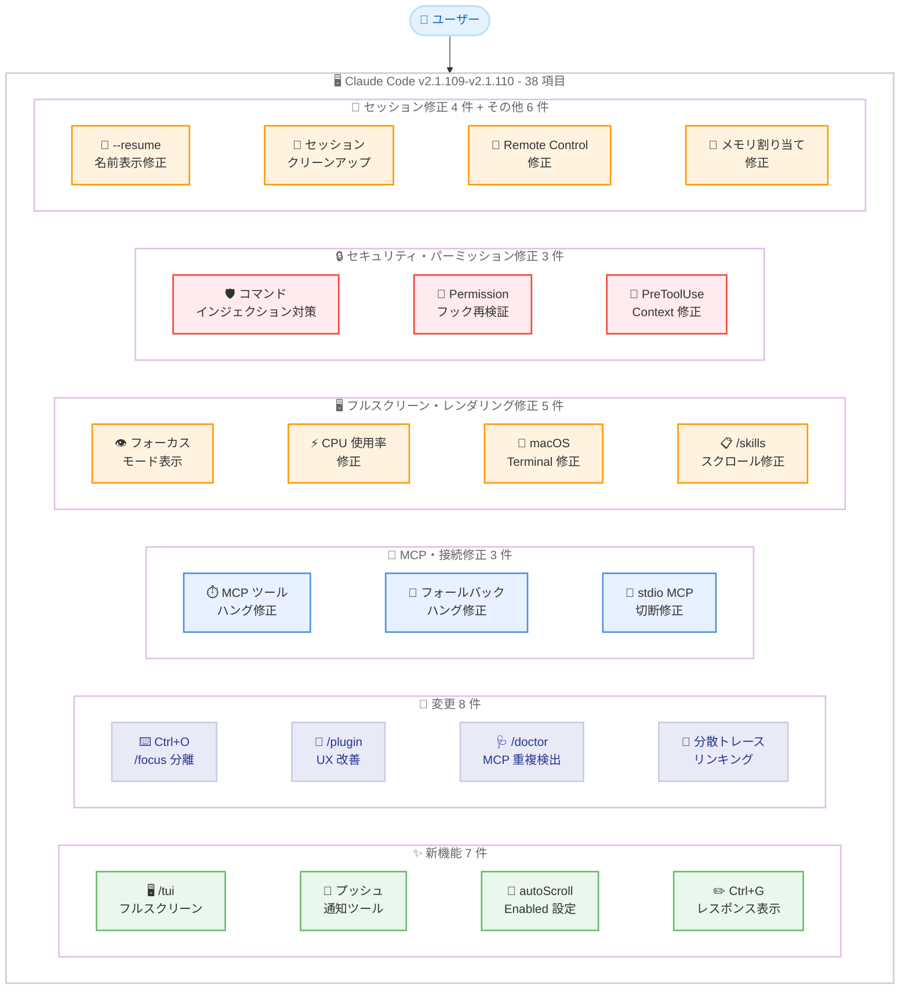
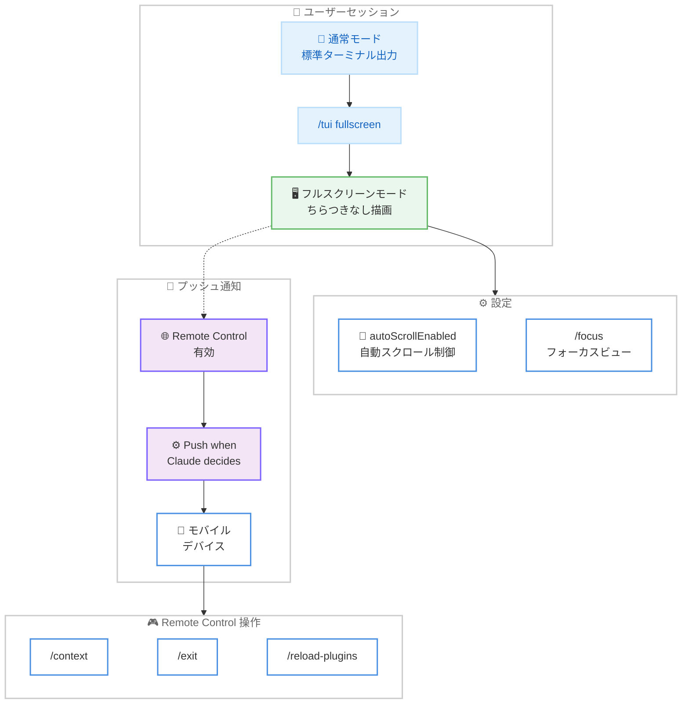
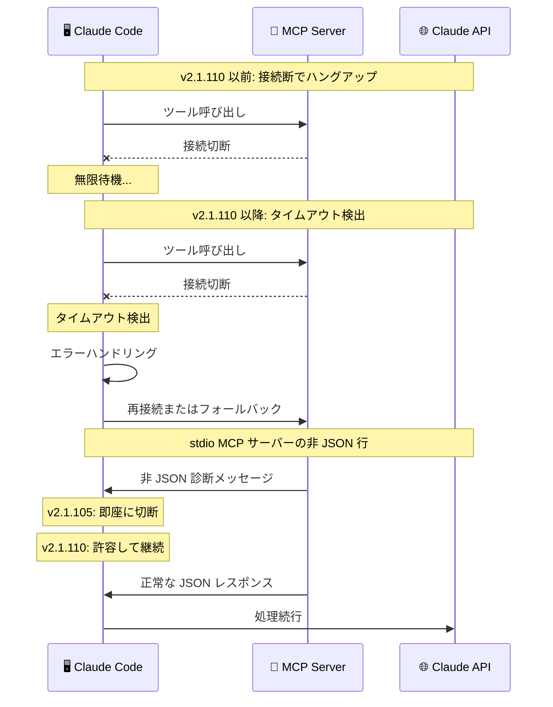

# Claude Code v2.1.109-v2.1.110 リリース: TUI フルスクリーンモード、プッシュ通知、MCP 接続安定性修正を含む 38 件の変更

## メタデータ

| 項目 | 内容 |
|------|------|
| 発表日 | 2026-04-15 |
| ソース | Claude Code Changelog |
| カテゴリ | Claude Code アップデート |
| 公式リンク | https://github.com/anthropics/claude-code/blob/main/CHANGELOG.md |

## 概要

Claude Code v2.1.109 および v2.1.110 が 2026 年 4 月 15 日にリリースされました。前バージョン v2.1.108 (2026 年 4 月 14 日) から 1 日後のリリースです。v2.1.109 は軽微な 1 件の改善のみ、v2.1.110 は新機能 6 件、変更 7 件、バグ修正 24 件の合計 37 件を含み、2 バージョン合わせて 38 項目のアップデートとなります。

主要な新機能として、ちらつきのないフルスクリーンレンダリングへ切り替える `/tui` コマンド、モバイルプッシュ通知機能、会話の自動スクロールを無効化する `autoScrollEnabled` 設定、`Ctrl+G` 外部エディタで Claude の最新レスポンスをコメントとして表示するオプションが追加されました。変更面では `Ctrl+O` の動作分離と新しい `/focus` コマンド、`/plugin` の Installed タブの UX 改善、`/doctor` の MCP サーバー重複定義検出、Write ツールの IDE diff 編集通知、Bash ツールのタイムアウト上限強制、SDK/headless セッションの分散トレースリンキング対応が含まれています。バグ修正では MCP ツール呼び出しのハングアップ修正、非ストリーミングフォールバックのハング修正、セキュリティ強化を含む 24 件の修正により、全体的な安定性とセキュリティが大幅に向上しています。

## 詳細

### 背景

Claude Code は Anthropic が提供する CLI ベースの AI 開発支援ツールです。v2.1.109 と v2.1.110 は同日にリリースされ、前日の v2.1.108 に続くアップデートです。本リリースでは TUI フルスクリーンモードの導入によるレンダリング品質の向上、モバイルプッシュ通知による非同期ワークフロー支援、MCP 接続の堅牢化という 3 つの重要な改善が行われました。また、セキュリティ面では信頼されていないファイル名からのコマンドインジェクション対策や、パーミッション関連のフック処理の修正など、防御的な強化が施されています。

### 主な変更点

#### v2.1.109 - 1 件

- **Extended Thinking インジケーターの改善**: Extended Thinking 中に回転するプログレスヒントが表示されるようになり、処理状況がより直感的に把握できるようになりました

#### v2.1.110 - 新機能 (Added) - 6 件

- **`/tui` コマンドと `tui` 設定**: `/tui fullscreen` を実行することで、同じ会話内でちらつきのないフルスクリーンレンダリングに切り替えられるようになりました。従来のターミナル出力ではリフレッシュ時にちらつきが発生することがありましたが、TUI モードではこの問題が解消されます
- **プッシュ通知ツール**: Remote Control と「Push when Claude decides」設定を有効にすると、Claude がモバイルデバイスにプッシュ通知を送信できるようになりました。長時間のタスク完了やユーザーの判断が必要な場面で、離席中でも重要な通知を受け取れます
- **`autoScrollEnabled` 設定**: フルスクリーンモードで会話の自動スクロールを無効化できる設定が追加されました。長い出力を確認する際にスクロール位置を維持したい場合に有用です
- **`Ctrl+G` 外部エディタでのレスポンス表示**: `/config` で有効化すると、`Ctrl+G` で外部エディタを開いた際に Claude の最新レスポンスがコメントとしてコンテキスト表示されるようになりました。レスポンスを参照しながら次のプロンプトを編集できます
- **`--resume`/`--continue` でのスケジュールタスク復元**: 期限切れでないスケジュールタスクを `--resume` または `--continue` で復元できるようになりました
- **Remote Control からのコマンド実行拡張**: `/context`、`/exit`、`/reload-plugins` が Remote Control (モバイル / Web) クライアントから実行可能になりました

#### v2.1.110 - 変更 (Changed) - 7 件

- **`Ctrl+O` と `/focus` の動作分離**: `Ctrl+O` は通常トランスクリプトと verbose トランスクリプトの切り替えのみになりました。フォーカスビューは新しい `/focus` コマンドで独立して切り替えます
- **`/plugin` Installed タブの UX 改善**: 注意が必要なプラグインとお気に入りが上部に表示され、無効化されたアイテムは折りたたみの背後に隠されるようになりました。`f` キーで選択中のアイテムをお気に入りに追加できます
- **`/doctor` の MCP サーバー重複定義検出**: MCP サーバーが複数の設定スコープで異なるエンドポイントとして定義されている場合に警告が表示されるようになりました
- **Write ツールの IDE diff 編集通知**: IDE の diff ビューで提案されたコンテンツをユーザーが編集してから承認した場合、その編集内容がモデルに通知されるようになりました
- **Bash ツールのタイムアウト上限強制**: ドキュメントに記載された最大タイムアウト値が厳密に適用されるようになり、任意に大きな値は受け付けなくなりました
- **SDK/headless セッションの分散トレースリンキング**: SDK/headless セッションが環境変数 `TRACEPARENT`/`TRACESTATE` を読み取り、分散トレースとのリンキングに対応しました。OpenTelemetry エコシステムとの統合が容易になります
- **テレメトリ無効化ユーザーへのセッションリキャップ有効化**: Bedrock、Vertex、Foundry、`DISABLE_TELEMETRY` 環境のユーザーでもセッションリキャップが利用可能になりました。`/config` または `CLAUDE_CODE_ENABLE_AWAY_SUMMARY=0` でオプトアウトできます

#### v2.1.110 - バグ修正 (Fixed) - 24 件

**MCP・接続修正 - 3 件:**

- **MCP ツール呼び出しのハングアップ修正**: SSE/HTTP トランスポートでレスポンス中にサーバー接続が切断された場合に、MCP ツール呼び出しが無限にハングアップする問題が修正されました
- **非ストリーミングフォールバックのハング修正**: API に到達できない場合に非ストリーミングフォールバックのリトライが数分間ハングする問題が修正されました
- **stdio MCP サーバーの非 JSON 出力修正**: stdout に JSON 以外の行を出力する stdio MCP サーバーが最初の不正行で切断される問題が修正されました (v2.1.105 でのリグレッション)

**フルスクリーン・レンダリング修正 - 5 件:**

- **フォーカスモードの表示修正**: セッションリキャップ、ローカルスラッシュコマンド出力、その他のシステムステータス行がフォーカスモードで表示されない問題が修正されました
- **フルスクリーンの CPU 使用率修正**: ツール実行中にテキストが選択されている場合にフルスクリーンモードで CPU 使用率が高くなる問題が修正されました
- **macOS Terminal.app 起動時のレンダリング修正**: macOS Terminal.app および同期出力をサポートしないターミナルでの起動時にレンダリングが文字化けする問題が修正されました
- **`/skills` メニューのスクロール修正**: フルスクリーンモードでリストがモーダルからはみ出る場合に `/skills` メニューがスクロールしない問題が修正されました
- **二重メッセージ表示修正**: マルチツールコール中にキューに入れられたメッセージが一時的に 2 回表示される問題が修正されました

**セキュリティ・パーミッション修正 - 3 件:**

- **ファイル名からのコマンドインジェクション対策**: 「エディタで開く」アクションが信頼されていないファイル名からのコマンドインジェクションに対して堅牢化されました
- **`PermissionRequest` フックの `updatedInput` 再検証**: `PermissionRequest` フックが返す `updatedInput` が `permissions.deny` ルールに対して再チェックされるようになりました。`setMode:'bypassPermissions'` の更新も `disableBypassPermissionsMode` を尊重するようになりました
- **`PreToolUse` フックの `additionalContext` 修正**: ツール呼び出しが失敗した場合に `PreToolUse` フックの `additionalContext` がドロップされる問題が修正されました

**セッション・Resume 修正 - 4 件:**

- **`--resume` のセッション名表示修正**: 実行中または異常終了したセッションで `--resume` を使用する際に、`/rename` で設定した名前ではなく最初のプロンプトが表示される問題が修正されました
- **セッションクリーンアップの完全削除修正**: サブエージェントのトランスクリプトを含むセッションディレクトリ全体が適切にクリーンアップされるようになりました
- **Remote Control セッションの再ログインプロンプト修正**: セッションが古すぎる場合に汎用エラーではなく再ログインのプロンプトが表示されるようになりました
- **Remote Control セッション名の永続化修正**: claude.ai からのセッション名変更がローカル CLI セッションに永続化されるようになりました

**プラグイン・Skill 修正 - 2 件:**

- **プラグインインストールの依存関係修正**: マーケットプレイスエントリが省略している場合でも、`plugin.json` で宣言された依存関係がインストール時に尊重されるようになりました。`/plugin` のインストールで自動インストールされた依存関係が表示されます
- **`disable-model-invocation: true` Skill の修正**: メッセージ途中で `/<skill>` 経由で呼び出された場合に `disable-model-invocation: true` が設定された Skill が失敗する問題が修正されました

**SDK・headless 修正 - 2 件:**

- **headless/SDK セッションのタイトルリクエスト修正**: `CLAUDE_CODE_DISABLE_NONESSENTIAL_TRAFFIC` または `CLAUDE_CODE_DISABLE_TERMINAL_TITLE` が設定されている場合に、自動タイトル生成で余分な Haiku リクエストが発行される問題が修正されました
- **パイプ出力のメモリ割り当て修正**: パイプ (非 TTY) の Ink 出力に単一の非常に幅の広い行が含まれる場合に過剰なメモリ割り当てが発生する可能性がある問題が修正されました

**入力・キーストローク修正 - 2 件:**

- **CLI 再起動後のキーストロークドロップ修正**: `/tui` やプロバイダーセットアップウィザードなどで CLI が再起動した後にキーストロークがドロップされる問題が修正されました
- **テレメトリ無効化時のリキャップ有効化**: v2.1.108 のセッションリキャップ機能が Bedrock、Vertex、Foundry、`DISABLE_TELEMETRY` 環境でもデフォルトで有効になりました

### 技術的な詳細

#### TUI フルスクリーンモード

従来の Claude Code はターミナルの標準出力にインクリメンタルにテキストを追加する方式を採用しており、画面のリフレッシュ時にちらつきが発生することがありました。v2.1.110 で導入された TUI フルスクリーンモードは、ターミナル全体を描画バッファとして使用し、フレームごとにバッファを更新する方式に切り替えます。`/tui fullscreen` コマンドで同じ会話内からモードを切り替えられるため、作業を中断することなくレンダリング品質を改善できます。

`autoScrollEnabled` 設定と組み合わせることで、長い出力を確認する際にスクロール位置を固定しつつ、必要に応じて自動スクロールを再開できる柔軟な操作環境が実現します。macOS Terminal.app での起動時文字化けやテキスト選択時の高 CPU 使用率の修正と合わせ、フルスクリーンモードの安定性も初期リリース段階から配慮されています。

#### モバイルプッシュ通知

プッシュ通知ツールにより、Claude が自律的にモバイルデバイスへ通知を送信できるようになりました。この機能は Remote Control が有効かつ「Push when Claude decides」設定が有効な場合に利用可能です。典型的なユースケースとして、長時間のビルドやテストの完了通知、エラー発生時のアラート、ユーザーの判断が必要な場面での確認依頼などが想定されます。

Remote Control からは `/context`、`/exit`、`/reload-plugins` も実行可能になり、モバイルからの操作範囲が拡張されています。

#### MCP 接続の堅牢化

v2.1.110 では MCP (Model Context Protocol) 関連の 3 件の重要なバグ修正が行われました。

第一に、SSE/HTTP トランスポートでサーバー接続がレスポンス途中で切断された場合にツール呼び出しが無限にハングアップする問題が修正されました。タイムアウト処理の追加により、接続断が適切に検出されリトライまたはエラーハンドリングに移行します。

第二に、非ストリーミングフォールバックのリトライが API 到達不能時に数分間ハングする問題が修正されました。これにより、ネットワーク不安定な環境でも迅速にエラーフィードバックが返されます。

第三に、v2.1.105 でのリグレッションにより、stdout に非 JSON 行を出力する stdio MCP サーバーが即座に切断されていた問題が修正されました。診断メッセージやログを stdout に混在させるサーバー実装との互換性が回復しています。

#### セキュリティ強化

本リリースでは 3 件のセキュリティ関連修正が含まれています。

「エディタで開く」アクションが信頼されていないファイル名からのコマンドインジェクションに対して堅牢化されました。悪意あるファイル名にシェルメタ文字が含まれる場合の対策が強化されています。

`PermissionRequest` フックが `updatedInput` を返した場合、更新後の入力が `permissions.deny` ルールに対して再チェックされるようになりました。従来はフックによる入力変更後に deny ルールがバイパスされる可能性がありましたが、この修正により権限制御の一貫性が確保されました。`setMode:'bypassPermissions'` の更新も `disableBypassPermissionsMode` 設定を尊重するようになり、管理者が設定した制限を回避できない仕組みが強化されました。

#### 分散トレースリンキング

SDK/headless セッションが環境変数 `TRACEPARENT` と `TRACESTATE` を読み取り、W3C Trace Context 仕様に基づく分散トレースリンキングに対応しました。これにより、CI/CD パイプラインや自動化ワークフローにおいて、Claude Code のセッションを上位のトレースコンテキストに関連付けることが可能になります。OpenTelemetry ベースの監視システムとの統合がシームレスに行えます。

## アーキテクチャ図

### v2.1.109-v2.1.110 変更点の全体像



### TUI フルスクリーンモードと通知フロー



### MCP 接続堅牢化のシーケンス



## 開発者への影響

### 対象

- **全ての Claude Code ユーザー**: 24 件のバグ修正と 8 件の変更により、全体的な安定性と使用体験が向上しています。特に MCP 接続の堅牢化とフルスクリーンモードの安定化は日常的な開発体験に直接影響します
- **フルスクリーンモード利用者**: `/tui fullscreen` による新しいレンダリングモード、`autoScrollEnabled` による自動スクロール制御、CPU 使用率の修正、macOS Terminal.app での文字化け修正など、フルスクリーン体験が大幅に改善されました
- **Remote Control / モバイルユーザー**: プッシュ通知機能により、長時間タスクの完了を離席中でも把握できます。`/context`、`/exit`、`/reload-plugins` のリモート実行、セッション名の永続化、再ログインプロンプトの改善も含まれます
- **MCP サーバー開発者・利用者**: SSE/HTTP 接続断でのハングアップ修正、stdio サーバーの非 JSON 出力への耐性回復、`/doctor` での重複定義検出により、MCP エコシステムの安定性が向上しました
- **SDK/headless 利用者**: `TRACEPARENT`/`TRACESTATE` による分散トレースリンキング対応、不要な Haiku リクエストの削減、パイプ出力のメモリ修正が含まれます
- **プラグイン開発者**: `/plugin` の UX 改善、依存関係の適切なインストール、`disable-model-invocation: true` Skill の修正が含まれます
- **セキュリティ意識の高いユーザー**: ファイル名からのコマンドインジェクション対策、`PermissionRequest` フックの `updatedInput` 再検証、`bypassPermissions` モードの制限強化により、セキュリティが向上しています
- **テレメトリ無効化ユーザー (Bedrock / Vertex / Foundry)**: セッションリキャップがデフォルトで有効になりました。不要な場合は `/config` または `CLAUDE_CODE_ENABLE_AWAY_SUMMARY=0` でオプトアウトできます

### 必要なアクション

以下のコマンドで最新バージョンに更新できます。

```bash
# npm でのアップデート
npm update -g @anthropic-ai/claude-code

# Homebrew でのアップデート
brew upgrade claude-code

# 現在のバージョン確認
claude --version
```

**確認が推奨される項目:**

- **TUI フルスクリーンモード**: `/tui fullscreen` を試して、ちらつきのないレンダリング体験を確認してください。`tui` 設定でデフォルト化も可能です
- **プッシュ通知**: Remote Control を使用している場合、「Push when Claude decides」設定を有効化して長時間タスクの通知を受け取れるようにしてください
- **MCP サーバーの設定確認**: `/doctor` を実行して、複数スコープでの MCP サーバーの重複定義がないか確認してください
- **`Ctrl+O` の動作変更**: フォーカスビューを使用していた場合、新しい `/focus` コマンドに切り替えてください
- **セキュリティ**: フック経由でパーミッション制御をカスタマイズしている場合、`PermissionRequest` フックの `updatedInput` が deny ルールに対して再チェックされるようになった点を確認してください
- **テレメトリ無効化環境**: セッションリキャップがデフォルト有効になりました。不要な場合はオプトアウトしてください

### 移行ガイド (該当する場合)

#### Ctrl+O とフォーカスビューの分離

従来 `Ctrl+O` はトランスクリプト表示とフォーカスビューの両方を制御していましたが、v2.1.110 では分離されました。

```bash
# v2.1.108 以前
# Ctrl+O: トランスクリプト表示 + フォーカスビューの切り替え

# v2.1.110 以降
# Ctrl+O: 通常トランスクリプト ↔ verbose トランスクリプトの切り替えのみ
# /focus: フォーカスビューの独立した切り替え
```

#### テレメトリ無効化環境でのリキャップオプトアウト

```bash
# セッションリキャップを無効化する場合
export CLAUDE_CODE_ENABLE_AWAY_SUMMARY=0

# または /config から設定
> /config
# セッションリキャップを無効化
```

## コード例

### TUI フルスクリーンモードの使用

```bash
# Claude Code 起動後にフルスクリーンモードに切り替え
> /tui fullscreen
# ちらつきのないフルスクリーンレンダリングに切り替わる

# /config で自動スクロールを無効化
> /config
# autoScrollEnabled を false に設定

# フォーカスビューの切り替え
> /focus
# フォーカスモードに切り替わる
```

### プッシュ通知の設定

```bash
# Remote Control を有効化
> /config
# Remote Control を有効化
# "Push when Claude decides" を有効化

# 長時間タスクの実行 - 完了時に通知が届く
> 大規模なリファクタリングを実行してください
# Claude がタスク完了時にモバイルへプッシュ通知を送信
```

### Ctrl+G 外部エディタでのレスポンス表示

```bash
# /config で有効化
> /config
# "Show Claude's last response in Ctrl+G editor" を有効化

# Ctrl+G で外部エディタを開く
# Claude の最新レスポンスがコメントとして表示される
# レスポンスを参照しながら次のプロンプトを編集可能
```

### /doctor による MCP サーバー設定の確認

```bash
# MCP サーバーの設定を診断
> /doctor
# 複数スコープで異なるエンドポイントの MCP サーバーが検出された場合:
# Warning: MCP server "my-server" is defined in multiple config scopes
#   with different endpoints:
#   - project: http://localhost:3000
#   - user: http://localhost:4000
```

### 分散トレースリンキングの設定

```bash
# CI/CD パイプラインで TRACEPARENT を設定して Claude Code を実行
export TRACEPARENT="00-4bf92f3577b34da6a3ce929d0e0e4736-00f067aa0ba902b7-01"
export TRACESTATE="congo=t61rcWkgMzE"

# headless モードで実行
claude --headless "テストを実行してください"
# セッションが上位トレースにリンクされる
```

### --resume でのスケジュールタスク復元

```bash
# スケジュールタスクの復元
claude --resume <session-id>
# 期限切れでないスケジュールタスクが自動的に復元される

# --continue でも同様
claude --continue
# 最新のセッションとそのスケジュールタスクが復元される
```

### Remote Control からのコマンド実行

```bash
# モバイル/Web クライアントから実行可能なコマンド
# /context - コンテキスト情報の表示
# /exit - セッションの終了
# /reload-plugins - プラグインの再読み込み
```

## 関連リンク

- [Claude Code Changelog](https://github.com/anthropics/claude-code/blob/main/CHANGELOG.md)
- [Claude Code GitHub リポジトリ](https://github.com/anthropics/claude-code)
- [Claude Code v2.1.107-v2.1.108](./2026-04-14-claude-code-v2-1-107-v2-1-108.md)
- [Claude Code v2.1.105](./2026-04-13-claude-code-v2-1-105.md)
- [Claude Code v2.1.101](./2026-04-10-claude-code-v2-1-101.md)
- [Claude Code v2.1.98](./2026-04-10-claude-code-v2-1-98.md)

## まとめ

Claude Code v2.1.109 および v2.1.110 は、v2.1.109 の 1 件と v2.1.110 の新機能 6 件、変更 7 件、バグ修正 24 件を合わせた全 38 項目のリリースです。変更は大きく 5 つの領域にわたります。

第一に、**TUI フルスクリーンモードの導入**により、レンダリング品質が根本的に改善されました。`/tui fullscreen` によるちらつきのない描画、`autoScrollEnabled` による自動スクロール制御、`/focus` コマンドによるフォーカスビューの独立制御、macOS Terminal.app の文字化け修正、CPU 使用率の修正を含む 5 件のレンダリング関連バグ修正により、フルスクリーンモードの実用性が確立されています。

第二に、**モバイル・リモート操作の拡張**が行われました。プッシュ通知ツールにより Claude が自律的にモバイルへ通知を送信でき、`/context`、`/exit`、`/reload-plugins` のリモート実行対応、セッション名の永続化、再ログインプロンプトの改善により、Remote Control の操作性が向上しています。

第三に、**MCP 接続の堅牢化**が実現しました。SSE/HTTP 接続断でのハングアップ修正、非ストリーミングフォールバックのハング修正、stdio MCP サーバーの非 JSON 出力への耐性回復の 3 件により、MCP エコシステムの信頼性が大幅に向上しています。`/doctor` での重複定義検出も MCP 運用の診断に貢献します。

第四に、**セキュリティとパーミッション制御**が強化されました。ファイル名からのコマンドインジェクション対策、`PermissionRequest` フックの `updatedInput` 再検証、`bypassPermissions` モードの制限強化により、特にフック経由でパーミッションをカスタマイズしている環境でのセキュリティが向上しています。

第五に、**SDK/headless 環境と運用支援**が改善されました。`TRACEPARENT`/`TRACESTATE` による分散トレースリンキング、Bash ツールのタイムアウト上限強制、Write ツールの IDE diff 編集通知、テレメトリ無効化環境でのセッションリキャップデフォルト有効化により、自動化ワークフローと日常的な開発体験の両方が向上しています。

全ての Claude Code ユーザーに対してアップデートを推奨します。特に TUI フルスクリーンモードとプッシュ通知は開発ワークフローに大きな変化をもたらす機能追加であり、MCP 接続の堅牢化とセキュリティ強化は安定性と安全性の観点から重要です。
