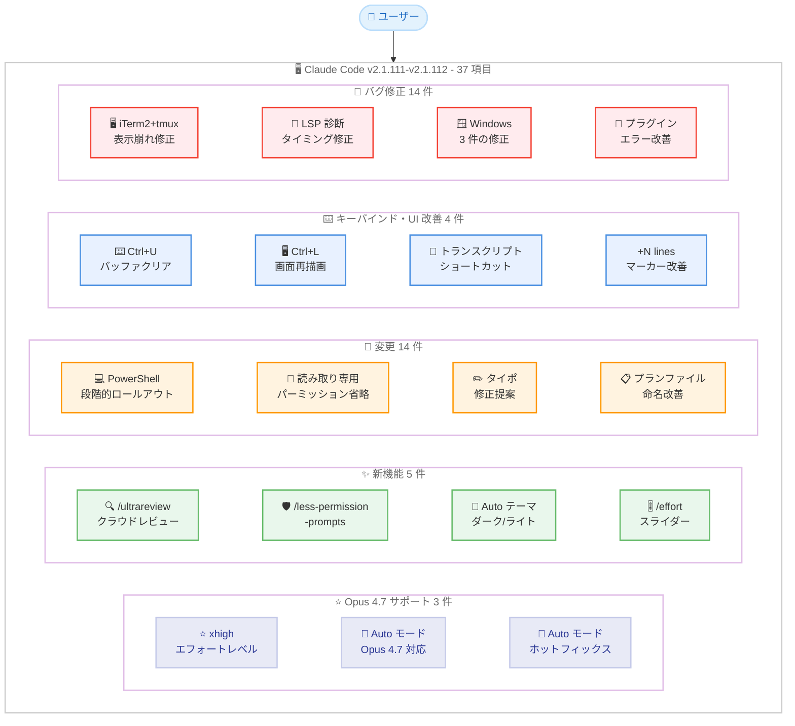
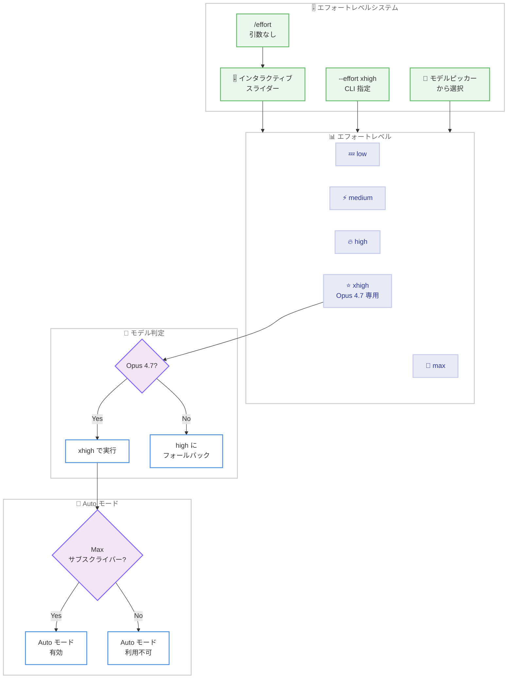
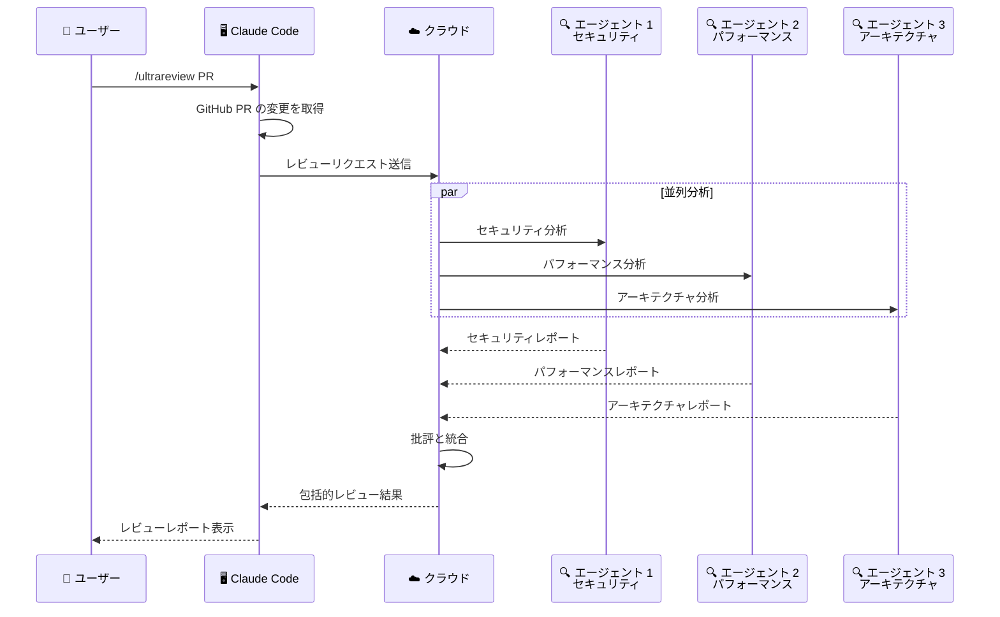
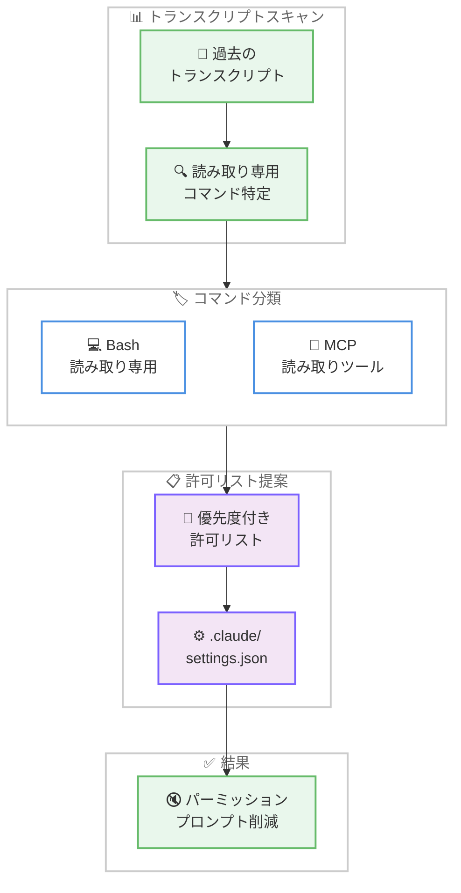

# Claude Code v2.1.111-v2.1.112 リリース: Opus 4.7 xhigh エフォート、/ultrareview クラウドコードレビュー、Auto モード簡素化を含む 37 件の変更

## メタデータ

| 項目 | 内容 |
|------|------|
| 発表日 | 2026-04-16 |
| ソース | Claude Code Changelog |
| カテゴリ | Claude Code アップデート |
| 公式リンク | https://github.com/anthropics/claude-code/blob/main/CHANGELOG.md |

## 概要

Claude Code v2.1.111 および v2.1.112 が 2026 年 4 月 16 日にリリースされました。前バージョン v2.1.109-v2.1.110 (2026 年 4 月 15 日) から 1 日後のリリースです。v2.1.111 は新機能 8 件、変更 14 件、バグ修正 14 件の合計 36 件を含むメジャーリリース、v2.1.112 は 1 件のホットフィックスで、2 バージョン合わせて 37 項目のアップデートとなります。

本リリースの最大の注目点は **Claude Opus 4.7 xhigh エフォートレベルの正式サポート**です。`/effort` コマンドまたは `--effort` オプションで速度とインテリジェンスのバランスを調整できるようになり、`high` と `max` の間に位置する `xhigh` レベルが Opus 4.7 専用で追加されました。さらに、**Max サブスクライバー向けに Auto モードが Opus 4.7 で利用可能**となり、`--enable-auto-mode` フラグが不要になるなど Auto モードの利用が大幅に簡素化されました。

もう 1 つの主要な新機能は **`/ultrareview` コマンド**です。クラウド上で並列マルチエージェント分析と批評を実行する包括的なコードレビュー機能で、現在のブランチまたは特定の GitHub PR を対象にレビューを行えます。加えて、**`/less-permission-prompts` スキル**によるパーミッションプロンプトの削減、**Windows PowerShell ツールの段階的ロールアウト**、**Auto テーマオプション**、**`/effort` のインタラクティブスライダー**など、開発者体験を大幅に改善する機能が多数追加されています。

## 詳細

### 背景

Claude Code は Anthropic が提供する CLI ベースの AI 開発支援ツールです。v2.1.111 は 36 件の変更を含む大規模リリースであり、Claude Opus 4.7 のサポートとそれに伴うエフォートレベルシステムの拡張が中心です。v2.1.112 は v2.1.111 リリース直後に発見された Auto モードでの Opus 4.7 一時利用不可問題を修正するホットフィックスです。

前バージョン v2.1.109-v2.1.110 では TUI フルスクリーンモード、プッシュ通知、MCP 接続安定性修正が行われましたが、本リリースではモデルサポートの拡張、コードレビューワークフローの革新、パーミッション管理の改善という 3 つの異なる領域に焦点が当てられています。

### 主な変更点

#### v2.1.112 - ホットフィックス - 1 件

- **Auto モードでの Opus 4.7 一時利用不可の修正**: Auto モードで "claude-opus-4-7 is temporarily unavailable" エラーが発生する問題が修正されました。v2.1.111 で Auto モードが Opus 4.7 に対応した直後の緊急修正です

#### v2.1.111 - 新機能 (Added) - 8 件

- **Claude Opus 4.7 xhigh エフォートレベル**: Claude Opus 4.7 xhigh が利用可能になりました。`/effort` コマンドで速度とインテリジェンスのバランスを調整できます。`xhigh` は `high` と `max` の間に位置する新しいエフォートレベルで、Opus 4.7 専用です。`/effort`、`--effort`、モデルピッカーから選択でき、他のモデルでは `high` にフォールバックします
- **Opus 4.7 での Auto モード**: Max サブスクライバーが Opus 4.7 使用時に Auto モードを利用できるようになりました
- **`/effort` インタラクティブスライダー**: `/effort` を引数なしで呼び出すと、矢印キーで操作できるインタラクティブスライダーが開きます。レベル間をナビゲートし、Enter キーで確定できます
- **Auto テーマオプション**: ターミナルのダーク/ライトモードに自動的に合わせる "Auto (match terminal)" テーマオプションが追加されました。`/theme` から選択できます
- **`/less-permission-prompts` スキル**: トランスクリプトをスキャンして一般的な読み取り専用の Bash および MCP ツール呼び出しを特定し、`.claude/settings.json` に優先度付きの許可リストを提案します。パーミッションプロンプトの頻度を効果的に削減できます
- **`/ultrareview` コマンド**: クラウド上で並列マルチエージェント分析と批評を実行する包括的なコードレビュー機能です。引数なしで実行すると現在のブランチをレビューし、`/ultrareview <PR#>` で特定の GitHub PR を取得してレビューします
- **`OTEL_LOG_RAW_API_BODIES` 環境変数**: 完全な API リクエストおよびレスポンスボディを OpenTelemetry ログイベントとして出力するデバッグ用環境変数が追加されました

#### v2.1.111 - 変更 (Changed) - 14 件

**Auto モード・モデル関連 - 2 件:**

- **Auto モードのフラグ不要化**: Auto モードの利用に `--enable-auto-mode` フラグが不要になりました。デフォルトで利用可能です
- **Windows PowerShell ツールの段階的ロールアウト**: PowerShell ツールが Windows で段階的にロールアウトされます。`CLAUDE_CODE_USE_POWERSHELL_TOOL` でオプトイン/オプトアウトが可能です。Linux および macOS では `CLAUDE_CODE_USE_POWERSHELL_TOOL=1` で有効化できます (PATH に `pwsh` が必要)

**パーミッション・UX 改善 - 3 件:**

- **読み取り専用 Bash コマンドのパーミッション省略**: glob パターンを含む読み取り専用 Bash コマンド (例: `ls *.ts`) および `cd <project-dir> &&` で始まるコマンドでパーミッションプロンプトが表示されなくなりました
- **サブコマンドのタイポ修正提案**: `claude <word>` でタイポに近いサブコマンドが見つかった場合、最も近いサブコマンドを提案します (例: `claude udpate` で "Did you mean `claude update`?" と表示)
- **プランファイルの命名改善**: プランファイルがプロンプトに基づいた名前 (例: `fix-auth-race-snug-otter.md`) で生成されるようになりました。従来のランダムな単語による命名から改善されています

**セットアップ・設定改善 - 3 件:**

- **`/setup-vertex` と `/setup-bedrock` の改善**: `CLAUDE_CONFIG_DIR` が設定されている場合に実際の `settings.json` パスを表示するようになりました。再実行時に既存のピンからモデル候補をシードし、対応モデルで "with 1M context" オプションが提供されます
- **`/skills` メニューのトークン数ソート**: `/skills` メニューで推定トークン数によるソートをサポートしました。`t` キーで切り替えられます
- **v2.1.110 のリトライ制限の撤回**: v2.1.110 で導入された非ストリーミングフォールバックリトライの上限が撤回されました。API 過負荷時の長時間待機よりも完全な失敗が増えるトレードオフが不適切と判断されたためです

**キーバインド・UI 改善 - 4 件:**

- **`Ctrl+U` の動作変更**: `Ctrl+U` が入力バッファ全体をクリアするようになりました (従来は行頭まで削除)。`Ctrl+Y` でクリアした内容を復元できます
- **`Ctrl+L` の動作強化**: `Ctrl+L` がプロンプト入力のクリアに加え、画面全体の再描画を強制するようになりました
- **トランスクリプトビューのフッターショートカット表示**: トランスクリプトビューのフッターに `[` (スクロールバックにダンプ) と `v` (エディタで開く) のショートカットが表示されるようになりました
- **長いペーストの "+N lines" マーカー改善**: 切り詰められた長いペーストの "+N lines" マーカーが全幅のルールで表示されるようになり、スキャンが容易になりました

**SDK・headless 改善 - 2 件:**

- **headless `stream-json` の `plugin_errors` 追加**: headless の `--output-format stream-json` で、プラグインが依存関係の不備により降格された場合に init イベントに `plugin_errors` が含まれるようになりました
- **不要なエラーメッセージの抑制**: TUI の通常操作中に表示される可能性があった、解凍エラー、ネットワークエラー、一時的なエラーメッセージが抑制されました

#### v2.1.111 - バグ修正 (Fixed) - 14 件

**ターミナル・表示修正 - 3 件:**

- **iTerm2 + tmux でのターミナル表示崩れの修正**: ターミナル通知送信時に iTerm2 + tmux セットアップでランダムな文字やドリフトする入力が表示される問題が修正されました
- **`/context` グリッドレンダリングの修正**: `/context` のグリッド表示で行間に余分な空行が表示される問題が修正されました
- **URL のクリック可能性の修正**: Bash/PowerShell/MCP ツール出力内のベア URL がターミナルの行折り返し時にクリックできなくなる問題が修正されました

**ファイル・セッション修正 - 4 件:**

- **`@` ファイル提案の再スキャン問題の修正**: 非 Git ワーキングディレクトリで毎ターン `@` ファイル提案がプロジェクト全体を再スキャンする問題と、追跡ファイルのない新規初期化 Git リポジトリで設定ファイルのみが表示される問題が修正されました
- **LSP 診断のタイミング修正**: 編集前の LSP 診断が編集後に表示され、モデルが編集したばかりのファイルを再読み込みする問題が修正されました
- **`/resume` のタブ補完修正**: `/resume` のタブ補完でセッションピッカーが表示される代わりに任意のタイトル付きセッションが即座に再開される問題が修正されました
- **`/clear` でのセッション名ドロップの修正**: `/clear` が `/rename` で設定したセッション名を失い、ステータスライン出力で `session_name` が失われる問題が修正されました

**プラグイン・Skill 修正 - 2 件:**

- **プラグインエラーハンドリングの改善**: 依存関係エラーで競合、無効、過度に複雑なバージョン要件を区別するようになりました。`plugin update` 後の古い解決済みバージョンの修正、`plugin install` が中断された以前のインストールからの復旧に対応しました
- **`commit` スキルの呼び出しエラーの修正**: カスタム `/commit` コマンドがないユーザーで、Claude が存在しない `commit` スキルを呼び出し "Unknown skill: commit" と表示される問題が修正されました

**エラーハンドリング・その他修正 - 5 件:**

- **Bedrock/Vertex/Foundry の 429 レート制限エラーメッセージの修正**: Bedrock/Vertex/Foundry での 429 レート制限エラーが status.claude.com を参照していた問題が修正されました (status.claude.com は Anthropic 運営のプロバイダーのみ対象)
- **フィードバックサーベイの連続表示修正**: 1 つを閉じた直後に別のフィードバックサーベイが表示される問題が修正されました
- **Windows: 環境ファイルの適用修正**: `CLAUDE_ENV_FILE` および SessionStart フックの環境ファイルが実際に適用されるようになりました (従来は no-op)
- **Windows: ドライブレターパスのパーミッションルール修正**: ドライブレターパスを含むパーミッションルールが正しくルートアンカーされるようになり、ドライブレターの大文字小文字の違いのみのパスが同一パスとして認識されるようになりました
- **Windows: `CLAUDE_ENV_FILE` の適用**: Windows で `CLAUDE_ENV_FILE` と SessionStart フックの環境ファイルが正しく適用されるようになりました

### 技術的な詳細

#### Claude Opus 4.7 xhigh エフォートシステム

Claude Code のエフォートレベルシステムに `xhigh` が追加されました。このレベルは Opus 4.7 専用で、既存の `low`、`medium`、`high`、`max` の 4 段階に加わる 5 段階目のレベルです。`xhigh` は `high` と `max` の間に位置し、`max` ほどのレイテンシを発生させずに高いインテリジェンスを発揮します。

```
low → medium → high → xhigh (Opus 4.7 only) → max
```

`/effort` コマンドを引数なしで実行すると、インタラクティブスライダーが表示されます。矢印キーでレベル間を移動し、Enter キーで確定する直感的な操作が可能です。CLI からは `--effort xhigh` で直接指定することもできます。Opus 4.7 以外のモデルで `xhigh` を指定した場合は、自動的に `high` にフォールバックします。

#### Auto モードの簡素化

従来 Auto モードの利用には `--enable-auto-mode` フラグが必要でしたが、v2.1.111 でこのフラグが不要になりました。Max サブスクライバーが Opus 4.7 を使用している場合、Auto モードがデフォルトで利用可能です。ただし、v2.1.112 で修正されたように、初期リリース時には Auto モードで Opus 4.7 が一時的に利用不可になるエラーが発生していました。

#### /ultrareview クラウドコードレビュー

`/ultrareview` は Claude Code に新たに追加されたクラウドベースのコードレビュー機能です。ローカルの単一エージェントによるレビューとは異なり、クラウド上で複数のエージェントが並列に分析と批評を実行します。

- **引数なし**: 現在のブランチの変更をレビュー
- **`/ultrareview <PR#>`**: 指定した GitHub PR を取得してレビュー

並列マルチエージェントアーキテクチャにより、大規模な変更セットでも包括的なレビューが可能です。セキュリティ、パフォーマンス、アーキテクチャ、コード品質などの複数の観点から同時に分析が行われます。

#### /less-permission-prompts スキル

`/less-permission-prompts` スキルは、過去のトランスクリプトを分析してユーザーが頻繁に許可している読み取り専用の Bash コマンドや MCP ツール呼び出しを特定し、`.claude/settings.json` に追加する許可リストを提案します。これにより、安全性を維持しながらパーミッションプロンプトの頻度を効果的に削減できます。

さらに、glob パターンを含む読み取り専用 Bash コマンド (例: `ls *.ts`) と `cd <project-dir> &&` で始まるコマンドはデフォルトでパーミッションプロンプトが不要になりました。

#### Windows PowerShell ツール

Windows で PowerShell ツールが段階的にロールアウトされます。環境変数 `CLAUDE_CODE_USE_POWERSHELL_TOOL` でオプトイン/オプトアウトが可能です。

- **Windows**: 段階的に自動有効化 (オプトアウトは `CLAUDE_CODE_USE_POWERSHELL_TOOL=0`)
- **Linux / macOS**: `CLAUDE_CODE_USE_POWERSHELL_TOOL=1` で明示的に有効化 (PATH に `pwsh` が必要)

これにより、Windows ユーザーはネイティブの PowerShell 環境で Claude Code のツール実行が可能になり、Bash エミュレーションに依存する必要がなくなります。

#### OpenTelemetry デバッグ拡張

`OTEL_LOG_RAW_API_BODIES` 環境変数を設定することで、Claude API との完全なリクエスト/レスポンスボディが OpenTelemetry ログイベントとして出力されます。前バージョンで追加された `TRACEPARENT`/`TRACESTATE` による分散トレースリンキングと組み合わせることで、CI/CD パイプラインでの詳細なデバッグとモニタリングが可能になります。

## アーキテクチャ図

### v2.1.111-v2.1.112 変更点の全体像



### Opus 4.7 エフォートシステムとモデル選択フロー



### /ultrareview マルチエージェントアーキテクチャ



### /less-permission-prompts ワークフロー



## 開発者への影響

### 対象

- **全ての Claude Code ユーザー**: 14 件のバグ修正と 14 件の変更により、全体的な安定性と操作性が向上しています。特に iTerm2 + tmux の表示崩れ修正、`@` ファイル提案の再スキャン問題の修正、LSP 診断のタイミング修正は日常的な開発体験に直接影響します
- **Claude Opus 4.7 ユーザー**: `xhigh` エフォートレベルにより、速度とインテリジェンスの最適なバランスを選択できます。Auto モードも Opus 4.7 で利用可能になり、`--enable-auto-mode` フラグが不要になりました
- **Max サブスクライバー**: Opus 4.7 での Auto モードがデフォルトで利用可能です。v2.1.112 のホットフィックスにより、Auto モードでの一時利用不可問題も解消されています
- **コードレビューを行うチーム**: `/ultrareview` により、クラウドベースの並列マルチエージェントコードレビューが利用可能です。PR レビューワークフローを大幅に効率化できます
- **パーミッションプロンプトを煩わしく感じるユーザー**: `/less-permission-prompts` スキルで許可リストを自動提案できます。読み取り専用 Bash コマンドのパーミッション自動省略も適用されます
- **Windows ユーザー**: PowerShell ツールの段階的ロールアウト、`CLAUDE_ENV_FILE` の適用修正、ドライブレターパスのパーミッション修正により、Windows 環境のサポートが大幅に改善されました
- **SDK/headless 利用者・CI/CD パイプライン運用者**: `OTEL_LOG_RAW_API_BODIES` による API デバッグ、`plugin_errors` の init イベント出力、不要なエラーメッセージの抑制により、自動化環境での運用性が向上しました
- **プラグイン開発者**: 依存関係エラーの詳細な区別、`plugin update` 後の古いバージョン修正、`plugin install` の中断からの復旧など、プラグインエコシステムの信頼性が向上しています

### 必要なアクション

以下のコマンドで最新バージョンに更新できます。

```bash
# npm でのアップデート
npm update -g @anthropic-ai/claude-code

# Homebrew でのアップデート
brew upgrade claude-code

# 現在のバージョン確認
claude --version
```

**確認が推奨される項目:**

- **Opus 4.7 xhigh エフォート**: `/effort` でインタラクティブスライダーを試してください。`xhigh` レベルで速度とインテリジェンスのバランスを確認できます
- **Auto モード**: Max サブスクライバーの場合、`--enable-auto-mode` フラグを削除してください。フラグなしで Auto モードが利用可能です
- **`/ultrareview`**: 現在のブランチまたは PR 番号を指定してクラウドコードレビューを試してください
- **`/less-permission-prompts`**: 日常的にパーミッションプロンプトが多い場合、このスキルを実行して許可リストの提案を受けてください
- **Auto テーマ**: `/theme` から "Auto (match terminal)" を選択して、ターミナルのテーマに自動追従させることができます
- **Windows PowerShell**: Windows ユーザーは PowerShell ツールが段階的に有効化されます。動作に問題がある場合は `CLAUDE_CODE_USE_POWERSHELL_TOOL=0` でオプトアウトしてください
- **`Ctrl+U` の動作変更**: 入力バッファ全体がクリアされるようになりました。従来の「行頭まで削除」の動作を期待していた場合は注意してください

### 移行ガイド

#### Auto モードフラグの削除

v2.1.111 で `--enable-auto-mode` フラグが不要になりました。スクリプトやエイリアスで使用している場合は削除を推奨します。

```bash
# v2.1.110 以前
claude --enable-auto-mode "タスクを実行してください"

# v2.1.111 以降
claude "タスクを実行してください"
# Auto モードは Max サブスクライバー + Opus 4.7 で自動的に有効
```

#### Ctrl+U の動作変更

```bash
# v2.1.110 以前
# Ctrl+U: カーソル位置から行頭までを削除

# v2.1.111 以降
# Ctrl+U: 入力バッファ全体をクリア
# Ctrl+Y: クリアした内容を復元
```

#### PowerShell ツールの制御

```bash
# Windows: オプトアウト
export CLAUDE_CODE_USE_POWERSHELL_TOOL=0

# Linux / macOS: 明示的にオプトイン (pwsh が PATH に必要)
export CLAUDE_CODE_USE_POWERSHELL_TOOL=1
```

## コード例

### エフォートレベルの設定

```bash
# インタラクティブスライダーで設定
> /effort
# 矢印キーでレベルを選択、Enter で確定
# low → medium → high → xhigh → max

# CLI から直接指定
claude --effort xhigh "コードの最適化を提案してください"

# /effort コマンドで直接指定
> /effort xhigh
```

### /ultrareview によるコードレビュー

```bash
# 現在のブランチをレビュー
> /ultrareview
# クラウドで並列マルチエージェント分析が実行される

# 特定の GitHub PR をレビュー
> /ultrareview 456
# PR #456 を取得してクラウドレビューを実行
```

### /less-permission-prompts によるパーミッション最適化

```bash
# トランスクリプトをスキャンして許可リストを提案
> /less-permission-prompts
# 一般的な読み取り専用コマンドを特定
# .claude/settings.json に追加する許可リストを提案
```

### Auto テーマの設定

```bash
# テーマ選択メニューを開く
> /theme
# "Auto (match terminal)" を選択
# ターミナルのダーク/ライトモードに自動追従
```

### /setup-vertex と /setup-bedrock の改善された設定フロー

```bash
# Vertex AI セットアップ
> /setup-vertex
# CLAUDE_CONFIG_DIR が設定されている場合、実際の settings.json パスを表示
# 再実行時に既存のピンからモデル候補をシード
# 対応モデルで "with 1M context" オプションが提供

# Bedrock セットアップ
> /setup-bedrock
# 同様の改善が適用
```

### /skills メニューのトークン数ソート

```bash
# /skills メニューを開く
> /skills
# t キーを押してトークン数でソート
# 推定トークン数の大きい順にスキルが表示される
```

### OTEL_LOG_RAW_API_BODIES によるデバッグ

```bash
# API リクエスト/レスポンスボディの完全なログ出力を有効化
export OTEL_LOG_RAW_API_BODIES=1

# Claude Code を実行
claude "テストを作成してください"
# OpenTelemetry ログイベントに完全な API ボディが含まれる
```

### Windows 環境での PowerShell ツール制御

```powershell
# Windows: PowerShell ツールをオプトアウト
$env:CLAUDE_CODE_USE_POWERSHELL_TOOL = "0"

# Windows: PowerShell ツールを明示的に有効化
$env:CLAUDE_CODE_USE_POWERSHELL_TOOL = "1"

# Linux / macOS: pwsh が PATH に必要
which pwsh  # pwsh のパスを確認
export CLAUDE_CODE_USE_POWERSHELL_TOOL=1
```

## 関連リンク

- [Claude Code Changelog](https://github.com/anthropics/claude-code/blob/main/CHANGELOG.md)
- [Claude Code GitHub リポジトリ](https://github.com/anthropics/claude-code)
- [Claude Code v2.1.109-v2.1.110](./2026-04-15-claude-code-v2-1-109-v2-1-110.md)
- [Claude Code v2.1.107-v2.1.108](./2026-04-14-claude-code-v2-1-107-v2-1-108.md)
- [Claude Code v2.1.105](./2026-04-13-claude-code-v2-1-105.md)
- [Claude Code v2.1.101](./2026-04-10-claude-code-v2-1-101.md)

## まとめ

Claude Code v2.1.111 および v2.1.112 は、v2.1.111 の新機能 8 件、変更 14 件、バグ修正 14 件と v2.1.112 のホットフィックス 1 件を合わせた全 37 項目のリリースです。変更は大きく 5 つの領域にわたります。

第一に、**Claude Opus 4.7 サポートと Auto モードの簡素化**が実現しました。`xhigh` エフォートレベルの追加により、`high` と `max` の間の最適なバランスが選択可能になりました。Auto モードは `--enable-auto-mode` フラグが不要になり、Max サブスクライバーが Opus 4.7 使用時にデフォルトで利用可能です。`/effort` のインタラクティブスライダーにより、エフォートレベルの選択が直感的になりました。v2.1.112 では Auto モードでの Opus 4.7 一時利用不可問題が即座に修正されています。

第二に、**コードレビューワークフローの革新**です。`/ultrareview` コマンドにより、クラウド上で並列マルチエージェント分析と批評を実行する包括的なコードレビューが利用可能になりました。引数なしで現在のブランチ、PR 番号指定で特定の GitHub PR をレビューでき、セキュリティ、パフォーマンス、アーキテクチャなど複数の観点からの同時分析が実現します。

第三に、**パーミッション管理の大幅改善**です。`/less-permission-prompts` スキルによる許可リストの自動提案、glob パターンを含む読み取り専用 Bash コマンドのパーミッション自動省略、`cd <project-dir> &&` パターンの許可により、日常的なパーミッションプロンプトの頻度が大幅に削減されました。

第四に、**Windows サポートの強化**です。PowerShell ツールの段階的ロールアウト、`CLAUDE_ENV_FILE` と SessionStart フック環境ファイルの適用修正、ドライブレターパスのパーミッションルール修正により、Windows 環境での Claude Code の信頼性と利便性が向上しています。

第五に、**開発者体験の全般的な改善**です。Auto テーマオプション、タイポ時のサブコマンド提案、プランファイルの命名改善、`Ctrl+U`/`Ctrl+L` の動作強化、トランスクリプトビューのショートカット表示、`/skills` メニューのトークン数ソートなど、日常的な操作の細部にわたる改善が行われました。バグ修正では iTerm2 + tmux の表示崩れ、LSP 診断のタイミング、`@` ファイル提案の再スキャン問題など、開発効率に直結する 14 件の修正が含まれます。

全ての Claude Code ユーザーに対してアップデートを推奨します。特に Opus 4.7 の `xhigh` エフォートレベルと `/ultrareview` は開発ワークフローに変革をもたらす機能であり、`/less-permission-prompts` スキルと読み取り専用コマンドのパーミッション省略は日常的な開発体験を大きく改善します。
