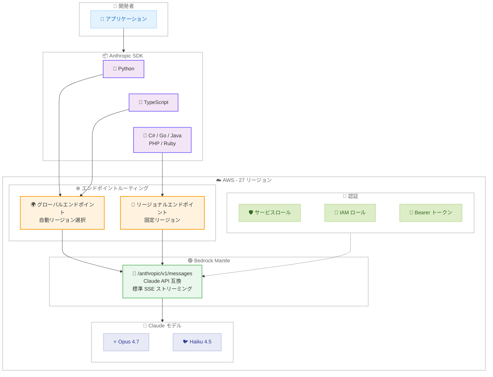

# Claude in Amazon Bedrock がリサーチプレビューから一般提供 (GA) に移行

## メタデータ

| 項目 | 内容 |
|------|------|
| 発表日 | 2026-04-16 |
| ソース | Claude API Release Notes |
| カテゴリ | プラットフォーム / クラウド統合 |
| 公式リンク | https://platform.claude.com/docs/en/build-with-claude/claude-in-amazon-bedrock |

## 概要

Anthropic は 2026 年 4 月 16 日、「Claude in Amazon Bedrock」をリサーチプレビューから一般提供 (GA) に移行し、全ての Amazon Bedrock 顧客に開放したことを発表しました。4 月 7 日のリサーチプレビュー開始からわずか 9 日間で GA に到達し、招待制から Bedrock コンソールでのセルフサービスアクセスへと切り替わりました。同日に発表された Claude Opus 4.7 と Claude Haiku 4.5 が、Bedrock Mantle エンドポイント `/anthropic/v1/messages` 経由で即座に利用可能です。

GA 移行に伴い、対応リージョンは `us-east-1` のみから 27 の AWS リージョンに拡大され、グローバルエンドポイントおよびリージョナルエンドポイントによるルーティングが利用可能になりました。専用 AWS アカウントの要件も撤廃され、既存の Bedrock アカウントからそのままアクセスできるようになっています。さらに、ゼロデータ保持 (ZDR) オプションがリサーチプレビューでは未提供でしたが、GA では AWS サポートへの問い合わせにより利用可能になりました。

## 詳細

### 背景

Amazon Bedrock における Claude の統合方式は、これまで 3 つの段階を経て進化してきました。

1. **レガシー統合 (従来)**: AWS 独自の `InvokeModel` API、ARN ベースのモデル識別子、AWS イベントストリームエンコーディングを使用。Anthropic API との互換性がなく、プラットフォーム間でのコード移植にアダプターコードが必要でした。

2. **リサーチプレビュー (2026 年 4 月 7 日)**: 新エンドポイント `/anthropic/v1/messages` と `AnthropicBedrockMantle` クライアントが導入され、Anthropic のファーストパーティ API と同一のリクエスト形式が利用可能に。ただし、`us-east-1` リージョンのみ、招待制、専用 AWS アカウントが必要という制約がありました。

3. **一般提供 / GA (2026 年 4 月 16 日)**: 全ての Bedrock 顧客に開放。27 リージョン対応、セルフサービスアクセス、ZDR オプション追加など、本番環境での利用に必要な要件が整備されました。

### 主な変更点

リサーチプレビューから GA への移行における主要な変更点は以下のとおりです。

| 項目 | リサーチプレビュー | GA |
|------|-------------------|-----|
| アクセス方法 | 招待制 (Anthropic AE への問い合わせ) | セルフサービス (Bedrock コンソールから直接) |
| 対応リージョン | `us-east-1` のみ | 27 AWS リージョン + グローバルエンドポイント |
| AWS アカウント | 専用アカウントが必要 | 既存の Bedrock アカウントで利用可能 |
| ゼロデータ保持 | 利用不可 | AWS サポートへの問い合わせで利用可能 |
| 利用可能モデル | 限定的 | Claude Opus 4.7、Claude Haiku 4.5 (オープン) |
| 許可リスト登録 | 必要 (最大 24 時間待ち) | 不要 |

### 技術的な詳細

#### エンドポイント

```
https://bedrock-mantle.{region}.api.aws/anthropic/v1/messages
```

Anthropic のファーストパーティ API と同一のリクエストボディ形式を使用し、標準 SSE ストリーミングに対応しています。

#### 利用可能なモデル

| モデル | モデル ID | アクセス |
|--------|----------|---------|
| Claude Opus 4.7 | `anthropic.claude-opus-4-7` | オープン |
| Claude Haiku 4.5 | `anthropic.claude-haiku-4-5` | オープン |
| Claude Mythos Preview | `anthropic.claude-mythos-preview` | 招待制 |

#### 認証方式

3 つの認証パスをサポートしています。

1. **Bedrock サービスロール (推奨)**: AWS マネージドキーを使用した最も安全な長期アクセス方式
2. **IAM 引き受けロール**: ID フェデレーション経由のアクセス、最大 12 時間セッション
3. **Bearer トークン**: 短期アクセス用、最も非推奨の方式

#### SDK サポート

全公式 SDK が Bedrock Mantle クライアントを提供しています。

| 言語 | インストール | クライアント |
|------|-------------|-------------|
| Python | `pip install "anthropic[bedrock]"` | `AnthropicBedrockMantle` |
| TypeScript | `@anthropic-ai/bedrock-sdk` | `AnthropicBedrockMantle` |
| C# | `Anthropic.Bedrock` | `AnthropicBedrockMantleClient` |
| Go | `github.com/anthropics/anthropic-sdk-go/bedrock` | `bedrock.NewMantleClient` |
| Java | `com.anthropic:anthropic-java-bedrock` | `BedrockMantleBackend` |
| PHP | `anthropic-ai/sdk` + `aws/aws-sdk-php` | `MantleClient` |
| Ruby | `anthropic` gem | `Anthropic::BedrockMantleClient` |

#### サポートされる機能

- Messages API
- プロンプトキャッシング
- 拡張思考 (Extended Thinking)
- ツール使用 (クライアント定義ツール)
- 引用 (Citations)
- 構造化出力 (Structured Outputs)

#### サポートされない機能

- Anthropic 定義ツール (Web Search、Web Fetch、Remote MCP、Memory、Files API、Computer Use、Skills、Code Execution)
- Claude Managed Agents
- Message Batches API
- `/v1/users` エンドポイント

#### リージョン対応

27 の AWS リージョンで利用可能です。

- **グローバルエンドポイント**: リクエストを最適なリージョンに自動ルーティング
- **リージョナルエンドポイント**: 特定リージョンへの固定ルーティング (10% プレミアム)
- **推論プロファイル**: US、EU、JP、AU の 4 つのリージョングループをサポート

主要リージョン: `us-east-1`、`us-east-2`、`us-west-1`、`us-west-2`、`eu-central-1`、`eu-west-1`、`ap-northeast-1` (東京)、`ap-southeast-2` (シドニー) など

#### クォータ

- デフォルト: 200 万入力トークン/分 (TPM)
- 追加承認なしで最大 400 万入力 TPM までリクエスト可能

## 開発者への影響

### 対象

- Amazon Bedrock 経由で Claude を利用している全ての開発者および企業
- Anthropic API と Bedrock の両方でコードの移植性を求めている開発者
- AWS セキュリティ境界内での Claude 利用が必要なエンタープライズ顧客
- リサーチプレビューでアクセスを待機していた開発者
- 従来の `InvokeModel` API からの移行を検討している開発者

### 必要なアクション

1. **Bedrock コンソールでモデルアクセスを有効化**: Claude Opus 4.7 または Claude Haiku 4.5 をセルフサービスで有効化
2. **SDK のインストールまたは更新**: 各言語の Bedrock 対応パッケージを導入
3. **クライアントの切り替え**: `AnthropicBedrock` から `AnthropicBedrockMantle` に変更
4. **リージョン選択の検討**: 27 リージョンから最適なリージョンを選択 (レイテンシ、データ所在地要件を考慮)
5. **ZDR が必要な場合**: AWS サポートに問い合わせてゼロデータ保持を申請

### 移行ガイド

従来の Bedrock 統合から新しい Bedrock Mantle への移行は、主にクライアント初期化の変更で対応できます。

**変更が必要な箇所**:

- クライアントクラス: `AnthropicBedrock` から `AnthropicBedrockMantle` へ変更
- エンドポイント: 自動的に `bedrock-mantle.{region}.api.aws` を使用
- モデル ID: `anthropic.` プレフィックス付きのモデル ID を使用 (ARN ベースではなく)

**変更が不要な箇所**:

- リクエストボディの構造 (messages、max_tokens 等)
- レスポンスの処理ロジック
- ストリーミングの処理 (標準 SSE に自動対応)

## コード例

### 従来の Bedrock 統合 (レガシー)

```python
from anthropic import AnthropicBedrock

# 従来の Bedrock クライアント (InvokeModel API を使用)
client = AnthropicBedrock(aws_region="us-west-2")

message = client.messages.create(
    model="global.anthropic.claude-opus-4-6-v1",
    max_tokens=1024,
    messages=[{"role": "user", "content": "Hello, Claude"}],
)
print(message.content[0].text)
```

### 新しい Claude in Amazon Bedrock (GA)

```python
from anthropic import AnthropicBedrockMantle

# 新しい Bedrock Mantle クライアント (Messages API を直接使用)
# GA により 27 リージョンから選択可能
client = AnthropicBedrockMantle(aws_region="ap-northeast-1")

message = client.messages.create(
    model="anthropic.claude-opus-4-7",
    max_tokens=1024,
    messages=[{"role": "user", "content": "Hello, Claude"}],
)
print(message.content[0].text)
```

### TypeScript での例

```typescript
import { AnthropicBedrockMantle } from "@anthropic-ai/bedrock-sdk";

const client = new AnthropicBedrockMantle({
  awsRegion: "ap-northeast-1",
});

const message = await client.messages.create({
  model: "anthropic.claude-opus-4-7",
  max_tokens: 1024,
  messages: [{ role: "user", content: "Hello, Claude" }],
});

console.log(message.content[0].text);
```

### curl での直接リクエスト

```bash
curl https://bedrock-mantle.ap-northeast-1.api.aws/anthropic/v1/messages \
  --aws-sigv4 "aws:amz:ap-northeast-1:bedrock-mantle" \
  --user "$AWS_ACCESS_KEY_ID:$AWS_SECRET_ACCESS_KEY" \
  -H "x-amz-security-token: $AWS_SESSION_TOKEN" \
  -H "content-type: application/json" \
  -H "anthropic-version: 2023-06-01" \
  -d '{
    "model": "anthropic.claude-opus-4-7",
    "max_tokens": 1024,
    "messages": [
      {"role": "user", "content": "Hello, Claude"}
    ]
  }'
```

## アーキテクチャ図



## 関連リンク

- [Claude API Release Notes](https://platform.claude.com/docs/en/release-notes/overview)
- [Claude in Amazon Bedrock ドキュメント](https://platform.claude.com/docs/en/build-with-claude/claude-in-amazon-bedrock)
- [Claude on Amazon Bedrock - レガシー統合](https://platform.claude.com/docs/en/build-with-claude/claude-on-amazon-bedrock)
- [Anthropic Client SDK](https://platform.claude.com/docs/en/api/client-sdks)
- [AWS Bedrock](https://aws.amazon.com/bedrock/)
- [リサーチプレビュー時のレポート](./2026-04-07-messages-api-amazon-bedrock.md)
- [Claude Opus 4.7 レポート](./2026-04-16-claude-opus-4-7.md)

## まとめ

Claude in Amazon Bedrock の一般提供 (GA) は、4 月 7 日のリサーチプレビュー開始からわずか 9 日間で実現した迅速な展開です。招待制から全 Bedrock 顧客へのセルフサービスアクセスへの移行、`us-east-1` のみから 27 AWS リージョンへの大幅な拡大、専用アカウント要件の撤廃、ゼロデータ保持オプションの追加と、本番環境での利用に必要な要件が全面的に整備されました。

同日に発表された Claude Opus 4.7 がすぐに Bedrock Mantle 経由で利用可能になったことは、Anthropic と AWS の統合がファーストパーティ API と同等のスピードで新モデルを提供できる段階に達したことを示しています。開発者は `AnthropicBedrockMantle` クライアントを使用することで、Anthropic API と同一のコード構造を維持しながら、AWS マネージドインフラのセキュリティとスケーラビリティを活用できます。従来の `InvokeModel` API を使用している場合は、GA を機に新しい Bedrock Mantle への移行を検討することを推奨します。
