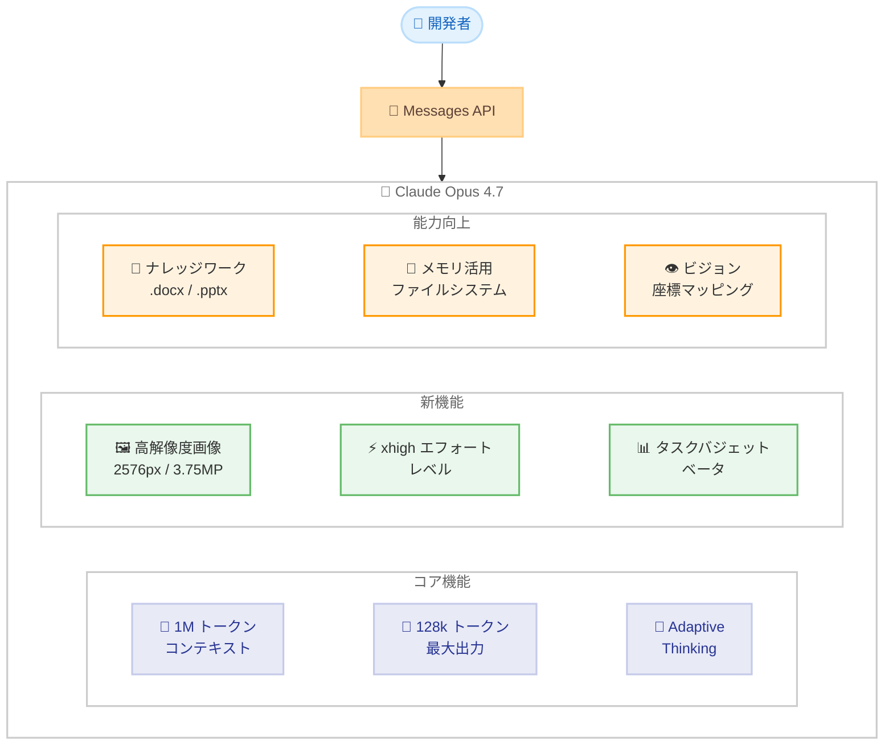
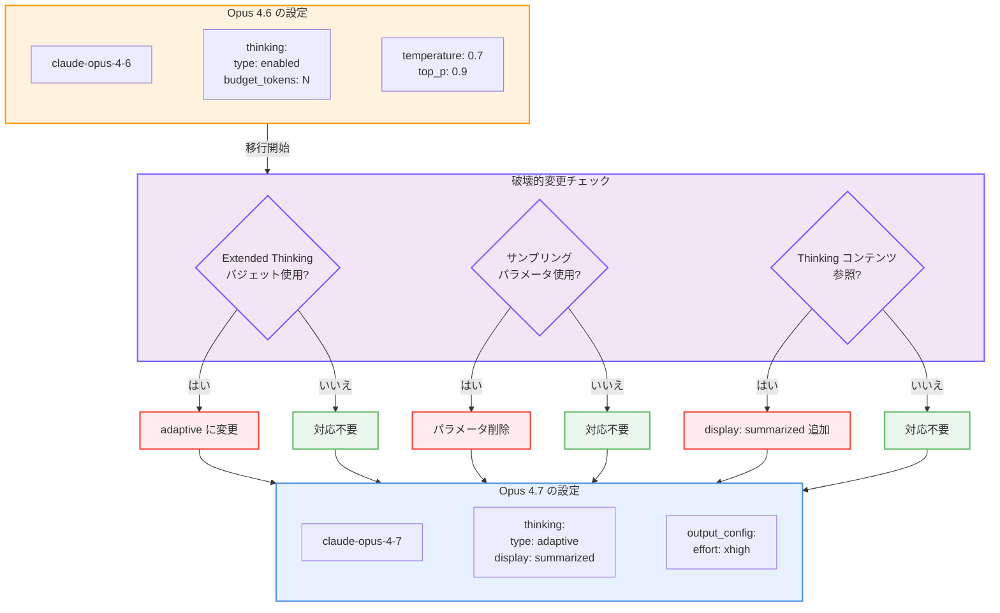
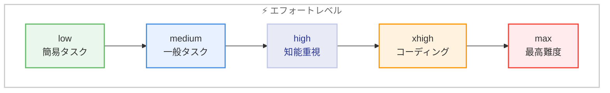

# Claude Opus 4.7 リリース -- 高解像度画像対応・タスクバジェット・新エフォートレベルを搭載、Opus 4.6 からの破壊的変更あり

## メタデータ

| 項目 | 内容 |
|------|------|
| 発表日 | 2026-04-16 |
| ソース | Claude Developer Platform Release Notes |
| カテゴリ | モデルリリース |
| 公式リンク | [What's new in Claude Opus 4.7](https://platform.claude.com/docs/en/about-claude/models/whats-new-claude-4-7) |

## 概要

Anthropic は 2026 年 4 月 16 日、最も高性能な一般提供 (GA) モデルである Claude Opus 4.7 をリリースしました。API モデル ID は `claude-opus-4-7` で、複雑な推論やエージェントコーディングにおいて最高水準の能力を備えています。価格は Opus 4.6 と同一の入力 $5 / 出力 $25 (100 万トークンあたり) に据え置かれています。

本リリースでは、高解像度画像サポート、新しい `xhigh` エフォートレベル、タスクバジェット機能 (ベータ) といった新機能が追加される一方、Messages API において複数の破壊的変更が導入されています。Extended Thinking のバジェット指定が廃止され Adaptive Thinking のみとなるほか、サンプリングパラメータの非デフォルト値が使用不可になるなど、既存のコードに影響を及ぼす変更が含まれるため、アップグレード前に移行ガイドの確認が必須です。

## 詳細

### 背景

Claude Opus 4.6 は 2026 年 2 月 5 日にリリースされ、Adaptive Thinking や Compaction API、データレジデンシーなどの機能を搭載した高性能モデルとして広く利用されてきました。今回の Opus 4.7 は、そのわずか約 2 か月後のメジャーアップデートとなり、Anthropic のモデル進化のペースが加速していることを示しています。

特筆すべきは、価格据え置きでの性能向上です。Opus 4.6 と同じ $5/$25 per MTok の価格設定を維持しながら、画像処理能力の大幅な強化、エージェント動作のきめ細かな制御、そしてトークン使用量の管理機能を新たに提供しています。

### 主な変更点

#### 新機能

1. **高解像度画像サポート**: Claude モデルとして初めてハイレゾ画像に対応。最大解像度が従来の 1568px / 1.15MP から 2576px / 3.75MP へ約 3.3 倍に向上しました。実ピクセルとの 1:1 座標マッピングにより、スケールファクターの計算が不要になりました。低レベルの知覚タスク (ポインティング、測定、カウント) と画像ローカライゼーション (バウンディングボックス検出) が大幅に改善されています

2. **新しい `xhigh` エフォートレベル**: `high` と `max` の中間に位置する新レベル。コーディングやエージェントユースケースに推奨されます。知能を重視するユースケースでは最低 `high` の使用が推奨されています

3. **タスクバジェット機能 (ベータ)**: エージェントループ全体 (思考 + ツール呼び出し + 出力) に対してトークン目標を設定可能。モデルは残りバジェットのカウントダウンを参照しながら動作します。`task-budgets-2026-03-13` ベータヘッダーの指定が必要で、最小 20k トークンから設定できます。これは `max_tokens` とは異なりハードキャップではなく、あくまでアドバイザリーな目標値です

#### 破壊的変更 (Messages API)

1. **Extended Thinking バジェットの廃止**: `thinking: {"type": "enabled", "budget_tokens": N}` を指定すると 400 エラーが返されます。Adaptive Thinking のみがサポートされ、デフォルトではオフになっているため、明示的に `thinking: {type: "adaptive"}` を設定する必要があります

2. **サンプリングパラメータの廃止**: `temperature`、`top_p`、`top_k` を非デフォルト値に設定すると 400 エラーが返されます。これらのパラメータは完全に省略する必要があります

3. **思考コンテンツのデフォルト非表示化**: Thinking ブロックは出力に含まれますが、`thinking` フィールドは空になります。可視化する場合は `display: "summarized"` を設定する必要があります

4. **トークナイザーの更新**: 新しいトークナイザーにより、従来モデルと比較して 1 倍から 1.35 倍のトークンを使用する可能性があります (最大約 35% 増加)。`max_tokens` パラメータに余裕を持たせる調整が必要です

#### 能力の向上

- **ナレッジワーク**: .docx のレッドライン、.pptx の編集、チャート/図表の分析が向上
- **メモリ**: ファイルシステムベースのメモリ、スクラッチパッド、構造化メモリストアの活用が向上
- **ビジョン**: 前述の高解像度サポートによる大幅な改善

#### 動作の変化

- より文字通りの指示追従
- タスクの複雑さに応じたレスポンス長の調整
- デフォルトでのツール呼び出し回数が減少し、推論をより多く活用
- より直接的で意見を持ったトーンに変化 (絵文字の使用が減少)
- 長いエージェントトレースでの進捗報告がより定期的に
- デフォルトでのサブエージェント生成数が減少

### 技術的な詳細

#### モデル仕様

| 項目 | Opus 4.6 | Opus 4.7 |
|------|----------|----------|
| モデル ID | `claude-opus-4-6` | `claude-opus-4-7` |
| コンテキストウィンドウ | 1M トークン | 1M トークン |
| 最大出力トークン | 128k トークン | 128k トークン |
| 入力価格 | $5 / MTok | $5 / MTok |
| 出力価格 | $25 / MTok | $25 / MTok |
| Adaptive Thinking | 対応 | 対応 |
| Extended Thinking バジェット | 対応 | **非対応 (400 エラー)** |
| 高解像度画像 | 非対応 | **対応 (2576px / 3.75MP)** |
| `xhigh` エフォートレベル | 非対応 | **対応** |
| タスクバジェット | 非対応 | **対応 (ベータ)** |
| サンプリングパラメータ | 対応 | **非対応 (400 エラー)** |
| Thinking 表示 | デフォルト表示 | **デフォルト非表示** |
| トークナイザー | 従来版 | **新版 (最大 35% 増)** |

#### 画像解像度の比較

| 項目 | Opus 4.6 以前 | Opus 4.7 |
|------|-------------|----------|
| 最大解像度 | 1568px | 2576px |
| 最大メガピクセル | 1.15MP | 3.75MP |
| 座標マッピング | スケールファクター計算が必要 | 1:1 ピクセルマッピング |
| バウンディングボックス検出 | 標準 | 大幅改善 |

#### エフォートレベル一覧

| レベル | 説明 | 推奨ユースケース |
|--------|------|------------------|
| `low` | 最小限の推論 | 簡単な分類タスク |
| `medium` | 標準的な推論 | 一般的な質問応答 |
| `high` | 深い推論 | 知能重視のタスク (最低推奨) |
| **`xhigh` (新)** | **高度な推論** | **コーディング、エージェント** |
| `max` | 最大限の推論 | 最も困難なタスク |

## 開発者への影響

### 対象

- Claude Opus 4.6 (`claude-opus-4-6`) を使用しており、Opus 4.7 へのアップグレードを検討しているすべての開発者
- Extended Thinking のバジェット指定 (`budget_tokens`) を使用しているアプリケーション
- `temperature`、`top_p`、`top_k` パラメータをカスタマイズしているアプリケーション
- Thinking ブロックの内容を参照しているアプリケーション
- 画像処理の高精度化を必要とするユースケース
- エージェントループのトークン使用量を管理したいユースケース

### 必要なアクション

**Opus 4.7 へアップグレードする場合、以下の対応が必須です。**

1. **Extended Thinking バジェットの削除**: `thinking: {"type": "enabled", "budget_tokens": N}` を `thinking: {"type": "adaptive"}` に変更。Adaptive Thinking はデフォルトでオフのため、明示的に有効化が必要です
2. **サンプリングパラメータの削除**: `temperature`、`top_p`、`top_k` を非デフォルト値で指定しているコードから、これらのパラメータを完全に削除
3. **Thinking 表示の対応**: Thinking コンテンツを利用している場合は `display: "summarized"` を追加
4. **max_tokens の調整**: 新しいトークナイザーにより最大 35% のトークン増加があるため、`max_tokens` に余裕を持たせる
5. **テストの実施**: 本番環境に適用する前に、開発環境で十分なテストを実施。特に画像処理、エージェント動作、トークン使用量に注意

### 移行ガイド

#### ステップ 1: 破壊的変更の対応

以下の変更は **必須** であり、対応しないとリクエストが 400 エラーで失敗します。

| 変更内容 | 影響度 | 対応方法 |
|----------|--------|----------|
| Extended Thinking バジェット廃止 | **高** | `thinking: {type: "adaptive"}` に変更 |
| サンプリングパラメータ廃止 | **高** | `temperature`、`top_p`、`top_k` を削除 |
| Thinking デフォルト非表示 | **中** | `display: "summarized"` を追加 (必要な場合) |
| トークナイザー更新 | **中** | `max_tokens` を余裕を持って設定 |

#### ステップ 2: 新機能の活用 (任意)

| 新機能 | 推奨対象 | 設定方法 |
|--------|----------|----------|
| 高解像度画像 | 画像処理アプリケーション | 自動適用 (追加設定不要) |
| `xhigh` エフォートレベル | コーディング、エージェント | `output_config: {effort: "xhigh"}` |
| タスクバジェット | エージェントループ | ベータヘッダー + `output_config.task_budget` |

#### ステップ 3: 動作変化への適応

Opus 4.7 ではモデルの動作傾向が変化しています。以下の点を考慮してプロンプトやワークフローを調整してください。

- **ツール呼び出し頻度の減少**: モデルがツールを呼ぶ前に推論で解決しようとする傾向が強まっています。ツールの積極的な利用が必要な場合はプロンプトで明示的に指示してください
- **レスポンス長の最適化**: タスクの複雑さに応じてレスポンス長が自動調整されます。冗長なレスポンスが減少する代わりに、簡潔すぎると感じる場合は詳細度をプロンプトで指定してください
- **サブエージェントの生成抑制**: デフォルトでのサブエージェント生成が減少しています。並列処理が必要な場合は明示的に指示する必要があります

## コード例

### Python: Opus 4.6 から Opus 4.7 への基本移行

**変更前 (Opus 4.6)**:

```python
import anthropic

client = anthropic.Anthropic()

message = client.messages.create(
    model="claude-opus-4-6",
    max_tokens=16000,
    temperature=0.7,
    thinking={"type": "enabled", "budget_tokens": 32000},
    messages=[
        {
            "role": "user",
            "content": "このコードベースをレビューし、リファクタリング計画を提案してください。"
        }
    ]
)

# Thinking コンテンツへの直接アクセス
for block in message.content:
    if block.type == "thinking":
        print(f"思考: {block.thinking}")
    elif block.type == "text":
        print(f"回答: {block.text}")
```

**変更後 (Opus 4.7)**:

```python
import anthropic

client = anthropic.Anthropic()

message = client.messages.create(
    model="claude-opus-4-7",
    max_tokens=21600,  # 35% の余裕を確保: 16000 * 1.35
    # temperature は省略 (非デフォルト値は 400 エラー)
    thinking={"type": "adaptive", "display": "summarized"},
    output_config={"effort": "high"},
    messages=[
        {
            "role": "user",
            "content": "このコードベースをレビューし、リファクタリング計画を提案してください。"
        }
    ]
)

for block in message.content:
    if block.type == "thinking":
        print(f"思考: {block.thinking}")  # display: "summarized" で取得可能
    elif block.type == "text":
        print(f"回答: {block.text}")
```

### Python: タスクバジェット機能の利用 (ベータ)

```python
import anthropic

client = anthropic.Anthropic()

response = client.beta.messages.create(
    model="claude-opus-4-7",
    max_tokens=128000,
    thinking={"type": "adaptive"},
    output_config={
        "effort": "high",
        "task_budget": {"type": "tokens", "total": 128000},
    },
    messages=[
        {
            "role": "user",
            "content": "コードベースをレビューし、リファクタリング計画を提案してください。"
        }
    ],
    betas=["task-budgets-2026-03-13"],
)
```

### Python: 新しい xhigh エフォートレベルの利用

```python
import anthropic

client = anthropic.Anthropic()

message = client.messages.create(
    model="claude-opus-4-7",
    max_tokens=128000,
    thinking={"type": "adaptive"},
    output_config={"effort": "xhigh"},  # コーディング・エージェントに推奨
    messages=[
        {
            "role": "user",
            "content": "この関数にセキュリティ脆弱性がないか分析してください。"
        }
    ]
)
```

### curl: Opus 4.7 へのリクエスト例

```bash
curl https://api.anthropic.com/v1/messages \
     --header "x-api-key: $ANTHROPIC_API_KEY" \
     --header "anthropic-version: 2023-06-01" \
     --header "content-type: application/json" \
     --data \
'{
    "model": "claude-opus-4-7",
    "max_tokens": 21600,
    "thinking": {
        "type": "adaptive",
        "display": "summarized"
    },
    "output_config": {
        "effort": "high"
    },
    "messages": [
        {
            "role": "user",
            "content": "このコードベースをレビューしてください。"
        }
    ]
}'
```

### curl: タスクバジェット付きリクエスト例 (ベータ)

```bash
curl https://api.anthropic.com/v1/messages \
     --header "x-api-key: $ANTHROPIC_API_KEY" \
     --header "anthropic-version: 2023-06-01" \
     --header "anthropic-beta: task-budgets-2026-03-13" \
     --header "content-type: application/json" \
     --data \
'{
    "model": "claude-opus-4-7",
    "max_tokens": 128000,
    "thinking": {
        "type": "adaptive"
    },
    "output_config": {
        "effort": "high",
        "task_budget": {
            "type": "tokens",
            "total": 128000
        }
    },
    "messages": [
        {
            "role": "user",
            "content": "コードベースをレビューし、リファクタリング計画を提案してください。"
        }
    ]
}'
```

## アーキテクチャ図

### Opus 4.7 の主要機能と構成



### Opus 4.6 から Opus 4.7 への移行パス



### エフォートレベルの選択ガイド



## 関連リンク

- [Claude Opus 4.7 公式発表](https://www.anthropic.com/news/claude-opus-4-7)
- [What's new in Claude Opus 4.7](https://platform.claude.com/docs/en/about-claude/models/whats-new-claude-4-7)
- [Migrating to Claude Opus 4.7](https://platform.claude.com/docs/en/about-claude/models/migration-guide#migrating-to-claude-opus-4-7)
- [Claude Developer Platform Release Notes](https://platform.claude.com/docs/en/release-notes/overview)
- [Claude Models Overview](https://platform.claude.com/docs/en/about-claude/models/overview)
- [Adaptive Thinking](https://platform.claude.com/docs/en/build-with-claude/adaptive-thinking)
- [Effort Parameter](https://platform.claude.com/docs/en/build-with-claude/effort)

## まとめ

Claude Opus 4.7 は、Anthropic の最も高性能な GA モデルとして、複雑な推論やエージェントコーディングにおける能力を大幅に向上させたリリースです。高解像度画像サポート (2576px / 3.75MP)、新しい `xhigh` エフォートレベル、タスクバジェット機能 (ベータ) といった注目の新機能が追加されています。

一方で、Messages API に複数の破壊的変更が含まれている点は特に注意が必要です。Extended Thinking のバジェット指定の廃止、サンプリングパラメータの使用不可、Thinking コンテンツのデフォルト非表示化、そして新トークナイザーによるトークン消費量の増加 (最大 35%) は、既存のアプリケーションに直接影響を与えます。

価格は Opus 4.6 と同一の $5/$25 per MTok に据え置かれており、コスト面での追加負担はありません。ただし、トークナイザーの変更により実質的なトークン消費が増加する可能性があるため、使用量のモニタリングを推奨します。

アップグレードを検討する開発者は、まず [移行ガイド](https://platform.claude.com/docs/en/about-claude/models/migration-guide#migrating-to-claude-opus-4-7) を確認し、破壊的変更への対応を完了した上で、開発環境でのテストを十分に行ってから本番環境に適用することを強く推奨します。
