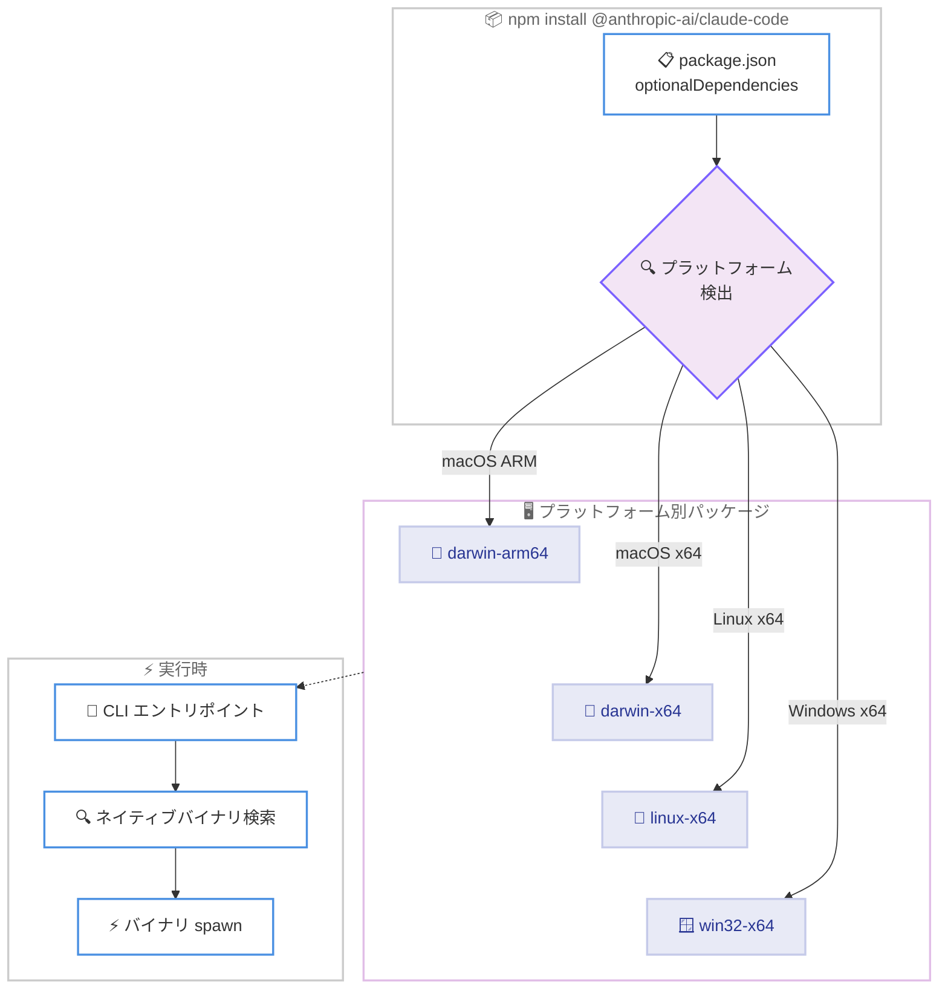
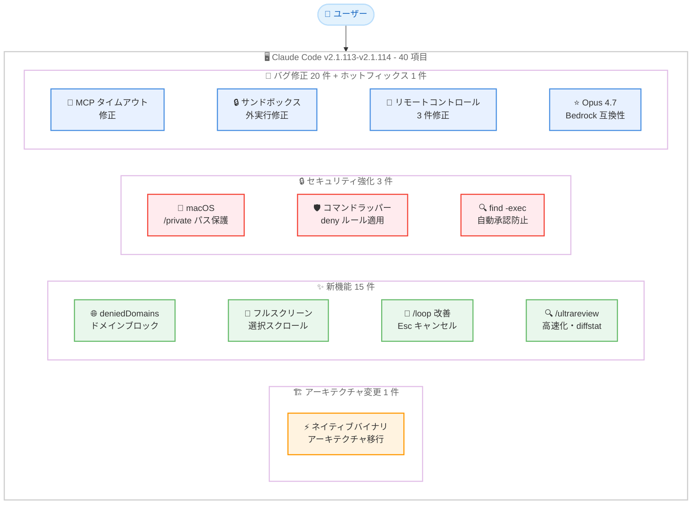
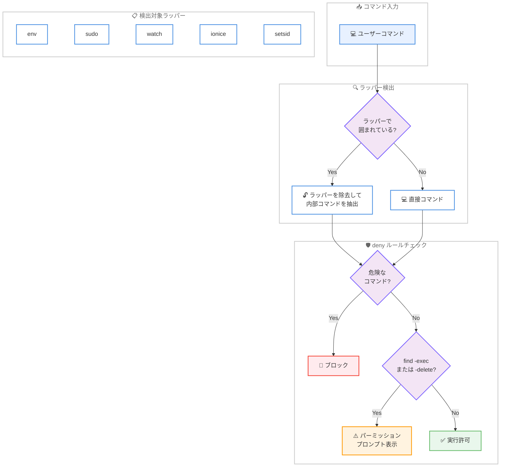

# Claude Code v2.1.113-v2.1.114 リリース: ネイティブバイナリアーキテクチャへの移行、セキュリティ強化、20 件超のバグ修正を含む 40 件の変更

## メタデータ

| 項目 | 内容 |
|------|------|
| 発表日 | 2026-04-17 |
| ソース | Claude Code Changelog |
| カテゴリ | Claude Code アップデート |
| 公式リンク | https://github.com/anthropics/claude-code/blob/main/CHANGELOG.md |

## 概要

Claude Code v2.1.113 および v2.1.114 が 2026 年 4 月 17 日にリリースされました。前バージョン v2.1.111-v2.1.112 (2026 年 4 月 16 日) から 1 日後のリリースです。v2.1.113 は新機能、セキュリティ強化、バグ修正など合計 39 件を含むメジャーリリース、v2.1.114 はエージェントチームのパーミッションダイアログに関する 1 件のクラッシュ修正ホットフィックスで、2 バージョン合わせて 40 項目のアップデートとなります。

本リリースの最大の注目点は **CLI アーキテクチャの根本的な変更** です。従来のバンドル済み JavaScript を実行する方式から、**プラットフォーム固有のネイティブバイナリを起動する方式** に移行しました。これはパフォーマンスと起動速度に直接影響する基盤レベルの変更であり、Claude Code の実行基盤そのものが刷新されたことを意味します。

もう 1 つの重要なテーマは **セキュリティ強化** です。macOS での危険なパスの保護、`env`/`sudo`/`watch` 等のコマンドラッパーに対する deny ルールの適用、`find -exec`/`-delete` の自動承認防止の 3 件が追加され、Bash ツールのセキュリティモデルが大幅に強化されました。

さらに、**20 件のバグ修正** により、MCP タイムアウト処理、マークダウンテーブル、セッションリキャップ、サンドボックス外実行、リモートコントロールセッション、Opus 4.7 の Bedrock 互換性など、幅広い領域の問題が解消されています。

## 詳細

### 背景

Claude Code は Anthropic が提供する CLI ベースの AI 開発支援ツールです。v2.1.113 は 39 件の変更を含む大規模リリースであり、その中核はアーキテクチャレベルの変更です。従来、Claude Code の CLI は Node.js 上でバンドルされた JavaScript を実行していましたが、v2.1.113 からはプラットフォーム固有のオプショナル依存関係としてネイティブバイナリが配布され、CLI エントリポイントがそのネイティブバイナリを spawn する方式に変わりました。

前バージョン v2.1.111-v2.1.112 では Opus 4.7 xhigh エフォートレベル、`/ultrareview` コマンド、Auto モード簡素化が行われましたが、本リリースではランタイム基盤の刷新、セキュリティモデルの強化、大量のバグ修正という 3 つの異なる領域に焦点が当てられています。v2.1.114 は v2.1.113 リリース直後に発見されたエージェントチームのパーミッションダイアログクラッシュを修正するホットフィックスです。

### 主な変更点

#### v2.1.114 - ホットフィックス - 1 件

- **エージェントチームのパーミッションダイアログクラッシュの修正**: エージェントチームのチームメイトがツールパーミッションをリクエストした際に、パーミッションダイアログでクラッシュする問題が修正されました

#### v2.1.113 - アーキテクチャ変更 (Changed) - 1 件

- **ネイティブバイナリアーキテクチャへの移行**: CLI がバンドル済み JavaScript を実行する代わりに、プラットフォーム固有のオプショナル依存関係としてネイティブ Claude Code バイナリを spawn する方式に変更されました。これは Claude Code の実行基盤に関わる根本的なアーキテクチャ変更です

#### v2.1.113 - 新機能 (Added) - 15 件

**ネットワーク・セキュリティ - 1 件:**

- **`sandbox.network.deniedDomains` 設定**: 特定のドメインをブロックする新しい設定が追加されました。`allowedDomains` のワイルドカードで広範にドメインを許可している場合でも、`deniedDomains` で個別のドメインをブロックできます

**フルスクリーン・入力操作改善 - 4 件:**

- **フルスクリーンモードの選択スクロール**: `Shift+Up/Down` で選択を拡張する際、選択範囲が画面の端を超えるとビューポートが自動スクロールするようになりました
- **`Ctrl+A`/`Ctrl+E` の論理行対応**: マルチライン入力で `Ctrl+A` と `Ctrl+E` が現在の論理行の先頭/末尾に移動するようになりました。readline の動作と一致します
- **Windows: `Ctrl+Backspace` で単語削除**: Windows 環境で `Ctrl+Backspace` が前の単語を削除するようになりました
- **長い URL の折り返し対応**: レスポンスや Bash 出力中の長い URL が行をまたいで折り返されても、クリック可能な状態が維持されるようになりました (OSC 8 ハイパーリンク対応ターミナル)

**/loop・リモートコントロール改善 - 3 件:**

- **`/loop` の改善**: Esc キーでペンディング中のウェイクアップをキャンセルできるようになりました。ウェイクアップ時の表示が "Claude resuming /loop wakeup" に明確化されました
- **リモートコントロールからの `/extra-usage`**: リモートコントロール (モバイル/Web) クライアントから `/extra-usage` が利用可能になりました
- **リモートコントロールの `@` ファイル補完**: リモートコントロールクライアントから `@` ファイルのオートコンプリート候補をクエリできるようになりました

**/ultrareview・サブエージェント改善 - 3 件:**

- **`/ultrareview` の改善**: 並列化されたチェックによる高速起動、起動ダイアログでの diffstat 表示、アニメーション付きの起動状態が追加されました
- **サブエージェントのストール検出**: ストリーム中にストールしたサブエージェントが、無限に待機する代わりに 10 分後に明確なエラーで失敗するようになりました
- **Bash ツールのコメント行表示改善**: 複数行コマンドの最初の行がコメントの場合、トランスクリプトにコマンド全体が表示されるようになりました。これにより UI スプーフィングの攻撃ベクターが閉じられました

**その他 - 4 件:**

- **`cd` ノーオプの自動承認**: `cd <current-directory> && git ...` のように、`cd` が現在のディレクトリへの移動 (ノーオプ) の場合、パーミッションプロンプトがトリガーされなくなりました
- **`OTEL_LOG_RAW_API_BODIES` 環境変数**: 完全な API リクエストおよびレスポンスボディを OpenTelemetry ログイベントとして出力するデバッグ用環境変数が追加されました

#### v2.1.113 - セキュリティ強化 (Security) - 3 件

- **macOS の危険なパスの保護**: macOS で `/private/{etc,var,tmp,home}` パスが `Bash(rm:*)` 許可ルール下で危険な削除対象として扱われるようになりました。macOS ではシンボリックリンクにより `/etc` が `/private/etc` を指すため、従来の `/etc` のみの保護では不十分でした
- **コマンドラッパーに対する deny ルールの適用**: Bash の deny ルールが `env`、`sudo`、`watch`、`ionice`、`setsid` などの実行ラッパーで囲まれたコマンドにもマッチするようになりました。これにより、`sudo rm -rf /` のようなラッパー経由の危険なコマンド実行がブロックされます
- **`find -exec`/`-delete` の自動承認防止**: `Bash(find:*)` 許可ルールが `find -exec` および `find -delete` を自動承認しなくなりました。`find` はファイル検索だけでなく任意のコマンド実行やファイル削除が可能であり、`find:*` のワイルドカード許可がこれらの危険な操作まで自動承認していた問題が修正されました

#### v2.1.113 - バグ修正 (Fixed) - 20 件

**MCP・ツール修正 - 2 件:**

- **MCP 同時呼び出しタイムアウトの修正**: MCP の同時呼び出し時に、1 つのツール呼び出しのメッセージが別の呼び出しのウォッチドッグを無効化する問題が修正されました。これにより MCP ツールが予期せずタイムアウトしない安定した動作が実現します
- **`ToolSearch` ランキングの修正**: 貼り付けた MCP ツール名が、説明文のマッチにより本来とは異なるツールを上位に表示する問題が修正されました。実際のツール名が正確にサーフェスされるようになりました

**入力・キーバインド修正 - 3 件:**

- **`Cmd+Backspace`/`Ctrl+U` の修正**: カーソルから行頭までの削除が再び正常に動作するようになりました
- **プロンプトカーソルの消失修正**: `NO_COLOR` 環境変数が設定されている場合にプロンプトカーソルが消える問題が修正されました
- **セッションリキャップの自動発火修正**: プロンプトで未送信テキストを入力中にセッションリキャップが自動発火する問題が修正されました

**UI・表示修正 - 4 件:**

- **マークダウンテーブルの修正**: セル内のインラインコードスパンにパイプ文字が含まれている場合にマークダウンテーブルが崩れる問題が修正されました
- **`/copy` のテーブル整列修正**: `/copy` の "Full response" でマークダウンテーブルの列が GitHub、Notion、Slack への貼り付け時に整列されない問題が修正されました
- **コピートーストの文字数カウント修正**: "copied N chars" トーストが絵文字やその他のマルチコードユニット文字を過大にカウントする問題が修正されました
- **スラッシュ/@ 補完メニューの位置修正**: フルスクリーンモードでスラッシュ/@ 補完メニューがプロンプトボーダーに密着しない問題が修正されました

**サブエージェント・セッション修正 - 3 件:**

- **サブエージェントへのメッセージ誤帰属の修正**: 実行中のサブエージェントを表示中に入力したメッセージがトランスクリプトから隠れ、親 AI に誤帰属される問題が修正されました
- **長いコンテキストセッションのコンパクト化修正**: 再開された長いコンテキストセッションのコンパクト化で "Extra usage is required for long context requests" エラーが発生する問題が修正されました
- **`/effort auto` の確認メッセージ修正**: `/effort auto` の確認メッセージが "Effort level set to max" と表示されるようになり、ステータスバーの表示と一致するようになりました

**サンドボックス・セキュリティ修正 - 1 件:**

- **`dangerouslyDisableSandbox` の修正**: Bash ツールの `dangerouslyDisableSandbox` がパーミッションプロンプトなしにサンドボックス外でコマンドを実行していた重大な問題が修正されました。サンドボックスを無効にする際も適切なパーミッション確認が行われるようになりました

**プラグイン修正 - 1 件:**

- **`plugin install` のバージョン競合検出**: `plugin install` が既にインストール済みのプラグインと依存関係バージョンが競合する場合、成功する代わりに `range-conflict` エラーを報告するようになりました

**リモートコントロール修正 - 3 件:**

- **リモートコントロールセッションのサブエージェントトランスクリプト**: リモートコントロールセッションでサブエージェントのトランスクリプトがストリーミングされるようになりました
- **リモートコントロールセッションのアーカイブ**: Claude Code 終了時にリモートコントロールセッションが適切にアーカイブされるようになりました
- **"Refine with Ultraplan" の URL 表示**: "Refine with Ultraplan" がトランスクリプトにリモートセッション URL を表示するようになりました

**プラットフォーム互換性修正 - 3 件:**

- **Windows: `/insights` クラッシュの修正**: Windows で `/insights` が `EBUSY` エラーでクラッシュする問題が修正されました
- **終了確認ダイアログの修正**: 終了確認ダイアログがワンショットスケジュールタスクを繰り返しタスクと誤表示する問題が修正されました。カウントダウンが表示されるようになりました
- **Opus 4.7 Bedrock ARN 互換性修正**: Bedrock アプリケーション推論プロファイル ARN を使用して Opus 4.7 を呼び出す際に `thinking.type.enabled is not supported` 400 エラーが発生する問題が修正されました

**SDK・画像処理修正 - 2 件:**

- **SDK 画像コンテンツブロックのクラッシュ修正**: SDK の画像コンテンツブロックの処理に失敗した際にセッションがクラッシュする問題が修正されました。テキストプレースホルダーへのグレースフルデグレードが実装されました
- **`CLAUDE_CODE_EXTRA_BODY` エフォート設定の修正**: `CLAUDE_CODE_EXTRA_BODY` の `output_config.effort` がエフォートをサポートしないモデルへのサブエージェント呼び出しおよび Vertex AI で 400 エラーを引き起こす問題が修正されました

### 技術的な詳細

#### ネイティブバイナリアーキテクチャへの移行

v2.1.113 における最大の技術的変更は、CLI の実行方式の根本的な変更です。

**従来のアーキテクチャ (v2.1.112 以前):**

CLI エントリポイント (`claude` コマンド) が Node.js ランタイム上でバンドル済みの JavaScript コードを直接実行していました。全てのロジックが JavaScript として実行され、Node.js のプロセスモデルに依存していました。

**新しいアーキテクチャ (v2.1.113 以降):**

CLI エントリポイントは、プラットフォーム固有のネイティブバイナリを spawn するシンプルなランチャーとして機能します。ネイティブバイナリは npm のオプショナル依存関係 (per-platform optional dependency) として配布され、各プラットフォーム (macOS arm64、macOS x64、Linux x64、Windows x64 等) に最適化されたバイナリが提供されます。

この変更により期待される効果は以下の通りです。

- **起動速度の向上**: Node.js のブートストラップと JavaScript パースのオーバーヘッドが排除されます
- **メモリ効率**: ネイティブバイナリは JavaScript VM のメモリオーバーヘッドなしに動作できます
- **プラットフォーム最適化**: 各プラットフォームの特性に合わせたネイティブコードの最適化が可能です
- **配布の柔軟性**: npm のオプショナル依存関係メカニズムにより、必要なプラットフォームのバイナリのみがインストールされます

#### sandbox.network.deniedDomains 設定

ネットワークサンドボックスに新しいドメインブロック機能が追加されました。

```jsonc
// .claude/settings.json
{
  "sandbox": {
    "network": {
      "allowedDomains": ["*.example.com"],
      "deniedDomains": ["internal.example.com", "admin.example.com"]
    }
  }
}
```

`allowedDomains` で `*.example.com` のようなワイルドカードを指定して広範にアクセスを許可しつつ、`deniedDomains` で特定のサブドメインをブロックする粒度の細かいネットワーク制御が可能になります。deny ルールは allow ルールよりも優先されます。

#### セキュリティ強化の詳細

**macOS `/private` パスの保護:**

macOS ではシステムディレクトリが `/private` 配下にシンボリックリンクされています。

```
/etc  → /private/etc
/var  → /private/var
/tmp  → /private/tmp
/home → /private/home
```

従来の `Bash(rm:*)` 許可ルールは `/etc` のようなパスを危険な対象として検出していましたが、`/private/etc` としてアクセスされた場合の検出が漏れていました。v2.1.113 でこのギャップが修正されました。

**コマンドラッパーの deny ルール適用:**

従来の deny ルールは直接のコマンド実行のみを対象としていました。

```bash
# 従来: これはブロックされる
rm -rf /

# 従来: これはブロックされない (ラッパー経由)
sudo rm -rf /
env rm -rf /
watch rm -rf /
ionice rm -rf /
setsid rm -rf /
```

v2.1.113 では `env`、`sudo`、`watch`、`ionice`、`setsid` などの実行ラッパーを透過的に解析し、内部のコマンドに対して deny ルールを適用します。

**`find -exec`/`-delete` の自動承認防止:**

`Bash(find:*)` の許可ルールは、`find` コマンドの全てのサブコマンドを自動承認していました。しかし `find` にはファイル検索以外にも強力な機能があります。

```bash
# ファイル検索 (安全) - 引き続き自動承認
find . -name "*.ts"

# 任意コマンド実行 (危険) - 自動承認されなくなった
find . -name "*.log" -exec rm {} \;

# ファイル削除 (危険) - 自動承認されなくなった
find . -name "*.tmp" -delete
```

v2.1.113 では `-exec` および `-delete` オプションを含む `find` コマンドは自動承認の対象外となり、パーミッションプロンプトが表示されます。

#### サブエージェントストール検出

サブエージェントがストリーム中にストールした場合、従来は無限に待機し続けていました。v2.1.113 では 10 分間のタイムアウトが設定され、ストールしたサブエージェントは明確なエラーメッセージとともに失敗します。

```
Error: Subagent stalled mid-stream for 10 minutes without producing output.
```

これにより、ネットワーク障害や API の一時的な問題でサブエージェントがハングした場合でも、ユーザーは問題を認識して対処できるようになりました。

#### Bash ツールのコメント行表示改善とセキュリティ

複数行 Bash コマンドの最初の行がコメントの場合、従来はトランスクリプトにコメント行のみが表示されていました。

```bash
# This is a safe operation
rm -rf /important/data
```

この動作は UI スプーフィング (ユーザーに無害なコマンドに見せかけて危険なコマンドを実行する攻撃) に悪用される可能性がありました。v2.1.113 ではコマンド全体がトランスクリプトに表示されるようになり、この攻撃ベクターが閉じられました。

#### dangerouslyDisableSandbox の修正

Bash ツールの `dangerouslyDisableSandbox` オプションに重大なセキュリティ問題が発見され修正されました。このオプションを使用したコマンドがパーミッションプロンプトなしにサンドボックス外で実行されていました。v2.1.113 では、サンドボックスを無効にする場合でも適切なパーミッション確認が行われるようになりました。

## アーキテクチャ図

### ネイティブバイナリアーキテクチャの移行

```mermaid
flowchart TD
    subgraph Before["📦 v2.1.112 以前 - JavaScript バンドル方式"]
        CLI_Old(["👤 claude コマンド"])
        NodeJS["🟢 Node.js ランタイム"]
        JSBundle["📜 バンドル済み<br/>JavaScript"]
        JSExec["⚙️ JS 実行エンジン"]

        CLI_Old --> NodeJS
        NodeJS --> JSBundle
        JSBundle --> JSExec
    end

    subgraph After["📦 v2.1.113 以降 - ネイティブバイナリ方式"]
        CLI_New(["👤 claude コマンド"])
        Launcher["🚀 ランチャー<br/>プラットフォーム判定"]
        subgraph Binaries["🖥️ プラットフォーム固有バイナリ"]
            direction LR
            MacARM["🍎 macOS<br/>arm64"]
            MacX64["🍎 macOS<br/>x64"]
            LinuxX64["🐧 Linux<br/>x64"]
            WinX64["🪟 Windows<br/>x64"]
            MacARM ~~~ MacX64 ~~~ LinuxX64 ~~~ WinX64
        end
        NativeExec["⚡ ネイティブ実行"]

        CLI_New --> Launcher
        Launcher --> Binaries
        Binaries --> NativeExec
    end

    classDef platform fill:none,stroke:#CCCCCC,stroke-width:2px,color:#666666
    classDef layer fill:none,stroke:#E1BEE7,stroke-width:2px,color:#666666
    classDef oldStyle fill:#FFEBEE,stroke:#F44336,stroke-width:2px,color:#333333
    classDef newStyle fill:#E9F7EC,stroke:#66BB6A,stroke-width:2px,color:#333333
    classDef process fill:#FFFFFF,stroke:#4A90E2,stroke-width:2px,color:#333333
    classDef binary fill:#E8EAF6,stroke:#C5CAE9,stroke-width:2px,color:#283593
    classDef user fill:#E3F2FD,stroke:#BBDEFB,stroke-width:2px,color:#1565C0

    class Before platform
    class After platform
    class Binaries layer
    class CLI_Old,CLI_New user
    class NodeJS,JSBundle,JSExec oldStyle
    class Launcher,NativeExec newStyle
    class MacARM,MacX64,LinuxX64,WinX64 binary
```



### npm オプショナル依存関係による配布フロー



### v2.1.113-v2.1.114 変更点の全体像



### セキュリティ強化: Bash deny ルールの適用範囲



## 開発者への影響

### 対象

- **全ての Claude Code ユーザー**: ネイティブバイナリアーキテクチャへの移行により、起動速度とメモリ効率が向上する可能性があります。20 件のバグ修正により全体的な安定性が大幅に改善されています
- **セキュリティを重視する組織**: 3 件のセキュリティ強化と `dangerouslyDisableSandbox` の修正により、Bash ツールのセキュリティモデルが大幅に強化されました。`sandbox.network.deniedDomains` 設定によりネットワークアクセスの細粒度制御も可能になりました
- **macOS ユーザー**: `/private/{etc,var,tmp,home}` パスの保護により、macOS 固有のシンボリックリンク構造に起因するセキュリティギャップが解消されました
- **MCP ツール利用者**: 同時呼び出しタイムアウトの修正と `ToolSearch` ランキングの修正により、MCP ツールの信頼性が向上しています
- **リモートコントロール利用者**: サブエージェントトランスクリプトのストリーミング、セッションアーカイブ、`/extra-usage` 対応、`@` ファイル補完の 4 件の改善により、モバイル/Web からの操作体験が大幅に向上しました
- **Bedrock 経由の Opus 4.7 利用者**: アプリケーション推論プロファイル ARN 使用時の `thinking.type.enabled` 400 エラーが修正されました
- **エージェントチーム利用者**: v2.1.114 のホットフィックスにより、チームメイトからのツールパーミッションリクエスト時のクラッシュが解消されました
- **プラグイン開発者**: `plugin install` のバージョン競合検出が改善され、依存関係の整合性が確保されるようになりました
- **CI/CD パイプライン運用者**: `OTEL_LOG_RAW_API_BODIES` 環境変数によるデバッグ、サブエージェントストール検出のタイムアウト、SDK 画像コンテンツブロックのグレースフルデグレードにより、自動化環境の信頼性が向上しました

### 必要なアクション

以下のコマンドで最新バージョンに更新できます。

```bash
# npm でのアップデート
npm update -g @anthropic-ai/claude-code

# Homebrew でのアップデート
brew upgrade claude-code

# 現在のバージョン確認
claude --version
```

**確認が推奨される項目:**

- **ネイティブバイナリの動作確認**: アップデート後に `claude --version` で正常に起動することを確認してください。ネイティブバイナリの spawn に失敗する場合は、npm の再インストールを試してください
- **セキュリティ設定の確認**: `Bash(rm:*)` や `Bash(find:*)` の許可ルールを使用している場合、v2.1.113 のセキュリティ強化によりこれらのルールの動作が変わります。特に `find -exec` を自動承認に依存していた場合は、ワークフローの見直しが必要です
- **`deniedDomains` の設定**: ネットワークアクセスを制限する必要がある環境では、`sandbox.network.deniedDomains` を設定してください
- **リモートコントロールセッション**: リモートコントロールを使用している場合、サブエージェントトランスクリプトのストリーミングとセッションアーカイブが正常に動作することを確認してください
- **Bedrock Opus 4.7**: Bedrock アプリケーション推論プロファイル ARN 経由で Opus 4.7 を使用している場合、`thinking.type.enabled` エラーが解消されていることを確認してください

### 移行ガイド

#### ネイティブバイナリアーキテクチャへの移行

v2.1.113 のアーキテクチャ変更は自動的に適用されます。npm パッケージのインストール時にプラットフォーム固有のオプショナル依存関係が自動的にダウンロードされ、CLI 起動時にネイティブバイナリが使用されます。

```bash
# アップデート
npm update -g @anthropic-ai/claude-code

# 正常に動作することを確認
claude --version

# 問題がある場合は再インストール
npm uninstall -g @anthropic-ai/claude-code
npm install -g @anthropic-ai/claude-code
```

#### find コマンドの許可ルール見直し

`Bash(find:*)` の許可ルールを使用している場合、`-exec` と `-delete` は自動承認されなくなります。

```jsonc
// .claude/settings.json

// v2.1.112 以前: find:* で全てが自動承認
// v2.1.113 以降: find -exec と find -delete はパーミッション確認が必要

// 安全な find のみ自動承認したい場合 (推奨)
{
  "permissions": {
    "allow": ["Bash(find:*)"]
    // -exec と -delete は自動的にブロックされる
  }
}
```

#### deniedDomains の設定

```jsonc
// .claude/settings.json
{
  "sandbox": {
    "network": {
      // 広範にドメインを許可
      "allowedDomains": ["*.company.com"],
      // 特定のドメインをブロック
      "deniedDomains": [
        "internal-admin.company.com",
        "secrets.company.com"
      ]
    }
  }
}
```

## コード例

### sandbox.network.deniedDomains の設定

```jsonc
// .claude/settings.json
{
  "sandbox": {
    "network": {
      "allowedDomains": ["*.example.com", "api.github.com"],
      "deniedDomains": ["admin.example.com", "internal.example.com"]
    }
  }
}
```

### OTEL_LOG_RAW_API_BODIES によるデバッグ

```bash
# API リクエスト/レスポンスボディの完全なログ出力を有効化
export OTEL_LOG_RAW_API_BODIES=1

# Claude Code を実行
claude "テストを作成してください"
# OpenTelemetry ログイベントに完全な API ボディが含まれる
```

### /loop の改善された操作

```bash
# /loop を開始
> /loop 5m "ビルドステータスを確認してください"

# ウェイクアップ時の表示
# "Claude resuming /loop wakeup"

# Esc キーでペンディング中のウェイクアップをキャンセル
# (次のウェイクアップまで待つ必要がなくなる)
```

### /ultrareview の改善された起動

```bash
# /ultrareview を実行
> /ultrareview

# 改善点:
# - 並列化されたチェックにより高速起動
# - 起動ダイアログに diffstat が表示される
# - アニメーション付きの起動状態

# PR を指定してレビュー
> /ultrareview 789
```

### Ctrl+A/Ctrl+E のマルチライン入力操作

```bash
# マルチライン入力中
> function hello() {
>   console.log("hello");
> }

# Ctrl+A: 現在の論理行の先頭に移動
# Ctrl+E: 現在の論理行の末尾に移動
# (readline の動作と一致)
```

## 関連リンク

- [Claude Code Changelog](https://github.com/anthropics/claude-code/blob/main/CHANGELOG.md)
- [Claude Code GitHub リポジトリ](https://github.com/anthropics/claude-code)
- [Claude Code v2.1.111-v2.1.112](./2026-04-16-claude-code-v2-1-111-v2-1-112.md)
- [Claude Code v2.1.109-v2.1.110](./2026-04-15-claude-code-v2-1-109-v2-1-110.md)
- [Claude Code v2.1.107-v2.1.108](./2026-04-14-claude-code-v2-1-107-v2-1-108.md)
- [Claude Code v2.1.105](./2026-04-13-claude-code-v2-1-105.md)

## まとめ

Claude Code v2.1.113 および v2.1.114 は、v2.1.113 のアーキテクチャ変更 1 件、新機能 15 件、セキュリティ強化 3 件、バグ修正 20 件と v2.1.114 のホットフィックス 1 件を合わせた全 40 項目のリリースです。変更は大きく 4 つの領域にわたります。

第一に、**ネイティブバイナリアーキテクチャへの移行** が実現しました。CLI がバンドル済み JavaScript からプラットフォーム固有のネイティブバイナリを spawn する方式に変更され、Claude Code の実行基盤が根本的に刷新されました。npm のオプショナル依存関係メカニズムにより、各プラットフォームに最適化されたバイナリが自動的にインストールされます。起動速度、メモリ効率、プラットフォーム固有の最適化が期待される基盤レベルの変更です。

第二に、**セキュリティモデルの大幅強化** です。macOS の `/private/{etc,var,tmp,home}` パス保護、`env`/`sudo`/`watch` 等のコマンドラッパーに対する deny ルール適用、`find -exec`/`-delete` の自動承認防止の 3 件に加え、`dangerouslyDisableSandbox` のパーミッション確認漏れと Bash ツールのコメント行 UI スプーフィングの修正により、Bash ツールのセキュリティが 5 つの異なる観点から強化されました。さらに `sandbox.network.deniedDomains` 設定によるネットワークアクセスの細粒度制御も追加されています。

第三に、**20 件の広範なバグ修正** です。MCP 同時呼び出しタイムアウト、マークダウンテーブルのパイプ文字処理、セッションリキャップの自動発火、リモートコントロールセッションのストリーミングとアーカイブ、Opus 4.7 の Bedrock 互換性、SDK 画像コンテンツブロックのクラッシュなど、幅広い領域の問題が解消されました。v2.1.114 ではエージェントチームのパーミッションダイアログクラッシュも即座に修正されています。

第四に、**開発者体験の改善** です。フルスクリーンモードの選択スクロール、`Ctrl+A`/`Ctrl+E` の readline 準拠動作、`/loop` の Esc キャンセル、`/ultrareview` の高速起動と diffstat 表示、リモートコントロールからの `/extra-usage` と `@` ファイル補完、サブエージェントのストール検出タイムアウトなど、日常的な操作の細部にわたる改善が行われました。

全ての Claude Code ユーザーに対してアップデートを強く推奨します。特にネイティブバイナリアーキテクチャへの移行は将来のパフォーマンス向上の基盤となる変更であり、セキュリティ強化は組織のセキュリティポリシーに直接影響する重要な改善です。`Bash(find:*)` の許可ルールを使用している場合は、`-exec`/`-delete` の自動承認が無効化されたことによるワークフローへの影響を事前に確認してください。
