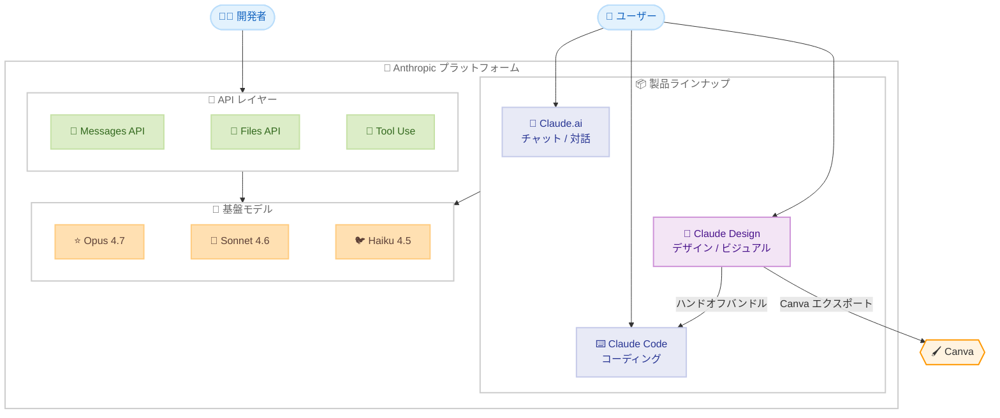
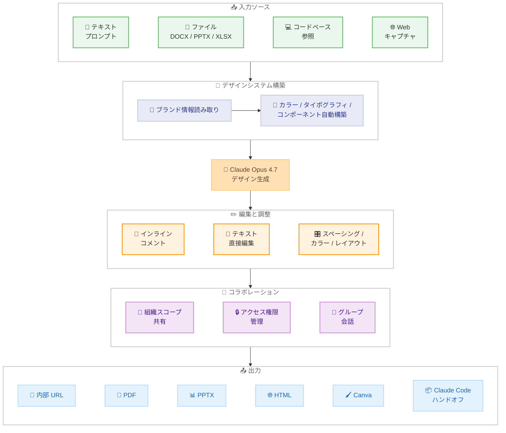
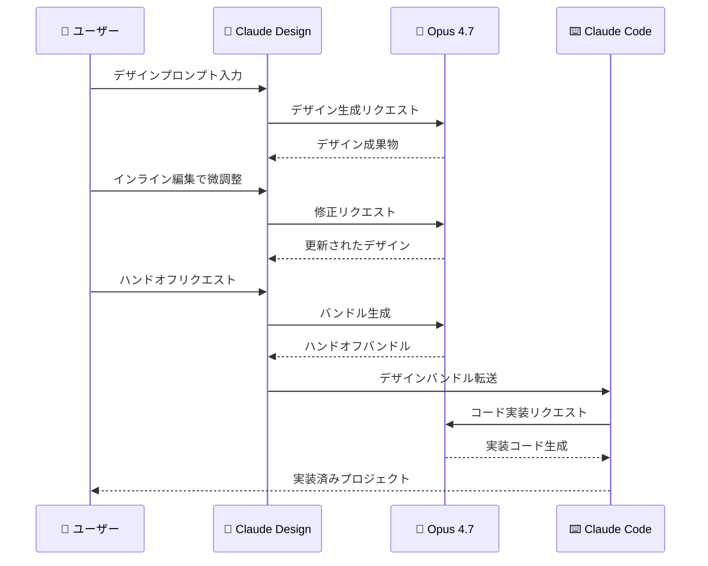

# Claude Design -- Anthropic Labs が AI デザインコラボレーションツールをリサーチプレビューとして公開

## メタデータ

| 項目 | 内容 |
|------|------|
| 発表日 | 2026-04-17 |
| ソース | Anthropic News |
| カテゴリ | 新製品 |
| 公式リンク | [Claude Design - Anthropic Labs](https://www.anthropic.com/news/claude-design-anthropic-labs) |

## 概要

Anthropic は 2026 年 4 月 17 日、新しい Anthropic Labs 製品「Claude Design」をリサーチプレビューとして公開しました。Claude Design は、Claude と協力してデザイン、プロトタイプ、スライド、ワンページャーなどの洗練されたビジュアルワークを作成できるツールです。

Claude Design は Claude Opus 4.7 を搭載しており、Claude Pro、Max、Team、Enterprise プランの契約者が利用可能です。アクセスは段階的にロールアウトされます。URL は [claude.ai/design](https://claude.ai/design) です。

本製品は、テキストプロンプトからデザインを生成するだけでなく、チームのデザインシステム (カラー、タイポグラフィ、コンポーネント) を自動的に読み取って適用する「ブランド統合」機能、DOCX/PPTX/XLSX のインポート、きめ細かいインライン編集、組織スコープの共有機能、そして Claude Code へのハンドオフバンドル生成など、デザインワークフロー全体をカバーする包括的な機能セットを備えています。

## 詳細

### 背景

Anthropic はこれまで、テキスト生成やコード生成を中心とした AI アシスタントを提供してきました。Claude.ai ではチャットベースの対話、Claude Code ではコーディング支援、API ではプログラマティックなアクセスという形で、それぞれ異なるユースケースに対応しています。

しかし、プロダクト開発の現場では、テキストやコードだけでなく、デザインやビジュアルコミュニケーションも不可欠な要素です。デザイナーがモックアップを作成し、PM がワイヤフレームを描き、マーケティングチームがプレゼン資料やキャンペーンビジュアルを制作するなど、ビジュアルワークは組織のあらゆる部門で日常的に行われています。

Claude Design は、この「ビジュアルワーク」の領域に AI コラボレーションを持ち込む Anthropic 初の製品です。Anthropic Labs (実験的な製品を公開するブランド) のもとで提供されるリサーチプレビューという位置付けで、Claude Opus 4.7 の高度な推論能力と視覚的理解力を活用し、プロフェッショナルレベルのデザイン成果物を生成します。

2026 年 4 月 16 日にリリースされた Claude Opus 4.7 は、高解像度画像サポート (2576px / 3.75MP) やナレッジワーク能力の向上 (.docx / .pptx の処理改善) を搭載しており、Claude Design の基盤技術として最適なモデルです。

### 主な変更点

#### 1. ブランド統合 -- デザインシステムの自動構築

オンボーディング時に、Claude がチームのコードベースとデザインファイルを読み取り、デザインシステムを自動構築します。以降のすべてのプロジェクトで、チームのカラーパレット、タイポグラフィ、コンポーネントが自動的に適用されます。

- コードベースからブランドガイドラインを抽出
- デザインファイルからスタイル情報を学習
- プロジェクトごとに一貫したビジュアルアイデンティティを維持

#### 2. マルチソースインポート

さまざまな入力ソースからプロジェクトを開始できます。

- **テキストプロンプト**: 自然言語で指示を記述して生成
- **画像 / ドキュメントのアップロード**: DOCX、PPTX、XLSX ファイルに対応
- **コードベース参照**: 既存のコードベースを指定してデザインを生成
- **Web キャプチャ**: Web サイトから要素を取り込むツールを搭載

#### 3. きめ細かい編集コントロール

生成されたデザインに対して、精細な調整が可能です。

- **インラインコメント**: 特定の要素に対してコメントを付けて修正指示
- **テキスト直接編集**: デザイン内のテキストを直接編集
- **調整ノブ**: スペーシング、カラー、レイアウトをライブで微調整

#### 4. 組織スコープのコラボレーション

チーム内での共同作業を支援する機能を備えています。

- **組織スコープの共有**: 組織全体でデザインを共有
- **アクセス権限管理**: プライベート、閲覧のみ、編集の 3 段階
- **グループ会話**: チームメンバーとのディスカッション機能

#### 5. 多彩なエクスポートオプション

作成したデザインをさまざまな形式で出力できます。

- 内部 URL (共有用)
- フォルダ出力
- Canva へのエクスポート
- PDF
- PPTX (PowerPoint)
- スタンドアロン HTML ファイル

#### 6. Claude Code へのハンドオフ

Claude Design で作成したデザインを Claude Code に引き渡すための専用機能があります。Claude がデザイン成果物をハンドオフバンドルとしてパッケージ化し、Claude Code でそのまま実装に移行できます。

### 技術的な詳細

#### 搭載モデル

Claude Design は Claude Opus 4.7 を搭載しています。Opus 4.7 は以下の機能を備えており、デザインワークに最適です。

| 特性 | 内容 |
|------|------|
| モデル | Claude Opus 4.7 |
| 高解像度画像 | 2576px / 3.75MP 対応 |
| ナレッジワーク | .docx / .pptx の高度な処理 |
| Adaptive Thinking | 複雑なデザイン判断の推論 |
| コンテキストウィンドウ | 1M トークン |

#### 対応フォーマット

**入力**:

| フォーマット | 説明 |
|-------------|------|
| テキスト | 自然言語プロンプト |
| 画像 | PNG、JPG など |
| DOCX | Microsoft Word 文書 |
| PPTX | Microsoft PowerPoint プレゼンテーション |
| XLSX | Microsoft Excel スプレッドシート |
| コードベース | プロジェクトのソースコード |
| Web URL | Web キャプチャツールで取得 |

**出力**:

| フォーマット | 説明 |
|-------------|------|
| 内部 URL | Claude Design 上での共有リンク |
| フォルダ | ローカルフォルダへの出力 |
| Canva | Canva プラットフォームへの直接エクスポート |
| PDF | PDF ドキュメント |
| PPTX | PowerPoint ファイル |
| HTML | スタンドアロン HTML ファイル |
| ハンドオフバンドル | Claude Code 用のパッケージ |

#### ユースケース

1. **リアルなプロトタイプ**: デザイナーが静的なモックアップをインタラクティブなプロトタイプに変換
2. **プロダクトワイヤフレームとモックアップ**: PM が機能フローをスケッチし、Claude Code に引き渡し
3. **デザインエクスプロレーション**: 多様なデザイン方向性を迅速に作成
4. **ピッチデッキとプレゼンテーション**: アウトラインからオンブランドのデッキを数分で作成、PPTX や Canva にエクスポート
5. **マーケティングコラテラル**: ランディングページ、ソーシャルメディアアセット、キャンペーンビジュアル
6. **フロンティアデザイン**: 音声、動画、シェーダー、3D、AI を活用したコード駆動プロトタイプ

## 開発者への影響

### 対象

- **デザイナー**: プロトタイプの迅速な作成、デザインエクスプロレーションの高速化
- **プロダクトマネージャー**: ワイヤフレームやモックアップの自主作成、Claude Code との連携
- **マーケティングチーム**: プレゼン資料、ランディングページ、キャンペーンビジュアルの作成
- **開発者**: Claude Code ハンドオフによるデザインからの実装効率化
- **エンタープライズ管理者**: 組織設定でのアクセス管理

### 必要なアクション

#### 一般ユーザー向け

1. **プランの確認**: Claude Pro、Max、Team、Enterprise のいずれかのプランに加入していることを確認
2. **アクセスの確認**: [claude.ai/design](https://claude.ai/design) にアクセスし、ロールアウト対象かどうかを確認 (段階的にロールアウト中)
3. **オンボーディングの実施**: 初回利用時にコードベースやデザインファイルを読み込ませ、デザインシステムを構築

#### エンタープライズ管理者向け

1. **アクセスの有効化**: Claude Design はエンタープライズプランではデフォルトでオフに設定されています。組織設定 (Organization settings) から管理者が手動で有効化する必要があります
2. **アクセスポリシーの策定**: 組織内での共有ポリシー (プライベート / 閲覧 / 編集) を策定
3. **デザインシステムの準備**: オンボーディングで読み込ませるコードベースやデザインファイルを準備

### 移行ガイド

Claude Design は新規製品のため、既存機能からの移行は不要です。ただし、以下のワークフロー統合を検討してください。

#### 既存のデザインワークフローとの統合

| 現在のワークフロー | Claude Design での改善 |
|------------------|----------------------|
| Figma でモックアップ作成 → 手動で開発者に共有 | Claude Design でプロトタイプ作成 → Claude Code にハンドオフ |
| PowerPoint で資料作成 → 手動でブランド適用 | Claude Design でオンブランドのデッキを自動生成 |
| デザイナーに依頼 → 複数回のレビューサイクル | Claude Design でラピッドプロトタイピング → 微調整 |

## コード例

### Claude Code ハンドオフワークフロー

Claude Design から Claude Code へのハンドオフは、デザインから実装への移行を自動化します。以下は想定されるワークフローの例です。

**ステップ 1: Claude Design でプロトタイプを作成**

```
# Claude Design でのプロンプト例
「ダッシュボード画面のプロトタイプを作成してください。
左サイドバーにナビゲーション、メイン領域にチャートとテーブルを配置。
当社のデザインシステムを使用してください。」
```

**ステップ 2: インライン編集で微調整**

```
# 特定要素へのインラインコメント例
「このチャートのカラーパレットをブランドカラーに変更」
「テーブルのヘッダーにソートアイコンを追加」
「左サイドバーの幅を 240px に固定」
```

**ステップ 3: Claude Code にハンドオフ**

```bash
# Claude Code でハンドオフバンドルを受け取って実装
# (想定されるワークフロー)
claude "Claude Design のハンドオフバンドルを使って、
       このダッシュボードを React コンポーネントとして実装してください。"
```

### プレゼンテーション作成ワークフロー

```
# Claude Design でのプレゼン作成例

プロンプト:
「Q1 の事業レビュープレゼンテーションを作成してください。
以下のデータを含めてください:
- 売上: 前年比 125%
- 新規顧客: 3,200 社
- NPS: 72
オンブランドのデザインで、10 スライド構成にしてください。」

出力: PPTX ファイルまたは Canva プロジェクト
```

### Web キャプチャを使ったランディングページ作成

```
# 既存の Web サイトを参照してデザインを作成

プロンプト:
「https://example.com のデザインを参考に、
新製品のランディングページを作成してください。
ヒーローセクション、機能紹介 (3 カラム)、
CTA ボタン、フッターを含めてください。」

出力: スタンドアロン HTML ファイル
```

## アーキテクチャ図

### Anthropic プロダクトエコシステムにおける Claude Design の位置付け



### Claude Design のワークフロー



### Claude Design から Claude Code へのハンドオフフロー



## パートナーの反応

### Canva

> **Melanie Perkins (CEO)**: Claude Design から Canva へのシームレスな移行を実現。

Canva との統合により、Claude Design で生成したデザインを Canva プラットフォームに直接エクスポートし、さらなる編集や共同作業が可能になります。

### Brilliant

> **Olivia Xu**: 複雑なページの作成に 20 以上のプロンプトが必要だったものが 2 プロンプトに削減。Claude Code ハンドオフでデザインインテントが正確に伝達される。

従来のワークフローと比較して、プロンプト数が 90% 削減されるという大幅な効率改善が報告されています。

### Datadog

> **Aneesh Kethini**: ミーティングが終わる前に動作するプロトタイプが完成。ブランドへの忠実さも維持される。

リアルタイムでのプロトタイプ生成能力により、意思決定プロセスが大幅に加速されることが示されています。

## 利用可能プランと注意事項

| プラン | 利用可否 | デフォルト設定 | 追加使用量 |
|--------|---------|--------------|-----------|
| Pro | 利用可能 | 有効 | 追加使用量あり |
| Max | 利用可能 | 有効 | 追加使用量あり |
| Team | 利用可能 | 有効 | 追加使用量あり |
| Enterprise | 利用可能 | **無効 (管理者が有効化)** | 追加使用量あり |
| Free | 利用不可 | -- | -- |

- Enterprise プランでは、管理者が Organization settings から手動で有効化する必要があります
- アクセスは段階的にロールアウト中であり、即座に利用できない場合があります

## 関連リンク

- [Claude Design 公式発表](https://www.anthropic.com/news/claude-design-anthropic-labs)
- [Claude Design](https://claude.ai/design)
- [Claude Opus 4.7 リリースノート](https://platform.claude.com/docs/en/about-claude/models/whats-new-claude-4-7)
- [Claude Apps Release Notes](https://support.claude.com/en/articles/12138966-release-notes)
- [Claude Code](https://claude.ai/code)
- [Anthropic News](https://www.anthropic.com/news)

## まとめ

Claude Design は、Anthropic Labs が公開した AI デザインコラボレーションツールであり、Claude のプロダクトエコシステムにおいてビジュアルワークという新たな領域をカバーする製品です。Claude Opus 4.7 を搭載し、デザインシステムの自動構築、マルチソースインポート、きめ細かい編集コントロール、組織レベルのコラボレーション、多彩なエクスポートオプション、そして Claude Code へのハンドオフ機能を備えています。

特に注目すべきは、オンボーディング時にチームのコードベースとデザインファイルからデザインシステムを自動構築する機能です。これにより、生成されるすべてのデザインが組織のブランドガイドラインに自動的に準拠し、一貫したビジュアルアイデンティティを維持できます。

また、Claude Code へのハンドオフ機能により、デザインから実装までのワークフローが一気通貫で実現される点も重要です。Brilliant の事例では、複雑なページ作成のプロンプト数が 20 以上から 2 に削減されたと報告されており、デザインワークの効率を大幅に向上させる可能性があります。

Claude Pro、Max、Team、Enterprise プランの契約者が利用可能で、Enterprise プランでは管理者が Organization settings から有効化する必要があります。現在リサーチプレビューとして段階的にロールアウト中のため、すぐにアクセスできない場合がありますが、[claude.ai/design](https://claude.ai/design) から確認できます。
