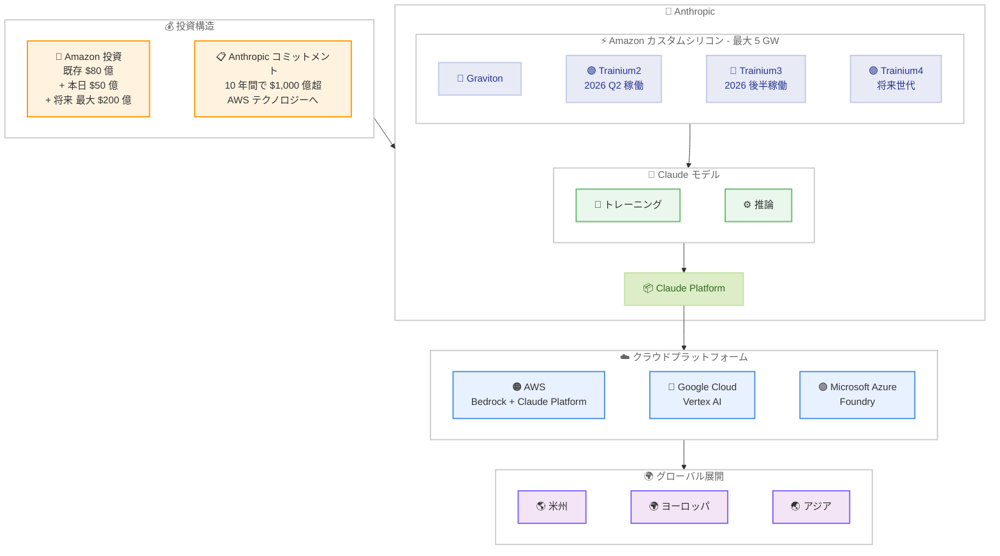

# Anthropic と Amazon が提携を拡大し、最大 5 ギガワットの新規コンピュート容量を確保

## メタデータ

| 項目 | 内容 |
|------|------|
| 発表日 | 2026-04-20 |
| ソース | Anthropic News |
| カテゴリ | パートナーシップ / インフラストラクチャ |
| 公式リンク | https://www.anthropic.com/news/anthropic-amazon-compute |

## 概要

Anthropic は 2026 年 4 月 20 日、Amazon との既存パートナーシップを大幅に深化させる新たな契約を締結したことを発表しました。この契約により、Claude のトレーニングおよびデプロイのために最大 5 ギガワット (GW) の新規コンピュート容量を確保します。Anthropic は今後 10 年間で AWS テクノロジーに 1,000 億ドル以上を投じるコミットメントを行い、Amazon は本日 50 億ドルの追加投資を実施、将来的にはさらに最大 200 億ドルの投資を予定しています。

本契約には、2026 年上半期に稼働開始する新たな Trainium2 容量と、2026 年末までに合計約 1 GW に達する Trainium2 および Trainium3 容量が含まれます。さらに、Claude Platform が AWS 上で直接利用可能になることも発表され、AWS の同一アカウント、同一管理体制、同一課金で利用できるようになります。

## 詳細

### 背景

Anthropic と Amazon の関係は、Amazon がこれまでに 80 億ドルを Anthropic に投資してきた既存のパートナーシップに基づいています。AWS は Anthropic のプライマリクラウドプロバイダーとして、Trainium チップを用いたトレーニングおよび推論インフラを提供してきました。

2026 年 4 月 6 日には Google および Broadcom との数ギガワット規模の次世代 TPU 容量確保が発表されており、今回の Amazon との契約拡大は、Anthropic がマルチクラウド戦略を推進しながらも AWS との関係を一層強化する姿勢を示すものです。Claude の需要が急速に拡大する中、フロンティアモデルの開発と推論に必要な大規模コンピュートインフラの確保が経営上の最重要課題となっています。

### 主な変更点

- **最大 5 GW の新規コンピュート容量を確保**: 今後 10 年間にわたり、Graviton および Trainium2 から Trainium4 までのチップ、さらに将来世代の Amazon カスタムシリコンの購入オプションを含む
- **1,000 億ドル超の長期コミットメント**: Anthropic が AWS テクノロジーに今後 10 年間で投じる総額
- **Amazon による追加投資**: 本日 50 億ドルを投資、将来的に最大 200 億ドルの追加投資を予定 (既存の 80 億ドルに上乗せ)
- **Trainium2 容量が 2026 年 Q2 に稼働開始**: 大規模な Trainium2 容量が第 2 四半期に利用可能に
- **Trainium3 容量が 2026 年後半に稼働予定**: スケーリングされた Trainium3 容量が年内に利用開始
- **Claude Platform on AWS**: Claude Platform の全機能が AWS 上で直接利用可能に (近日公開)
- **アジアおよびヨーロッパでの推論展開拡大**: 国際的な顧客基盤の成長に対応

### 技術的な詳細

#### コンピュートインフラの構成

Anthropic が確保する 5 GW のコンピュート容量は、以下の Amazon カスタムシリコンで構成されます。

- **Graviton**: AWS の汎用 Arm ベースプロセッサ。推論ワークロードやインフラストラクチャの運用に使用
- **Trainium2**: 現行世代の AI トレーニング専用チップ。2026 年 Q2 に大規模容量が稼働開始
- **Trainium3**: 次世代 AI トレーニングチップ。2026 年後半にスケーリング容量が稼働予定
- **Trainium4**: 将来世代のチップ。契約に購入オプションとして含まれる

Amazon CEO の Andy Jassy 氏によると、カスタム AI シリコンは顧客に対して大幅に低いコストで高いパフォーマンスを提供しており、その需要は非常に高いとのことです。

#### Claude Platform on AWS

Claude Platform が AWS 上で直接利用可能になります。

- **同一アカウント**: 既存の AWS アカウントでそのまま利用可能
- **同一管理体制**: AWS の既存のセキュリティコントロールがそのまま適用
- **同一課金**: AWS の請求に統合、追加の認証情報や契約は不要

Claude は AWS (Bedrock)、Google Cloud (Vertex AI)、Microsoft Azure (Foundry) の三大クラウドプラットフォーム全てで利用可能な唯一のフロンティア AI モデルであり、この地位を維持しています。

#### Bedrock との関連

2026 年 4 月 16 日に Claude in Amazon Bedrock が全 Bedrock 顧客に一般提供 (GA) されたばかりであり、Claude Opus 4.7 と Claude Haiku 4.5 が 27 の AWS リージョンでセルフサービスから利用可能になっています。今回の大規模インフラ投資は、この GA 展開を支える基盤をさらに強化するものです。

## 開発者への影響

### 対象

- Claude API を利用している全ての開発者および企業
- AWS Bedrock 経由で Claude を利用している顧客
- アジアおよびヨーロッパで Claude を利用している国際的な顧客
- 大規模なワークロードを Claude で処理している企業ユーザー
- Claude Platform の AWS 統合を待望していた顧客

### 必要なアクション

現時点で開発者に即座のアクションは必要ありません。ただし、以下の点に注目することを推奨します。

- **Trainium2 容量の稼働開始 (2026 年 Q2)**: スループットやレイテンシーの改善が期待される。パフォーマンスベンチマークを定期的に確認することを推奨
- **Claude Platform on AWS の公開**: 近日公開予定のため、AWS アカウントでの利用準備を検討。既存の Bedrock 統合との関係やメリットを評価
- **アジア・ヨーロッパの推論拡大**: 国際展開を行っている場合、新たに利用可能になるリージョンを確認し、レイテンシー最適化の機会を検討
- **長期的なインフラ計画**: 5 GW のコンピュート容量確保により、Claude の安定供給が長期的に保証されるため、Claude を前提としたアーキテクチャ設計をより安心して進められる

## アーキテクチャ図

## 関連リンク

- [公式発表](https://www.anthropic.com/news/anthropic-amazon-compute)
- [Anthropic News](https://www.anthropic.com/news)
- [Google および Broadcom との提携拡大レポート](./2026-04-06-google-broadcom-partnership-compute.md)
- [Claude in Amazon Bedrock GA レポート](./2026-04-16-claude-in-amazon-bedrock-ga.md)
- [AWS Bedrock - Claude](https://aws.amazon.com/bedrock/claude/)
- [Claude API Release Notes](https://platform.claude.com/docs/en/release-notes/overview)

## まとめ

Anthropic と Amazon の提携拡大は、Claude の急速に拡大する需要に対応するための史上最大規模のインフラ投資です。最大 5 GW の新規コンピュート容量と 10 年間で 1,000 億ドル超のコミットメントは、Anthropic が AWS カスタムシリコンを Claude の中核インフラとして長期的に位置づけていることを示しています。Amazon 側も既存の 80 億ドルに加えて 50 億ドルの即時投資と最大 200 億ドルの将来投資を表明し、両社の関係はかつてない規模に達しました。

2026 年 Q2 に Trainium2 の大規模容量が稼働を開始し、年後半には Trainium3 が続くことで、開発者はスループットとレイテンシーの段階的な改善を期待できます。Claude Platform on AWS の発表は、AWS の既存アカウント体系に完全統合された形で Claude の全機能を利用できる新たな選択肢を提供します。4 月 6 日の Google / Broadcom との TPU 容量確保、4 月 16 日の Bedrock GA と合わせて、Anthropic はマルチクラウド戦略を維持しながらコンピュートインフラを急速に拡充しており、Claude がフロンティア AI モデルとしての地位をさらに強固にする基盤を築いています。
