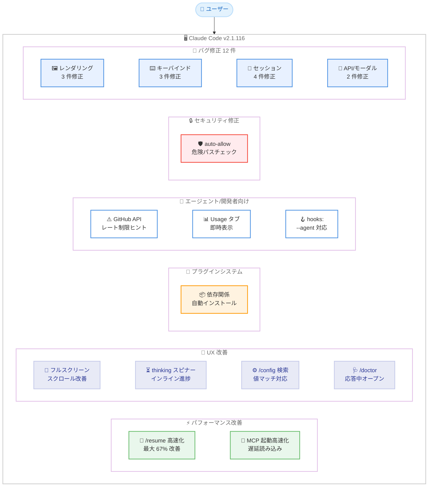
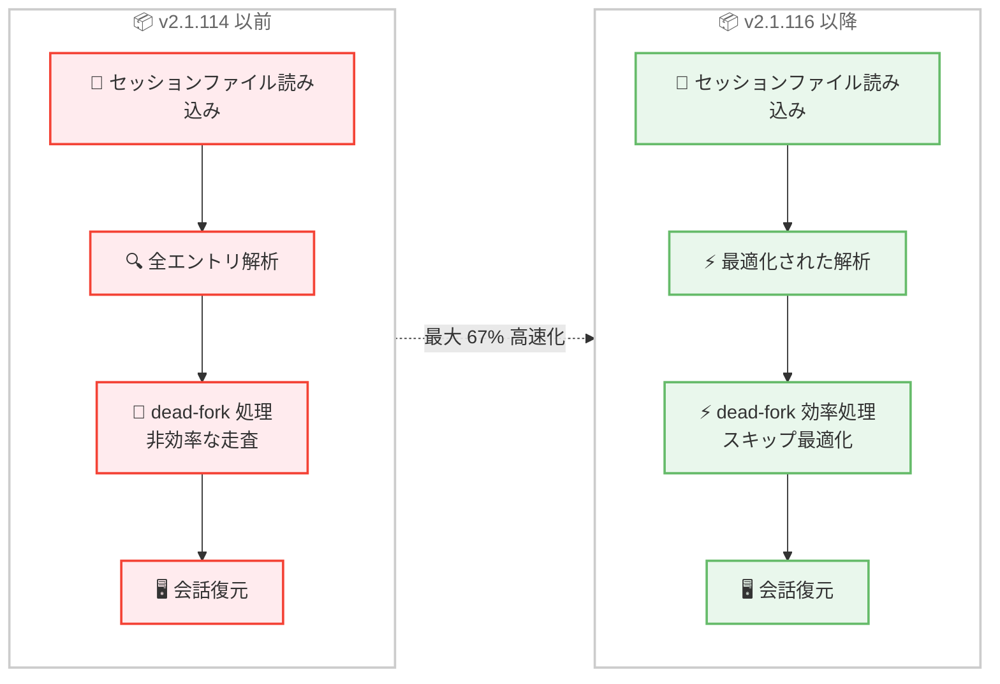
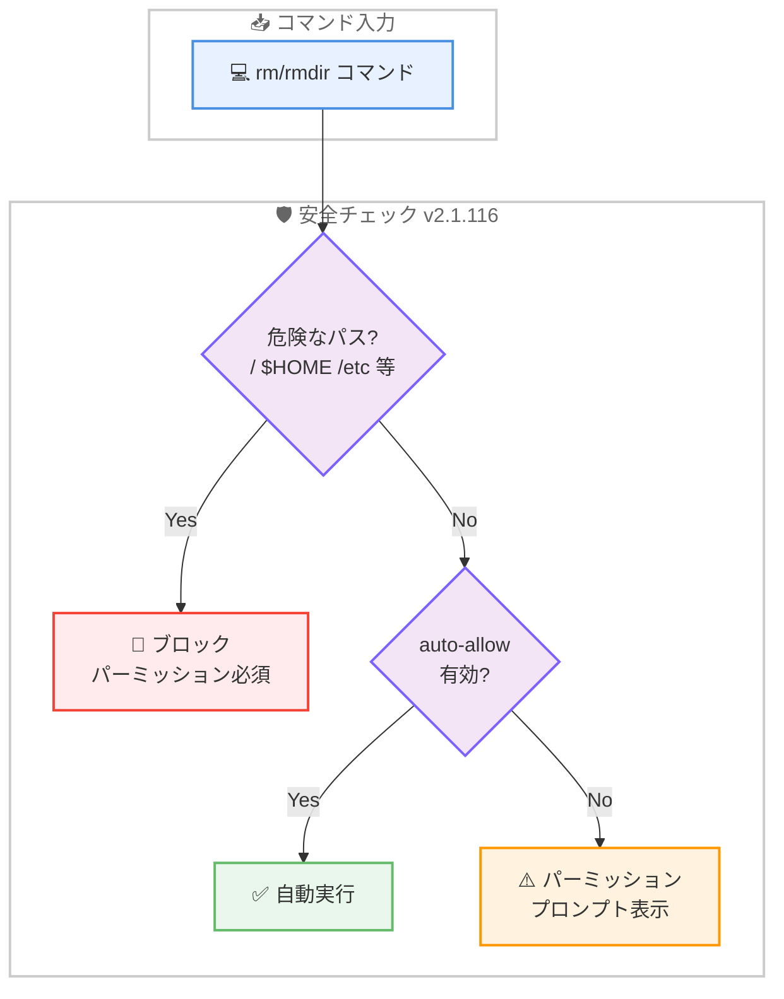

# Claude Code v2.1.116 リリース: 大規模セッションの復元高速化、UX 全般の改善、セキュリティ修正を含む包括的アップデート

## メタデータ

| 項目 | 内容 |
|------|------|
| 発表日 | 2026-04-20 |
| ソース | Claude Code Changelog |
| カテゴリ | Claude Code アップデート |
| 公式リンク | https://github.com/anthropics/claude-code/blob/main/CHANGELOG.md |

## 概要

Claude Code v2.1.116 が 2026 年 4 月 20 日にリリースされました。前バージョン v2.1.113-v2.1.114 (2026 年 4 月 17 日) から 3 日後のリリースです。本バージョンはパフォーマンス改善、UX 改善、プラグインシステム強化、エージェント/開発者向け機能、セキュリティ修正、多数のバグ修正を含む包括的なアップデートとなっています。

本リリースの最大の注目点は **大規模セッションの `/resume` パフォーマンス改善** です。40MB 以上のセッションで最大 67% の高速化が実現され、dead-fork エントリが多いセッションの処理効率も大幅に向上しました。

UX 面では、VS Code、Cursor、Windsurf ターミナルでのフルスクリーンスクロールの滑らかさ向上、thinking スピナーのインライン進捗表示、`/config` 検索のオプション値マッチなど、日常的な操作体験を向上させる改善が複数含まれています。

セキュリティ面では、サンドボックスの自動許可が `/`、`$HOME` などの重要システムディレクトリに対する `rm`/`rmdir` の危険パス安全チェックをバイパスしていた問題が修正されました。

## 詳細

### 背景

Claude Code は Anthropic が提供する CLI ベースの AI 開発支援ツールです。v2.1.116 は前バージョン v2.1.113-v2.1.114 で行われたネイティブバイナリアーキテクチャへの移行とセキュリティモデル強化に続き、パフォーマンスチューニング、ユーザー体験の洗練、安定性向上に焦点を当てたリリースです。

前バージョンではアーキテクチャレベルの根本的な変更が行われましたが、本リリースでは大規模セッションの復元速度、MCP 起動速度、ターミナル操作の滑らかさなど、実際の利用場面で体感できるパフォーマンス改善と、多数のバグ修正による安定性向上が中心テーマとなっています。

### 主な変更点

#### パフォーマンス改善 - 2 件

- **`/resume` の大幅高速化**: 大規模セッション (40MB 以上) での `/resume` が最大 67% 高速化されました。dead-fork エントリが多いセッションの処理も効率化されています
- **MCP 起動の高速化**: 複数の stdio サーバーが設定されている場合の MCP 起動が高速化されました。`resources/templates/list` の取得は最初の `@` メンションまで遅延されるようになりました

#### UX 改善 - 5 件

- **フルスクリーンスクロールの改善**: VS Code、Cursor、Windsurf ターミナルでのフルスクリーンスクロールが滑らかになりました。`/terminal-setup` でエディタのスクロール感度を設定できるようになっています
- **thinking スピナーのインライン進捗表示**: thinking スピナーが "still thinking"、"thinking more"、"almost done thinking" とインラインで進捗を表示するようになりました。従来の別行ヒント表示は廃止されました
- **`/config` 検索のオプション値マッチ**: `/config` の検索がオプション値にもマッチするようになりました。例えば "vim" と検索すると Editor mode 設定が見つかります
- **`/doctor` の応答中オープン対応**: `/doctor` が Claude の応答中でも、現在のターンの完了を待たずにオープンできるようになりました
- **スラッシュコマンドメニューの空結果表示**: フィルタ結果がゼロの場合、メニューが消えるのではなく "No commands match" と表示されるようになりました

#### プラグインシステム - 1 件

- **プラグイン依存関係の自動インストール**: `/reload-plugins` およびバックグラウンドプラグイン自動更新で、既に追加済みのマーケットプレイスから不足しているプラグイン依存関係が自動インストールされるようになりました

#### エージェント/開発者向け機能 - 3 件

- **Bash ツールの GitHub API レート制限ヒント**: `gh` コマンドが GitHub API のレート制限に達した際に、Bash ツールがヒントを表示するようになりました。エージェントがリトライではなくバックオフ動作を取ることが可能になります
- **Usage タブの即時表示**: Settings の Usage タブで 5 時間および週間の使用量が即座に表示されるようになりました。usage エンドポイントがレート制限された場合も失敗しなくなりました
- **エージェントフロントマター `hooks:` の `--agent` 対応**: エージェントフロントマターの `hooks:` が `--agent` 経由でメインスレッドエージェントとして実行された場合にも発火するようになりました

#### セキュリティ修正 - 1 件

- **サンドボックス自動許可の危険パスチェックバイパス修正**: サンドボックスの自動許可 (auto-allow) が `/`、`$HOME`、その他の重要システムディレクトリを対象とする `rm`/`rmdir` に対して、危険パス安全チェックをバイパスしていた問題が修正されました

#### バグ修正 - 12 件

**レンダリング・表示修正 - 3 件:**

- **デーヴァナーガリーおよびインド系文字の列揃え修正**: デーヴァナーガリーおよびその他のインド系文字が壊れた列揃えでレンダリングされる問題が修正されました
- **VS Code 統合ターミナルの空白セル修正**: VS Code 統合ターミナルでスクロール中に散在する空白セルが発生する問題が修正されました
- **インラインモードのスクロールバック重複修正**: インラインモードでスクロールバックが重複する問題が修正されました

**キーバインド・入力修正 - 3 件:**

- **Ctrl+- のアンドゥ修正**: Kitty キーボードプロトコルを使用するターミナルで Ctrl+- がアンドゥをトリガーしない問題が修正されました
- **Cmd+Left/Right の行頭/行末移動修正**: Kitty プロトコルターミナルで Cmd+Left/Right が行頭/行末にジャンプしない問題が修正されました
- **Ctrl+Z のターミナルハング修正**: ラッパープロセス (npx、bun run) 経由で起動した際に Ctrl+Z がターミナルをハングさせる問題が修正されました

**セッション・コマンド修正 - 4 件:**

- **`/branch` の 50MB 制限修正**: `/branch` が 50MB を超えるトランスクリプトを持つ会話を拒否する問題が修正されました
- **`/resume` の空会話表示修正**: 大規模セッションファイルで `/resume` が空の会話をサイレントに表示する問題が修正されました
- **`/plugin` の重複表示修正**: `/plugin` の Installed タブで同じアイテムが 2 回表示される問題が修正されました
- **`/update` と `/tui` の worktree 対応修正**: セッション途中で worktree に入った後に `/update` と `/tui` が動作しなくなる問題が修正されました

**API・モーダル修正 - 2 件:**

- **API 400 エラーの修正**: キャッシュコントロール TTL の順序に関連する断続的な API 400 エラーが修正されました
- **モーダル検索ダイアログのオーバーフロー修正**: ターミナルの高さが短い場合にモーダル検索ダイアログがオーバーフローする問題が修正されました

### 技術的な詳細

#### `/resume` の高速化

大規模セッション (40MB 以上) での `/resume` コマンドのパフォーマンスが最大 67% 改善されました。この最適化は 2 つの側面から行われています。

1. **セッションファイルの解析最適化**: 大規模なセッションファイルの読み込みと解析処理が効率化されました
2. **dead-fork エントリの効率的な処理**: 会話の分岐で発生する dead-fork エントリ (使われなくなった会話パス) が多いセッションでの処理効率が向上しました

これにより、長時間のセッションや複雑な分岐を持つセッションの復元が大幅に高速化されます。

#### MCP 起動の遅延読み込み

複数の stdio サーバーが設定されている環境での MCP 起動が高速化されました。従来は起動時に全てのリソース情報を取得していましたが、v2.1.116 では `resources/templates/list` の取得を最初の `@` メンションまで遅延させるようになりました。これにより、MCP サーバーを多数設定している環境での起動時間が短縮されます。

#### サンドボックス自動許可の安全チェック

v2.1.116 ではサンドボックスの自動許可 (auto-allow) メカニズムに重要なセキュリティ修正が加えられました。従来、自動許可が有効な場合、`rm` や `rmdir` コマンドが `/`、`$HOME`、その他の重要システムディレクトリを対象としていても、危険パス安全チェックがバイパスされる可能性がありました。

v2.1.116 では、自動許可の判定前に危険パスチェックが実行されるようになり、重要なシステムディレクトリの削除が確実にブロックされます。

```
# 以下のようなコマンドは auto-allow 状態でもブロックされる
rm -rf /
rm -rf $HOME
rmdir /etc
```

#### thinking スピナーのインライン進捗

従来の thinking スピナーは別行にヒントを表示していましたが、v2.1.116 ではスピナー自体がインラインで進捗状態を表示するようになりました。

```
# 進捗表示の流れ
⠋ still thinking...
⠙ thinking more...
⠹ almost done thinking...
```

この変更により、表示がコンパクトになり、ターミナルの縦方向のスペースが節約されます。

#### `/terminal-setup` のスクロール感度設定

VS Code、Cursor、Windsurf のターミナルでフルスクリーンモードを使用する際、スクロールが粗くなる問題がありました。v2.1.116 では `/terminal-setup` コマンドがエディタのスクロール感度を適切に設定するようになり、滑らかなスクロール体験が実現されます。

## 開発者への影響

### 対象

- **長時間セッションを利用するユーザー**: `/resume` の最大 67% 高速化と `/branch` の 50MB 制限修正により、大規模セッションの操作性が大幅に向上しました
- **VS Code/Cursor/Windsurf ユーザー**: フルスクリーンスクロールの改善と空白セル修正により、エディタ統合ターミナルでの体験が向上しました
- **MCP を多用するユーザー**: 複数 stdio サーバー環境での起動高速化により、MCP を活用した開発ワークフローの待ち時間が短縮されます
- **Kitty プロトコル対応ターミナルのユーザー**: Ctrl+-、Cmd+Left/Right のキーバインド修正により、標準的なキーボード操作が正常に動作するようになりました
- **プラグイン利用者**: 依存関係の自動インストールと重複表示修正により、プラグイン管理の利便性が向上しました
- **エージェント開発者**: `hooks:` の `--agent` 対応と GitHub API レート制限ヒントにより、エージェントの信頼性が向上しました
- **非ラテン文字圏のユーザー**: デーヴァナーガリーおよびインド系文字の列揃え修正により、多言語環境での表示品質が改善されました

### 必要なアクション

以下のコマンドで最新バージョンに更新できます。

```bash
# npm でのアップデート
npm update -g @anthropic-ai/claude-code

# Homebrew でのアップデート
brew upgrade claude-code

# 現在のバージョン確認
claude --version
```

**確認が推奨される項目:**

- **セキュリティ修正の適用**: サンドボックスの自動許可を利用している環境では、危険パスチェックが適切に動作することを確認してください
- **VS Code 環境でのスクロール設定**: VS Code、Cursor、Windsurf を使用している場合、`/terminal-setup` を実行してスクロール感度の設定を適用してください
- **大規模セッションの動作確認**: 大規模セッションファイルを使用している場合、`/resume` が正常に高速化されていることを確認してください

### 移行ガイド

#### フルスクリーンスクロールの設定

VS Code、Cursor、Windsurf のターミナルでスクロールを改善するには、以下を実行してください。

```bash
# ターミナルセットアップの実行
/terminal-setup

# エディタのスクロール感度が自動設定される
```

#### プラグイン依存関係の自動インストール

v2.1.116 以降、プラグインの依存関係は自動的にインストールされます。手動でのインストールは不要です。

```bash
# プラグインの再読み込み (依存関係も自動インストール)
/reload-plugins
```

## コード例

### アップデートとバージョン確認

```bash
# Claude Code を最新バージョンに更新
npm update -g @anthropic-ai/claude-code

# バージョン確認
claude --version
# Claude Code v2.1.116
```

### /terminal-setup によるスクロール設定

```bash
# Claude Code 内でターミナルセットアップを実行
> /terminal-setup

# VS Code、Cursor、Windsurf のスクロール感度が最適化される
# フルスクリーンモードでの滑らかなスクロールが実現
```

### /config 検索でのオプション値マッチ

```bash
# /config でオプション値を検索
> /config

# 検索ボックスに "vim" と入力
# → Editor mode 設定が表示される (オプション値にマッチ)
```

### エージェントフロントマター hooks の利用

```yaml
---
hooks:
  on_start:
    - echo "Agent started"
  on_complete:
    - echo "Agent completed"
---

# --agent フラグで実行した場合も hooks が発火する
# claude --agent my-agent.md
```

## アーキテクチャ図

### v2.1.116 改善領域の全体像



### `/resume` 高速化のフロー



### サンドボックス auto-allow の安全チェックフロー



## 関連リンク

- [Claude Code Changelog](https://github.com/anthropics/claude-code/blob/main/CHANGELOG.md)
- [Claude Code GitHub リポジトリ](https://github.com/anthropics/claude-code)
- [Claude Code npm パッケージ](https://www.npmjs.com/package/@anthropic-ai/claude-code)
- [Claude Code ドキュメント](https://docs.anthropic.com/en/docs/claude-code)
- [Claude Code v2.1.113-v2.1.114](./2026-04-17-claude-code-v2-1-113-v2-1-114.md)
- [Claude Code v2.1.111-v2.1.112](./2026-04-16-claude-code-v2-1-111-v2-1-112.md)
- [Claude Code v2.1.109-v2.1.110](./2026-04-15-claude-code-v2-1-109-v2-1-110.md)

## まとめ

Claude Code v2.1.116 は、パフォーマンス改善 2 件、UX 改善 5 件、プラグインシステム強化 1 件、エージェント/開発者向け機能 3 件、セキュリティ修正 1 件、バグ修正 12 件を含む包括的なリリースです。変更は大きく 3 つのテーマにまとめられます。

第一に、**パフォーマンスの大幅改善** です。大規模セッション (40MB 以上) での `/resume` が最大 67% 高速化され、dead-fork エントリの効率的な処理も実現されました。また、複数の MCP stdio サーバーが設定されている環境での起動時間も短縮されました。これらの改善により、長時間にわたる開発セッションや複雑なツール構成を持つ環境での操作体験が向上します。

第二に、**UX の全般的な洗練** です。VS Code、Cursor、Windsurf ターミナルでのフルスクリーンスクロール改善、thinking スピナーのインライン進捗表示、`/config` 検索のオプション値マッチ、`/doctor` の応答中オープン、スラッシュコマンドメニューの空結果表示など、日常操作の細部にわたる改善が行われました。プラグイン依存関係の自動インストールや GitHub API レート制限のヒント表示も、開発ワークフローの効率を高める実用的な改善です。

第三に、**安定性とセキュリティの向上** です。12 件のバグ修正により、デーヴァナーガリー文字のレンダリング、Kitty プロトコルターミナルのキーバインド、ラッパープロセス経由での Ctrl+Z ハング、50MB 超セッションの `/branch` 拒否、API 400 エラーなど、幅広い領域の問題が解消されました。セキュリティ面では、サンドボックスの auto-allow が `/`、`$HOME` などの重要ディレクトリの削除をバイパスしていた問題が修正され、安全性が強化されています。

全ての Claude Code ユーザーに対してアップデートを推奨します。特に大規模セッションを頻繁に利用するユーザーは `/resume` の高速化の恩恵を受けることができます。VS Code、Cursor、Windsurf を使用している場合は、アップデート後に `/terminal-setup` を実行してスクロール感度の設定を適用してください。
