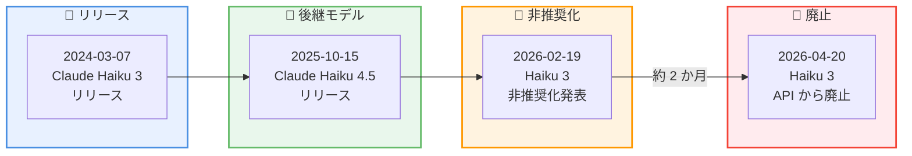

# Claude Haiku 3 モデルが廃止 -- API リクエストはエラーを返却、Claude Haiku 4.5 への移行が必要

## メタデータ

| 項目 | 内容 |
|------|------|
| 発表日 | 2026-04-20 |
| ソース | [Claude API Release Notes](https://platform.claude.com/docs/en/release-notes/overview) |
| カテゴリ | モデルライフサイクル |
| 公式リンク | [Model Deprecations](https://platform.claude.com/docs/en/about-claude/model-deprecations) |

## 概要

2026 年 4 月 20 日、Claude Haiku 3 (`claude-3-haiku-20240307`) が正式に廃止 (retirement) されました。この日以降、当該モデル ID への API リクエストはすべてエラーを返します。Anthropic は後継モデルとして Claude Haiku 4.5 への移行を推奨しています。

この廃止は、2026 年 2 月 19 日に発表された非推奨化 (deprecation) に基づくものです。当初の廃止予定日は 2026 年 4 月 19 日でしたが、実際の廃止は 1 日遅れの 4 月 20 日に実施されました。Claude Haiku 3 は 2024 年 3 月にリリースされた軽量高速モデルであり、約 2 年の稼働期間を経て役目を終えることとなりました。

## 詳細

### 背景

Claude Haiku 3 は、2024 年 3 月 7 日にリリースされた Claude 3 ファミリーの軽量モデルです。高速な応答性能と低コストを特徴とし、チャットボットや分類タスク、リアルタイムアプリケーションなど、レイテンシが重視されるユースケースで広く利用されてきました。

後継モデルである Claude Haiku 4.5 は、2025 年 10 月 15 日にリリースされました。Anthropic はこのモデルを「最速かつ最もインテリジェントな Haiku モデルであり、フロンティアに近いパフォーマンスを実現」と位置づけています。

非推奨化から廃止までの経緯は以下のとおりです。

- **2025 年 10 月 15 日**: Claude Haiku 4.5 がリリースされ、後継モデルとして利用可能に
- **2026 年 2 月 19 日**: Claude Haiku 3 の非推奨化を発表。廃止予定日を 2026 年 4 月 19 日と告知
- **2026 年 4 月 20 日**: Claude Haiku 3 が正式に廃止。API リクエストはエラーを返却

### 主な変更点

1. **Claude Haiku 3 の廃止**: `claude-3-haiku-20240307` への API リクエストはすべてエラーを返すようになりました
2. **即時対応が必要**: 非推奨期間は終了しており、現在 Haiku 3 を使用しているアプリケーションは動作停止の状態です
3. **推奨移行先**: Claude Haiku 4.5 (`claude-haiku-4-5-20241022`) が公式の移行先として指定されています

### 技術的な詳細

#### モデル比較: Haiku 3 vs Haiku 4.5

| 項目 | Haiku 3 | Haiku 4.5 |
|------|---------|-----------|
| モデル ID | `claude-3-haiku-20240307` | `claude-haiku-4-5-20241022` |
| ステータス | 廃止済み | Active |
| コンテキストウィンドウ | 200k トークン | 200k トークン |
| 入力価格 | $0.25 / 100 万トークン | $0.80 / 100 万トークン |
| 出力価格 | $1.25 / 100 万トークン | $4.00 / 100 万トークン |
| 画像入力 | 対応 | 対応 |
| ツール使用 | 対応 | 対応 |
| パフォーマンス | 高速・軽量 | フロンティアに近い性能 |

#### 非推奨化履歴 -- Haiku 3 のタイムライン

| 日付 | イベント |
|------|---------|
| 2024 年 3 月 7 日 | Claude Haiku 3 リリース |
| 2025 年 10 月 15 日 | Claude Haiku 4.5 リリース |
| 2026 年 2 月 19 日 | Haiku 3 の非推奨化を発表 |
| 2026 年 4 月 19 日 | 当初の廃止予定日 |
| 2026 年 4 月 20 日 | 実際の廃止日 |

## 開発者への影響

### 対象

- Claude Haiku 3 (`claude-3-haiku-20240307`) を使用しているすべてのアプリケーション
- このモデルを Amazon Bedrock や Google Vertex AI 経由で利用している開発者
- Haiku 3 をチャットボット、分類、コンテンツモデレーションなどに組み込んでいるシステム

### 必要なアクション

**Claude Haiku 3 は既に廃止されているため、直ちに以下の対応が必要です。**

1. **モデル ID の更新**: コードベース内のすべての `claude-3-haiku-20240307` を `claude-haiku-4-5-20241022` に変更
2. **動作テストの実施**: Haiku 4.5 は Haiku 3 よりも高性能ですが、出力の傾向やフォーマットが異なる場合があるため、テストを実施
3. **コスト影響の確認**: Haiku 4.5 は Haiku 3 と比較して入力価格が約 3.2 倍、出力価格が約 3.2 倍となるため、利用量に応じたコスト見積もりを更新
4. **SDK のアップデート**: 最新の Anthropic SDK にアップデートして、新しいモデル ID に対応していることを確認

### 移行ガイド

#### モデル ID の変更

| 変更前 | 変更後 |
|--------|--------|
| `claude-3-haiku-20240307` | `claude-haiku-4-5-20241022` |

#### 移行時の注意点

| 項目 | 詳細 |
|------|------|
| 性能向上 | Haiku 4.5 はフロンティアに近いパフォーマンスを実現。分類精度や推論能力が大幅に向上 |
| コスト増加 | 入力 $0.25 から $0.80、出力 $1.25 から $4.00 に変更。性能向上とのトレードオフ |
| 応答形式 | 高性能化に伴い、出力のスタイルや詳細度が異なる場合あり。プロンプトの調整を推奨 |
| 互換性 | API インターフェースに破壊的変更はなし。モデル ID の変更のみで基本的に移行可能 |

## コード例

### Python: Haiku 3 から Haiku 4.5 への移行

**変更前 (Haiku 3 -- 現在はエラー)**:

```python
import anthropic

client = anthropic.Anthropic()

# このリクエストは既にエラーを返します
message = client.messages.create(
    model="claude-3-haiku-20240307",
    max_tokens=1024,
    messages=[
        {
            "role": "user",
            "content": "この文章をポジティブ・ネガティブ・ニュートラルに分類してください。"
        }
    ]
)

print(message.content[0].text)
```

**変更後 (Haiku 4.5)**:

```python
import anthropic

client = anthropic.Anthropic()

message = client.messages.create(
    model="claude-haiku-4-5-20241022",
    max_tokens=1024,
    messages=[
        {
            "role": "user",
            "content": "この文章をポジティブ・ネガティブ・ニュートラルに分類してください。"
        }
    ]
)

print(message.content[0].text)
```

### curl: Haiku 4.5 へのリクエスト例

```bash
curl https://api.anthropic.com/v1/messages \
     --header "x-api-key: $ANTHROPIC_API_KEY" \
     --header "anthropic-version: 2023-06-01" \
     --header "content-type: application/json" \
     --data \
'{
    "model": "claude-haiku-4-5-20241022",
    "max_tokens": 1024,
    "messages": [
        {
            "role": "user",
            "content": "この文章をポジティブ・ネガティブ・ニュートラルに分類してください。"
        }
    ]
}'
```

## マイグレーションタイムライン



## 関連リンク

- [Claude Model Deprecations](https://platform.claude.com/docs/en/about-claude/model-deprecations)
- [Claude API Release Notes](https://platform.claude.com/docs/en/release-notes/overview)
- [Claude Haiku 4.5 Documentation](https://platform.claude.com/docs/en/about-claude/models/overview)
- [Claude Models Overview](https://platform.claude.com/docs/en/about-claude/models/overview)

## まとめ

Claude Haiku 3 (`claude-3-haiku-20240307`) は 2026 年 4 月 20 日に正式に廃止され、API リクエストはエラーを返すようになりました。2024 年 3 月のリリースから約 2 年にわたり、高速・低コストの軽量モデルとして多くのアプリケーションで利用されてきましたが、後継の Claude Haiku 4.5 にその役割を引き継ぐ形となりました。

現在も Haiku 3 を使用しているアプリケーションは既に動作停止の状態にあるため、直ちに Claude Haiku 4.5 (`claude-haiku-4-5-20241022`) への移行が必要です。移行作業自体はモデル ID の変更のみで基本的に完了しますが、Haiku 4.5 は価格が上昇しているため (入力: 約 3.2 倍、出力: 約 3.2 倍)、コストへの影響を事前に確認することを推奨します。一方で、Haiku 4.5 はフロンティアに近いパフォーマンスを実現しており、分類精度や推論能力の大幅な向上が期待できます。
