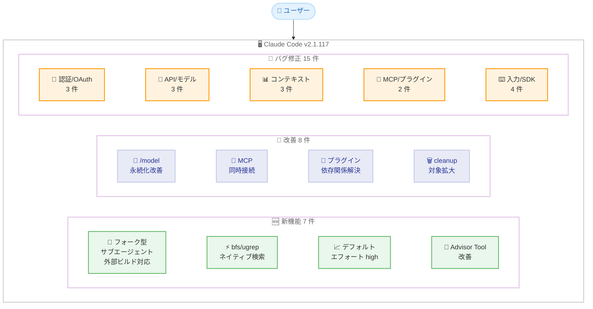
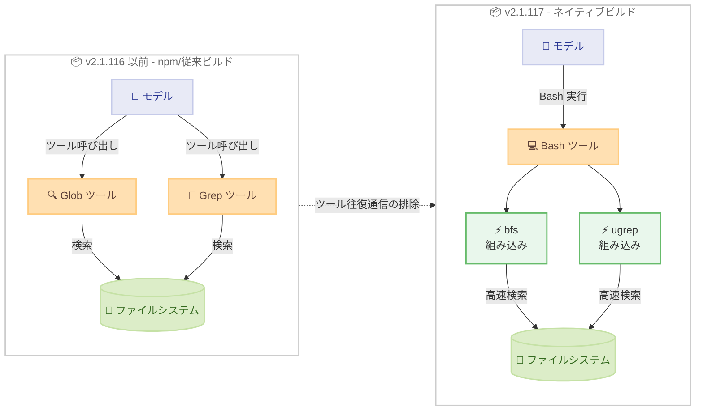
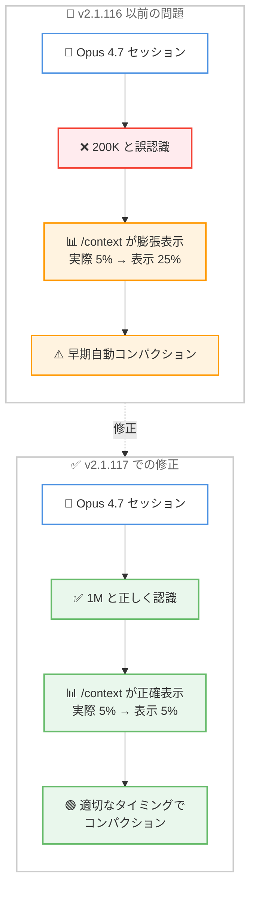
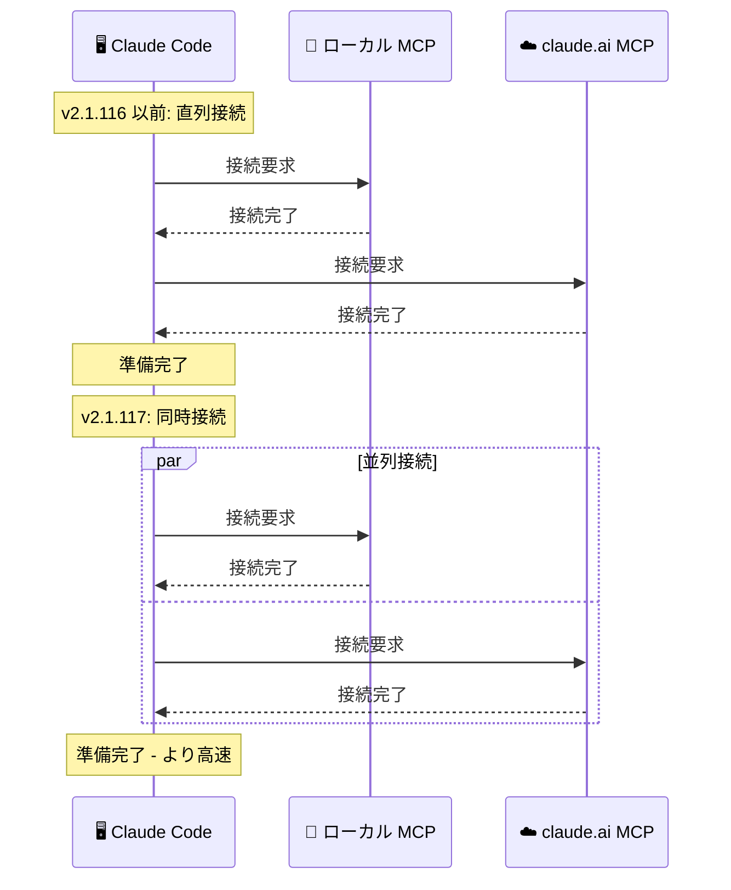
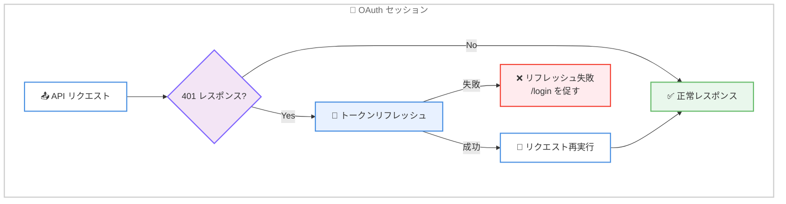

# Claude Code v2.1.117 リリース: ネイティブビルドでの検索高速化、Opus 4.6/Sonnet 4.6 デフォルトエフォート引き上げ、Opus 4.7 コンテキストウィンドウ修正を含む大型アップデート

## メタデータ

| 項目 | 内容 |
|------|------|
| 発表日 | 2026-04-21 |
| ソース | Claude Code Changelog |
| カテゴリ | Claude Code アップデート |
| 公式リンク | https://github.com/anthropics/claude-code/blob/main/CHANGELOG.md |

## 概要

Claude Code v2.1.117 が 2026 年 4 月 21 日にリリースされました。前バージョン v2.1.116 (2026 年 4 月 20 日) からわずか 1 日後のリリースですが、新機能 7 件、改善 8 件、バグ修正 15 件を含む大規模なアップデートです。本リリースはネイティブビルドにおけるパフォーマンスの根本的な変革、モデル利用体験の向上、プラグインエコシステムの成熟、そして多数の安定性修正を特徴としています。

最大の注目点は **ネイティブビルドでの検索パフォーマンス革新** です。macOS および Linux のネイティブビルドにおいて、従来の `Glob` および `Grep` ツールが組み込みの `bfs` (高速ファイル検索) と `ugrep` (高速テキスト検索) に置き換えられました。これにより、ツールの往復通信が不要になり、Bash ツールから直接高速な検索が可能になります。また、Pro/Max サブスクライバー向けに Opus 4.6 および Sonnet 4.6 のデフォルトエフォートレベルが `medium` から `high` に引き上げられ、より高品質な応答がデフォルトで得られるようになりました。

さらに、Opus 4.7 のコンテキストウィンドウが 200K として誤計算されていた重大なバグが修正され、本来の 1M コンテキストウィンドウが正しく認識されるようになりました。これにより、`/context` の表示精度が改善され、不必要な早期自動コンパクションが解消されます。フォーク型サブエージェントの外部ビルド対応、MCP 同時接続によるスタートアップ高速化、Advisor Tool の改善など、幅広い領域にわたる改善が行われています。

## 詳細

### 背景

Claude Code は Anthropic が提供する CLI ベースの AI 開発支援ツールです。v2.1.117 は前バージョン v2.1.116 で行われた `/resume` パフォーマンス改善、UX 改善、セキュリティ修正に続き、ネイティブビルドアーキテクチャの本格活用、モデル利用体験の最適化、プラグインエコシステムの信頼性向上に焦点を当てたリリースです。

v2.1.113-v2.1.114 でネイティブバイナリへの移行が行われましたが、v2.1.117 ではその基盤の上に `bfs` や `ugrep` といった高性能検索ツールを組み込むことで、ネイティブビルドのメリットを最大限に引き出しています。また、Opus 4.7 のリリース (2026 年 4 月 16 日) に伴うコンテキストウィンドウの誤認識問題の修正など、最新モデルへの対応も重要なテーマとなっています。

### 主な変更点

#### 新機能 - 7 件

- **フォーク型サブエージェントの外部ビルド対応**: 環境変数 `CLAUDE_CODE_FORK_SUBAGENT=1` を設定することで、外部ビルドでもフォーク型サブエージェントを有効化できるようになりました
- **エージェントフロントマター `mcpServers` の `--agent` 対応**: エージェントフロントマターの `mcpServers` が `--agent` 経由のメインスレッドエージェントセッションで読み込まれるようになりました
- **ネイティブビルドでの組み込み検索ツール**: macOS および Linux のネイティブビルドで `Glob` と `Grep` ツールが組み込みの `bfs` と `ugrep` に置き換えられました。Bash ツールから直接利用でき、ツールの往復通信が不要になります (Windows および npm インストール版は変更なし)
- **Pro/Max デフォルトエフォートの引き上げ**: Pro/Max サブスクライバー向けに Opus 4.6 および Sonnet 4.6 のデフォルトエフォートレベルが `high` に変更されました (従来は `medium`)
- **OpenTelemetry の拡張**: `user_prompt` イベントにスラッシュコマンドの `command_name` と `command_source` が含まれるようになりました。`cost.usage`、`token.usage`、`api_request`、`api_error` にはモデルがエフォートレベルをサポートする場合に `effort` 属性が追加されます。カスタム/MCP コマンド名は `OTEL_LOG_TOOL_DETAILS=1` を設定しない限りリダクトされます
- **Advisor Tool の改善 (実験的)**: ダイアログに "experimental" ラベル、詳細リンク、有効時のスタートアップ通知が追加されました。"Advisor tool result content could not be processed" エラーでセッションが停止する問題も解消されました
- **`cleanupPeriodDays` の対象拡大**: リテンションスイープの対象に `~/.claude/tasks/`、`~/.claude/shell-snapshots/`、`~/.claude/backups/` が追加されました

#### 改善 - 8 件

- **`/model` の永続化改善**: モデル選択がプロジェクトのモデルピンと異なる場合でもリスタート間で永続化されるようになりました。スタートアップヘッダーにアクティブモデルがプロジェクトまたはマネージド設定のピンであることが表示されます
- **`/resume` のセッション要約提案**: `/resume` コマンドが古く大きなセッションを再読み込みする前に要約を提案するようになりました。既存の `--resume` フラグの動作と統一されました
- **MCP 同時接続によるスタートアップ高速化**: ローカルと claude.ai の両方の MCP サーバーが設定されている場合、同時接続がデフォルトになりました
- **`plugin install` の依存関係解決改善**: インストール済みプラグインに対する `plugin install` が "already installed" で停止せず、不足している依存関係をインストールするようになりました
- **プラグイン依存関係エラーの改善**: 依存関係エラーが "not installed" とインストールヒントを表示するようになり、`claude plugin marketplace add` が設定済みマーケットプレイスから不足依存関係を自動解決するようになりました
- **マネージド設定によるマーケットプレイス制御**: `blockedMarketplaces` と `strictKnownMarketplaces` がプラグインの install、update、refresh、autoupdate で適用されるようになりました
- **Windows サブプロセス起動の高速化**: `where.exe` の実行ファイル検索結果がプロセス単位でキャッシュされるようになり、サブプロセスの起動が高速化されました
- **SDK `reload_plugins` の並列化**: `reload_plugins` が全ユーザー MCP サーバーを直列ではなく並列で再接続するようになりました

#### バグ修正 - 15 件

**認証・セッション修正 - 3 件:**

- **Plain-CLI OAuth トークンリフレッシュ修正**: Plain-CLI の OAuth セッションでアクセストークンが期限切れになった際に "Please run /login" で終了する問題が修正されました。401 レスポンス時にトークンが反応的にリフレッシュされるようになりました
- **`CLAUDE_CODE_OAUTH_TOKEN` 環境変数での `/login` 修正**: `CLAUDE_CODE_OAUTH_TOKEN` 環境変数で起動し、そのトークンが期限切れになった場合に `/login` が効果を持たない問題が修正されました
- **`NO_PROXY` のリモート API リクエスト対応修正**: Bun 環境で実行時に `NO_PROXY` がリモート API リクエストに対して適用されない問題が修正されました

**入力・操作修正 - 2 件:**

- **プロンプト入力のアンドゥ修正**: `Ctrl+_` によるアンドゥがテキスト入力直後に動作しない問題と、各アンドゥステップで状態を 1 つスキップする問題が修正されました
- **低速接続でのキー入力修正**: 低速接続でキー名が結合テキストとして到着した際に、エスケープ/リターンが誤ってトリガーされるレアな問題が修正されました

**API・モデル修正 - 3 件:**

- **`WebFetch` の大規模 HTML ハング修正**: 非常に大きな HTML ページで `WebFetch` がハングする問題が修正されました。HTML からマークダウンへの変換前に入力がトランケートされるようになりました
- **プロキシ HTTP 204 クラッシュ修正**: プロキシが HTTP 204 No Content を返した際のクラッシュが修正され、`TypeError` の代わりに明確なエラーメッセージが表示されるようになりました
- **Bedrock アプリケーション推論プロファイル修正**: thinking を無効にした Opus 4.7 をバックエンドとする Bedrock アプリケーション推論プロファイルリクエストが 400 エラーで失敗する問題が修正されました

**コンテキスト・メモリ修正 - 3 件:**

- **Opus 4.7 コンテキストウィンドウ修正**: Opus 4.7 セッションで `/context` のパーセンテージが膨張し、早すぎる自動コンパクションが発生する問題が修正されました。Claude Code が Opus 4.7 のネイティブ 1M コンテキストウィンドウではなく 200K で計算していたことが原因でした
- **サブエージェントのマルウェア警告修正**: メインエージェントと異なるモデルを実行するサブエージェントがファイル読み取り時に誤ってマルウェア警告をフラグする問題が修正されました
- **アイドル再レンダーループ修正**: バックグラウンドタスクが存在する場合のアイドル再レンダーループが修正され、Linux でのメモリ増加が軽減されました

**MCP・プラグイン修正 - 2 件:**

- **MCP `elicitation/create` の自動キャンセル修正**: print/SDK モードでサーバーがターン途中に接続完了した際に MCP `elicitation/create` リクエストが自動キャンセルされる問題が修正されました
- **VS Code "Manage Plugins" パネル修正**: 複数の大規模マーケットプレイスが設定されている場合に VS Code の "Manage Plugins" パネルが壊れる問題が修正されました

**SDK 修正 - 2 件:**

- **SDK `reload_plugins` の直列接続修正**: `reload_plugins` が全ユーザー MCP サーバーを直列で再接続していた問題が並列接続に修正されました (改善の項にも記載)
- **フォーク型サブエージェントのモデル不一致修正**: サブエージェントがメインエージェントと異なるモデルで実行されている際のファイル読み取り時のマルウェア誤検出が修正されました

### 技術的な詳細

#### ネイティブビルドでの `bfs`/`ugrep` 組み込み

v2.1.117 の最も重要な技術的変更は、macOS および Linux のネイティブビルドにおける検索アーキテクチャの刷新です。

従来のアーキテクチャでは、ファイル検索 (`Glob`) とテキスト検索 (`Grep`) は個別のツールとして実装されており、モデルがこれらのツールを呼び出す際にはツールの往復通信 (tool round-trip) が必要でした。

v2.1.117 では、ネイティブビルドに `bfs` (高速ファイル検索ツール) と `ugrep` (高速テキスト検索ツール) がバイナリとして直接組み込まれます。これらは Bash ツールを通じて直接実行されるため、ツール呼び出しのオーバーヘッドが排除されます。

```
# 従来のアーキテクチャ (npm インストール版は引き続きこちら)
モデル → Glob ツール呼び出し → ファイルシステム検索 → 結果返却 → モデル

# 新アーキテクチャ (ネイティブビルド)
モデル → Bash ツール → bfs/ugrep 直接実行 → 結果返却 → モデル
```

この変更は以下の環境に適用されます。

- macOS ネイティブビルド: 適用
- Linux ネイティブビルド: 適用
- Windows: 変更なし (従来のツールを維持)
- npm インストール版: 変更なし (従来のツールを維持)

#### デフォルトエフォートレベルの変更

Pro/Max サブスクライバー向けに、Opus 4.6 および Sonnet 4.6 のデフォルトエフォートレベルが `medium` から `high` に引き上げられました。エフォートレベルはモデルが応答生成に費やす「思考の深さ」を制御するパラメータです。

| モデル | 対象ユーザー | 変更前 | 変更後 |
|--------|------------|--------|--------|
| Opus 4.6 | Pro/Max | `medium` | `high` |
| Sonnet 4.6 | Pro/Max | `medium` | `high` |

`high` エフォートではモデルがより深く思考するため、応答品質が向上します。一方で、トークン使用量と応答時間は増加する可能性があります。

#### Opus 4.7 コンテキストウィンドウの修正

v2.1.117 以前では、Opus 4.7 のコンテキストウィンドウサイズが 200K トークンとして計算されていました。しかし、Opus 4.7 のネイティブコンテキストウィンドウは 1M (100 万) トークンです。この誤認識により、以下の問題が発生していました。

1. **`/context` の表示が不正確**: 実際のコンテキスト使用率よりも大幅に高い値が表示されていました (例: 実際は 5% なのに 25% と表示)
2. **早期自動コンパクション**: コンテキストウィンドウの上限に達していないにもかかわらず、自動コンパクションが実行されていました

v2.1.117 では Opus 4.7 の 1M コンテキストウィンドウが正しく認識されるようになり、これらの問題が解消されます。

#### フォーク型サブエージェントの外部ビルド対応

フォーク型サブエージェント (forked subagent) は、メインプロセスからフォークされたサブプロセスとして実行されるエージェントです。従来は内部ビルドのみで利用可能でしたが、v2.1.117 では環境変数 `CLAUDE_CODE_FORK_SUBAGENT=1` を設定することで外部ビルドでも有効化できるようになりました。

フォーク型サブエージェントのメリットは以下のとおりです。

- プロセス起動のオーバーヘッドが大幅に削減される
- メインプロセスのメモリ空間を共有するため、リソース効率が高い
- コンテキストの引き継ぎが高速

#### MCP 同時接続の標準化

v2.1.116 で MCP の起動高速化 (遅延読み込み) が行われましたが、v2.1.117 ではローカルと claude.ai の両方の MCP サーバーが設定されている場合に同時接続がデフォルトになりました。

```
# v2.1.116 以前: 直列接続
ローカル MCP サーバー接続 → claude.ai MCP サーバー接続 → 準備完了

# v2.1.117: 同時接続 (デフォルト)
ローカル MCP サーバー接続 ─┐
                          ├→ 準備完了
claude.ai MCP サーバー接続 ─┘
```

#### OAuth トークンリフレッシュの改善

Plain-CLI の OAuth セッションで、アクセストークンが期限切れになるとセッションが終了する問題がありました。v2.1.117 では、API からの 401 レスポンスを検出した際にトークンを反応的にリフレッシュするメカニズムが導入されました。これにより、長時間のセッションでもトークン期限切れによる中断が発生しなくなります。

#### `cleanupPeriodDays` の対象拡大

Claude Code のデータ保持期間設定 (`cleanupPeriodDays`) によるクリーンアップスイープの対象が拡大されました。

| ディレクトリ | 内容 | v2.1.116 | v2.1.117 |
|-------------|------|----------|----------|
| `~/.claude/sessions/` | セッションデータ | 対象 | 対象 |
| `~/.claude/tasks/` | タスクデータ | 対象外 | **対象** |
| `~/.claude/shell-snapshots/` | シェルスナップショット | 対象外 | **対象** |
| `~/.claude/backups/` | バックアップ | 対象外 | **対象** |

## 開発者への影響

### 対象

- **全 Pro/Max サブスクライバー**: Opus 4.6 および Sonnet 4.6 のデフォルトエフォートが `high` に変更されたため、応答品質が向上する一方、トークン使用量と応答時間が増加する可能性があります
- **macOS/Linux ネイティブビルドユーザー**: `bfs`/`ugrep` の組み込みにより、ファイル検索とテキスト検索が高速化されます
- **Opus 4.7 利用者**: コンテキストウィンドウの修正により、`/context` の表示が正確になり、不必要な自動コンパクションが解消されます
- **OAuth 認証ユーザー**: トークンリフレッシュの修正により、長時間セッションの安定性が向上します
- **エージェント開発者**: フォーク型サブエージェントの外部ビルド対応と `mcpServers` の `--agent` 対応により、エージェントの構成オプションが拡大されます
- **プラグイン開発者・利用者**: 依存関係の自動解決改善とマネージド設定によるマーケットプレイス制御により、プラグインエコシステムの管理性が向上します
- **MCP を多用するユーザー**: 同時接続のデフォルト化により、スタートアップ時間が短縮されます
- **Bedrock ユーザー**: Opus 4.7 をバックエンドとする推論プロファイルの 400 エラーが修正されました
- **OpenTelemetry を利用する組織**: スラッシュコマンドの追跡とエフォートレベルの可観測性が向上します

### 必要なアクション

以下のコマンドで最新バージョンに更新できます。

```bash
# npm でのアップデート
npm update -g @anthropic-ai/claude-code

# Homebrew でのアップデート
brew upgrade claude-code

# 現在のバージョン確認
claude --version
```

**確認が推奨される項目:**

- **エフォートレベルの確認**: Pro/Max サブスクライバーはデフォルトエフォートが `high` に変更されています。トークン使用量を監視し、必要に応じてエフォートレベルを手動で調整してください
- **Opus 4.7 セッションの確認**: Opus 4.7 を使用している場合、`/context` の表示が修正されていることを確認してください。以前の不必要な自動コンパクションは解消されています
- **ネイティブビルドの動作確認**: macOS/Linux ネイティブビルドユーザーは、`bfs` と `ugrep` による検索が正常に動作することを確認してください
- **OAuth セッションの確認**: OAuth 認証を使用している場合、長時間セッションでトークンリフレッシュが正常に動作することを確認してください

### 移行ガイド

#### フォーク型サブエージェントの有効化

外部ビルドでフォーク型サブエージェントを利用するには、環境変数を設定します。

```bash
# 環境変数で有効化
export CLAUDE_CODE_FORK_SUBAGENT=1

# Claude Code を起動
claude
```

#### エフォートレベルの手動調整

デフォルトエフォートが `high` に変更されましたが、従来の `medium` に戻したい場合は `/model` コマンドからエフォートレベルを調整できます。

```bash
# Claude Code 内でモデル設定を開く
> /model

# エフォートレベルを medium に変更
```

#### ネイティブビルドでの検索ツールの利用

ネイティブビルドでは `Glob` と `Grep` ツールの代わりに、Bash ツールから `bfs` と `ugrep` を直接利用できます。

```bash
# bfs でファイル検索 (従来の Glob ツールに相当)
bfs . -name "*.ts" -type f

# ugrep でテキスト検索 (従来の Grep ツールに相当)
ugrep -rn "pattern" --include="*.ts"
```

#### OpenTelemetry のツール詳細ログ

カスタム/MCP コマンド名はデフォルトでリダクトされます。詳細をログに含めるには環境変数を設定します。

```bash
# ツール詳細をログに含める
export OTEL_LOG_TOOL_DETAILS=1
```

## コード例

### アップデートとバージョン確認

```bash
# Claude Code を最新バージョンに更新
npm update -g @anthropic-ai/claude-code

# バージョン確認
claude --version
# Claude Code v2.1.117
```

### フォーク型サブエージェントの有効化

```bash
# 環境変数を設定して Claude Code を起動
CLAUDE_CODE_FORK_SUBAGENT=1 claude

# または .bashrc/.zshrc に追加
echo 'export CLAUDE_CODE_FORK_SUBAGENT=1' >> ~/.bashrc
source ~/.bashrc
```

### エージェントフロントマターでの MCP サーバー設定

```yaml
---
mcpServers:
  my-server:
    command: "npx"
    args: ["-y", "@my-org/mcp-server"]
    env:
      API_KEY: "$MY_API_KEY"
---

# このエージェントを --agent で起動すると mcpServers が読み込まれる
# claude --agent my-agent.md
```

### ネイティブビルドでの高速検索

```bash
# ネイティブビルドでは bfs/ugrep が組み込まれている
# 従来の Glob/Grep ツール呼び出しなしに直接検索可能

# bfs: 高速なファイル検索
bfs . -name "*.py" -type f -newer ./setup.py

# ugrep: 高速なテキスト検索
ugrep -rn "def main" --include="*.py"

# パイプラインで組み合わせ
bfs . -name "*.ts" -type f | xargs ugrep -l "import.*React"
```

### OpenTelemetry のエフォートレベル属性

```bash
# OpenTelemetry でエフォートレベルを追跡
# cost.usage、token.usage、api_request、api_error に effort 属性が含まれる

# カスタム/MCP コマンド名の詳細ログを有効化
OTEL_LOG_TOOL_DETAILS=1 claude
```

### /model の永続化確認

```bash
# /model で選択したモデルがリスタート後も永続化される
> /model
# プロジェクトピンとは異なるモデルを選択しても永続化

# スタートアップヘッダーにモデルソースが表示される
# "Active model: opus-4-6 (from project settings)"
# "Active model: sonnet-4-6 (from /model selection)"
```

## アーキテクチャ図

### v2.1.117 改善領域の全体像



### ネイティブビルド検索アーキテクチャの変化



### Opus 4.7 コンテキストウィンドウ修正



### MCP 同時接続フロー



### OAuth トークンリフレッシュフロー



## 関連リンク

- [Claude Code Changelog](https://github.com/anthropics/claude-code/blob/main/CHANGELOG.md)
- [Claude Code GitHub リポジトリ](https://github.com/anthropics/claude-code)
- [Claude Code npm パッケージ](https://www.npmjs.com/package/@anthropic-ai/claude-code)
- [Claude Code ドキュメント](https://docs.anthropic.com/en/docs/claude-code)
- [bfs - 高速ファイル検索ツール](https://github.com/tavianator/bfs)
- [ugrep - 高速テキスト検索ツール](https://github.com/Genivia/ugrep)
- [Claude Code v2.1.116 レポート](./2026-04-20-claude-code-v2-1-116.md)
- [Claude Code v2.1.113-v2.1.114 レポート](./2026-04-17-claude-code-v2-1-113-v2-1-114.md)
- [Claude Opus 4.7 リリースレポート](./2026-04-16-claude-opus-4-7.md)

## まとめ

Claude Code v2.1.117 は、新機能 7 件、改善 8 件、バグ修正 15 件を含む大規模なリリースです。変更は大きく 3 つのテーマにまとめられます。

第一に、**ネイティブビルドの本格的な性能活用** です。macOS および Linux のネイティブビルドで `Glob` と `Grep` ツールが組み込みの `bfs` と `ugrep` に置き換えられ、ツール往復通信のオーバーヘッドが排除されました。MCP の同時接続がデフォルト化され、Windows でのサブプロセス起動キャッシュも追加されています。フォーク型サブエージェントの外部ビルド対応 (`CLAUDE_CODE_FORK_SUBAGENT=1`) により、ネイティブビルドの高速なプロセスフォークも活用できるようになりました。これらの改善により、Claude Code の応答性とスタートアップ速度が全体的に向上しています。

第二に、**モデル利用体験の最適化** です。Pro/Max サブスクライバー向けに Opus 4.6 および Sonnet 4.6 のデフォルトエフォートが `high` に引き上げられ、より高品質な応答がデフォルトで得られるようになりました。Opus 4.7 のコンテキストウィンドウが 200K から正しい 1M に修正され、`/context` の表示精度が改善されるとともに不必要な早期自動コンパクションが解消されました。`/model` の選択がリスタート間で永続化されるようになり、スタートアップヘッダーにモデルソースが表示される改善も加えられています。OpenTelemetry のエフォート属性追加により、モデル利用状況の可観測性も向上しています。

第三に、**プラグインエコシステムの成熟と安定性向上** です。プラグインの依存関係が自動解決されるようになり、マネージド設定による `blockedMarketplaces` と `strictKnownMarketplaces` の制御がプラグインライフサイクル全体に適用されるようになりました。15 件のバグ修正には、OAuth トークンリフレッシュの改善、`WebFetch` の大規模 HTML ハング修正、プロキシ HTTP 204 クラッシュ修正、Bedrock の Opus 4.7 対応修正、サブエージェントのマルウェア誤検出修正、Linux でのアイドル再レンダーループによるメモリ増加修正など、幅広い領域の問題解消が含まれています。Advisor Tool (実験的) もエラーハンドリングと UI が改善され、より安定した利用が可能になりました。

全ての Claude Code ユーザーに対してアップデートを推奨します。特に Opus 4.7 を使用しているユーザーはコンテキストウィンドウの修正により大幅な体験改善が得られます。Pro/Max サブスクライバーはデフォルトエフォートの変更に伴うトークン使用量の変化を確認してください。macOS/Linux のネイティブビルドユーザーは `bfs`/`ugrep` による検索高速化の恩恵を受けることができます。
