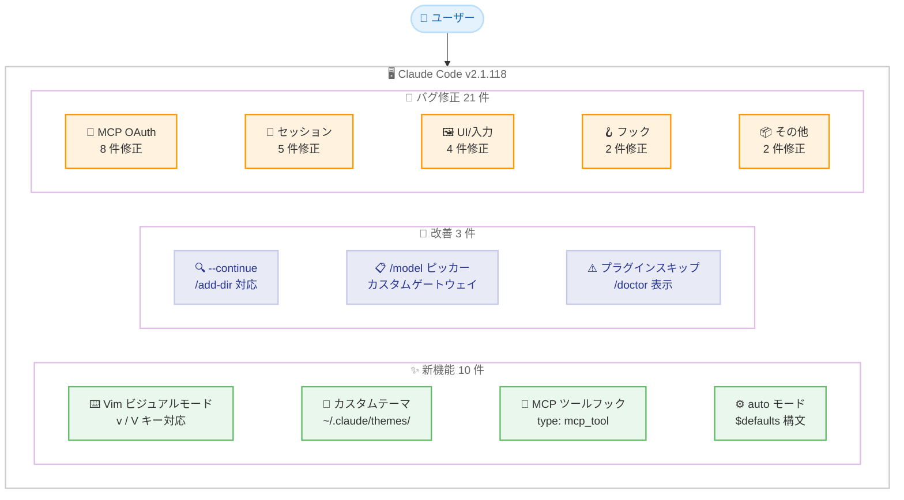
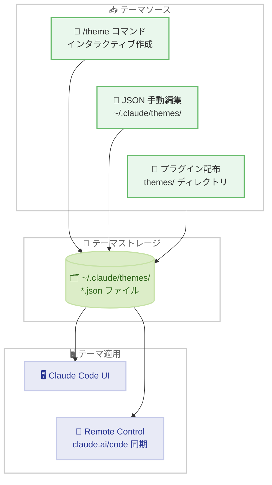
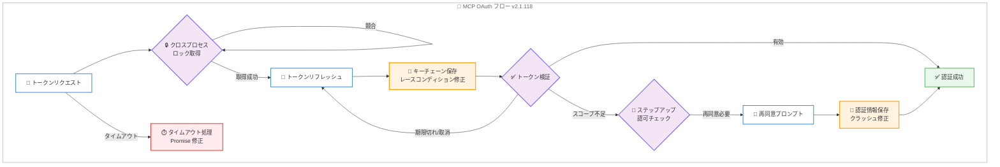
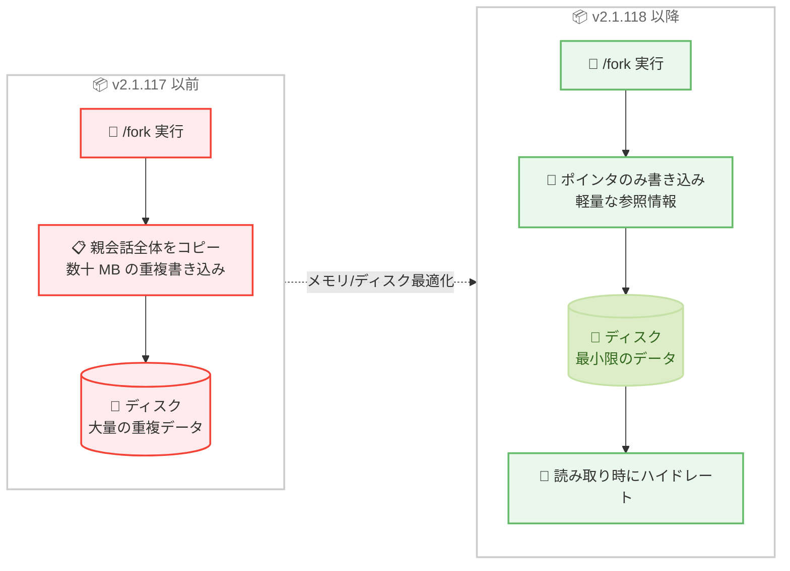

# Claude Code v2.1.118 リリース: Vim ビジュアルモード、カスタムテーマシステム、MCP ツールフック、OAuth 信頼性の包括的改善

## メタデータ

| 項目 | 内容 |
|------|------|
| 発表日 | 2026-04-22 |
| ソース | Claude Code Changelog |
| カテゴリ | Claude Code アップデート |
| 公式リンク | https://github.com/anthropics/claude-code/blob/main/CHANGELOG.md |

## 概要

Claude Code v2.1.118 が 2026 年 4 月 22 日にリリースされました。前バージョン v2.1.117 (2026 年 4 月 21 日) から 1 日後のリリースで、新機能 10 件、改善 3 件、バグ修正 21 件を含む大規模なアップデートです。本リリースでは、Vim ビジュアルモードの追加、カスタムテーマシステムの導入、MCP ツールフックの新設という 3 つの主要な新機能が注目されます。

特に MCP OAuth 関連のバグ修正が 8 件に及び、トークンリフレッシュの競合状態、macOS キーチェーンのレースコンディション、OAuth フローのタイムアウト処理など、認証の信頼性を根本的に改善する包括的なオーバーホールが行われました。これにより、MCP サーバーとの OAuth 接続が大幅に安定します。

また、`/fork` コマンドのメモリ最適化により、フォーク時に会話全体のコピーではなくポインタが書き込まれるようになり、ディスク使用量と書き込み速度が改善されました。auto モードの `$defaults` 構文、`DISABLE_UPDATES` 環境変数、WSL での Windows 設定継承など、エンタープライズ環境やカスタマイズ性を強化する機能も多数追加されています。

## 詳細

### 背景

Claude Code は Anthropic が提供する CLI ベースの AI 開発支援ツールです。v2.1.118 は前バージョン v2.1.117 でのネイティブビルドパフォーマンス改善 (bfs/ugrep)、フォークされたサブエージェント、effort レベル変更、Opus 4.7 コンテキストウィンドウ修正に続き、エディタ体験の強化、テーマカスタマイズ、フックシステムの拡張、MCP 認証の安定性向上に焦点を当てたリリースです。

v2.1.118 は 34 件の変更を含む大規模なリリースであり、特に Vim ユーザー体験の拡充、プラグインエコシステムの強化 (テーマ配布、タグ管理)、MCP OAuth の信頼性改善という 3 つの軸で開発が進められています。

### 主な変更点

#### 新機能 - 10 件

- **Vim ビジュアルモード**: `v` キーによるビジュアルモードと `V` キーによるビジュアルラインモードが追加されました。選択、オペレータ、ビジュアルフィードバックに対応し、Vim ユーザーの編集体験が大幅に向上します
- **カスタムテーマシステム**: `/theme` コマンドから名前付きカスタムテーマの作成と切り替えが可能になりました。テーマは `~/.claude/themes/` ディレクトリに JSON ファイルとして保存され、手動編集も可能です。プラグインも `themes/` ディレクトリ経由でテーマを配布できます
- **MCP ツールフック**: フックで `type: "mcp_tool"` を指定して MCP ツールを直接呼び出せるようになりました。フックシステムと MCP エコシステムの統合により、自動化の幅が広がります
- **auto モード `$defaults` 構文**: `autoMode.allow`、`autoMode.soft_deny`、`autoMode.environment` に `"$defaults"` を含めることで、ビルトインリストを置き換えるのではなく、カスタムルールを追加できるようになりました
- **`DISABLE_UPDATES` 環境変数**: 全てのアップデートパスを完全にブロックする環境変数が追加されました。手動の `claude update` も含めて無効化され、`DISABLE_AUTOUPDATER` よりも厳格な制御が可能です
- **WSL Windows 設定継承**: WSL on Windows で `wslInheritsWindowsSettings` ポリシーキーを使用して、Windows 側の管理設定を継承できるようになりました
- **auto モード確認ダイアログの非表示オプション**: auto モードのオプトインプロンプトに「Don't ask again」オプションが追加されました
- **`claude plugin tag` コマンド**: プラグインのリリース git タグをバージョンバリデーション付きで作成するコマンドが追加されました
- **`/cost` と `/stats` の `/usage` への統合**: `/cost` と `/stats` が `/usage` に統合され、関連するタブが開くタイピングショートカットとして引き続き利用可能です
- **`/color` の Remote Control 同期**: `/color` コマンドでセッションのアクセントカラーを設定すると、Remote Control 接続時に claude.ai/code と同期されるようになりました

#### 改善 - 3 件

- **`--continue`/`--resume` のディレクトリ検索改善**: `/add-dir` で追加されたカレントディレクトリを持つセッションも検索対象になりました
- **`/model` ピッカーのカスタムゲートウェイ対応**: カスタム `ANTHROPIC_BASE_URL` ゲートウェイ使用時に `ANTHROPIC_DEFAULT_*_MODEL_NAME`/`_DESCRIPTION` のオーバーライドが反映されるようになりました
- **プラグインバージョン制約のスキップ表示**: 自動更新が別のプラグインのバージョン制約によりスキップされた場合、`/doctor` と `/plugin` の Errors タブにスキップ情報が表示されるようになりました

#### バグ修正 - 21 件

##### MCP OAuth 修正 - 8 件

- **`/mcp` メニューの OAuth アクション表示修正**: `headersHelper` で設定されたサーバーの OAuth Authenticate/Re-authenticate アクションが `/mcp` メニューで非表示になる問題、およびカスタムヘッダー付き HTTP/SSE MCP サーバーが一時的な 401 後に "needs authentication" 状態のままになる問題が修正されました
- **`expires_in` 省略時の再認証修正**: OAuth トークンレスポンスで `expires_in` が省略されている MCP サーバーで 1 時間ごとに再認証が必要になる問題が修正されました
- **ステップアップ認可のサイレントリフレッシュ修正**: MCP ステップアップ認可で、サーバーの `insufficient_scope` 403 が現在のトークンに既に含まれるスコープを指定している場合に、再同意プロンプトではなくサイレントリフレッシュが行われる問題が修正されました
- **OAuth フロータイムアウトの未処理 Promise 修正**: MCP サーバーの OAuth フローがタイムアウトまたはキャンセルされた際の未処理 Promise rejection が修正されました
- **OAuth リフレッシュのクロスプロセスロック修正**: 競合状態で MCP OAuth リフレッシュがクロスプロセスロックなしに進行する問題が修正されました
- **macOS キーチェーンのレースコンディション修正**: 同時並行の MCP トークンリフレッシュがリフレッシュ直後の OAuth トークンを上書きし、予期しない「Please run /login」プロンプトが表示される問題が修正されました
- **トークン期限前取り消し時のリフレッシュ修正**: サーバーがローカルの期限到来前にトークンを取り消した場合に OAuth トークンリフレッシュが失敗する問題が修正されました
- **認証情報保存クラッシュ修正**: Linux/Windows で認証情報の保存時にクラッシュが発生し、`~/.claude/.credentials.json` が破損する問題が修正されました

##### セッション/コマンド修正 - 5 件

- **`/login` と `CLAUDE_CODE_OAUTH_TOKEN` の競合修正**: `CLAUDE_CODE_OAUTH_TOKEN` で起動されたセッションで `/login` が効果を持たない問題が修正されました。環境変数トークンがクリアされ、ディスク上の認証情報が有効になります
- **`/fork` メモリ最適化**: `/fork` が各フォークごとに親会話全体をディスクに書き込んでいた問題が修正されました。ポインタを書き込み、読み取り時にハイドレートする方式に変更されました
- **リモートセッション接続時のモデル設定上書き修正**: リモートセッションに接続した際にローカルの `~/.claude/settings.json` の `model` 設定が上書きされる問題が修正されました
- **`plugin install` の依存関係再解決修正**: 既にインストール済みのプラグインに対する `plugin install` で、誤ったバージョンでインストールされた依存関係が再解決されない問題が修正されました
- **`SendMessage` 経由のサブエージェント復元修正**: `SendMessage` 経由で再開されたサブエージェントが、生成時に指定された明示的な `cwd` を復元しない問題が修正されました

##### UI/入力修正 - 4 件

- **スクロールピルとバッジの文字色修正**: 「new messages」スクロールピルと `/plugin` バッジのテキストが読めない問題が修正されました
- **`--dangerously-skip-permissions` のダイアログ修正**: プラン承認ダイアログで `--dangerously-skip-permissions` 実行時に「bypass permissions」ではなく「auto mode」が表示される問題が修正されました
- **Alt キーバインドのフリーズ修正**: Alt+K / Alt+X / Alt+^ / Alt+_ がキーボード入力をフリーズさせる問題が修正されました
- **タイプアヘッドのファイルパスエラー修正**: `/` で始まるファイルパスをペーストした際にタイプアヘッドが「No commands match」エラーを表示する問題が修正されました

##### フック/エージェント修正 - 2 件

- **エージェントタイプフックのエラー修正**: `Stop` または `SubagentStop` 以外のイベントに設定されたエージェントタイプフックが「Messages are required for agent hooks」エラーで失敗する問題が修正されました
- **`prompt` フックの再発火修正**: エージェントフック検証サブエージェントによるツールコールで `prompt` フックが再発火する問題が修正されました

##### その他の修正 - 2 件

- **ファイルウォッチャーの未処理エラー修正**: 無効なパスや fd 枯渇時のファイルウォッチャーからの未処理エラーが修正されました
- **Remote Control セッションのアーカイブ修正**: JWT リフレッシュ中の一時的な CCR 初期化障害で Remote Control セッションがアーカイブされる問題が修正されました

### 技術的な詳細

#### Vim ビジュアルモード

v2.1.118 では Vim エミュレーションに本格的なビジュアルモードが追加されました。`v` キーで文字単位のビジュアルモード、`V` キーで行単位のビジュアルラインモードに入ることができます。

ビジュアルモードでは以下の操作が可能です。

- カーソル移動キー (`h`、`j`、`k`、`l`、`w`、`b`、`e` 等) による選択範囲の拡縮
- オペレータ (`d` で削除、`y` でヤンク、`c` で変更) による選択範囲への操作
- 選択範囲のビジュアルフィードバック (ハイライト表示)

これにより、Claude Code の入力フィールドで Vim ユーザーが慣れ親しんだ操作体験が実現されます。

#### カスタムテーマシステム

テーマシステムは 3 つの方法でカスタマイズ可能です。

1. **`/theme` コマンド**: インタラクティブにテーマを作成・切り替え
2. **JSON ファイルの手動編集**: `~/.claude/themes/` ディレクトリ内の JSON ファイルを直接編集
3. **プラグインによるテーマ配布**: プラグインの `themes/` ディレクトリにテーマファイルを配置

テーマファイルは `~/.claude/themes/` ディレクトリに保存され、名前付きで管理されます。プラグインエコシステムとの統合により、コミュニティ製のテーマを簡単にインストール・共有できます。

#### MCP ツールフック

フックシステムに新しい `type: "mcp_tool"` が追加され、フックから直接 MCP ツールを呼び出せるようになりました。従来のフックは Bash コマンドの実行に限定されていましたが、この拡張により MCP サーバーが提供するツールをフックのアクションとして利用できます。

これにより、例えば以下のようなワークフローが可能になります。

- コード変更時に MCP ツール経由で外部サービスに通知
- セッション開始時に MCP ツールで環境情報を取得
- 特定のイベント発生時に MCP ツールでデータを記録

#### auto モード `$defaults` 構文

従来の auto モード設定では、`autoMode.allow` や `autoMode.soft_deny` にカスタムルールを設定すると、ビルトインリストが完全に置き換えられていました。v2.1.118 では `"$defaults"` をリストに含めることで、ビルトインリストを維持しつつカスタムルールを追加できるようになりました。

これにより、デフォルトの安全なルールセットを基盤としながら、プロジェクト固有のルールを上乗せする運用が容易になります。

#### `/fork` メモリ最適化

従来の `/fork` コマンドはフォーク作成時に親会話全体をディスクにコピーしていました。大規模なセッションでは、フォークごとに数十 MB のデータが重複して書き込まれていました。

v2.1.118 では、フォーク時にポインタ (参照情報) のみを書き込み、実際のデータは読み取り時にハイドレート (展開) する方式に変更されました。これにより、フォーク作成が高速化され、ディスク使用量が大幅に削減されます。

#### MCP OAuth 信頼性の包括的改善

v2.1.118 では MCP OAuth に関連する 8 件のバグ修正が行われました。主な修正内容は以下のとおりです。

1. **クロスプロセスロックの修正**: 複数プロセスが同時にトークンリフレッシュを行う際のロック競合が解決されました
2. **macOS キーチェーンのレースコンディション**: 同時並行のトークンリフレッシュがキーチェーン内のトークンを上書きする問題が解消されました
3. **トークン有効期限の処理改善**: `expires_in` が省略された場合やサーバー側での期限前取り消しに対する耐性が向上しました
4. **ステップアップ認可のフロー修正**: スコープ不足の 403 レスポンスに対する適切な再同意プロンプト表示が実現されました
5. **認証情報の永続化修正**: Linux/Windows での認証情報保存時のクラッシュと `~/.claude/.credentials.json` の破損が防止されました

## 開発者への影響

### 対象

- **Vim ユーザー**: ビジュアルモード (`v`/`V`) の追加により、Claude Code の入力フィールドでの編集操作が大幅に強化されました
- **テーマカスタマイズを求めるユーザー**: `/theme` コマンドとカスタムテーマシステムにより、外観を自由にカスタマイズできるようになりました
- **MCP を活用するユーザー**: MCP ツールフックにより自動化の幅が広がり、OAuth 修正により接続の安定性が大幅に向上しました
- **auto モード利用者**: `$defaults` 構文により、デフォルトルールを維持しながらカスタマイズが可能になりました
- **エンタープライズ管理者**: `DISABLE_UPDATES` 環境変数と WSL 設定継承により、管理対象環境での制御が強化されました
- **プラグイン開発者**: テーマ配布機能と `claude plugin tag` コマンドにより、プラグインの公開・管理が改善されました
- **大規模セッション利用者**: `/fork` のメモリ最適化により、ディスク使用量と書き込み速度が改善されました

### 必要なアクション

以下のコマンドで最新バージョンに更新できます。

```bash
# npm でのアップデート
npm update -g @anthropic-ai/claude-code

# Homebrew でのアップデート
brew upgrade claude-code

# 現在のバージョン確認
claude --version
```

**確認が推奨される項目:**

- **MCP OAuth 接続の安定性**: MCP サーバーを使用している環境では、OAuth 認証の安定性が改善されていることを確認してください
- **Vim モードの動作確認**: Vim モードを使用している場合、ビジュアルモード (`v`/`V`) が正常に動作することを確認してください
- **auto モード設定の確認**: auto モードのカスタムルールを設定している場合、`$defaults` 構文への移行を検討してください
- **フック設定の確認**: エージェントタイプフックを `Stop`/`SubagentStop` 以外のイベントに設定している場合、正常に動作するようになりました

### 移行ガイド

#### `/cost` と `/stats` から `/usage` への移行

`/cost` と `/stats` は `/usage` に統合されましたが、従来のコマンド名はタイピングショートカットとして引き続き利用可能です。入力すると `/usage` の該当タブが開きます。設定やスクリプトの変更は不要です。

#### auto モード `$defaults` への移行

既存の auto モード設定でビルトインルールを維持しながらカスタムルールを追加したい場合は、`$defaults` を使用します。

```json
{
  "autoMode": {
    "allow": ["$defaults", "custom_tool_1", "custom_tool_2"],
    "soft_deny": ["$defaults", "dangerous_operation"]
  }
}
```

#### MCP ツールフックの設定

フックで MCP ツールを呼び出すには、`type: "mcp_tool"` を指定します。

## コード例

### アップデートとバージョン確認

```bash
# Claude Code を最新バージョンに更新
npm update -g @anthropic-ai/claude-code

# バージョン確認
claude --version
# Claude Code v2.1.118
```

### Vim ビジュアルモードの使用

```bash
# Claude Code の入力フィールドで Vim モードが有効な場合

# v: ビジュアルモード (文字単位選択)
# V: ビジュアルラインモード (行単位選択)

# 操作例:
# v + w: 単語を選択
# V + j: 現在行と次の行を選択
# v + d: 選択範囲を削除
# V + y: 選択行をヤンク
```

### カスタムテーマの作成と管理

```bash
# /theme コマンドでテーマを作成・切り替え
> /theme

# テーマファイルの直接編集
# ~/.claude/themes/my-dark-theme.json
```

```json
{
  "name": "my-dark-theme",
  "colors": {
    "primary": "#61AFEF",
    "background": "#282C34",
    "foreground": "#ABB2BF"
  }
}
```

### auto モード `$defaults` 構文

```json
{
  "autoMode": {
    "allow": [
      "$defaults",
      "my_custom_tool",
      "another_tool"
    ],
    "soft_deny": [
      "$defaults",
      "risky_operation"
    ],
    "environment": [
      "$defaults",
      "MY_CUSTOM_VAR"
    ]
  }
}
```

### MCP ツールフックの設定

```json
{
  "hooks": {
    "on_stop": [
      {
        "type": "mcp_tool",
        "server": "my-mcp-server",
        "tool": "notify",
        "params": {
          "message": "Task completed"
        }
      }
    ]
  }
}
```

### `DISABLE_UPDATES` 環境変数

```bash
# 全てのアップデートパスを完全にブロック
export DISABLE_UPDATES=1

# DISABLE_AUTOUPDATER との違い:
# DISABLE_AUTOUPDATER=1  -> 自動更新のみ無効 (手動 claude update は可能)
# DISABLE_UPDATES=1      -> 全てのアップデートを無効 (手動 claude update も不可)
```

### プラグインのリリースタグ作成

```bash
# プラグインのリリース git タグを作成
claude plugin tag

# バージョンバリデーション付きでタグが作成される
```

## アーキテクチャ図

### v2.1.118 主要変更の全体像



### カスタムテーマシステムのアーキテクチャ



### MCP OAuth 修正の影響範囲



### `/fork` 最適化: Before/After



## 関連リンク

- [Claude Code Changelog](https://github.com/anthropics/claude-code/blob/main/CHANGELOG.md)
- [Claude Code GitHub リポジトリ](https://github.com/anthropics/claude-code)
- [Claude Code npm パッケージ](https://www.npmjs.com/package/@anthropic-ai/claude-code)
- [Claude Code ドキュメント](https://docs.anthropic.com/en/docs/claude-code)
- [Claude Code v2.1.116 レポート](./2026-04-20-claude-code-v2-1-116.md)
- [Claude Code v2.1.113-v2.1.114 レポート](./2026-04-17-claude-code-v2-1-113-v2-1-114.md)

## まとめ

Claude Code v2.1.118 は、新機能 10 件、改善 3 件、バグ修正 21 件を含む大規模なリリースです。変更は大きく 3 つのテーマにまとめられます。

第一に、**エディタ体験とカスタマイズ性の飛躍的向上** です。Vim ビジュアルモード (`v`/`V`) の追加により、選択、オペレータ、ビジュアルフィードバックを備えた本格的な Vim 編集体験が実現されました。カスタムテーマシステムの導入により、`/theme` コマンドでの対話的な作成、`~/.claude/themes/` の JSON 手動編集、プラグインによるテーマ配布の 3 つの方法で外観をカスタマイズできるようになりました。`/cost` と `/stats` の `/usage` への統合、`/color` の Remote Control 同期など、UI の統一性と利便性も向上しています。

第二に、**フックシステムと auto モードの拡張** です。`type: "mcp_tool"` によるフックからの MCP ツール直接呼び出しにより、Claude Code のフックシステムと MCP エコシステムが統合されました。auto モードの `$defaults` 構文により、ビルトインルールを維持しながらプロジェクト固有のカスタムルールを追加する柔軟な設定が可能になりました。`DISABLE_UPDATES` 環境変数や WSL の Windows 設定継承は、エンタープライズ環境での管理性を強化する機能です。

第三に、**MCP OAuth の信頼性とセッション管理の抜本的改善** です。8 件の MCP OAuth バグ修正により、クロスプロセスロックの競合、macOS キーチェーンのレースコンディション、トークン有効期限の処理、ステップアップ認可のフロー、認証情報の永続化など、OAuth 認証の全レイヤーにわたる問題が解消されました。`/fork` のメモリ最適化 (ポインタ方式への移行)、リモートセッション接続時のモデル設定保護、サブエージェントの `cwd` 復元など、セッション管理の安定性も大幅に向上しています。

全ての Claude Code ユーザーに対してアップデートを推奨します。特に MCP サーバーを OAuth で接続しているユーザーは、認証の安定性が大幅に改善されるため速やかなアップデートが推奨されます。Vim モードを使用しているユーザーはビジュアルモードの追加を、テーマのカスタマイズに関心があるユーザーは `/theme` コマンドをお試しください。
