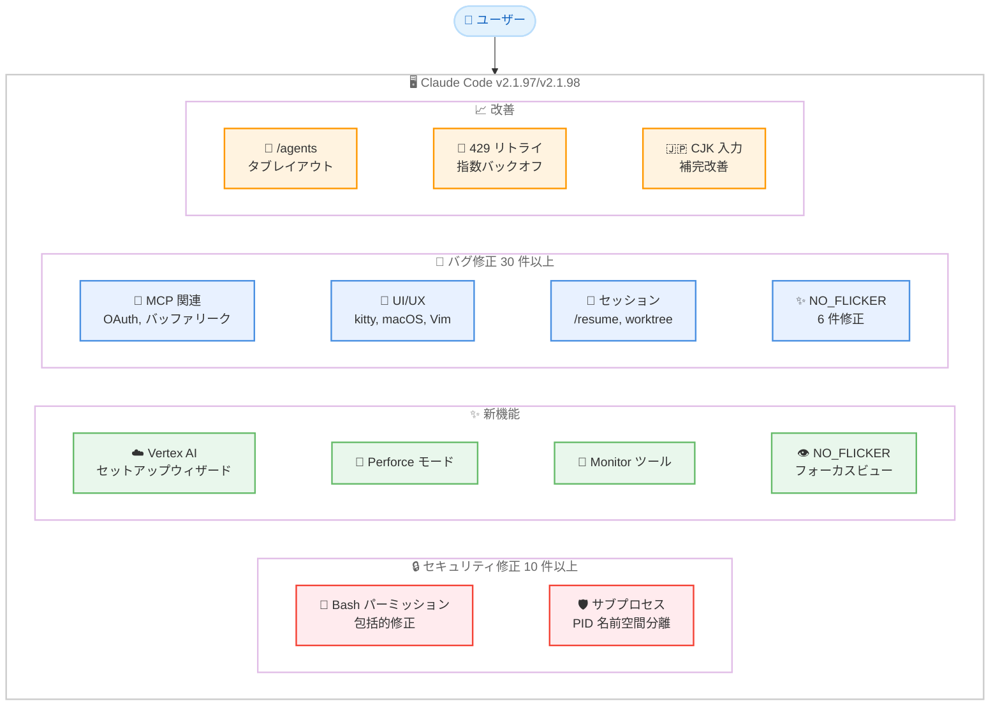
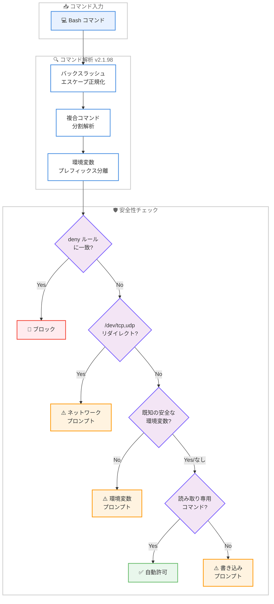

# Claude Code v2.1.97 & v2.1.98 リリース -- セキュリティ強化・Vertex AI セットアップウィザード・NO_FLICKER 改善

## メタデータ

| 項目 | 内容 |
|------|------|
| 発表日 | 2026-04-22 |
| ソース | Claude Code Changelog |
| カテゴリ | ツールアップデート |
| 公式リンク | https://github.com/anthropics/claude-code/blob/main/CHANGELOG.md |

## 概要

Claude Code v2.1.97 および v2.1.98 が 2026 年 4 月 22 日に同日リリースされました。本リリースの最大の注目点は **Bash ツールのパーミッションバイパスに関する複数のセキュリティ修正** です。バックスラッシュエスケープされたフラグが読み取り専用として自動許可され任意コード実行に至る脆弱性をはじめ、複合コマンドによる強制パーミッションプロンプトの回避、環境変数プレフィックスを悪用した読み取り専用判定の迂回、`/dev/tcp` や `/dev/udp` へのリダイレクトの自動許可など、計 10 件以上のセキュリティクリティカルな修正が含まれています。

新機能面では、Google Vertex AI のインタラクティブセットアップウィザード、Perforce モード (`CLAUDE_CODE_PERFORCE_MODE`)、サブプロセスサンドボックスの PID 名前空間分離、Monitor ツールなどが追加されました。v2.1.97 では `NO_FLICKER` モードのフォーカスビュートグル (`Ctrl+O`) が導入され、同モードの多数のバグ修正も行われています。

また、MCP OAuth トークンリフレッシュの修正、429 リトライの指数バックオフ改善、`/resume` ピッカーの複数修正、セッション管理の安定性向上など、幅広い領域でのバグ修正と改善が含まれています。

## 詳細

### 背景

Claude Code は Anthropic が提供する CLI ベースの AI 開発支援ツールです。v2.1.97 と v2.1.98 は同日にリリースされており、v2.1.97 がセキュリティ修正と NO_FLICKER 改善を先行してリリースし、v2.1.98 がそれを包含しつつ新機能の追加とさらなる修正を行った形になっています。

前バージョン v2.1.96 (Bedrock 認証の緊急修正) および v2.1.94 (Amazon Bedrock Mantle サポート、デフォルトエフォートレベル変更) に続くリリースです。今回は特に Bash ツールのパーミッションシステムに対する包括的なセキュリティ監査の結果が反映されており、複数の攻撃ベクターが同時に修正されています。

### 主な変更点

#### セキュリティ修正 -- 重大 (v2.1.97 / v2.1.98 共通)

本リリースで最も重要な変更は Bash ツールのパーミッションシステムに対する包括的な修正です。以下の脆弱性が修正されました。

**任意コード実行につながる脆弱性:**

- **バックスラッシュエスケープによるパーミッションバイパス**: バックスラッシュでエスケープされたフラグが読み取り専用コマンドとして自動許可され、任意コード実行が可能になる脆弱性が修正されました
- **複合コマンドによる強制プロンプトの回避**: 複合 Bash コマンドが auto モードおよび bypass-permissions モードで安全チェックと明示的 ask ルールの強制パーミッションプロンプトをバイパスしていた問題が修正されました

**パーミッション判定の不備:**

- **環境変数プレフィックスの判定漏れ**: 環境変数プレフィックス付きの読み取り専用コマンドが、変数が既知の安全なもの (`LANG`、`TZ`、`NO_COLOR` など) でない限りプロンプトを表示しない問題が修正されました
- **ネットワークリダイレクトの自動許可**: `/dev/tcp/...` や `/dev/udp/...` へのリダイレクトが自動許可されていた問題が修正され、プロンプトが表示されるようになりました
- **`grep -f` / `rg -f` のパターンファイル読み取り**: 作業ディレクトリ外のパターンファイルを読み取る `grep -f FILE` / `rg -f FILE` がプロンプトなしで実行されていた問題が修正されました

**パーミッションモードの整合性:**

- **`--dangerously-skip-permissions` のサイレントダウングレード**: 保護パスへの Bash 経由の書き込み承認後、`--dangerously-skip-permissions` が accept-edits モードにサイレントにダウングレードされていた問題が修正されました
- **エージェントチームのパーミッション継承**: `--dangerously-skip-permissions` 使用時にエージェントチームメンバーがリーダーのパーミッションモードを継承しない問題が修正されました

**ルール処理の不備:**

- **管理設定の allow ルール残留**: 管理者が allow ルールを削除した後も、プロセス再起動まで当該ルールが有効なまま残る問題が修正されました
- **ワイルドカードルールのスペース/タブ不一致**: `Bash(cmd:*)` や `Bash(git commit *)` のワイルドカードパーミッションルールが、余分なスペースやタブを含むコマンドにマッチしない問題が修正されました
- **deny ルールのプロンプトダウングレード**: `Bash(...)` deny ルールが、`cd` と他のセグメントを混在させたパイプコマンドに対してプロンプトにダウングレードされていた問題が修正されました
- **JavaScript プロトタイププロパティ名の衝突**: `toString` などの JavaScript プロトタイププロパティ名に一致するパーミッションルールが、`settings.json` をサイレントに無視させる問題が修正されました

#### 新機能 (v2.1.98)

- **Google Vertex AI セットアップウィザード**: ログイン画面で "3rd-party platform" を選択した際にアクセス可能なインタラクティブウィザードが追加されました。GCP 認証、プロジェクトとリージョンの設定、認証情報の検証、モデルピニングをガイドします
- **`CLAUDE_CODE_PERFORCE_MODE` 環境変数**: 設定時に Edit/Write/NotebookEdit が読み取り専用ファイルに対して `p4 edit` ヒントと共にエラーを返すようになり、サイレントな上書きを防止します
- **Monitor ツール**: バックグラウンドスクリプトからのイベントストリーミング用 Monitor ツールが追加されました
- **サブプロセスサンドボックスの PID 名前空間分離**: `CLAUDE_CODE_SUBPROCESS_ENV_SCRUB` 設定時に Linux 上で PID 名前空間分離が有効になります。`CLAUDE_CODE_SCRIPT_CAPS` 環境変数でセッションごとのスクリプト呼び出し数を制限できます
- **`--exclude-dynamic-system-prompt-sections` フラグ**: print モードでクロスユーザープロンプトキャッシュを改善するためのフラグが追加されました
- **W3C `TRACEPARENT` 環境変数**: OTEL トレーシング有効時に Bash ツールのサブプロセスに W3C `TRACEPARENT` 環境変数が設定され、子プロセスのスパンが Claude Code のトレースツリーに正しく紐づけられます
- **`workspace.git_worktree` ステータスライン入力**: カレントディレクトリがリンクされた git worktree 内にある場合、ステータスライン JSON 入力に `workspace.git_worktree` が設定されるようになりました

#### 新機能 (v2.1.97)

- **フォーカスビュートグル (`Ctrl+O`)**: `NO_FLICKER` モードでプロンプト、ツールサマリー (編集 diffstat 付き)、最終レスポンスのみを表示するフォーカスビューが追加されました
- **`refreshInterval` ステータスライン設定**: ステータスラインコマンドを N 秒ごとに再実行する設定が追加されました
- **`/agents` の実行中インジケーター**: ライブサブエージェントインスタンスを持つエージェントタイプの横に `N running` インジケーターが表示されるようになりました
- **Cedar ポリシーファイルのシンタックスハイライト**: `.cedar` および `.cedarpolicy` ファイルのシンタックスハイライトが追加されました

#### バグ修正 -- パーミッション関連

- **`permissions.additionalDirectories` の中断セッション適用**: 設定変更がセッション中に即座に反映されるようになりました。ディレクトリの削除はアクセスを即時無効化し、追加は再起動なしで有効になります
- **偽のパーミッションプロンプト削減**: `cut -d /`、`paste -d /`、`column -s /`、`awk '{print $1}' file`、`%` を含むファイル名に対する偽のパーミッションプロンプトが修正されました

#### バグ修正 -- MCP 関連

- **MCP OAuth トークンリフレッシュ**: `oauth.authServerMetadataUrl` の設定オーバーライドが再起動後のトークンリフレッシュ時に適用されない問題が修正されました。ADFS などの IdP に影響していました
- **MCP HTTP/SSE バッファリーク (v2.1.97)**: サーバー再接続時に MCP HTTP/SSE 接続が 1 時間あたり約 50MB の未解放バッファを蓄積する問題が修正されました

#### バグ修正 -- UI/UX 関連

- **kitty キーボードプロトコルの大文字ドロップ**: xterm および VS Code 統合ターミナルで kitty キーボードプロトコル使用時に大文字が小文字に変換される問題が修正されました
- **macOS テキスト置換**: macOS のテキスト置換がトリガーワードを削除して置換テキストを挿入しない問題が修正されました
- **フルスクリーンモードのクラッシュ**: MCP ツール結果にホバーした際のクラッシュが修正されました
- **URL コピー時のスペース挿入**: フルスクリーンモードおよび NO_FLICKER モードでラップされた URL をコピーする際にスペースが挿入される問題が修正されました
- **Vim モードのナビゲーション改善**: NORMAL モードで `j`/`k` が履歴をナビゲートし、入力境界でフッターピルを選択するようになりました
- **フッターインジケーターの折り返し防止**: Focus やノティフィケーションのインジケーターが狭いターミナル幅でもモードインジケーター行に留まるようになりました

#### バグ修正 -- NO_FLICKER モード (v2.1.97)

- **スクロールレンダリングアーティファクト**: zellij 内での実行時のスクロールレンダリングアーティファクトが修正されました
- **メモリリーク**: API リトライで古いストリーミング状態が残るメモリリークが修正されました
- **低速マウスホイールスクロール**: Windows Terminal でのマウスホイールスクロールが改善されました
- **カスタムステータスライン非表示**: 24 行未満のターミナルでカスタムステータスラインが表示されない問題が修正されました
- **Warp でのキーボードショートカット**: Shift+Enter と Alt/Cmd+Arrow ショートカットが NO_FLICKER モードの Warp で動作しない問題が修正されました
- **CJK テキストの文字化け**: Windows で NO_FLICKER モードにてコピーした韓国語/日本語/Unicode テキストが文字化けする問題が修正されました

#### バグ修正 -- セッション・リジューム関連

- **`/resume` ピッカーの複数修正**: `--resume <name>` で編集不可になる、フィルタリロードで検索状態が消える、空リストで矢印キーが無効になる、クロスプロジェクトの陳腐化、タスクステータステキストが会話サマリーを上書きする問題が修正されました
- **10KB 超ファイル編集の diff 消失**: `--resume` 時に 10KB を超えるファイルの編集 diff が UI から消える問題が修正されました
- **`--resume` キャッシュミス**: 添付メッセージからの中間ターン入力がトランスクリプトに保存されない問題が修正されました
- **作業中のメッセージ未保存 (v2.1.97)**: Claude が作業中に入力されたメッセージがトランスクリプトに永続化されない問題が修正されました
- **サブエージェントの worktree リーク (v2.1.97)**: worktree 分離または `cwd:` オーバーライドを持つサブエージェントが作業ディレクトリを親セッションの Bash ツールにリークする問題が修正されました
- **コンパクション時の重複トランスクリプト (v2.1.97)**: prompt-too-long リトライ時にコンパクションが重複する数 MB のサブエージェントトランスクリプトファイルを書き込む問題が修正されました

#### バグ修正 -- その他

- **ストリーミングレスポンスのタイムアウト**: ストリーミングレスポンスが停止した際にタイムアウトする代わりに非ストリーミングモードにフォールバックするようになりました
- **429 リトライの指数バックオフ**: サーバーが小さい `Retry-After` を返す場合に全リトライが約 13 秒で消費される問題が修正され、指数バックオフが最低値として適用されるようになりました
- **`/export` のパス処理**: 絶対パスと `~` が適切に処理されるようになりました
- **`/effort max` の未知モデル ID 対応**: 未知または将来のモデル ID で `/effort max` が拒否される問題が修正されました
- **スラッシュコマンドピッカーの YAML ブーリアン**: プラグインのフロントマター `name` が YAML のブーリアンキーワードの場合にスラッシュコマンドピッカーが壊れる問題が修正されました
- **音声モードのスペースリーク**: プッシュトゥトークキーを再押下した際にスペース文字が大量にリークする問題が修正されました
- **`DISABLE_AUTOUPDATER` の完全抑制**: npm レジストリバージョンチェックとシンボリックリンク変更が完全に抑制されるようになりました
- **Remote Control のメモリリーク**: パーミッションハンドラエントリがセッション全体にわたって保持されるメモリリークが修正されました
- **バックグラウンドサブエージェントの部分進捗**: エラーで失敗したバックグラウンドサブエージェントが部分的な進捗を親エージェントに報告するようになりました
- **陳腐サブエージェント worktree のクリーンアップ**: 未追跡ファイルを含む worktree が削除される問題が修正されました
- **`sandbox.network.allowMachLookup`**: macOS での設定が有効になるようになりました
- **Bedrock SigV4 認証 (v2.1.97)**: `AWS_BEARER_TOKEN_BEDROCK` や `ANTHROPIC_BEDROCK_BASE_URL` が空文字列に設定されている場合に認証が失敗する問題が修正されました
- **`claude plugin update` (v2.1.97)**: git ベースのマーケットプレイスプラグインで "already at the latest version" と誤報告される問題が修正されました
- **VSCode の Git Bash 誤検出**: Windows で `CLAUDE_CODE_GIT_BASH_PATH` が設定されている場合の偽陽性 "requires git-bash" エラーが修正されました

#### 改善

- **`/resume` フィルタヒント**: フィルタヒントラベルが改善され、プロジェクト/worktree/ブランチ名がフィルタインジケーターに追加されました
- **`/agents` のタブレイアウト**: Running タブにライブサブエージェントが表示され、Library タブに Run agent と View running instance アクションが追加されました
- **`/reload-plugins` のスキル反映**: 再起動なしでプラグイン提供のスキルが反映されるようになりました
- **Accept Edits モードの自動承認拡大**: 安全な環境変数やプロセスラッパーが付加されたファイルシステムコマンドが自動承認されるようになりました
- **トランスクリプトのトークン使用量**: ストリーミングプレースホルダーではなく最終的なトークン使用量が記録されるようになりました
- **LSP clientInfo**: Claude Code が initialize リクエストの `clientInfo` で言語サーバーに自身を識別するようになりました
- **`/claude-api` スキルの更新**: Claude API に加えて Managed Agents がカバーされるようになりました
- **画像圧縮 (v2.1.97)**: 貼り付けおよび添付された画像が Read ツールと同じトークンバジェットに圧縮されるようになりました
- **CJK 入力補完 (v2.1.97)**: スラッシュコマンドと `@` メンション補完が CJK 句読点の後にもトリガーされるようになりました
- **Bridge セッション情報 (v2.1.97)**: ローカル git リポジトリ、ブランチ、作業ディレクトリが claude.ai セッションカードに表示されるようになりました
- **auto モードのサンドボックスネットワーク自動承認 (v2.1.97)**: auto モードおよび bypass-permissions モードでサンドボックスネットワークアクセスプロンプトが自動承認されるようになりました

#### 削除

- **`/compact` ヒントの非表示**: `DISABLE_COMPACT` が設定されている場合に `/compact` ヒントが表示されなくなりました

### 技術的な詳細

#### Bash ツールパーミッションシステムの包括的修正

v2.1.97/v2.1.98 で修正された Bash ツールのパーミッション脆弱性は、複数の攻撃ベクターにまたがっています。

**バックスラッシュエスケープ攻撃**: Bash ツールのコマンド解析で、バックスラッシュでエスケープされたフラグ (例: `command \--flag`) が読み取り専用コマンドとして分類される場合がありました。これにより、本来書き込み操作を行うコマンドが自動許可され、任意コード実行が可能になっていました。修正後はエスケープされたフラグも正しく解析されます。

**複合コマンドのバイパス**: パイプやセミコロンで接続された複合コマンドが、安全チェックの強制パーミッションプロンプトをバイパスしていました。特に `cd` と他のコマンドを混在させたパイプコマンドで、deny ルールがプロンプトにダウングレードされる問題がありました。

**環境変数プレフィックスの悪用**: `ENV_VAR=value command` 形式のコマンドで、任意の環境変数プレフィックスが安全とみなされていました。修正後は `LANG`、`TZ`、`NO_COLOR` など既知の安全な変数のみが自動許可されます。

**ネットワークリダイレクト**: Bash の `/dev/tcp/host/port` や `/dev/udp/host/port` へのリダイレクトが、ファイルシステム操作として自動許可されていました。これによりネットワーク接続が暗黙的に許可される状態でした。

#### Vertex AI セットアップウィザード

新しいインタラクティブウィザードは以下のステップで Google Vertex AI の設定をガイドします。

1. **GCP 認証**: `gcloud auth` による認証の確認と設定
2. **プロジェクト設定**: GCP プロジェクト ID の選択と設定
3. **リージョン設定**: Vertex AI が利用可能なリージョンの選択
4. **認証情報検証**: 設定した認証情報の動作検証
5. **モデルピニング**: 使用するモデルの固定設定

#### サブプロセスサンドボックスの PID 名前空間分離

`CLAUDE_CODE_SUBPROCESS_ENV_SCRUB` 環境変数を設定すると、Linux 上でサブプロセスが PID 名前空間分離で実行されます。これにより、サブプロセスが他のプロセスを参照したり操作したりすることが制限されます。`CLAUDE_CODE_SCRIPT_CAPS` 環境変数と組み合わせることで、セッションごとのスクリプト呼び出し回数を制限し、リソース消費を抑制できます。

#### MCP HTTP/SSE バッファリーク修正

v2.1.97 で修正された MCP HTTP/SSE バッファリークは、サーバーが再接続するたびに約 50MB/時 の未解放バッファが蓄積される深刻なメモリリークでした。長時間実行されるセッションや頻繁に再接続が発生する環境で顕著に影響していました。

#### 429 リトライの指数バックオフ改善

サーバーが小さい `Retry-After` 値 (例: 1 秒) を返す場合、全リトライ試行が約 13 秒で消費されてしまう問題がありました。修正後は指数バックオフが最低値として適用され、サーバーの `Retry-After` が小さい場合でも適切な間隔でリトライが行われます。

## 開発者への影響

### 対象

- **全ての Claude Code ユーザー**: Bash ツールのパーミッションバイパス修正はセキュリティクリティカルであり、全ユーザーに即座のアップデートを推奨します
- **Google Vertex AI ユーザー**: 新しいセットアップウィザードにより、初期設定が大幅に簡素化されます
- **Perforce ユーザー**: `CLAUDE_CODE_PERFORCE_MODE` 環境変数により、読み取り専用ファイルの誤上書きが防止されます
- **NO_FLICKER モードユーザー**: フォーカスビュー (`Ctrl+O`) の追加と多数のバグ修正により、NO_FLICKER モードの使用体験が大幅に向上しました
- **MCP を利用するユーザー**: OAuth トークンリフレッシュの修正と HTTP/SSE バッファリーク修正により、MCP サーバーとの長時間接続の安定性が向上しました
- **エージェント開発者**: パーミッションモードの継承修正とサブエージェントの worktree リーク修正により、マルチエージェント構成の信頼性が向上しました
- **auto モード / bypass-permissions モードユーザー**: 複合コマンドのバイパス修正により、セキュリティが強化されました
- **CJK 入力ユーザー**: スラッシュコマンド補完の CJK 句読点対応と NO_FLICKER モードのテキスト文字化け修正により、日本語/韓国語/中国語環境での使用性が改善されました

### 必要なアクション

以下のコマンドで最新バージョンに更新できます。

```bash
# npm でのアップデート
npm update -g @anthropic-ai/claude-code

# Homebrew でのアップデート
brew upgrade claude-code

# 現在のバージョン確認
claude --version
```

**重要 -- セキュリティアップデート:**

本リリースには複数のセキュリティクリティカルな修正が含まれています。特に Bash ツールのパーミッションバイパス脆弱性は任意コード実行に至る可能性があるため、全てのユーザーに対して速やかなアップデートを強く推奨します。

**確認が推奨される項目:**

- **パーミッション設定の再確認**: `settings.json` のパーミッションルール (特に `Bash(cmd:*)` 形式のワイルドカードルール) が意図どおりに動作しているか確認してください
- **管理設定の allow ルール**: 管理者が変更した allow ルールが正しく反映されているか確認してください
- **MCP OAuth 設定**: ADFS などカスタム IdP を使用している場合、トークンリフレッシュが正常に動作することを確認してください
- **Vertex AI の設定**: Google Vertex AI を使用している場合、新しいセットアップウィザードを試すことを検討してください

### 移行ガイド

#### Perforce モードの有効化

Perforce を使用する開発チームでは、以下の環境変数を設定することで読み取り専用ファイルの保護が有効になります。

```bash
# 環境変数の設定
export CLAUDE_CODE_PERFORCE_MODE=1

# 読み取り専用ファイルへの Edit/Write/NotebookEdit 操作時に
# "p4 edit" ヒントが表示され、サイレントな上書きが防止される
```

#### サブプロセスサンドボックスの有効化

Linux 環境でサブプロセスの PID 名前空間分離を有効にするには以下を設定します。

```bash
# サブプロセス環境スクラブの有効化
export CLAUDE_CODE_SUBPROCESS_ENV_SCRUB=1

# セッションごとのスクリプト呼び出し数の制限 (オプション)
export CLAUDE_CODE_SCRIPT_CAPS=100
```

#### NO_FLICKER モードのフォーカスビュー

`NO_FLICKER` モードで新しいフォーカスビューを使用するには、セッション中に `Ctrl+O` を押下します。

```bash
# NO_FLICKER モードでの実行
export NO_FLICKER=1
claude

# セッション中に Ctrl+O でフォーカスビューを切り替え
# プロンプト、ツールサマリー (diffstat 付き)、最終レスポンスのみ表示
```

## コード例

### アップデートとバージョン確認

```bash
# Claude Code を最新バージョンに更新
npm update -g @anthropic-ai/claude-code

# バージョン確認
claude --version
# Claude Code v2.1.98
```

### Vertex AI セットアップウィザードの利用

```bash
# Claude Code を起動しログイン画面で "3rd-party platform" を選択
claude

# ウィザードが以下をガイド:
# 1. GCP 認証の確認・設定
# 2. プロジェクト ID の選択
# 3. リージョンの選択
# 4. 認証情報の検証
# 5. モデルピニングの設定
```

### Perforce モードの設定

```bash
# 環境変数を設定して Claude Code を起動
export CLAUDE_CODE_PERFORCE_MODE=1
claude

# 読み取り専用ファイルを編集しようとすると:
# Error: File is read-only. Run "p4 edit <file>" first.
```

### OTEL トレーシングとの連携

```bash
# OTEL トレーシングを有効にして実行
export OTEL_EXPORTER_OTLP_ENDPOINT=http://localhost:4318
claude

# Bash ツールのサブプロセスに TRACEPARENT が自動設定される
# 子プロセスのスパンが Claude Code のトレースツリーに紐づく
```

## アーキテクチャ図

### セキュリティ修正カテゴリの全体像

```mermaid
flowchart TD
    subgraph SecurityFixes["🔒 Bash ツールセキュリティ修正 v2.1.97/v2.1.98"]
        subgraph CodeExec["🚨 任意コード実行"]
            direction LR
            Backslash["⚠️ バックスラッシュ<br/>エスケープ攻撃"]
            Compound["⚠️ 複合コマンド<br/>プロンプト回避"]
            Backslash ~~~ Compound
        end

        subgraph PermJudge["🔍 パーミッション判定"]
            direction LR
            EnvVar["🛡️ 環境変数<br/>プレフィックス悪用"]
            NetRedir["🌐 /dev/tcp,udp<br/>リダイレクト許可"]
            GrepFile["📄 grep -f<br/>パターンファイル"]
            EnvVar ~~~ NetRedir ~~~ GrepFile
        end

        subgraph PermMode["🔧 パーミッションモード"]
            direction LR
            SkipPerm["⚙️ skip-permissions<br/>ダウングレード"]
            TeamInherit["👥 エージェントチーム<br/>モード継承"]
            SkipPerm ~~~ TeamInherit
        end

        subgraph RuleProc["📋 ルール処理"]
            direction LR
            ManagedRules["🏢 管理設定<br/>allow ルール残留"]
            Wildcard["✳️ ワイルドカード<br/>スペース不一致"]
            DenyDowngrade["🚫 deny ルール<br/>プロンプト化"]
            ProtoProps["🔤 プロトタイプ<br/>プロパティ衝突"]
            ManagedRules ~~~ Wildcard ~~~ DenyDowngrade ~~~ ProtoProps
        end
    end

    Attack(["🎯 攻撃ベクター"]) --> CodeExec
    Attack --> PermJudge
    Attack --> PermMode
    Attack --> RuleProc

    CodeExec -->|"修正済"| Safe(["✅ 安全な状態"])
    PermJudge -->|"修正済"| Safe
    PermMode -->|"修正済"| Safe
    RuleProc -->|"修正済"| Safe

    classDef platform fill:none,stroke:#CCCCCC,stroke-width:2px,color:#666666
    classDef layer fill:none,stroke:#E1BEE7,stroke-width:2px,color:#666666
    classDef critical fill:#FFEBEE,stroke:#F44336,stroke-width:2px,color:#333333
    classDef warning fill:#FFF3E0,stroke:#FF9800,stroke-width:2px,color:#333333
    classDef process fill:#FFFFFF,stroke:#4A90E2,stroke-width:2px,color:#333333
    classDef rule fill:#F3E5F5,stroke:#7B61FF,stroke-width:2px,color:#333333
    classDef attack fill:#FFCDD2,stroke:#E53935,stroke-width:2px,color:#333333
    classDef safe fill:#E9F7EC,stroke:#66BB6A,stroke-width:2px,color:#333333

    class SecurityFixes platform
    class CodeExec,PermJudge,PermMode,RuleProc layer
    class Backslash,Compound critical
    class EnvVar,NetRedir,GrepFile warning
    class SkipPerm,TeamInherit process
    class ManagedRules,Wildcard,DenyDowngrade,ProtoProps rule
    class Attack attack
    class Safe safe
```



### v2.1.97/v2.1.98 改善領域の全体像



### Bash ツールパーミッションチェックフロー -- 修正後



## 関連リンク

- [Claude Code Changelog](https://github.com/anthropics/claude-code/blob/main/CHANGELOG.md)
- [Claude Code GitHub リポジトリ](https://github.com/anthropics/claude-code)
- [Claude Code npm パッケージ](https://www.npmjs.com/package/@anthropic-ai/claude-code)
- [Claude Code ドキュメント](https://docs.anthropic.com/en/docs/claude-code)
- [Claude Code v2.1.116](./2026-04-20-claude-code-v2-1-116.md)
- [Claude Code v2.1.113-v2.1.114](./2026-04-17-claude-code-v2-1-113-v2-1-114.md)
- [Claude Code v2.1.111-v2.1.112](./2026-04-16-claude-code-v2-1-111-v2-1-112.md)

## まとめ

Claude Code v2.1.97 および v2.1.98 は、セキュリティ修正を最優先としつつ、新機能追加と広範なバグ修正を含む重要なリリースです。変更は大きく 4 つのテーマにまとめられます。

第一に、**Bash ツールパーミッションシステムの包括的なセキュリティ強化** です。バックスラッシュエスケープによる任意コード実行、複合コマンドによるプロンプトバイパス、環境変数プレフィックスの悪用、ネットワークリダイレクトの自動許可など、10 件以上のセキュリティクリティカルな脆弱性が修正されました。パーミッションルールの処理においても、ワイルドカードマッチ、deny ルールのダウングレード、管理設定の残留、JavaScript プロトタイププロパティの衝突など、多角的な修正が行われています。全ての Claude Code ユーザーに対して速やかなアップデートを強く推奨します。

第二に、**Google Vertex AI セットアップウィザードと Perforce サポート** です。Vertex AI の初期設定を対話的にガイドするウィザードにより、GCP 認証からモデルピニングまでの設定が大幅に簡素化されました。Perforce モードでは、読み取り専用ファイルへの誤った上書きが防止され、`p4 edit` のヒントが表示されます。

第三に、**NO_FLICKER モードの大幅な改善** です。v2.1.97 で新たにフォーカスビュートグル (`Ctrl+O`) が追加され、スクロールアーティファクト、メモリリーク、Windows Terminal での低速スクロール、Warp でのキーボードショートカット、CJK テキストの文字化けなど 6 件以上のバグが修正されました。

第四に、**MCP・セッション管理・UI の安定性向上** です。MCP OAuth トークンリフレッシュと HTTP/SSE バッファリーク (50MB/時) の修正により長時間接続の安定性が向上し、`/resume` ピッカーの複数修正やセッション管理の改善により日常的な操作の信頼性が高まりました。429 リトライの指数バックオフ改善も、API 利用時の安定性に寄与します。

本リリースはセキュリティクリティカルなアップデートを含むため、全ての Claude Code ユーザーに対して可能な限り早急なアップデートを推奨します。
