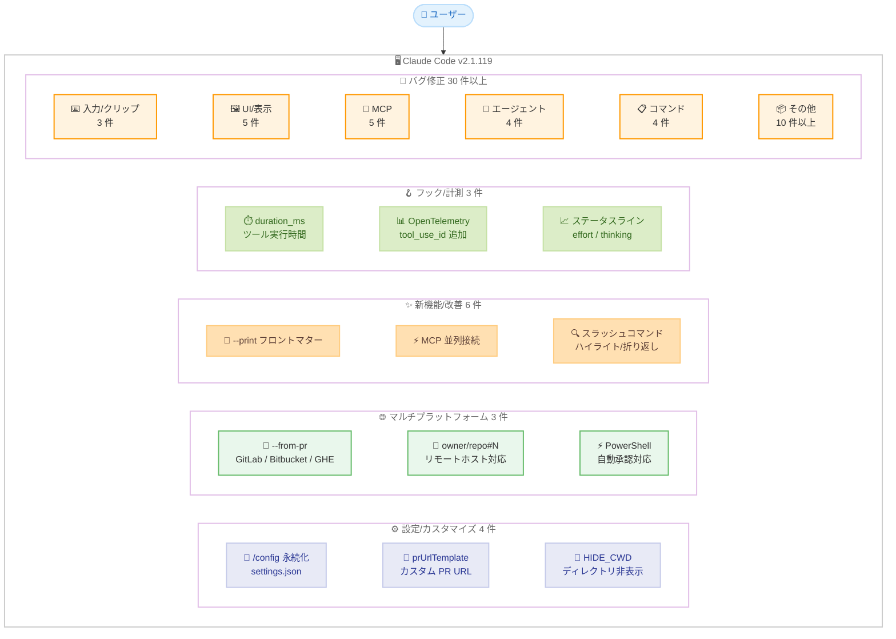
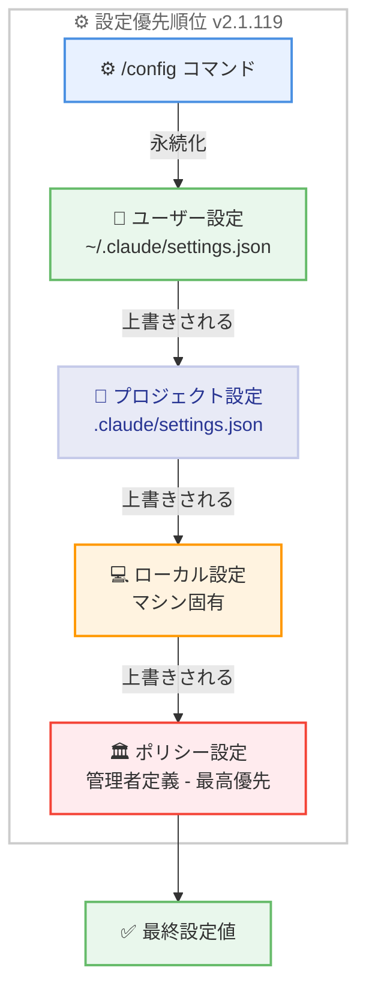
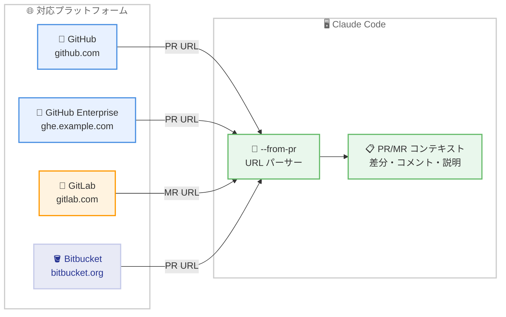

# Claude Code v2.1.119 リリース: 設定永続化、マルチプラットフォーム PR 対応、フックの実行時間計測、大量バグ修正

## メタデータ

| 項目 | 内容 |
|------|------|
| 発表日 | 2026-04-23 |
| ソース | Claude Code Changelog |
| カテゴリ | Claude Code アップデート |
| 公式リンク | https://github.com/anthropics/claude-code/blob/main/CHANGELOG.md |

## 概要

Claude Code v2.1.119 が 2026 年 4 月 23 日にリリースされました。前バージョン v2.1.118 (2026 年 4 月 22 日) から 1 日後のリリースで、新機能/改善 16 件、バグ修正 30 件以上を含む大規模なアップデートです。本リリースでは、`/config` 設定の永続化、`--from-pr` のマルチプラットフォーム対応、フックへの実行時間計測の追加という 3 つの主要な改善が注目されます。

特に `/config` で設定したテーマ、エディタモード、verbose 等の設定が `~/.claude/settings.json` に永続化されるようになり、プロジェクト/ローカル/ポリシーのオーバーライド優先順位にも対応しました。`--from-pr` は GitHub に加えて GitLab マージリクエスト、Bitbucket プルリクエスト、GitHub Enterprise PR URL を受け付けるようになり、マルチプラットフォーム環境での利用が大幅に容易になりました。

バグ修正は 30 件を超え、Windows のクリップボード改行処理、kitty キーボードプロトコル、Glob/Grep ツールの消失、フルスクリーンモードのスクロール、MCP OAuth 接続など多岐にわたる問題が解消されています。

## 詳細

### 背景

Claude Code は Anthropic が提供する CLI ベースの AI 開発支援ツールです。v2.1.119 は前バージョン v2.1.118 での Vim ビジュアルモード追加、カスタムテーマシステム導入、MCP ツールフック新設に続き、設定管理の永続化と統一、マルチプラットフォーム対応の強化、フックシステムの計測機能拡張、そして大量のバグ修正による安定性向上に焦点を当てたリリースです。

v2.1.119 は 46 件以上の変更を含むリリースであり、特に設定管理の改善、クロスプラットフォーム対応、UI/UX の洗練、MCP 接続の安定性向上という 4 つの軸で開発が進められています。

### 主な変更点

#### 設定/カスタマイズ - 4 件

- **`/config` 設定の永続化**: `/config` で設定したテーマ、エディタモード、verbose 等の設定が `~/.claude/settings.json` に永続化されるようになりました。プロジェクト/ローカル/ポリシーのオーバーライド優先順位にも対応し、再起動後も設定が維持されます
- **`prUrlTemplate` 設定の追加**: PR バッジのフッターリンクを github.com ではなくカスタムコードレビュー URL に変更できる `prUrlTemplate` 設定が追加されました
- **`CLAUDE_CODE_HIDE_CWD` 環境変数**: 起動ロゴに表示されるワーキングディレクトリを非表示にする環境変数が追加されました
- **verbose 出力設定の永続化修正**: 再起動後に verbose 出力設定が失われる問題が修正されました

#### マルチプラットフォーム対応 - 3 件

- **`--from-pr` のマルチプラットフォーム対応**: `--from-pr` が GitHub に加えて GitLab マージリクエスト、Bitbucket プルリクエスト、GitHub Enterprise PR URL を受け付けるようになりました
- **`owner/repo#N` リンクのリモートホスト対応**: 出力内の `owner/repo#N` ショートハンドリンクが常に github.com を指すのではなく、git リモートのホストを使用するようになりました
- **PowerShell コマンドの自動承認**: PowerShell ツールコマンドがパーミッションモードで自動承認可能になり、Bash と同等の動作に対応しました

#### 新機能/改善 - 6 件

- **`--print` モードのフロントマター対応**: `--print` モードがエージェントの `tools:` と `disallowedTools:` フロントマターを尊重するようになり、インタラクティブモードと同一の動作になりました
- **`--agent` の `permissionMode` 対応**: `--agent <name>` がビルトインエージェントのエージェント定義の `permissionMode` を尊重するようになりました
- **サブエージェント/SDK MCP サーバーの並列接続**: サブエージェントと SDK MCP サーバーの再構成時にサーバーへの接続がシリアルではなく並列で行われるようになりました
- **プラグインのバージョン制約付き自動更新**: 他のプラグインのバージョン制約で固定されたプラグインが、制約を満たす最高の git タグに自動更新されるようになりました
- **スラッシュコマンドのマッチハイライト**: スラッシュコマンド候補でクエリにマッチした文字がハイライト表示されるようになりました
- **スラッシュコマンドの長い説明文の折り返し**: スラッシュコマンドピッカーで長い説明文が切り詰められるのではなく、2 行目に折り返されるようになりました

#### フック/計測 - 3 件

- **`PostToolUse` / `PostToolUseFailure` に `duration_ms` 追加**: フック入力にツール実行時間 (パーミッションプロンプトと `PreToolUse` フックの時間を除く) が `duration_ms` として含まれるようになりました
- **OpenTelemetry の `tool_use_id` 追加**: `tool_result` と `tool_decision` イベントに `tool_use_id` が追加されました。`tool_result` には `tool_input_size_bytes` も追加されています
- **ステータスラインの `effort.level` と `thinking.enabled`**: stdin JSON に `effort.level` と `thinking.enabled` が含まれるようになりました

#### セキュリティ - 1 件

- **`blockedMarketplaces` の強制適用修正**: `blockedMarketplaces` が `hostPattern` と `pathPattern` エントリを正しく強制するようになりました

#### バグ修正 - 30 件以上

##### 入力/クリップボード修正 - 3 件

- **CRLF ペースト修正**: Windows クリップボードや Xcode コンソールからの CRLF コンテンツのペースト時に各行間に余分な空行が挿入される問題が修正されました
- **kitty プロトコルでの改行消失修正**: kitty キーボードプロトコルシーケンスを使用するターミナルでブラケットペースト内の複数行ペースト時に改行が失われる問題が修正されました
- **`@` ファイル Tab 補完修正**: スラッシュコマンド内で絶対パスを含む `@`-file Tab 補完を使用するとプロンプト全体が置き換わる問題が修正されました

##### ツール/パーミッション修正 - 2 件

- **Glob/Grep ツールの消失修正**: ネイティブ macOS/Linux ビルドで Bash ツールがパーミッションにより拒否された場合に Glob と Grep ツールが消失する問題が修正されました
- **Vertex AI での Tool Search デフォルト無効化**: サポートされていないベータヘッダーエラーを回避するため、Vertex AI ではツール検索がデフォルトで無効化されました (`ENABLE_TOOL_SEARCH` でオプトイン可能)

##### UI/表示修正 - 5 件

- **フルスクリーンスクロール修正**: フルスクリーンモードでスクロールアップ時にツール完了のたびに画面下部にスナップバックする問題が修正されました
- **Rewind オーバーレイの「no prompt」修正**: 画像添付付きメッセージで Rewind オーバーレイに「(no prompt)」と表示される問題が修正されました
- **`/export` のモデル名表示修正**: `/export` がセッションで実際に使用したモデルではなく、現在のデフォルトモデルを表示する問題が修正されました
- **`/usage` プログレスバーの重なり修正**: `/usage` のプログレスバーが「Resets ...」ラベルと重なる問題が修正されました
- **リスト項目の数値折り返し修正**: 文末に数値を含むリスト項目で数値が独自の行に折り返される問題が修正されました

##### MCP 修正 - 5 件

- **MCP HTTP OAuth エラー修正**: OAuth ディスカバリリクエストでサーバーが非 JSON ボディを返した場合に「Invalid OAuth error response」で MCP HTTP 接続が失敗する問題が修正されました
- **MCP サーバー `headers` の環境変数置換修正**: HTTP/SSE/WebSocket MCP サーバーの `headers` 内の `${ENV_VAR}` プレースホルダーがリクエスト送信前に置換されない問題が修正されました
- **MCP OAuth `client_secret_post` 修正**: `--client-secret` で保存された OAuth クライアントシークレットが `client_secret_post` を要求するサーバーへのトークン交換時に送信されない問題が修正されました
- **プラグイン MCP サーバーの Windows 起動修正**: プラグインキャッシュが不完全な場合に Windows でプラグインの MCP サーバーが起動しない問題が修正されました
- **プラグイン `${user_config.*}` 修正**: `${user_config.*}` が省略可能なフィールドの空白を参照した場合にプラグイン MCP サーバーが失敗する問題が修正されました

##### エージェント/プラン修正 - 4 件

- **auto モードの plan モード上書き修正**: auto モードが「Execute immediately」指示で plan モードを上書きする問題が修正されました
- **`/plan` と `/plan open` の既存プラン修正**: `/plan` と `/plan open` がプランモードに入る際に既存のプランに対して動作しない問題が修正されました
- **スキルの再実行修正**: auto コンパクション前に呼び出されたスキルが次のユーザーメッセージに対して再実行される問題が修正されました
- **Agent ツール `isolation: "worktree"` 修正**: `isolation: "worktree"` を使用する Agent ツールが以前のセッションの古いワークツリーを再利用する問題が修正されました

##### Vim/入力モード修正 - 1 件

- **Vim モード Esc キー修正**: INSERT モードで Esc キーを押した際にキューに入ったメッセージが入力フィールドに引き戻される問題が修正されました。もう一度 Esc を押すことで中断できるようになりました

##### スラッシュコマンド修正 - 4 件

- **`/skills` Enter キー修正**: `/skills` で Enter キーを押すとダイアログが閉じるのではなく、`/<skill-name>` がプロンプトにプリフィルされるようになりました
- **`/agents` 詳細ビュー修正**: `/agents` 詳細ビューでサブエージェントが利用不可なビルトインツールが「Unrecognized」と誤表示される問題が修正されました
- **`/reload-plugins` と `/doctor` 修正**: `/reload-plugins` と `/doctor` が無効化されたプラグインのロードエラーを報告する問題が修正されました
- **`/doctor` の MCP サーバー警告修正**: `/doctor` が上位スコープでオーバーライドされた MCP サーバーエントリについて警告する問題が修正されました

##### フック/セッション修正 - 3 件

- **非同期 `PostToolUse` フック修正**: レスポンスペイロードを出力しない非同期 `PostToolUse` フックがセッショントランスクリプトに空のエントリを書き込む問題が修正されました
- **サブエージェントスピナー修正**: サブエージェントタスク通知がキューで孤立した場合にスピナーが止まらない問題が修正されました
- **PR セッション紐付け修正**: git ワークツリーで作業中に PR がセッションにリンクされない問題が修正されました

##### その他の修正 - 3 件

- **`TaskList` のソート順修正**: `TaskList` がタスクをファイルシステムの任意の順序ではなく ID でソートして返すようになりました
- **「GitHub API rate limit exceeded」の誤検知修正**: `gh` 出力の PR タイトルに「rate limit」が含まれている場合に誤って「GitHub API rate limit exceeded」ヒントが表示される問題が修正されました
- **SDK/bridge `read_file` のサイズキャップ修正**: SDK/bridge の `read_file` が成長中のファイルに対してサイズキャップを正しく適用しない問題が修正されました

##### プラットフォーム固有修正 - 3 件

- **macOS Terminal.app の起動時 `p` 文字修正**: Docker または SSH 経由の macOS Terminal.app で起動時にプロンプトに余計な `p` 文字が表示される問題が修正されました
- **Windows MCP config 警告修正**: 「Windows requires 'cmd /c' wrapper」という誤った MCP config 警告が削除されました
- **[VSCode] macOS 音声入力修正**: macOS でマイクパーミッションプロンプト表示中に音声ディクテーションの最初の録音が無音になる問題が修正されました

##### 無効化 MCP サーバー修正 - 1 件

- **無効化 MCP サーバーの表示修正**: 無効化された MCP サーバーが `/status` で「failed」と表示される問題が修正されました

### 技術的な詳細

#### `/config` 設定の永続化アーキテクチャ

v2.1.119 では `/config` コマンドで変更された設定 (テーマ、エディタモード、verbose 等) が `~/.claude/settings.json` に永続化されるようになりました。これにより、Claude Code のセッション間で設定が維持されるだけでなく、プロジェクト、ローカル、ポリシーの 3 段階のオーバーライド優先順位にも対応します。

設定の優先順位は以下のとおりです。

1. **ポリシー設定** (最高優先): 管理者が定義した強制設定
2. **ローカル設定**: マシン固有の設定
3. **プロジェクト設定**: リポジトリ固有の `.claude/settings.json`
4. **ユーザー設定**: `~/.claude/settings.json` (今回永続化の対象)

#### `--from-pr` マルチプラットフォーム対応

従来 `--from-pr` は GitHub PR URL のみを受け付けていましたが、v2.1.119 では以下のプラットフォームに対応しました。

- **GitHub**: `https://github.com/owner/repo/pull/N`
- **GitHub Enterprise**: `https://ghe.example.com/owner/repo/pull/N`
- **GitLab**: `https://gitlab.com/owner/repo/-/merge_requests/N`
- **Bitbucket**: `https://bitbucket.org/owner/repo/pull-requests/N`

これにより、GitHub 以外のプラットフォームを使用するチームも `--from-pr` で PR/MR のコンテキストを活用できるようになります。

#### フックの `duration_ms` フィールド

`PostToolUse` と `PostToolUseFailure` フック入力に `duration_ms` フィールドが追加されました。この値はツールの実際の実行時間を示し、以下の時間は含まれません。

- パーミッションプロンプトの待ち時間
- `PreToolUse` フックの実行時間

これにより、ツールのパフォーマンス監視やボトルネック分析が可能になります。例えば、特定のツールの実行に閾値以上の時間がかかった場合に通知を行うフックを設定できます。

#### MCP サーバーの並列接続

従来、サブエージェントと SDK MCP サーバーの再構成時にサーバーへの接続はシリアル (逐次) で行われていました。v2.1.119 では並列接続に変更され、複数の MCP サーバーを使用する環境での起動時間が短縮されます。

#### Vim モード Esc キーの動作変更

v2.1.118 以前では、INSERT モードで Esc キーを押すとキューに入っていたメッセージが入力フィールドに引き戻されることがありました。v2.1.119 では Esc キーの動作が改善され、最初の Esc で NORMAL モードに遷移し、もう一度 Esc を押すことで処理の中断が可能になりました。

## 開発者への影響

### 対象

- **全ての Claude Code ユーザー**: `/config` 設定の永続化により、再起動後も設定が維持されます
- **GitHub 以外のプラットフォーム利用者**: `--from-pr` が GitLab、Bitbucket、GitHub Enterprise に対応し、マルチプラットフォーム環境でのワークフローが改善されます
- **フック/自動化利用者**: `duration_ms` による実行時間計測が可能になり、パフォーマンス監視やアラートの設定が容易になりました
- **カスタムコードレビューツール利用者**: `prUrlTemplate` 設定により PR バッジのリンク先をカスタマイズできます
- **MCP サーバー利用者**: OAuth 接続、環境変数置換、プラグインの起動に関する複数の修正が適用されました
- **Vim モード利用者**: Esc キーの動作が改善され、メッセージの意図しない引き戻しが防止されます
- **Windows ユーザー**: CRLF ペースト問題、MCP config の誤警告、プラグイン MCP サーバーの起動問題が修正されました
- **Vertex AI 利用者**: Tool Search がデフォルト無効化され、ベータヘッダーエラーが回避されます

### 必要なアクション

以下のコマンドで最新バージョンに更新できます。

```bash
# npm でのアップデート
npm update -g @anthropic-ai/claude-code

# Homebrew でのアップデート
brew upgrade claude-code

# 現在のバージョン確認
claude --version
```

**確認が推奨される項目:**

- **設定の永続化確認**: `/config` で設定を変更し、再起動後も維持されることを確認してください
- **`--from-pr` のプラットフォーム確認**: GitLab や Bitbucket を使用している場合、`--from-pr` にマージリクエスト/プルリクエスト URL を渡して動作を確認してください
- **Vertex AI 環境でのツール検索**: Vertex AI を使用している場合、ツール検索がデフォルト無効化されていることに注意してください。必要な場合は `ENABLE_TOOL_SEARCH` 環境変数でオプトインできます
- **フックの `duration_ms` 活用**: `PostToolUse` フックを使用している場合、`duration_ms` フィールドを活用したパフォーマンス監視の設定を検討してください

### 移行ガイド

#### Vertex AI でのツール検索

v2.1.119 以降、Vertex AI ではツール検索がデフォルト無効化されました。引き続きツール検索を使用する場合は、環境変数を設定してください。

```bash
# Vertex AI でツール検索を有効化
export ENABLE_TOOL_SEARCH=1
```

#### `prUrlTemplate` の設定

カスタムコードレビューツールを使用している場合、`prUrlTemplate` を設定して PR バッジのリンク先をカスタマイズできます。

```json
{
  "prUrlTemplate": "https://review.example.com/repos/${owner}/${repo}/pulls/${number}"
}
```

## コード例

### アップデートとバージョン確認

```bash
# Claude Code を最新バージョンに更新
npm update -g @anthropic-ai/claude-code

# バージョン確認
claude --version
# Claude Code v2.1.119
```

### `/config` 設定の永続化

```bash
# /config で設定を変更 (セッション間で永続化される)
> /config

# 設定は以下に保存される
# ~/.claude/settings.json
```

### `--from-pr` のマルチプラットフォーム使用

```bash
# GitHub PR
claude --from-pr https://github.com/owner/repo/pull/123

# GitLab マージリクエスト
claude --from-pr https://gitlab.com/owner/repo/-/merge_requests/456

# Bitbucket プルリクエスト
claude --from-pr https://bitbucket.org/owner/repo/pull-requests/789

# GitHub Enterprise PR
claude --from-pr https://ghe.example.com/owner/repo/pull/101
```

### フックでの `duration_ms` 活用

```json
{
  "hooks": {
    "PostToolUse": [
      {
        "type": "command",
        "command": "if [ \"$TOOL_DURATION_MS\" -gt 30000 ]; then echo 'Tool took over 30s'; fi"
      }
    ]
  }
}
```

### `CLAUDE_CODE_HIDE_CWD` の使用

```bash
# 起動ロゴのワーキングディレクトリを非表示
export CLAUDE_CODE_HIDE_CWD=1
claude
```

### MCP サーバーの環境変数置換

```json
{
  "mcpServers": {
    "my-server": {
      "type": "http",
      "url": "https://api.example.com/mcp",
      "headers": {
        "Authorization": "Bearer ${API_TOKEN}"
      }
    }
  }
}
```

## アーキテクチャ図

### v2.1.119 主要変更の全体像



### 設定優先順位アーキテクチャ



### `--from-pr` マルチプラットフォーム対応



## 関連リンク

- [Claude Code Changelog](https://github.com/anthropics/claude-code/blob/main/CHANGELOG.md)
- [Claude Code GitHub リポジトリ](https://github.com/anthropics/claude-code)
- [Claude Code npm パッケージ](https://www.npmjs.com/package/@anthropic-ai/claude-code)
- [Claude Code ドキュメント](https://docs.anthropic.com/en/docs/claude-code)
- [Claude Code v2.1.118 レポート](./2026-04-22-claude-code-v2-1-118.md)
- [Claude Code v2.1.117 レポート](./2026-04-21-claude-code-v2-1-117.md)

## まとめ

Claude Code v2.1.119 は、新機能/改善 16 件、バグ修正 30 件以上を含む大規模なリリースです。変更は大きく 4 つのテーマにまとめられます。

第一に、**設定管理の永続化と統一** です。`/config` で設定したテーマ、エディタモード、verbose 等が `~/.claude/settings.json` に永続化され、プロジェクト/ローカル/ポリシーのオーバーライド優先順位に参加するようになりました。`prUrlTemplate` によるカスタム PR URL、`CLAUDE_CODE_HIDE_CWD` による起動ロゴのカスタマイズなど、環境に合わせた柔軟な設定が可能になっています。

第二に、**マルチプラットフォーム対応の強化** です。`--from-pr` が GitHub に加えて GitLab マージリクエスト、Bitbucket プルリクエスト、GitHub Enterprise PR URL を受け付けるようになり、`owner/repo#N` リンクも git リモートのホストを使用するようになりました。PowerShell コマンドの自動承認対応も含め、多様な開発環境での利用が容易になっています。

第三に、**フック/計測システムの拡充** です。`PostToolUse` と `PostToolUseFailure` フック入力への `duration_ms` 追加により、ツール実行時間の計測が可能になりました。OpenTelemetry イベントへの `tool_use_id` と `tool_input_size_bytes` の追加、ステータスラインへの `effort.level` と `thinking.enabled` の追加と合わせて、Claude Code の運用監視と分析基盤が強化されています。

第四に、**30 件を超える大量バグ修正による安定性向上** です。Windows クリップボードの CRLF 処理、kitty プロトコルでの改行消失、Glob/Grep ツールの消失、フルスクリーンモードのスクロール、MCP OAuth 接続エラー、auto モードと plan モードの競合、スラッシュコマンドの動作不良、プラグイン MCP サーバーの起動問題など、あらゆる領域にわたる問題が解消されています。

全ての Claude Code ユーザーに対してアップデートを推奨します。特に GitLab や Bitbucket を使用しているチームは `--from-pr` のマルチプラットフォーム対応の恩恵を受けられます。フックを活用した自動化を行っているユーザーは `duration_ms` によるパフォーマンス監視の導入を検討してください。
