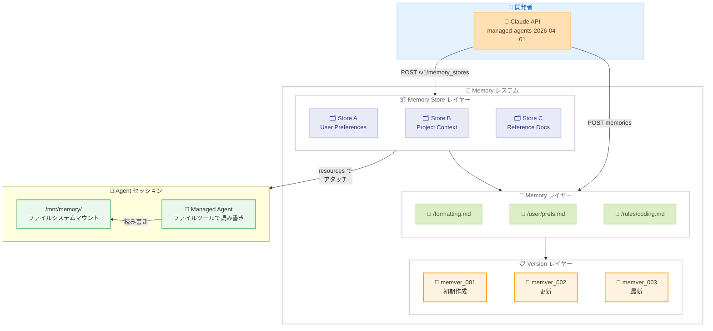
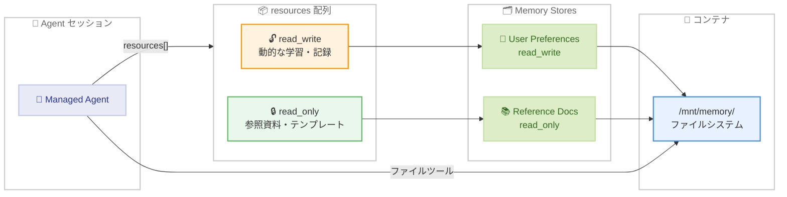

# Claude Managed Agents Memory がパブリックベータとして公開 -- セッション横断の記憶保持が API で利用可能に

## メタデータ

| 項目 | 内容 |
|------|------|
| 発表日 | 2026-04-23 |
| ソース | [Claude API Release Notes](https://platform.claude.com/docs/en/release-notes/overview) |
| カテゴリ | Claude API アップデート |
| 公式リンク | [Using Agent Memory](https://platform.claude.com/docs/en/managed-agents/memory) |

## 概要

2026 年 4 月 23 日、Anthropic は Claude Managed Agents 向けの Memory 機能をパブリックベータとして公開しました。標準の `managed-agents-2026-04-01` ヘッダーで利用可能です。

Memory 機能により、Managed Agents はセッションを跨いで情報を保持できるようになります。ユーザーの好み、プロジェクトの慣例、過去のミス、ドメイン固有のコンテキストなど、エージェントが学習した知識を永続化し、次回以降のセッションで活用できます。

Memory Store はワークスペーススコープのテキストドキュメントコレクションとして構成され、セッションのコンテナ内に `/mnt/memory/` ディレクトリとしてマウントされます。エージェントは標準のファイルツールで読み書きを行い、すべての変更はイミュータブルなバージョンとして記録されるため、完全な監査証跡が確保されます。

## 詳細

### 背景

従来の Managed Agents はセッションごとに独立しており、前回のセッションで得た知識や学びを次回に引き継ぐ手段がありませんでした。開発者がエージェントに継続的な記憶を持たせるには、外部データベースや独自のストレージソリューションを構築する必要がありました。

Memory 機能はこの課題を解決するために設計されたファーストパーティのソリューションです。Memory Store を作成し、セッションにアタッチするだけで、エージェントがセッション横断で情報を読み書きできるようになります。各メモリの変更はバージョン管理され、楽観的並行性制御 (Optimistic Concurrency) によるセーフな更新もサポートされています。

### 主な変更点

1. **Memory Store の導入**: ワークスペーススコープのテキストドキュメントコレクションを作成可能。Claude に最適化されたストレージとして、エージェントが自然にファイルとして読み書きできる形式を採用
2. **セッションへのアタッチ**: `resources[]` 配列で Memory Store をセッションに接続。`read_write` または `read_only` のアクセスレベルを指定可能
3. **イミュータブルバージョン管理**: すべての変更が `memver_...` プレフィックスのバージョンとして記録され、30 日間の履歴を保持
4. **楽観的並行性制御**: `content_sha256` プリコンディションによるセーフなコンテンツ編集をサポート
5. **多言語 SDK 対応**: Python、TypeScript、Go、Java、C#、PHP、Ruby の各 SDK および `ant` CLI で利用可能

### 技術的な詳細

#### Memory Store のアーキテクチャ

Memory Store は以下の階層構造で構成されます。

- **Memory Store**: 組織あたり最大 1,000 個作成可能なワークスペーススコープのコレクション。名前と説明を持ち、説明はシステムプロンプトに自動的に追加される
- **Memory**: 各ストア内に最大 2,000 個保存可能なテキストドキュメント。パスで識別され、1 つあたり最大 100 kB
- **Memory Version**: メモリの各変更を記録するイミュータブルなスナップショット。`memver_...` プレフィックスの ID で管理され、30 日間保持

#### API オペレーション

Memory Store の操作は以下の API エンドポイントで行います。

| オペレーション | エンドポイント | 説明 |
|---------------|--------------|------|
| ストア作成 | `POST /v1/memory_stores` | 名前と説明を指定して作成 |
| メモリ作成 | `POST /v1/memory_stores/{id}/memories` | パスとコンテンツを指定して作成 |
| メモリ一覧 | `GET /v1/memory_stores/{id}/memories` | `path_prefix` と `depth` でフィルタ可能 |
| メモリ取得 | `GET /v1/memory_stores/{id}/memories/{path}` | 特定パスのメモリを取得 |
| メモリ更新 | `PUT /v1/memory_stores/{id}/memories/{path}` | コンテンツを更新 |
| メモリ削除 | `DELETE /v1/memory_stores/{id}/memories/{path}` | メモリを削除 |
| バージョン一覧 | `GET /v1/memory_stores/{id}/versions` | 変更履歴を取得 |
| バージョン取得 | `GET /v1/memory_stores/{id}/versions/{ver}` | 特定バージョンを取得 |
| バージョン墨消し | `POST /v1/memory_stores/{id}/versions/{ver}/redact` | 機密情報を墨消し |

#### セッションへのアタッチ

Memory Store はセッション作成時に `resources[]` 配列で指定してアタッチします。

- **type**: `memory_store` を指定
- **memory_store_id**: アタッチする Memory Store の ID
- **access**: `read_write` (デフォルト) または `read_only`
- **instructions**: エージェントへの指示文 (最大 4,096 文字)

アタッチされた Memory Store はセッションのコンテナ内に `/mnt/memory/` ディレクトリとしてマウントされ、エージェントは標準のファイルツール (agent toolset が必要) で読み書きを行います。

#### 制限事項

| 制限項目 | 値 |
|---------|-----|
| 組織あたりの Memory Store 数 | 1,000 |
| ストアあたりのメモリ数 | 2,000 |
| ストアあたりの総容量 | 100 MB |
| 1 メモリあたりのサイズ | 100 kB |
| バージョン履歴の保持期間 | 30 日 |
| セッションあたりの Memory Store 数 | 8 |
| アタッチ時の instructions フィールド | 4,096 文字 |

#### セキュリティに関する重要な注意事項

Memory Store はデフォルトで `read_write` アクセスでアタッチされます。エージェントが信頼されていない入力を処理する場合、プロンプトインジェクションによって悪意のあるコンテンツが Memory Store に書き込まれるリスクがあります。

**推奨されるアクセスレベルの使い分け:**

| アクセスレベル | 用途 | リスク |
|--------------|------|--------|
| `read_write` | ユーザー固有の学習、動的な知識蓄積 | プロンプトインジェクションによる汚染リスクあり |
| `read_only` | 参照資料、静的なガイドライン、テンプレート | 書き込み不可のため汚染リスクなし |

信頼されていないユーザー入力を処理するエージェントでは、参照用の Memory Store には必ず `read_only` を指定することが推奨されます。

## 開発者への影響

### 対象

- **Managed Agents を利用する開発者**: セッション横断の記憶保持機能を活用して、より高度なエージェント体験を構築可能
- **カスタマーサポート向けエージェントの開発者**: ユーザーの過去のやり取りや好みを記憶し、パーソナライズされた対応を実現
- **ドメイン固有のエージェントを構築する開発者**: プロジェクトの慣例、コーディング規約、ビジネスルールなどを Memory Store に格納して一貫性のある出力を実現
- **セキュリティを重視する開発者**: `read_only` と `read_write` のアクセス制御により、エージェントの権限を適切に管理

### 必要なアクション

1. **ベータヘッダーの確認**: `managed-agents-2026-04-01` ヘッダーが設定されていることを確認
2. **Memory Store の設計**: エージェントに記憶させたい情報の種類とパス構造を設計
3. **アクセスレベルの検討**: 各 Memory Store に対して `read_write` と `read_only` のどちらが適切か、セキュリティ要件に基づいて判断
4. **既存エージェントへの統合**: 既存の Managed Agents セッションに Memory Store をアタッチして、セッション横断の記憶を有効化

### 移行ガイド

Memory 機能は新規追加であるため、破壊的変更はありません。既存の Managed Agents アプリケーションに段階的に導入できます。

**導入ステップ:**

1. Memory Store を作成し、初期コンテンツをシードする
2. セッション作成時に `resources[]` 配列で Memory Store をアタッチする
3. エージェントの指示文に Memory Store の活用方法を記述する
4. バージョン履歴を監視して、エージェントの書き込み内容を検証する

## コード例

### Python: Memory Store の作成からセッションアタッチまで

```python
import anthropic

client = anthropic.Anthropic()

# 1. Memory Store を作成
store = client.beta.memory_stores.create(
    name="User Preferences",
    description="Per-user preferences and project context.",
)

print(f"Memory Store created: {store.id}")

# 2. 初期コンテンツをシード
client.beta.memory_stores.memories.create(
    store.id,
    path="/formatting_standards.md",
    content="All reports use GAAP formatting. Dates are ISO-8601...",
)

client.beta.memory_stores.memories.create(
    store.id,
    path="/user/preferences.md",
    content="Preferred language: Japanese\nTimezone: Asia/Tokyo\n",
)

# 3. セッションに Memory Store をアタッチ
session = client.beta.sessions.create(
    agent=agent.id,
    environment_id=environment.id,
    resources=[
        {
            "type": "memory_store",
            "memory_store_id": store.id,
            "access": "read_write",
            "instructions": (
                "User preferences and project context. "
                "Check before starting any task."
            ),
        }
    ],
)

print(f"Session created with memory: {session.id}")
```

### Python: read_only アクセスでの参照資料アタッチ

```python
# 参照資料用のストアを read_only でアタッチ (セキュリティ推奨)
session = client.beta.sessions.create(
    agent=agent.id,
    environment_id=environment.id,
    resources=[
        {
            "type": "memory_store",
            "memory_store_id": reference_store.id,
            "access": "read_only",
            "instructions": "Reference documentation. Do not attempt to modify.",
        },
        {
            "type": "memory_store",
            "memory_store_id": learning_store.id,
            "access": "read_write",
            "instructions": "Store learned preferences and patterns here.",
        },
    ],
)
```

### Python: メモリの一覧取得とバージョン管理

```python
# メモリの一覧取得 (パスプレフィックスでフィルタ)
memories = client.beta.memory_stores.memories.list(
    store.id,
    path_prefix="/user/",
    depth=2,
)

for memory in memories:
    print(f"  {memory.path}: {len(memory.content)} bytes")

# バージョン履歴の取得 (監査証跡)
versions = client.beta.memory_stores.versions.list(store.id)

for version in versions:
    print(f"  {version.id}: {version.created_at}")
```

### Python: 楽観的並行性制御によるセーフな更新

```python
import hashlib

# 現在のメモリを取得
memory = client.beta.memory_stores.memories.retrieve(
    store.id,
    path="/user/preferences.md",
)

# コンテンツの SHA256 ハッシュを計算
content_hash = hashlib.sha256(memory.content.encode()).hexdigest()

# ハッシュをプリコンディションとして指定して更新
# 他のプロセスが同時に更新した場合はエラーになる
client.beta.memory_stores.memories.update(
    store.id,
    path="/user/preferences.md",
    content="Updated preferences...",
    content_sha256=content_hash,
)
```

## アーキテクチャ図

### Memory Store の全体アーキテクチャ



### セッションアタッチとアクセス制御



### セキュリティ: プロンプトインジェクションのリスク

```mermaid
flowchart TD
    subgraph SafeFlow["✅ 安全なフロー"]
        TrustedInput["👤 信頼された入力"]
        RWAgent1["🤖 Agent<br/>read_write"]
        MemWrite["📝 正常な書き込み"]

        TrustedInput --> RWAgent1
        RWAgent1 --> MemWrite
    end

    subgraph RiskFlow["⚠️ リスクのあるフロー"]
        UntrustedInput["❓ 信頼されていない入力"]
        RWAgent2["🤖 Agent<br/>read_write"]
        Injection["💉 プロンプトインジェクション<br/>悪意のあるコンテンツ書き込み"]

        UntrustedInput --> RWAgent2
        RWAgent2 --> Injection
    end

    subgraph Mitigation["🛡️ 緩和策"]
        ROAgent["🤖 Agent<br/>read_only"]
        Blocked["🚫 書き込みブロック"]

        UntrustedInput2["❓ 信頼されていない入力"] --> ROAgent
        ROAgent --> Blocked
    end

    classDef platform fill:none,stroke:#CCCCCC,stroke-width:2px,color:#666666
    classDef safe fill:#E9F7EC,stroke:#66BB6A,stroke-width:2px,color:#333333
    classDef risk fill:#FFEBEE,stroke:#F44336,stroke-width:2px,color:#333333
    classDef warning fill:#FFF3E0,stroke:#FF9800,stroke-width:2px,color:#333333
    classDef mitigation fill:#E8F1FF,stroke:#4A90E2,stroke-width:2px,color:#333333

    class SafeFlow,RiskFlow,Mitigation platform
    class TrustedInput,RWAgent1,MemWrite safe
    class UntrustedInput,RWAgent2,Injection risk
    class UntrustedInput2 warning
    class ROAgent,Blocked mitigation
```



## 関連リンク

- [Using Agent Memory](https://platform.claude.com/docs/en/managed-agents/memory) - Memory 機能の公式ドキュメント
- [Claude API Release Notes](https://platform.claude.com/docs/en/release-notes/overview) - API リリースノート
- [Managed Agents Overview](https://platform.claude.com/docs/en/managed-agents/overview) - Managed Agents の概要
- [Anthropic SDK](https://github.com/anthropics) - Python、TypeScript、Go 等の公式 SDK

## まとめ

Claude Managed Agents の Memory 機能がパブリックベータとして公開されました。`managed-agents-2026-04-01` ヘッダーで利用可能なこの機能により、エージェントはセッションを跨いでユーザーの好み、プロジェクト慣例、過去の学びなどを永続化できるようになります。

技術的には、Memory Store はワークスペーススコープのテキストドキュメントコレクションとして構成され、セッションのコンテナ内に `/mnt/memory/` としてマウントされます。エージェントは標準のファイルツールで読み書きを行うため、特別な API を学習する必要がありません。すべての変更はイミュータブルなバージョン (`memver_...`) として記録され、30 日間の監査証跡が確保されます。楽観的並行性制御 (`content_sha256` プリコンディション) により、複数セッションからの同時更新も安全に処理できます。

セキュリティ面では、Memory Store がデフォルトで `read_write` アクセスでアタッチされる点に注意が必要です。信頼されていない入力を処理するエージェントでは、プロンプトインジェクションによる Memory Store の汚染リスクがあるため、参照資料には `read_only` アクセスを指定することが強く推奨されます。

Python、TypeScript、Go、Java、C#、PHP、Ruby の各 SDK および `ant` CLI で利用可能であり、既存の Managed Agents アプリケーションに段階的に導入できます。セッション横断の記憶保持を必要とするユースケース -- カスタマーサポート、コード生成、ドメイン特化型エージェントなど -- に対して、大幅な体験向上が期待できます。
