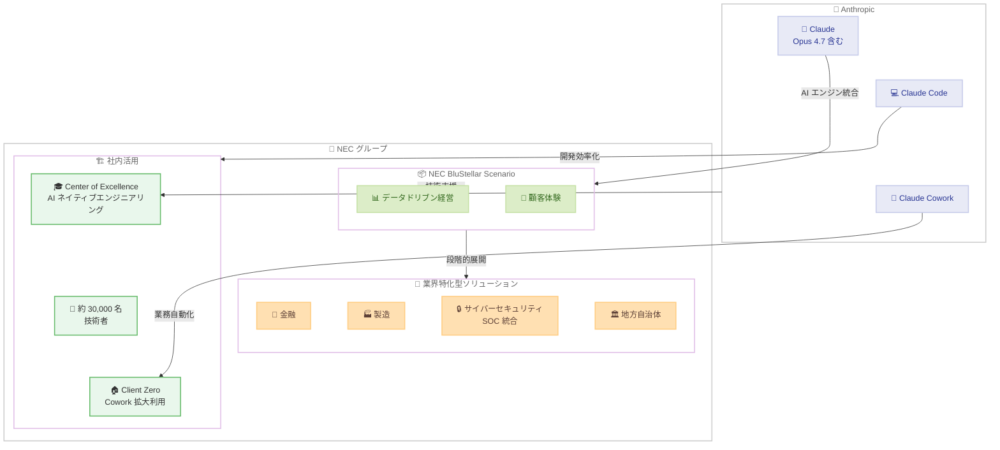

# Anthropic と NEC が戦略的提携 -- 日本最大規模の AI エンジニアリング組織を構築

## メタデータ

| 項目 | 内容 |
|------|------|
| 発表日 | 2026-04-24 |
| ソース | [Anthropic News](https://www.anthropic.com/news) |
| カテゴリ | Announcements / パートナーシップ |
| 公式リンク | [Anthropic and NEC collaborate to build Japan's largest AI engineering workforce](https://www.anthropic.com/news/anthropic-nec) |

## 概要

2026 年 4 月 24 日、Anthropic と NEC は戦略的パートナーシップを発表しました。NEC は Anthropic の初の日本拠点グローバルパートナーとなり、NEC グループ全体の約 30,000 名の従業員に Claude を展開して、日本最大規模の AI エンジニアリング組織を構築します。

この提携は、社内の AI ネイティブエンジニアリングチーム構築にとどまらず、金融、製造、サイバーセキュリティ、地方自治体向けのセキュアな業界特化型 AI プロダクトの共同開発にも及びます。NEC の統合 IT サービスプラットフォームである BluStellar Scenario に Claude (Opus 4.7 含む) と Claude Code を統合し、段階的に展開していく計画です。

## 詳細

### 背景

日本の IT 業界では、AI 技術の導入が加速する一方、AI を実務で活用できるエンジニア人材の不足が深刻な課題となっています。NEC は日本を代表する IT サービス企業として、幅広い業界の顧客に対してソリューションを提供しており、グループ全体で大規模な技術者集団を擁しています。

Anthropic は Claude の日本市場での展開を進めており、日本語対応の強化や国内パートナーとの協業を拡大してきました。今回の NEC との提携は、Anthropic にとって日本拠点の企業との初のグローバルパートナーシップであり、日本市場における AI 普及の重要なマイルストーンとなります。

### 主な提携内容

1. **約 30,000 名への Claude 展開**: NEC グループ全体の従業員に Claude を導入し、日常業務から高度なエンジニアリング作業まで AI を活用できる環境を整備
2. **Center of Excellence の設立**: Anthropic からの技術支援とトレーニングを受けて、AI ネイティブエンジニアリングチームを構築。Claude Code を活用したソフトウェア開発の高度化を推進
3. **業界特化型 AI プロダクトの共同開発**: 金融、製造、サイバーセキュリティ、地方自治体向けにセキュアな AI ソリューションを開発
4. **セキュリティ統合**: NEC のセキュリティオペレーションセンター (SOC) サービスに Claude を統合し、次世代サイバーセキュリティサービスを構築
5. **NEC BluStellar Scenario への統合**: Claude (Opus 4.7 含む) と Claude Code を NEC の統合プラットフォームに組み込み、データドリブン経営と顧客体験領域から段階的に展開
6. **Claude Cowork の社内活用**: Client Zero イニシアティブの一環として、社内業務全体で Claude Cowork を拡大利用

### 技術的な詳細

#### NEC BluStellar Scenario への統合

NEC BluStellar Scenario は NEC が提供する統合 IT サービスプラットフォームです。今回の提携では、以下の Claude 製品群が統合されます。

| 製品 | 用途 |
|------|------|
| Claude (Opus 4.7 含む) | BluStellar Scenario のコア AI エンジンとして統合 |
| Claude Code | ソフトウェア開発の自動化と効率化 |
| Claude Cowork | 社内業務のワークフロー自動化 |

展開は段階的に行われ、まずデータドリブン経営と顧客体験の領域から開始し、順次対象領域を拡大していく計画です。

#### セキュリティ統合

NEC の SOC サービスに Claude を統合することで、以下の領域での高度化が期待されます。

- **脅威検知の自動化**: Claude による大量のセキュリティログの分析と異常検知
- **インシデント対応の迅速化**: AI を活用したインシデントのトリアージと対応支援
- **次世代サイバーセキュリティサービス**: Claude の高度な推論能力を活用した新しいセキュリティサービスの開発

#### Center of Excellence

Anthropic からの直接的な技術支援とトレーニングにより、NEC 内部に AI エンジニアリングの専門チームを構築します。

- **Claude Code の活用**: 開発者が Claude Code を日常的に使用し、ソフトウェア開発プロセスを変革
- **Anthropic からの技術支援**: ベストプラクティスの共有、トレーニングプログラムの提供
- **AI ネイティブエンジニアリング**: 約 30,000 名の技術者が AI を前提とした開発手法を習得

## 開発者への影響

### 対象

- **NEC グループの開発者**: 約 30,000 名の技術者が Claude と Claude Code を業務で活用できるようになり、開発プロセスの大幅な効率化が期待される
- **NEC の顧客企業**: 金融、製造、サイバーセキュリティ、地方自治体分野の顧客が、Claude を活用した業界特化型 AI ソリューションを利用可能に
- **日本市場の開発者**: 日本最大規模の AI エンジニアリング組織の構築により、AI 開発の知見やベストプラクティスが日本市場全体に波及する可能性

### 必要なアクション

1. **NEC グループ内の開発者**: Center of Excellence が提供するトレーニングプログラムを活用し、Claude と Claude Code の効果的な利用方法を習得
2. **NEC の顧客企業**: NEC BluStellar Scenario を通じた Claude 統合ソリューションの利用を検討。特にデータドリブン経営と顧客体験の領域から段階的に導入を開始
3. **セキュリティ担当者**: NEC の SOC サービスにおける Claude 統合の恩恵を受けるため、次世代サイバーセキュリティサービスの情報を NEC から取得

## アーキテクチャ図

### Anthropic - NEC 提携の全体像

## 関連リンク

- [Anthropic and NEC collaborate to build Japan's largest AI engineering workforce](https://www.anthropic.com/news/anthropic-nec) - 公式発表
- [Anthropic News](https://www.anthropic.com/news) - Anthropic ニュース一覧
- [Claude Opus 4.7 発表レポート](./2026-04-16-claude-opus-4-7.md) - Opus 4.7 に関する詳細
- [Claude Cowork GA レポート](./2026-04-09-claude-cowork-ga.md) - Claude Cowork の一般提供開始に関する詳細

## まとめ

Anthropic と NEC の戦略的パートナーシップにより、NEC は Anthropic の初の日本拠点グローバルパートナーとなりました。NEC グループ全体の約 30,000 名の従業員に Claude を展開し、日本最大規模の AI エンジニアリング組織を構築する計画です。

この提携の核心は、単なるツール導入ではなく、組織全体の AI ネイティブ化にあります。Center of Excellence を設立し、Anthropic からの直接的な技術支援とトレーニングを受けて、Claude Code を活用したソフトウェア開発の変革を推進します。また、Client Zero イニシアティブとして Claude Cowork を社内業務全体に拡大展開し、NEC 自身が AI 活用の最前線に立ちます。

顧客向けには、NEC BluStellar Scenario に Claude (Opus 4.7 含む) と Claude Code を統合し、データドリブン経営と顧客体験の領域から段階的に展開します。さらに、金融、製造、サイバーセキュリティ、地方自治体向けのセキュアな業界特化型 AI プロダクトを共同開発し、NEC の SOC サービスにも Claude を統合して次世代サイバーセキュリティサービスを構築します。

NEC の吉崎敏文執行役 COO は「この Anthropic との長期的なパートナーシップにより、日本市場における AI のポテンシャルを最大化できる」とコメントしており、日本の企業 AI 活用における大きな転換点となることが期待されます。
