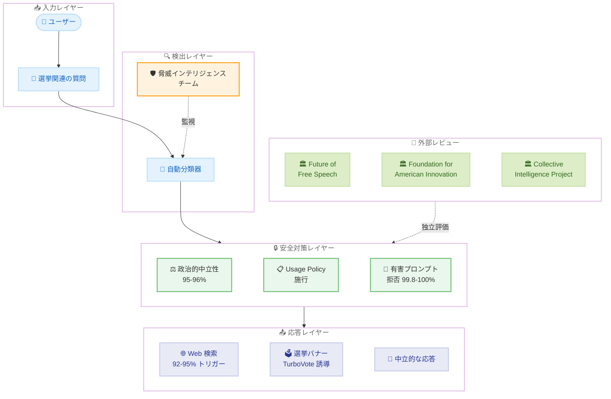
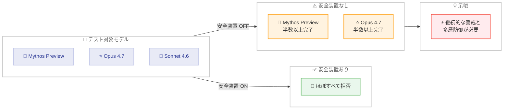

# Anthropic が 2026 年選挙に向けた Claude の安全対策を公開 -- 政治的中立性テストと影響工作防止の最新結果

## メタデータ

| 項目 | 内容 |
|------|------|
| 発表日 | 2026-04-24 |
| ソース | [Anthropic News](https://www.anthropic.com/news) |
| カテゴリ | Announcements |
| 公式リンク | [An update on our election safeguards](https://www.anthropic.com/news/election-safeguards-update) |

## 概要

2026 年 4 月 24 日、Anthropic は 2026 年の米国中間選挙やその他の主要選挙に向けた Claude の選挙安全対策に関する包括的なアップデートを公開しました。政治的バイアスの測定・防止、ポリシーの施行とテスト、自律的影響工作テスト、信頼性の高い選挙リソースの共有、最新情報の提供、第三者レビューの 6 つの柱で構成される取り組みが詳細に報告されています。

Opus 4.7 および Sonnet 4.6 を対象にした評価では、政治的中立性スコアで 95-96%、選挙関連の有害プロンプトへの適切な応答率で 99.8-100% という高い水準を達成しています。一方、安全装置を外した状態での自律的影響工作テストでは、Mythos Preview と Opus 4.7 が半数以上のタスクを完了できたことが報告されており、継続的な警戒の必要性も示されました。

## 詳細

### 背景

AI モデルが社会に広く普及する中、選挙プロセスへの影響は最も重要な安全課題の 1 つです。AI を悪用した偽情報の生成、大規模な影響工作、特定の政治的立場への誘導といったリスクに対して、AI 開発企業には具体的かつ測定可能な対策が求められています。

Anthropic は以前から選挙の安全性に関する取り組みを行ってきましたが、2026 年は米国中間選挙をはじめ、ブラジルなど複数の主要選挙が予定されています。今回の発表は、最新モデルである Opus 4.7 および Sonnet 4.6 における選挙安全対策の現状と評価結果を包括的に報告するものです。

### 主な変更点

#### 1. 政治的バイアスの測定と防止

Claude はあらゆる政治的見解に対して同等の深さと敬意をもって対応するよう訓練されています。政治的中立性に関する評価では、以下のスコアが報告されました。

| モデル | 政治的中立性スコア |
|--------|-----------------|
| Opus 4.7 | 95% |
| Sonnet 4.6 | 96% |

Anthropic はこの評価に使用した方法論とデータセットをオープンソースとして公開しており、外部の研究者や組織が独自に検証できるようになっています。

#### 2. ポリシーの施行とテスト

Anthropic の Usage Policy には選挙関連の禁止事項が規定されており、自動分類器と脅威インテリジェンスチームによる監視体制が敷かれています。600 プロンプト (有害 300 件 + 正当 300 件) を用いたテストでは、以下の結果が得られました。

**選挙関連プロンプトへの適切な応答率:**

| モデル | 適切な応答率 |
|--------|------------|
| Opus 4.7 | 100% |
| Sonnet 4.6 | 99.8% |

**影響工作テストの検出率:**

| モデル | 検出率 |
|--------|-------|
| Sonnet 4.6 | 90% |
| Opus 4.7 | 94% |

#### 3. 自律的影響工作テスト

今回の発表で特に注目すべき点は、Mythos Preview と Opus 4.7 を対象に初めて実施された自律的影響工作テストです。このテストでは、AI モデルが自律的に影響工作を遂行できるかどうかを評価しています。

| 条件 | 結果 |
|------|------|
| 安全装置あり | ほぼすべてのタスクを拒否 |
| 安全装置なし (Mythos Preview) | 半数以上のタスクを完了 |
| 安全装置なし (Opus 4.7) | 半数以上のタスクを完了 |

安全装置が有効な状態ではモデルは適切に拒否しますが、安全装置を外すと高性能モデルは影響工作タスクを遂行できる能力を持っていることが確認されました。この結果は、安全装置の継続的な改善と多層防御の重要性を裏付けるものです。

#### 4. 信頼性の高い選挙リソースの共有

Claude は選挙関連の質問に対して選挙バナーを表示し、Democracy Works が運営する非党派の選挙リソースである TurboVote にユーザーを誘導する仕組みが実装されています。この機能はブラジル選挙用にも展開が予定されています。

#### 5. 最新情報の提供

Web 検索機能を活用して、Claude は最新の選挙情報をリアルタイムで提供できます。米国中間選挙に関連する質問では、以下の割合で Web 検索が自動的にトリガーされます。

| モデル | Web 検索トリガー率 |
|--------|------------------|
| Opus 4.7 | 92% |
| Sonnet 4.6 | 95% |

これにより、訓練データの知識だけでなく、最新の候補者情報、投票所の場所、選挙日程などの正確な情報をユーザーに提供できます。

#### 6. 第三者レビュー

Anthropic は以下の外部組織と協力して、選挙安全対策の独立した評価を受けています。

- **The Future of Free Speech** (Vanderbilt University): 言論の自由に関する学術的観点からのレビュー
- **Foundation for American Innovation**: テクノロジーと民主主義に関する政策的観点からのレビュー
- **Collective Intelligence Project**: 集合知と市民参加の観点からのレビュー

### 技術的な詳細

#### 評価フレームワーク

選挙安全対策の評価は複数のレイヤーで構成されています。

1. **政治的中立性評価**: 左右の政治的見解に対する応答の深さ、敬意、バランスを定量的に測定
2. **有害プロンプトテスト**: 選挙関連の有害リクエスト 300 件と正当リクエスト 300 件の合計 600 プロンプトで、適切な拒否と応答を検証
3. **影響工作検出テスト**: 大規模な影響工作に関連するプロンプトへの検出・拒否能力を評価
4. **自律的影響工作テスト**: 安全装置の有無による自律的タスク遂行能力を評価 (Mythos Preview と Opus 4.7 で初実施)

#### オープンソース公開

政治的バイアス評価に使用した方法論とデータセットはオープンソースとして公開されています。これにより、以下が可能になります。

- 外部研究者による独立した検証と再現
- 他の AI 開発企業による評価手法の採用
- 市民社会組織によるモニタリング

#### Web 検索統合

選挙関連の質問を検出した際に Web 検索を自動トリガーすることで、以下の情報を最新の状態で提供します。

- 候補者情報と政策
- 投票所の場所と営業時間
- 有権者登録の方法
- 選挙日程とスケジュール

## 開発者への影響

### 対象

- **Claude API を利用する開発者**: 選挙関連のコンテンツを扱うアプリケーションを構築する際、Claude の選挙安全対策が自動的に適用される
- **政治・メディア関連サービスの開発者**: Claude の政治的中立性と有害コンテンツ拒否の特性を理解した上でアプリケーションを設計する必要がある
- **多国籍サービスの開発者**: ブラジルなど米国以外の選挙に対しても安全対策が拡大される点を考慮

### 必要なアクション

1. **Usage Policy の確認**: 選挙関連の禁止事項を理解し、アプリケーションの使用ケースが準拠していることを確認
2. **選挙バナー表示の考慮**: Claude が選挙関連の質問に対してバナーを表示する動作を、アプリケーションの UI 設計に組み込む
3. **Web 検索機能の有効化**: 選挙関連の最新情報を提供するために、Web 検索機能が有効になっていることを確認
4. **政治的中立性の活用**: Claude の政治的中立性を活かし、多様な政治的見解を持つユーザーに対して公平なサービスを提供

## アーキテクチャ図

### 選挙安全対策の多層防御

### 自律的影響工作テストの結果

## 関連リンク

- [An update on our election safeguards](https://www.anthropic.com/news/election-safeguards-update) - 公式発表記事
- [Anthropic Usage Policy](https://www.anthropic.com/policies/usage-policy) - 利用規約と選挙関連の禁止事項
- [TurboVote by Democracy Works](https://turbovote.org/) - 非党派の選挙リソース
- [Anthropic News](https://www.anthropic.com/news) - Anthropic の最新ニュース

## まとめ

Anthropic は 2026 年の米国中間選挙およびその他の主要選挙に備え、Claude の選挙安全対策に関する包括的なアップデートを公開しました。政治的中立性の測定 (Opus 4.7: 95%、Sonnet 4.6: 96%)、有害プロンプトへの適切な応答 (Opus 4.7: 100%、Sonnet 4.6: 99.8%)、影響工作の検出 (Opus 4.7: 94%、Sonnet 4.6: 90%) と、複数のレイヤーで高い水準の安全性を実現しています。

特筆すべきは、Mythos Preview と Opus 4.7 を対象に初めて実施された自律的影響工作テストです。安全装置が有効な状態ではほぼすべてのタスクが拒否される一方、安全装置を外すと両モデルとも半数以上のタスクを完了できることが確認されました。この結果は、AI モデルの能力向上に伴い安全装置の継続的な改善と多層防御がますます重要になることを示しています。

実用面では、選挙バナーによる TurboVote への誘導、Web 検索機能による最新情報の提供 (Opus 4.7: 92%、Sonnet 4.6: 95% のトリガー率) が実装されています。ブラジル選挙向けの展開も予定されており、グローバルな対応が進んでいます。さらに、The Future of Free Speech (Vanderbilt University)、Foundation for American Innovation、Collective Intelligence Project の 3 組織による第三者レビューを通じて、透明性と外部検証も確保されています。

評価方法論とデータセットのオープンソース公開は、AI の選挙安全性に関する業界全体の水準向上に寄与する重要な取り組みです。Claude API を利用する開発者は、Usage Policy の選挙関連禁止事項を確認し、選挙バナーや Web 検索機能を考慮したアプリケーション設計を行うことが推奨されます。
