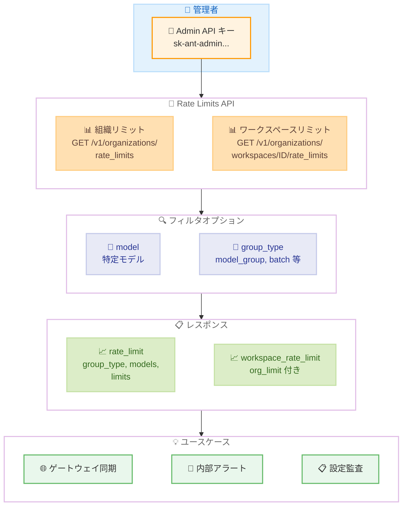
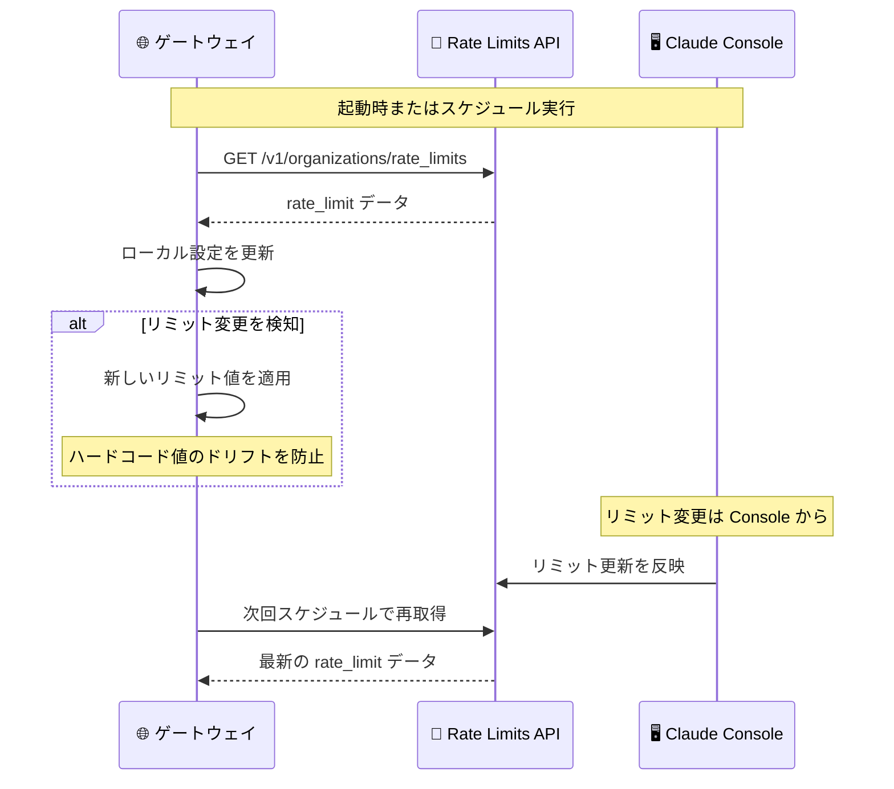
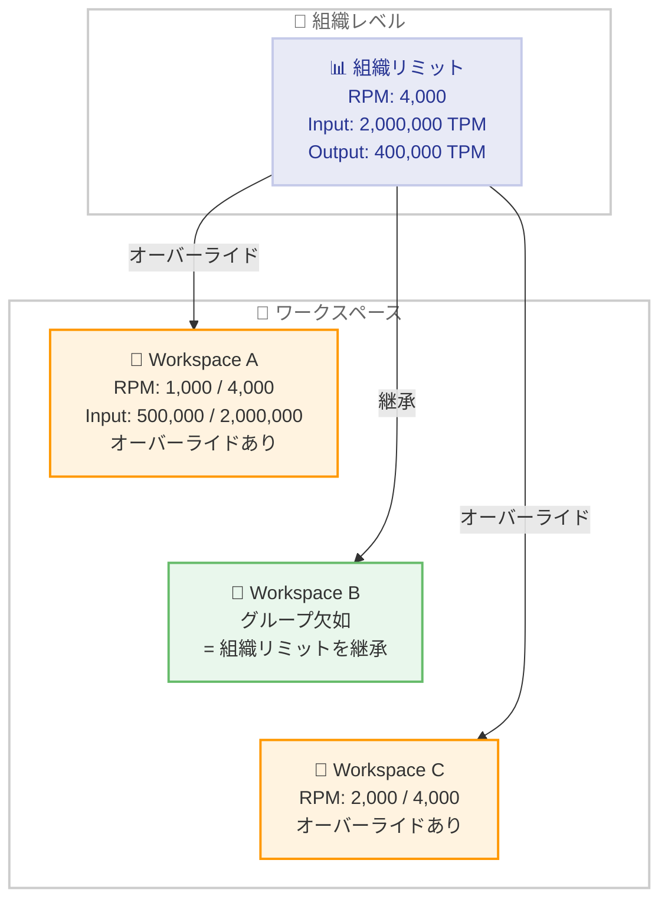

# Rate Limits API リリース -- 組織とワークスペースのレートリミットをプログラマティックに取得可能に

## メタデータ

| 項目 | 内容 |
|------|------|
| 発表日 | 2026-04-24 |
| ソース | [Claude API Release Notes](https://platform.claude.com/docs/en/release-notes/overview) |
| カテゴリ | Claude API アップデート |
| 公式リンク | [Rate Limits API](https://platform.claude.com/docs/en/release-notes/overview) |

## 概要

2026 年 4 月 24 日、Anthropic は組織およびワークスペースに設定された API レートリミットをプログラマティックに取得できる Rate Limits API をリリースしました。Claude Console の Limits ページで確認できる情報と同等のデータを API 経由で取得できます。

この API により、管理者はゲートウェイやプロキシの設定同期、内部アラートの生成、ワークスペース設定の監査といったユースケースをプログラマティックに実現できるようになります。Admin API キー (`sk-ant-admin...`) による認証が必要で、現時点では読み取り専用の API です。

## 詳細

### 背景

これまで、組織やワークスペースのレートリミット情報を確認するには Claude Console の Limits ページにアクセスする必要がありました。大規模な組織やマルチワークスペース環境では、以下のような課題がありました。

- ゲートウェイやプロキシにレートリミット値をハードコードしている場合、Anthropic 側でリミットが変更されるとドリフトが発生する
- Usage and Cost API のデータとリミットを比較して内部アラートを生成するには、手動でリミット値を管理する必要がある
- 複数ワークスペースのオーバーライド設定が期待値と一致しているかを検証する自動化が困難

Rate Limits API はこれらの課題を解決するために設計されています。

### 主な変更点

1. **組織レベルのレートリミット取得**: `GET /v1/organizations/rate_limits` エンドポイントで、組織全体のレートリミットを一覧取得可能
2. **モデル別フィルタリング**: `?model=claude-opus-4-7` のようにクエリパラメータで特定モデルのリミットを検索可能
3. **ワークスペースオーバーライドの取得**: `GET /v1/organizations/workspaces/{workspace_id}/rate_limits` で、ワークスペース固有のオーバーライド設定を取得可能
4. **グループタイプによるフィルタ**: `?group_type=` パラメータで `model_group`、`batch`、`token_count`、`files`、`skills`、`web_search` のグループタイプでフィルタ可能
5. **ページネーション対応**: `page` パラメータと `next_page` フィールドによるページネーションをサポート

### 技術的な詳細

#### エンドポイント一覧

| エンドポイント | 説明 |
|---------------|------|
| `GET /v1/organizations/rate_limits` | 組織レベルのレートリミットを一覧取得 |
| `GET /v1/organizations/rate_limits?model={model}` | 特定モデルのリミットを検索 |
| `GET /v1/organizations/workspaces/{id}/rate_limits` | ワークスペースのオーバーライド一覧 |
| `?group_type={type}` | グループタイプでフィルタ |

#### 認証

Rate Limits API の利用には Admin API キー (`sk-ant-admin...`) が必要です。管理者ロールを持つユーザーのみがこのキーをプロビジョニングできます。通常の API キー (`sk-ant-api...`) では利用できません。

#### レスポンス構造

**組織レベルのレスポンス:**

`rate_limit` オブジェクトは以下のフィールドで構成されます。

- **group_type**: リミットのグループタイプ (`model_group`、`batch` など)
- **models[]**: 対象モデルの一覧
- **limits[]**: `{type, value}` ペアの配列。`type` は `requests_per_minute`、`input_tokens_per_minute`、`output_tokens_per_minute` のいずれか

**ワークスペースレベルのレスポンス:**

ワークスペースのレスポンスには、各リミットに `org_limit` フィールドが追加されます。これにより、ワークスペースのオーバーライド値と組織レベルのリミットを比較できます。レスポンスにグループが含まれていない場合は、組織レベルのリミットがそのまま継承されていることを意味します。

#### ページネーション

レスポンスの `next_page` フィールドが `null` でない場合、次のページが存在します。現在は単一ページに収まるケースがほとんどですが、将来の拡張に備えてページネーションループを実装することが推奨されます。

#### 制限事項

- **読み取り専用**: レートリミットの更新は API からは行えません。変更は Claude Console から行う必要があります
- **Admin API キー必須**: 通常の API キーでは利用不可

## 開発者への影響

### 対象

- **インフラストラクチャ管理者**: ゲートウェイやプロキシのレートリミット設定を自動同期したい管理者
- **DevOps / SRE チーム**: Usage and Cost API と組み合わせてリミット到達前のアラートを構築したいチーム
- **マルチワークスペース環境の管理者**: ワークスペースごとのオーバーライド設定を一元的に監査したい管理者
- **プロビジョニング自動化を行う開発者**: IaC ツールでワークスペース設定の検証を自動化したい開発者

### 必要なアクション

1. **Admin API キーの取得**: Claude Console で管理者ロールを持つユーザーが Admin API キーをプロビジョニング
2. **既存のハードコード値の確認**: ゲートウェイやプロキシにハードコードされたレートリミット値がある場合、Rate Limits API からの動的取得に切り替えを検討
3. **監視・アラートの統合**: Usage and Cost API と Rate Limits API を組み合わせた監視ダッシュボードやアラートの構築を検討
4. **ページネーション対応**: 将来の拡張に備えて、`next_page` フィールドを使ったループ処理を実装

### 移行ガイド

Rate Limits API は新規追加の読み取り専用 API であるため、既存のアプリケーションへの破壊的変更はありません。段階的に以下のように導入できます。

**導入ステップ:**

1. Admin API キーを生成する
2. 組織レベルのレートリミットを取得して現在の設定を確認する
3. ワークスペースのオーバーライドを取得して設定の一貫性を検証する
4. 必要に応じて、定期的な取得とアラートのパイプラインを構築する

## コード例

### curl: 組織レベルのレートリミット取得

```bash
curl "https://api.anthropic.com/v1/organizations/rate_limits" \
  --header "anthropic-version: 2023-06-01" \
  --header "x-api-key: $ANTHROPIC_ADMIN_KEY"
```

レスポンス例:

```json
{
  "data": [
    {
      "type": "rate_limit",
      "group_type": "model_group",
      "models": [
        "claude-opus-4-5",
        "claude-opus-4-5-20251101",
        "claude-opus-4-6",
        "claude-opus-4-7"
      ],
      "limits": [
        { "type": "requests_per_minute", "value": 4000 },
        { "type": "input_tokens_per_minute", "value": 2000000 },
        { "type": "output_tokens_per_minute", "value": 400000 }
      ]
    }
  ],
  "next_page": null
}
```

### curl: 特定モデルのレートリミット検索

```bash
curl "https://api.anthropic.com/v1/organizations/rate_limits?model=claude-opus-4-7" \
  --header "anthropic-version: 2023-06-01" \
  --header "x-api-key: $ANTHROPIC_ADMIN_KEY"
```

### curl: ワークスペースのオーバーライド取得

```bash
curl "https://api.anthropic.com/v1/organizations/workspaces/${WORKSPACE_ID}/rate_limits" \
  --header "anthropic-version: 2023-06-01" \
  --header "x-api-key: $ANTHROPIC_ADMIN_KEY"
```

レスポンス例:

```json
{
  "data": [
    {
      "type": "workspace_rate_limit",
      "group_type": "model_group",
      "models": [
        "claude-opus-4-5",
        "claude-opus-4-5-20251101",
        "claude-opus-4-6",
        "claude-opus-4-7"
      ],
      "limits": [
        { "type": "requests_per_minute", "value": 1000, "org_limit": 4000 },
        { "type": "input_tokens_per_minute", "value": 500000, "org_limit": 2000000 }
      ]
    }
  ],
  "next_page": null
}
```

### Python: レートリミット取得とアラート生成の例

```python
import requests

ADMIN_KEY = "sk-ant-admin-..."
BASE_URL = "https://api.anthropic.com/v1"

headers = {
    "anthropic-version": "2023-06-01",
    "x-api-key": ADMIN_KEY,
}


def get_org_rate_limits(model=None):
    """組織レベルのレートリミットを取得する"""
    url = f"{BASE_URL}/organizations/rate_limits"
    if model:
        url += f"?model={model}"

    all_limits = []
    while url:
        response = requests.get(url, headers=headers)
        response.raise_for_status()
        data = response.json()
        all_limits.extend(data["data"])
        # ページネーション対応
        next_page = data.get("next_page")
        if next_page:
            url = f"{BASE_URL}/organizations/rate_limits?page={next_page}"
        else:
            url = None

    return all_limits


def get_workspace_rate_limits(workspace_id):
    """ワークスペースのオーバーライドを取得する"""
    url = f"{BASE_URL}/organizations/workspaces/{workspace_id}/rate_limits"

    all_limits = []
    while url:
        response = requests.get(url, headers=headers)
        response.raise_for_status()
        data = response.json()
        all_limits.extend(data["data"])
        next_page = data.get("next_page")
        if next_page:
            url = (
                f"{BASE_URL}/organizations/workspaces/"
                f"{workspace_id}/rate_limits?page={next_page}"
            )
        else:
            url = None

    return all_limits


def check_usage_against_limits(usage_rpm, model="claude-opus-4-7", threshold=0.8):
    """使用量がリミットの閾値を超えていないか確認する"""
    limits = get_org_rate_limits(model=model)
    for group in limits:
        for limit in group["limits"]:
            if limit["type"] == "requests_per_minute":
                ratio = usage_rpm / limit["value"]
                if ratio >= threshold:
                    print(
                        f"[ALERT] {model}: RPM usage {usage_rpm}/{limit['value']} "
                        f"({ratio:.0%}) exceeds threshold {threshold:.0%}"
                    )
                else:
                    print(
                        f"[OK] {model}: RPM usage {usage_rpm}/{limit['value']} "
                        f"({ratio:.0%})"
                    )


# 使用例
org_limits = get_org_rate_limits()
for group in org_limits:
    print(f"Group: {group['group_type']}")
    print(f"  Models: {', '.join(group['models'])}")
    for limit in group["limits"]:
        print(f"  {limit['type']}: {limit['value']}")

# アラートチェック
check_usage_against_limits(usage_rpm=3500, model="claude-opus-4-7")
```

## アーキテクチャ図

### Rate Limits API の全体フロー



### ゲートウェイ同期のシーケンス



### ワークスペースリミットの継承構造



## 関連リンク

- [Claude API Release Notes](https://platform.claude.com/docs/en/release-notes/overview) - API リリースノート
- [Rate Limits](https://platform.claude.com/docs/en/api/rate-limits) - レートリミットの概要
- [Administration API](https://platform.claude.com/docs/en/api/admin-api) - Admin API の公式ドキュメント
- [Usage and Cost API](https://platform.claude.com/docs/en/api/usage) - 使用量とコストの API

## まとめ

Rate Limits API がリリースされ、組織およびワークスペースに設定されたレートリミットをプログラマティックに取得できるようになりました。Claude Console の Limits ページと同等の情報を API 経由で取得でき、ゲートウェイやプロキシの自動同期、内部アラートの生成、ワークスペース設定の監査といったユースケースに活用できます。

技術的には、`GET /v1/organizations/rate_limits` と `GET /v1/organizations/workspaces/{workspace_id}/rate_limits` の 2 つの主要エンドポイントを提供し、`model` や `group_type` によるフィルタリング、ページネーションをサポートしています。ワークスペースのレスポンスには `org_limit` フィールドが含まれるため、オーバーライド値と組織リミットの比較が容易です。レスポンスにグループが含まれていない場合は、組織レベルのリミットがそのまま継承されていることを意味します。

認証には Admin API キー (`sk-ant-admin...`) が必要で、管理者ロールのみがプロビジョニング可能です。現時点では読み取り専用の API であり、レートリミットの変更は引き続き Claude Console から行う必要があります。Usage and Cost API と組み合わせることで、リミット到達前のアラートや使用量ダッシュボードの構築が可能になり、大規模な組織での API 利用管理が大幅に効率化されます。
