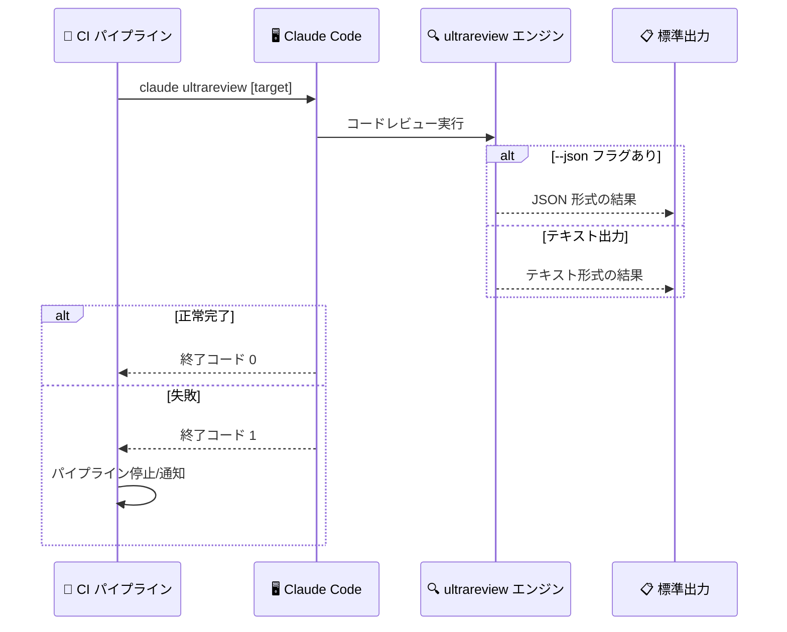
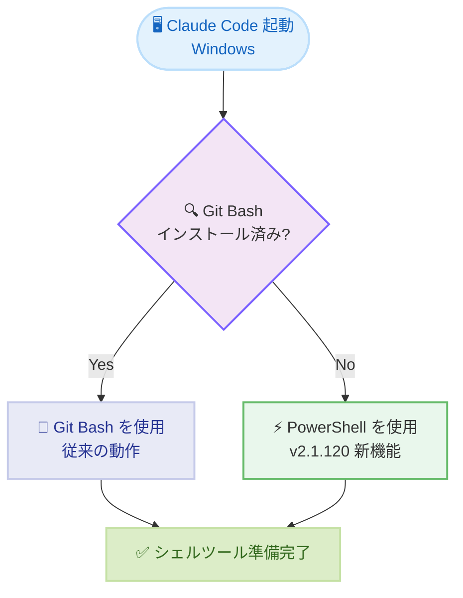

# Claude Code v2.1.120 リリース: Windows PowerShell 対応、`claude ultrareview` CI サブコマンド、起動高速化、大量バグ修正

## メタデータ

| 項目 | 内容 |
|------|------|
| 発表日 | 2026-04-25 |
| ソース | Claude Code Changelog |
| カテゴリ | Claude Code アップデート |
| 公式リンク | https://github.com/anthropics/claude-code/blob/main/CHANGELOG.md |

## 概要

Claude Code v2.1.120 が 2026 年 4 月 25 日にリリースされました。前バージョン v2.1.119 (2026 年 4 月 23 日) から 2 日後のリリースで、新機能/改善 12 件、バグ修正 10 件を含むアップデートです。本リリースでは、Windows での Git Bash 不要化 (PowerShell フォールバック)、`claude ultrareview` CI サブコマンドの追加、起動速度の改善という 3 つの主要な改善が注目されます。

Windows 環境では Git for Windows (Git Bash) が未インストールの場合、Claude Code が自動的に PowerShell をシェルツールとして使用するようになり、セットアップの障壁が大幅に下がりました。新たに追加された `claude ultrareview` サブコマンドは、CI やスクリプトから非インタラクティブにコードレビューを実行でき、`--json` オプションによる機械可読な出力にも対応しています。

起動速度の面では、アップグレード後のリリースノートスプラッシュから Recent Activity パネルが削除され、多数の claude.ai コネクタが設定されている環境でのセッション開始も高速化されました。バグ修正では、stdio MCP ツールコール中の Esc キー押下でサーバー接続が切断される致命的なリグレッションや、`find` コマンドによるファイルディスクリプタ枯渇問題など重要な修正が含まれています。

## 詳細

### 背景

Claude Code は Anthropic が提供する CLI ベースの AI 開発支援ツールです。v2.1.120 は前バージョン v2.1.119 での `/config` 設定永続化、`--from-pr` マルチプラットフォーム対応、30 件以上のバグ修正に続き、Windows プラットフォームのアクセシビリティ向上、CI/CD パイプラインとの統合強化、パフォーマンス最適化、そして重要なリグレッション修正に焦点を当てたリリースです。

特に `claude ultrareview` の追加は、Claude Code をインタラクティブな開発ツールから CI/CD パイプラインの一部としても活用できる方向への拡張を示しており、コードレビュー自動化のワークフローに大きな影響を与える機能です。

### 主な変更点

#### Windows プラットフォーム改善 - 1 件

- **Git Bash 不要化 (PowerShell フォールバック)**: Windows 環境で Git for Windows (Git Bash) がインストールされていない場合、Claude Code が自動的に PowerShell をシェルツールとして使用するようになりました。これにより、Git Bash の事前インストールが不要になり、Windows 環境でのセットアップが簡素化されます

#### CI/CD 統合 - 1 件

- **`claude ultrareview` サブコマンドの追加**: `/ultrareview` を CI やスクリプトから非インタラクティブに実行できる `claude ultrareview [target]` サブコマンドが追加されました。結果は標準出力に出力され、`--json` オプションで機械可読な JSON 形式での出力も可能です。終了コードは正常完了で 0、失敗時に 1 を返します

#### スキル/環境変数 - 2 件

- **`${CLAUDE_EFFORT}` スキル変数**: スキルのコンテンツ内で `${CLAUDE_EFFORT}` を参照することで、現在のエフォートレベルに応じた動的な動作が可能になりました
- **`AI_AGENT` 環境変数の設定**: サブプロセスに `AI_AGENT` 環境変数が設定されるようになり、`gh` コマンドなどがトラフィックを Claude Code に帰属できるようになりました

#### UX 改善 - 4 件

- **スピナーヒントの条件表示**: デスクトップアプリのインストール推奨やスキル/エージェント作成の推奨ヒントが、既に対応済みの場合は非表示になりました
- **PgUp/PgDn スクロールヒント**: ターミナルがスクロールイベントの代わりに矢印キーを送信する場合に「PgUp/PgDn でスクロール」というヒントが表示されるようになりました
- **auto モードの拒否メッセージ改善**: auto モードの拒否メッセージに設定ドキュメントへのリンクが追加されました
- **auto-compact の表示改善**: auto モードでの auto-compact 表示が、誤解を招くトークン数の代わりに `auto` (小文字、トークン数なし) と表示されるようになりました

#### 起動速度改善 - 2 件

- **リリースノートスプラッシュの高速化**: アップグレード後のリリースノートスプラッシュから Recent Activity パネルが削除され、起動が高速化されました
- **セッション開始の高速化**: 多数の claude.ai コネクタが設定されているが未認証の場合のセッション開始が高速化されました

#### プラグイン/バリデーション - 1 件

- **`claude plugin validate` の拡張**: `marketplace.json` のトップレベルに `$schema`、`version`、`description` フィールドを、`plugin.json` に `$schema` フィールドを受け付けるようになりました

#### VSCode 拡張機能 - 2 件

- **`/usage` のネイティブダイアログ化**: `/usage` がプレーンテキストのセッションコストではなく、ネイティブの Account & Usage ダイアログを開くようになりました
- **音声ディクテーションの言語設定対応**: 音声ディクテーションが `~/.claude/settings.json` の `language` 設定を尊重するようになりました

#### バグ修正 - 10 件

##### MCP/サーバー接続修正 - 1 件

- **stdio MCP ツールコール中の Esc キー修正 (v2.1.105 リグレッション)**: stdio MCP ツールコール中に Esc キーを押すとサーバー接続全体が切断される問題が修正されました。v2.1.105 で発生したリグレッションです

##### 入力/キーボード修正 - 1 件

- **`/rewind` 等のキーボード入力修正**: `claude --resume` で起動した後、`/rewind` やその他のインタラクティブオーバーレイがキーボード入力に応答しない問題が修正されました

##### ターミナル表示修正 - 2 件

- **スクロールバック重複修正**: 非フルスクリーンモードでのリサイズ、ダイアログ閉じ、長時間セッション時にターミナルのスクロールバックが重複する問題が修正されました
- **選択メニューのクリッピング修正**: フルスクリーンモードで長い選択メニューがターミナル下部で切れる問題が修正され、スクロール時にフォーカスされたオプションが画面内に表示されるようになりました

##### テレメトリ/プライバシー修正 - 1 件

- **テレメトリ無効化の修正**: `DISABLE_TELEMETRY` / `CLAUDE_CODE_DISABLE_NONESSENTIAL_TRAFFIC` 環境変数が API ユーザーおよびエンタープライズユーザーの使用量メトリクステレメトリを抑制しない問題が修正されました

##### auto モード修正 - 1 件

- **危険な `rm` 操作の誤検知修正**: パイプとリダイレクトの両方を含む複数行 Bash コマンドで「Dangerous rm operation」パーミッションプロンプトが誤って表示される問題が修正されました

##### UI/表示修正 - 2 件

- **Write ツール出力の展開修正**: フルスクリーンモードで「+N lines」をクリックした際に Write ツールの出力が展開ではなく折りたたまれる問題が修正されました
- **スラッシュコマンドピッカーの修正**: スラッシュコマンドピッカーが入力中にジャンプする問題が修正され、ハイライトが連続する部分文字列のみを青で表示するように改善されました

##### プラグイン修正 - 1 件

- **`/plugin` マーケットプレイスの読み込み修正**: 1 つのエントリが認識されないソースフォーマットを使用している場合にマーケットプレイス全体の読み込みが失敗する問題が修正されました

##### システム安定性修正 - 1 件

- **`find` コマンドのファイルディスクリプタ枯渇修正**: Bash ツール内の `find` コマンドが大きなディレクトリツリーでオープンファイルディスクリプタを枯渇させ、ホスト全体のクラッシュを引き起こす問題が修正されました (macOS/Linux ネイティブビルド)

### 技術的な詳細

#### Windows PowerShell フォールバック

v2.1.120 以前の Windows 環境では、Claude Code のシェルツールは Git for Windows (Git Bash) に依存していました。Git Bash がインストールされていない環境では Claude Code を使用できませんでした。

v2.1.120 では、Git Bash の存在を検出し、見つからない場合に自動的に PowerShell にフォールバックするロジックが追加されました。これにより以下の動作になります。

- **Git Bash がある場合**: 従来どおり Git Bash をシェルとして使用
- **Git Bash がない場合**: PowerShell を自動的にシェルとして使用

Windows ユーザーは Git for Windows を別途インストールすることなく Claude Code を利用開始できるようになり、特にエンタープライズ環境でのデプロイが容易になります。

#### `claude ultrareview` サブコマンド

`claude ultrareview` は、既存の `/ultrareview` インタラクティブコマンドを CI/CD パイプラインやスクリプトから利用できるようにした非インタラクティブサブコマンドです。

**動作仕様:**

- **入力**: `claude ultrareview [target]` でレビュー対象を指定
- **出力**: レビュー結果を標準出力に出力
- **JSON モード**: `--json` フラグで機械可読な JSON 形式での出力
- **終了コード**: 正常完了で `0`、失敗時に `1`

これにより、以下のようなワークフローが実現できます。

- PR の自動コードレビュー
- マージ前のコード品質ゲート
- レビュー結果の他ツールへの連携

#### `${CLAUDE_EFFORT}` スキル変数

スキルファイル内で `${CLAUDE_EFFORT}` 変数を参照することで、現在のエフォートレベル (low、medium、high など) に応じてスキルの動作を動的に変更できるようになりました。例えば、エフォートレベルが高い場合はより詳細なレビューを行い、低い場合は簡易チェックのみを実行するといった条件分岐が可能です。

#### `AI_AGENT` 環境変数

Claude Code がサブプロセスを起動する際に `AI_AGENT` 環境変数を設定するようになりました。これにより `gh` CLI などのツールが、リクエストが Claude Code から発行されたものであることを識別でき、トラフィックの帰属とアナリティクスが改善されます。

#### `find` コマンドのファイルディスクリプタ枯渇修正

macOS/Linux のネイティブビルドにおいて、Bash ツール内で `find` コマンドを大きなディレクトリツリーに対して実行すると、オープンファイルディスクリプタが枯渇し、Claude Code プロセスだけでなくホストマシン全体がクラッシュする可能性がありました。v2.1.120 ではファイルディスクリプタの管理が改善され、この致命的な問題が解消されています。

## 開発者への影響

### 対象

- **Windows ユーザー**: Git Bash の事前インストールが不要になり、PowerShell のみで Claude Code を使用可能になりました
- **CI/CD パイプライン利用者**: `claude ultrareview` により、コードレビューの自動化をパイプラインに組み込めるようになりました
- **スキル開発者**: `${CLAUDE_EFFORT}` によるエフォートレベル参照が可能になり、スキルの動的な動作制御が実現できます
- **エンタープライズ/API ユーザー**: テレメトリ無効化が正しく機能するようになり、プライバシー要件を満たせるようになりました
- **MCP サーバー利用者**: stdio MCP ツールコール中の Esc キーによる接続切断リグレッションが修正されました
- **macOS/Linux ネイティブビルドユーザー**: `find` コマンドによるファイルディスクリプタ枯渇問題が修正され、安定性が向上しました
- **VSCode 拡張機能ユーザー**: `/usage` のネイティブダイアログ化と音声ディクテーションの言語設定対応が追加されました

### 必要なアクション

以下のコマンドで最新バージョンに更新できます。

```bash
# npm でのアップデート
npm update -g @anthropic-ai/claude-code

# Homebrew でのアップデート
brew upgrade claude-code

# 現在のバージョン確認
claude --version
```

**確認が推奨される項目:**

- **Windows 環境の確認**: Git Bash なしの Windows 環境で Claude Code が PowerShell で正常に動作することを確認してください
- **CI パイプラインへの `ultrareview` 導入検討**: 既存の CI/CD パイプラインに `claude ultrareview` によるコードレビューゲートの追加を検討してください
- **テレメトリ設定の確認**: `DISABLE_TELEMETRY` や `CLAUDE_CODE_DISABLE_NONESSENTIAL_TRAFFIC` を設定しているエンタープライズ環境では、テレメトリが正しく無効化されていることを確認してください
- **MCP サーバー利用者**: v2.1.105 以降で stdio MCP ツールコール中に Esc キーで接続が切断される問題が発生していた場合、v2.1.120 で解消されています

### 移行ガイド

#### Windows 環境での Git Bash 依存の除去

v2.1.120 以降、Windows 環境では Git Bash が不要になりました。既存のセットアップドキュメントやオンボーディング手順から Git Bash のインストール要件を任意に変更できます。

**v2.1.119 以前:**

1. Git for Windows (Git Bash) をインストール
2. Claude Code をインストール
3. 利用開始

**v2.1.120 以降:**

1. Claude Code をインストール
2. 利用開始 (Git Bash がなければ PowerShell を自動使用)

#### CI/CD パイプラインへの `ultrareview` 組み込み

`claude ultrareview` は終了コード 0/1 を返すため、CI パイプラインのステップとして直接組み込めます。失敗時にパイプラインを停止するか、結果をコメントとして PR に投稿するかを選択できます。

## コード例

### アップデートとバージョン確認

```bash
# Claude Code を最新バージョンに更新
npm update -g @anthropic-ai/claude-code

# バージョン確認
claude --version
# Claude Code v2.1.120
```

### `claude ultrareview` の基本使用

```bash
# 現在のディレクトリをレビュー
claude ultrareview .

# 特定のファイルやディレクトリを指定してレビュー
claude ultrareview src/

# JSON 形式で出力
claude ultrareview src/ --json

# 終了コードを利用した条件分岐
claude ultrareview . && echo "レビュー完了" || echo "レビュー失敗"
```

### GitHub Actions での `ultrareview` 活用

```yaml
# .github/workflows/code-review.yml
name: Claude Code Review

on:
  pull_request:
    branches: [main]

jobs:
  ultrareview:
    runs-on: ubuntu-latest
    steps:
      - uses: actions/checkout@v4

      - name: Install Claude Code
        run: npm install -g @anthropic-ai/claude-code

      - name: Run ultrareview
        run: claude ultrareview . --json > review-results.json

      - name: Check review results
        run: |
          if [ $? -ne 0 ]; then
            echo "Code review found issues"
            cat review-results.json
            exit 1
          fi
```

### スキルでの `${CLAUDE_EFFORT}` 活用

```markdown
# レビュースキル例

エフォートレベル: ${CLAUDE_EFFORT}

## レビュー基準

高エフォートの場合は以下を全て確認してください。
- コードスタイルの一貫性
- パフォーマンスへの影響
- セキュリティの考慮事項
- テストカバレッジ
- ドキュメントの更新

低エフォートの場合は以下のみ確認してください。
- 明らかなバグ
- セキュリティの問題
```

### Windows での PowerShell フォールバック確認

```powershell
# Windows で Claude Code を起動 (Git Bash 不要)
claude

# PowerShell がシェルとして使用されていることを確認
# Claude Code 内で以下を実行
$PSVersionTable
```

## アーキテクチャ図

### v2.1.120 主要変更の全体像

```mermaid
flowchart TD
    subgraph ClaudeCode["🖥️ Claude Code v2.1.120"]
        subgraph Windows["🪟 Windows 改善"]
            direction LR
            PSFallback["⚡ PowerShell フォールバック<br/>Git Bash 不要"]
        end

        subgraph CICD["🔄 CI/CD 統合"]
            direction LR
            UltraReview["🔍 claude ultrareview<br/>非インタラクティブレビュー"]
            JsonOutput["📋 --json 出力<br/>機械可読フォーマット"]
            UltraReview ~~~ JsonOutput
        end

        subgraph SkillsEnv["🧩 スキル/環境変数"]
            direction LR
            Effort["📊 CLAUDE_EFFORT<br/>エフォートレベル参照"]
            AIAgent["🤖 AI_AGENT<br/>サブプロセス帰属"]
            Effort ~~~ AIAgent
        end

        subgraph Performance["⚡ 起動速度改善"]
            direction LR
            Splash["🚀 スプラッシュ高速化<br/>Recent Activity 削除"]
            SessionStart["🔌 セッション開始<br/>コネクタ最適化"]
            Splash ~~~ SessionStart
        end

        subgraph BugFixes["🐛 バグ修正 10 件"]
            direction LR
            MCPFix["🔌 MCP Esc キー<br/>リグレッション修正"]
            FindFix["📁 find FD 枯渇<br/>クラッシュ防止"]
            TelemetryFix["🔒 テレメトリ<br/>無効化修正"]
            UIFixes["🖼️ UI/表示<br/>4 件修正"]
            MCPFix ~~~ FindFix ~~~ TelemetryFix ~~~ UIFixes
        end
    end

    User(["👤 ユーザー"]) --> ClaudeCode
    CI(["🔄 CI/CD パイプライン"]) --> CICD

    classDef platform fill:none,stroke:#CCCCCC,stroke-width:2px,color:#666666
    classDef layer fill:none,stroke:#E1BEE7,stroke-width:2px,color:#666666
    classDef windows fill:#E8EAF6,stroke:#C5CAE9,stroke-width:2px,color:#283593
    classDef cicd fill:#E9F7EC,stroke:#66BB6A,stroke-width:2px,color:#333333
    classDef skill fill:#FFE0B2,stroke:#FFCC80,stroke-width:2px,color:#5D4037
    classDef perf fill:#DCEDC8,stroke:#C5E1A5,stroke-width:2px,color:#33691E
    classDef fix fill:#FFF3E0,stroke:#FF9800,stroke-width:2px,color:#333333
    classDef user fill:#E3F2FD,stroke:#BBDEFB,stroke-width:2px,color:#1565C0

    class ClaudeCode platform
    class Windows,CICD,SkillsEnv,Performance,BugFixes layer
    class PSFallback windows
    class UltraReview,JsonOutput cicd
    class Effort,AIAgent skill
    class Splash,SessionStart perf
    class MCPFix,FindFix,TelemetryFix,UIFixes fix
    class User,CI user
```



### `claude ultrareview` CI/CD フロー



### Windows シェル選択フロー



## 関連リンク

- [Claude Code Changelog](https://github.com/anthropics/claude-code/blob/main/CHANGELOG.md)
- [Claude Code GitHub リポジトリ](https://github.com/anthropics/claude-code)
- [Claude Code npm パッケージ](https://www.npmjs.com/package/@anthropic-ai/claude-code)
- [Claude Code ドキュメント](https://docs.anthropic.com/en/docs/claude-code)
- [Claude Code v2.1.119 レポート](./2026-04-23-claude-code-v2-1-119.md)
- [Claude Code v2.1.118 レポート](./2026-04-22-claude-code-v2-1-118.md)

## まとめ

Claude Code v2.1.120 は、新機能/改善 12 件、バグ修正 10 件を含むリリースです。変更は大きく 4 つのテーマにまとめられます。

第一に、**Windows プラットフォームのアクセシビリティ向上** です。Git for Windows (Git Bash) が未インストールの環境で自動的に PowerShell にフォールバックするようになり、Windows ユーザーのセットアップ障壁が大幅に低下しました。エンタープライズ環境でのデプロイや新規ユーザーのオンボーディングが容易になります。

第二に、**CI/CD パイプラインとの統合強化** です。`claude ultrareview [target]` サブコマンドにより、非インタラクティブなコードレビューが可能になりました。`--json` オプションによる機械可読出力と終了コード 0/1 の返却により、GitHub Actions や他の CI ツールとの統合が容易です。PR の自動レビューやマージ前の品質ゲートとして活用できます。

第三に、**起動速度とユーザー体験の改善** です。リリースノートスプラッシュの高速化、多数のコネクタ環境でのセッション開始高速化に加え、スピナーヒントの条件表示、PgUp/PgDn スクロールヒント、auto-compact の表示改善など、日常的な使用感を向上させる改善が含まれています。`${CLAUDE_EFFORT}` によるスキル変数や `AI_AGENT` 環境変数の追加も、開発ワークフローの柔軟性を高めています。

第四に、**重要なバグ修正と安定性向上** です。v2.1.105 で発生した stdio MCP ツールコール中の Esc キーによるサーバー接続切断リグレッションが修正されました。また、`find` コマンドによるファイルディスクリプタ枯渇でホスト全体がクラッシュする致命的な問題、テレメトリ無効化が正しく機能しない問題、auto モードでの `rm` 操作の誤検知など、安定性とセキュリティに関わる修正が含まれています。

全ての Claude Code ユーザーに対してアップデートを推奨します。特に Windows 環境のユーザーは Git Bash 依存の除去による恩恵を受けられます。CI/CD パイプラインを運用しているチームは `claude ultrareview` の導入を検討してください。MCP サーバーを利用している場合は、Esc キーによる接続切断リグレッションの修正を確認してください。
