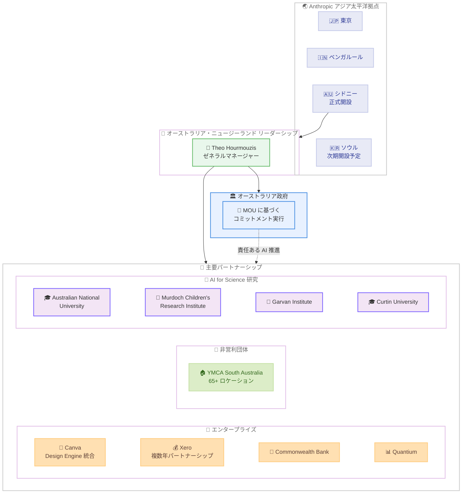

# Anthropic が Theo Hourmouzis をオーストラリア・ニュージーランドのゼネラルマネージャーに任命、シドニーオフィスを正式開設

## メタデータ

| 項目 | 内容 |
|------|------|
| 発表日 | 2026-04-27 |
| ソース | [Anthropic News](https://www.anthropic.com/news) |
| カテゴリ | 人事・組織 |
| 公式リンク | [Anthropic names Theo Hourmouzis General Manager of Australia & New Zealand and officially opens Sydney office](https://www.anthropic.com/news/theo-hourmouzis-general-manager-australia-new-zealand) |

## 概要

2026 年 4 月 27 日、Anthropic は Theo Hourmouzis をオーストラリア・ニュージーランドのゼネラルマネージャーに任命し、シドニーオフィスを正式に開設したことを発表しました。Hourmouzis はアジア太平洋地域のテクノロジー業界で 20 年以上のリーダーシップ経験を持ち、直近では Snowflake でオーストラリア、ニュージーランド、ASEAN 担当のシニアバイスプレジデントを務めていました。

同時に、Canva、Xero との新たなパートナーシップや、YMCA South Australia との非営利団体向け提携、オーストラリアの主要研究機関との AI for Science 研究パートナーシップなど、多数の現地パートナーシップも発表されました。

## 詳細

### 背景

Anthropic は 2026 年 3 月にシドニーオフィスの開設計画を発表し、同月末にはオーストラリア政府と AI 安全性・研究に関する覚書 (MOU) を締結しています。オーストラリアでは人口比で Claude.ai の利用率が世界 4 位を記録しており、Claude への需要が急速に拡大しています。

今回の Hourmouzis の任命とシドニーオフィスの正式開設は、これらの取り組みを本格的に推進するための重要なステップです。シドニーは東京、ベンガルールに続くアジア太平洋地域の拠点であり、次にソウルの開設が予定されています。

### 人事: Theo Hourmouzis の任命

| 項目 | 内容 |
|------|------|
| 氏名 | Theo Hourmouzis |
| 役職 | ゼネラルマネージャー、オーストラリア・ニュージーランド |
| 前職 | Snowflake シニアバイスプレジデント (オーストラリア、ニュージーランド、ASEAN 担当) |
| 経験 | アジア太平洋地域のテクノロジー業界で 20 年以上のリーダーシップ経験 |
| 役割 | 現地チームの統括、オーストラリア・ニュージーランドの顧客向け戦略の策定 |

**Hourmouzis のコメント**: 「オーストラリアとニュージーランドの組織は AI の導入方法について慎重に検討しており、安全性と厳密さをビジネスチャンスと同じくらい真剣に考えるパートナーを求めています」

**Chris Ciauri (Managing Director of International) のコメント**: 「Theo の任命は、責任ある開発と展開がなされれば AI が経済成長を促進できるというオーストラリア政府と共有する信念を反映しています」

### 新たなパートナーシップ

#### 1. Canva

- Canva Design Engine を Anthropic Labs の Claude Design に統合
- オーストラリアを代表するデザインプラットフォームとの連携強化

#### 2. Xero

- 複数年にわたるパートナーシップを締結
- Claude の AI 機能を Xero に統合
- Xero の財務データを Claude.ai に統合
- 会計・財務分野における AI 活用の拡大

#### 3. YMCA South Australia (Claude for Nonprofits Partner)

- オーストラリア全土で 65 以上のコミュニティロケーションを運営
- 約 1,250 名のスタッフを擁する組織
- YMCA SA のコメント: 「将来的には Claude が組織運営の中核を担う組み込みインフラストラクチャになることを目指しています」

### 既存パートナーシップの深化

- **Commonwealth Bank**: オーストラリア最大の銀行との関係強化
- **Quantium**: データアナリティクス企業との連携継続

### AI for Science 研究パートナーシップ

以下のオーストラリアの主要研究機関と AI for Science 研究パートナーシップを推進しています。

| 研究機関 | 分野 |
|----------|------|
| Australian National University | 総合研究 |
| Murdoch Children's Research Institute | 小児医学研究 |
| Garvan Institute of Medical Research | 医学研究 |
| Curtin University | 総合研究 |

### オーストラリア政府との連携

今回の発表は、Anthropic がオーストラリア政府と締結した MOU に基づくコミットメントの実行として位置づけられています。責任ある AI の開発と展開を通じた経済成長の促進という共通のビジョンに基づいて、政府との協力を深化させています。

## 開発者への影響

### 対象

- **オーストラリア・ニュージーランドの企業開発者**: 現地チームによるサポート体制が強化され、より迅速な対応が可能に
- **Canva 開発者**: Claude Design との統合により、新たな API 連携の機会が生まれる可能性
- **Xero エコシステムの開発者**: Claude の AI 機能と Xero の財務データの統合により、会計・財務分野での AI アプリケーション開発が加速
- **非営利団体**: Claude for Nonprofits プログラムを通じた AI 活用の機会が拡大

### 必要なアクション

1. **オーストラリア・ニュージーランドの企業**: シドニーオフィスの現地チームとの連携を検討し、Claude の導入や活用方法について相談が可能に
2. **Xero ユーザー**: Claude と Xero の統合に関する今後の発表を注視し、財務業務における AI 活用の準備を進める
3. **非営利団体**: Claude for Nonprofits プログラムへの参加を検討

### 移行ガイド

該当なし (新規人事・パートナーシップの発表のため、既存の技術的な移行作業は不要)。

## コード例

該当なし (本発表は人事・組織・パートナーシップに関するニュースであり、技術的な変更を伴わないため)。

## アーキテクチャ図

### Anthropic のアジア太平洋拠点展開とオーストラリア・ニュージーランド戦略

## 関連リンク

- [Anthropic names Theo Hourmouzis General Manager of Australia & New Zealand](https://www.anthropic.com/news/theo-hourmouzis-general-manager-australia-new-zealand) - 公式発表
- [Anthropic News](https://www.anthropic.com/news) - Anthropic ニュース一覧
- [シドニーオフィス開設レポート](./2026-03-10-sydney-fourth-office-asia-pacific.md) - シドニーオフィス開設計画の発表
- [オーストラリア政府との MOU 締結レポート](./2026-03-31-australia-mou-ai-safety.md) - AI 安全性・研究に関する覚書の詳細
- [Anthropic と NEC の戦略的提携レポート](./2026-04-24-anthropic-nec-japan-ai-workforce.md) - アジア太平洋地域における別のパートナーシップ事例

## まとめ

Anthropic は Theo Hourmouzis をオーストラリア・ニュージーランドのゼネラルマネージャーに任命し、シドニーオフィスを正式に開設しました。Hourmouzis は Snowflake でオーストラリア、ニュージーランド、ASEAN 担当のシニアバイスプレジデントを務めた経験を持ち、アジア太平洋地域のテクノロジー業界で 20 年以上のリーダーシップ実績があります。

今回の発表では、Canva (Design Engine の Claude Design への統合)、Xero (複数年パートナーシップ)、YMCA South Australia (Claude for Nonprofits) など、多数の現地パートナーシップも同時に発表されました。さらに、Australian National University、Murdoch Children's Research Institute、Garvan Institute of Medical Research、Curtin University との AI for Science 研究パートナーシップも推進されています。

シドニーは東京、ベンガルールに続くアジア太平洋地域の拠点であり、次にソウルの開設が予定されています。オーストラリア政府と締結した MOU に基づくコミットメントの実行として、責任ある AI の開発と展開を通じた経済成長の促進を目指しており、Commonwealth Bank や Quantium などの既存パートナーとの関係も深化させています。Anthropic のアジア太平洋地域における事業拡大が着実に進展していることを示す重要な発表です。
