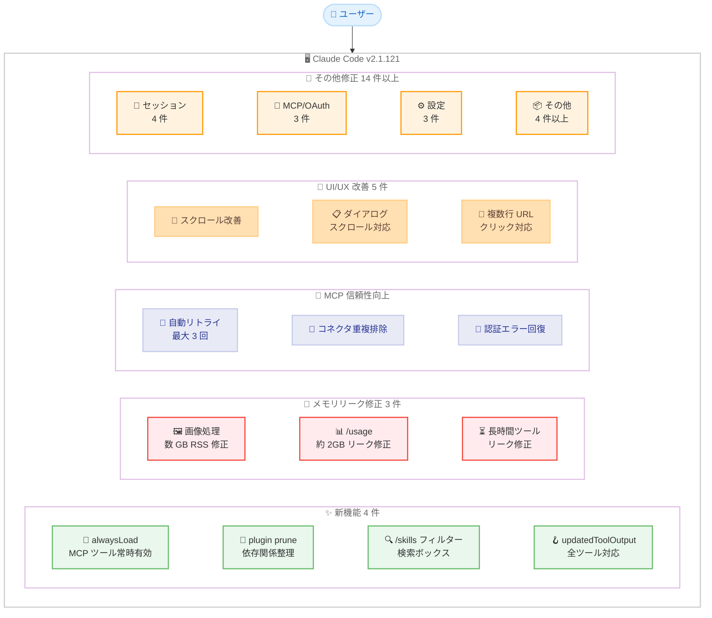
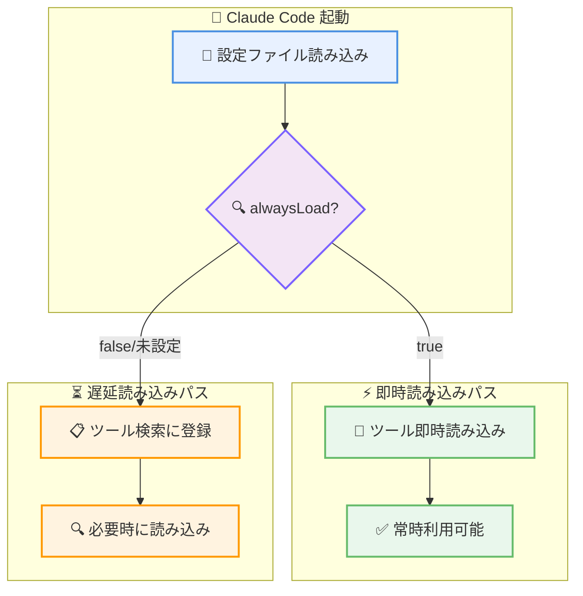
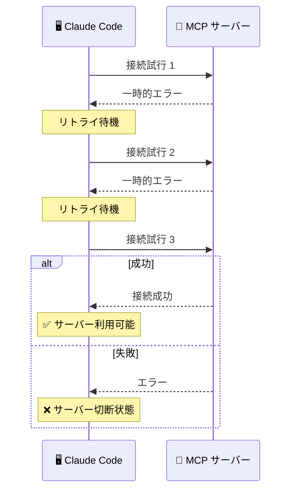

# Claude Code v2.1.121 リリース: MCP alwaysLoad オプション、プラグイン管理の強化、重大メモリリーク修正、MCP 信頼性向上

## メタデータ

| 項目 | 内容 |
|------|------|
| 発表日 | 2026-04-28 |
| ソース | Claude Code Changelog |
| カテゴリ | Claude Code アップデート |
| 公式リンク | https://github.com/anthropics/claude-code/blob/main/CHANGELOG.md |

## 概要

Claude Code v2.1.121 が 2026 年 4 月 28 日にリリースされました。新機能 4 件、改善 16 件、バグ修正 20 件以上を含む大規模なアップデートです。本リリースでは、MCP サーバー設定への `alwaysLoad` オプション追加、`claude plugin prune` コマンドによるプラグイン管理の強化、数 GB 規模に達するメモリリークの修正、そして MCP サーバーの信頼性向上が主な注目点です。

特にメモリ関連では、多数の画像を処理するセッションで RSS が数 GB に膨れ上がる問題、`/usage` コマンドで最大約 2GB のメモリリーク、長時間実行ツールの進捗イベント未送出によるメモリリークの 3 件が修正され、長時間セッションの安定性が大幅に改善されました。MCP 関連では、起動時の一時的なエラーに対する自動リトライ (最大 3 回)、OAuth エラーによるコネクタ消失の防止、`mcp_authenticate` の `redirectUri` サポートなど、接続の信頼性が強化されています。

## 詳細

### 背景

Claude Code は Anthropic が提供する CLI ベースの AI 開発支援ツールです。v2.1.121 は前バージョン v2.1.119 (2026 年 4 月 23 日) からの主要アップデートであり、MCP サーバーの設定と信頼性の改善、プラグインライフサイクル管理の強化、致命的なメモリリークの修正、UI/UX の洗練という 4 つの軸で開発が進められています。

### 主な変更点

#### 新機能 - 4 件

- **MCP サーバー設定に `alwaysLoad` オプション追加**: MCP サーバー設定で `alwaysLoad: true` を指定すると、そのサーバーの全ツールがツール検索の遅延読み込み (deferral) をスキップし、常に利用可能になります。頻繁に使用する MCP ツールを即座に呼び出せるようになり、ワークフローの効率が向上します
- **`claude plugin prune` コマンド追加**: 孤立した自動インストール済みプラグインの依存関係を削除する `claude plugin prune` コマンドが追加されました。`plugin uninstall --prune` でアンインストール時にカスケード削除も可能です
- **`/skills` のフィルタリング検索ボックス追加**: `/skills` コマンドにタイプして絞り込める検索ボックスが追加され、長いスキルリストからスクロールせずに目的のスキルを素早く見つけられるようになりました
- **`PostToolUse` フックの `updatedToolOutput` 拡張**: `PostToolUse` フックの `hookSpecificOutput.updatedToolOutput` が全ツールに対応し、ツール出力の置換が可能になりました (以前は MCP ツールのみ)

#### UI/UX 改善 - 5 件

- **フルスクリーンモードのスクロール改善**: フルスクリーンモードで過去の出力を読むためにスクロールアップした状態でプロンプトに入力しても、スクロール位置が最下部にジャンプしなくなりました
- **ダイアログのスクロール対応**: ターミナルからはみ出すダイアログが矢印キー、PgUp/PgDn、Home/End、マウスホイールでスクロール可能になりました。フルスクリーンモードと非フルスクリーンモードの両方で動作します
- **複数行 URL のクリック対応**: フルスクリーンモードで複数行にまたがる長い URL の任意の行をクリックすると、完全な URL が開かれるようになりました
- **LSP 診断サマリーの展開対応**: LSP 診断サマリーがクリックまたは Ctrl+O で展開でき、展開ヒントも表示されるようになりました
- **リリースノートスプラッシュの高速化**: アップグレード後の起動を高速化するため、リリースノートスプラッシュから Recent Activity パネルが削除されました

#### MCP/SDK 改善 - 5 件

- **MCP サーバーの自動リトライ**: 起動時に一時的なエラーが発生した MCP サーバーが、切断状態のまま放置されるのではなく、最大 3 回まで自動リトライされるようになりました
- **Claude.ai コネクタの重複排除**: 同じアップストリーム URL を持つ Claude.ai コネクタが重複表示されなくなりました
- **SDK `mcp_authenticate` の `redirectUri` サポート**: `mcp_authenticate` がカスタムスキーム完了のための `redirectUri` と Claude.ai コネクタをサポートするようになりました
- **`CLAUDE_CODE_FORK_SUBAGENT=1` の非対話セッション対応**: SDK と `claude -p` で `CLAUDE_CODE_FORK_SUBAGENT=1` が非対話セッションでも動作するようになりました
- **Vertex AI X.509 証明書ベースの Workload Identity Federation サポート**: Vertex AI で mTLS ADC による X.509 証明書ベースの Workload Identity Federation がサポートされました

#### その他の改善 - 6 件

- **`--dangerously-skip-permissions` のスキル/エージェント書き込み許可**: `--dangerously-skip-permissions` 使用時に `.claude/skills/`、`.claude/agents/`、`.claude/commands/` への書き込みでプロンプトが表示されなくなりました
- **`/terminal-setup` の iTerm2 クリップボードアクセス有効化**: `/terminal-setup` が iTerm2 の「Applications in terminal may access clipboard」設定を有効化し、tmux 環境を含む `/copy` が動作するようになりました
- **ターミナルタブタイトルの言語設定対応**: ターミナルのタブセッションタイトルが `language` 設定で指定した言語で生成されるようになりました
- **OpenTelemetry スパンの拡張**: LLM リクエストスパンに `stop_reason`、`gen_ai.response.finish_reasons`、`user_system_prompt` (`OTEL_LOG_USER_PROMPTS` で制御) が追加されました
- **[VSCode] 音声ディクテーションの言語設定対応**: Claude Code の言語が未設定の場合、音声ディクテーションが `accessibility.voice.speechLanguage` 設定を参照するようになりました
- **[VSCode] `/context` のネイティブトークン使用量ダイアログ**: `/context` コマンドがネイティブのトークン使用量ダイアログを開くようになりました

#### バグ修正 - 20 件以上

##### メモリリーク修正 - 3 件 (重大)

- **画像処理時のメモリ無制限増加修正**: 多数の画像を処理するセッションで RSS が数 GB に膨れ上がるメモリ無制限増加問題が修正されました
- **`/usage` のメモリリーク修正**: 大量のトランスクリプト履歴を持つマシンで `/usage` コマンドが最大約 2GB のメモリをリークする問題が修正されました
- **長時間実行ツールのメモリリーク修正**: 進捗イベントを正しく送出しない長時間実行ツールでメモリリークが発生する問題が修正されました

##### セッション/起動修正 - 4 件

- **Bash ツールの永久使用不可修正**: セッション中に Claude の起動ディレクトリが削除または移動された場合に Bash ツールが永久に使用不可能になる問題が修正されました
- **`--resume` の外部ビルドクラッシュ修正**: 外部ビルドで `--resume` が起動時にクラッシュする問題が修正されました
- **`--resume` の大規模セッション失敗修正**: 不正なシャットダウンでトランスクリプト行が破損した場合に `--resume` が大規模セッションで失敗する問題が修正されました。破損行はスキップされるようになりました
- **管理設定承認プロンプト修正**: 管理設定の承認プロンプトで承認した場合でもセッションが終了してしまう問題が修正され、設定を適用して続行するようになりました

##### MCP/OAuth 修正 - 3 件

- **Bedrock 推論プロファイル ARN エラー修正**: Bedrock アプリケーション推論プロファイル ARN 使用時に `thinking.type.enabled is not supported` エラーが発生する問題が修正されました
- **Microsoft 365 MCP OAuth 修正**: Microsoft 365 MCP OAuth が重複または未サポートの `prompt` パラメータで失敗する問題が修正されました
- **Claude.ai MCP コネクタの消失修正**: 起動時に一時的な認証エラーでコネクタリスト取得が失敗した場合に Claude.ai MCP コネクタが無言で消失する問題が修正されました

##### UI/表示修正 - 4 件

- **tmux 等でのスクロールバック重複修正**: 非フルスクリーンモードで Ctrl+L またはリドロー発生時に tmux、GNOME Terminal、Windows Terminal、Konsole でスクロールバックが重複する問題が修正されました
- **`/usage` のレートリミット誤表示修正**: 古い OAuth トークンで `/usage` が「rate limited」を返す問題が修正され、自動的にトークンがリフレッシュされるようになりました
- **`/usage` ダイアログのクリッピング修正**: no-flicker モードがオフの場合に `/usage` ダイアログの内容がクリップされる問題が修正されました
- **`/focus` の Unknown command 修正**: フルスクリーンレンダラーがオフの場合に `/focus` が「Unknown command」と表示される問題が修正され、有効化方法の説明が表示されるようになりました

##### 設定/パーミッション修正 - 3 件

- **リモートセッションの Always allow ルール修正**: リモートセッションでビルトインツールの「Always allow」ルールがワーカー再起動後に失われる問題が修正されました
- **`NO_PROXY` の全 HTTP クライアント適用修正**: ネイティブビルドで `managed-settings.json` 経由で設定した `NO_PROXY` が全 HTTP クライアントで正しく適用されない問題が修正されました
- **`settings.json` の無効レガシー列挙値修正**: `settings.json` 内の無効なレガシー列挙値が設定ファイル全体を無効化する問題が修正されました

##### その他の修正 - 3 件以上

- **組み込み grep/find/rg ラッパーのフォールバック修正**: セッション中に実行中のバイナリが削除された場合に組み込みの grep/find/rg シェルラッパーが失敗する問題が修正され、インストール済みツールにフォールバックするようになりました
- **Bash ツールの `find` ファイルディスクリプタ使用量削減**: 大規模ディレクトリツリーで Bash ツールの `find` 実行時のピークファイルディスクリプタ使用量が削減されました

### 技術的な詳細

#### MCP サーバー `alwaysLoad` オプション

Claude Code のツール検索機能では、MCP サーバーのツールは遅延読み込み (deferral) によりデフォルトでは必要になるまで読み込まれません。v2.1.121 で追加された `alwaysLoad` オプションを `true` に設定すると、そのサーバーの全ツールが遅延読み込みをスキップし、セッション開始時から常に利用可能になります。

これは以下のようなケースで有用です。

- 毎回のセッションで確実に使用するツールがある場合
- ツール検索の遅延によるレイテンシを回避したい場合
- カスタムワークフローで特定のツールが常に必要な場合

#### メモリリーク修正の技術的背景

v2.1.121 では 3 つの独立したメモリリークが修正されました。

1. **画像処理のメモリ無制限増加**: セッション中に多数の画像を処理すると、画像データのバッファが適切に解放されず RSS が数 GB に達する問題でした。長時間のコードレビューや画像を含むドキュメント処理で特に顕著でした
2. **`/usage` のメモリリーク**: 大量のトランスクリプト履歴があるマシンで `/usage` コマンドを実行すると、履歴データの処理中に最大約 2GB のメモリが解放されない問題でした
3. **長時間実行ツールのメモリリーク**: 進捗イベントを正しく送出しない長時間実行ツール (例: 大規模な検索やビルド処理) で、内部バッファが蓄積し続ける問題でした

これらの修正により、長時間セッションでのメモリ使用量が大幅に安定し、特に画像を多用するワークフローやトランスクリプト履歴の多い環境での安定性が向上しています。

#### MCP サーバーの自動リトライ機構

従来、MCP サーバーが起動時にネットワークの一時的なエラーなどで接続に失敗した場合、サーバーは切断状態のまま放置されていました。v2.1.121 では、一時的なエラー (transient error) が検出された場合に最大 3 回まで自動リトライする機構が追加されました。これにより、ネットワークの不安定な環境や、サーバーの起動タイミングによる一時的な接続失敗でも、自動的に回復するようになります。

#### `PostToolUse` フックの `updatedToolOutput` 拡張

v2.1.119 以前では、`PostToolUse` フックの `hookSpecificOutput.updatedToolOutput` は MCP ツールに対してのみツール出力の置換が可能でした。v2.1.121 では全てのツール (Bash、Read、Write、Edit、Grep、Glob 等のビルトインツールを含む) に対応し、フックによるツール出力のカスタマイズが統一的に行えるようになりました。

## 開発者への影響

### 対象

- **全ての Claude Code ユーザー**: 3 件のメモリリーク修正により、長時間セッションの安定性が大幅に向上します。特に画像処理を行うセッションでは数 GB 規模のメモリ節約が期待できます
- **MCP サーバー利用者**: `alwaysLoad` オプションで頻繁に使用するツールを常時利用可能にでき、自動リトライにより接続の信頼性が向上します
- **プラグイン利用者**: `claude plugin prune` で不要な依存関係を整理でき、ディスク使用量を削減できます
- **フック/自動化利用者**: `PostToolUse` の `updatedToolOutput` が全ツールに拡張され、より柔軟なフック処理が可能になりました
- **Vertex AI / Bedrock 利用者**: X.509 証明書ベースの Workload Identity Federation サポートと、推論プロファイル ARN エラーの修正が含まれます
- **リモートセッション利用者**: Always allow ルールがワーカー再起動後も維持されるようになりました
- **tmux / iTerm2 利用者**: スクロールバック重複の修正と `/terminal-setup` による iTerm2 クリップボードアクセスの自動有効化が含まれます

### 必要なアクション

以下のコマンドで最新バージョンに更新できます。

```bash
# npm でのアップデート
npm update -g @anthropic-ai/claude-code

# Homebrew でのアップデート
brew upgrade claude-code

# 現在のバージョン確認
claude --version
```

**確認が推奨される項目:**

- **メモリ使用量の確認**: 長時間セッションでのメモリ使用量が改善されていることを確認してください。特に画像を多用するワークフローで効果が顕著です
- **MCP サーバーの `alwaysLoad` 設定**: 毎回使用する MCP ツールがある場合、`alwaysLoad: true` の設定を検討してください
- **不要なプラグイン依存関係の整理**: `claude plugin prune` を実行して、孤立した依存関係を削除してください
- **MCP サーバーの接続安定性確認**: 自動リトライ機構の追加により、起動時の一時的なエラーが自動回復されるようになりました

### 移行ガイド

#### MCP サーバーの `alwaysLoad` 設定

頻繁に使用する MCP サーバーのツールを常時利用可能にするには、設定ファイルに `alwaysLoad: true` を追加してください。

```json
{
  "mcpServers": {
    "my-frequently-used-server": {
      "type": "http",
      "url": "https://api.example.com/mcp",
      "alwaysLoad": true
    }
  }
}
```

#### プラグインの依存関係整理

不要なプラグイン依存関係を整理するには以下のコマンドを使用します。

```bash
# 孤立した依存関係を確認して削除
claude plugin prune

# プラグインアンインストール時にカスケード削除
claude plugin uninstall <plugin-name> --prune
```

## コード例

### MCP サーバーの `alwaysLoad` 設定

```json
{
  "mcpServers": {
    "database-tools": {
      "type": "http",
      "url": "https://db.example.com/mcp",
      "alwaysLoad": true,
      "headers": {
        "Authorization": "Bearer ${DB_TOKEN}"
      }
    },
    "optional-tools": {
      "type": "http",
      "url": "https://tools.example.com/mcp"
    }
  }
}
```

上記の設定では、`database-tools` サーバーの全ツールが遅延読み込みをスキップして常に利用可能になります。`optional-tools` はデフォルトの遅延読み込み動作のままです。

### プラグイン管理

```bash
# 孤立した自動インストール済みプラグイン依存関係の削除
claude plugin prune

# プラグインのアンインストールと依存関係のカスケード削除
claude plugin uninstall my-plugin --prune

# インストール済みプラグインの確認
claude plugin list
```

### アップデートとバージョン確認

```bash
# Claude Code を最新バージョンに更新
npm update -g @anthropic-ai/claude-code

# バージョン確認
claude --version
# Claude Code v2.1.121
```

### PostToolUse フックによるツール出力の置換

```json
{
  "hooks": {
    "PostToolUse": [
      {
        "type": "command",
        "command": "python3 transform_output.py",
        "matcher": {
          "tool_name": "Bash"
        }
      }
    ]
  }
}
```

v2.1.121 では `hookSpecificOutput.updatedToolOutput` が全ツールで利用可能になり、MCP ツールだけでなく Bash、Read、Write 等のビルトインツールの出力もフックで置換できます。

## アーキテクチャ図

### v2.1.121 主要変更の全体像



### MCP サーバー `alwaysLoad` の動作フロー



### MCP サーバー自動リトライ機構



## 関連リンク

- [Claude Code Changelog](https://github.com/anthropics/claude-code/blob/main/CHANGELOG.md)
- [Claude Code GitHub リポジトリ](https://github.com/anthropics/claude-code)
- [Claude Code npm パッケージ](https://www.npmjs.com/package/@anthropic-ai/claude-code)
- [Claude Code ドキュメント](https://docs.anthropic.com/en/docs/claude-code)
- [Claude Code v2.1.119 レポート](./2026-04-23-claude-code-v2-1-119.md)
- [Claude Code v2.1.118 レポート](./2026-04-22-claude-code-v2-1-118.md)

## まとめ

Claude Code v2.1.121 は、新機能 4 件、改善 16 件、バグ修正 20 件以上を含む大規模なリリースです。変更は大きく 4 つのテーマにまとめられます。

第一に、**MCP サーバーの設定柔軟性の向上** です。新しい `alwaysLoad` オプションにより、頻繁に使用する MCP サーバーのツールを遅延読み込みなしで常時利用可能にできるようになりました。ツール検索によるレイテンシを回避し、重要なツールへの即座のアクセスを確保できます。

第二に、**致命的なメモリリークの修正** です。画像処理時の数 GB 規模の RSS 増加、`/usage` コマンドの約 2GB メモリリーク、長時間実行ツールのメモリリークという 3 つの独立した問題が修正されました。これらの修正により、長時間セッションの安定性とメモリ効率が大幅に向上しています。

第三に、**MCP サーバーの信頼性向上** です。起動時の一時的なエラーに対する自動リトライ (最大 3 回)、Claude.ai コネクタの重複排除、認証エラーによるコネクタ消失の防止、Microsoft 365 MCP OAuth の修正など、MCP 接続の安定性が包括的に強化されました。

第四に、**プラグイン管理と UI/UX の改善** です。`claude plugin prune` による孤立した依存関係の整理、`/skills` の検索ボックス、フルスクリーンモードのスクロール改善、ダイアログのスクロール対応、複数行 URL のクリック対応など、日常的な操作の利便性が向上しています。

全ての Claude Code ユーザーに対してアップデートを強く推奨します。特にメモリリークの修正は長時間セッションの安定性に直結するため、早急なアップデートが望ましいです。MCP サーバーを活用しているユーザーは `alwaysLoad` オプションの導入を検討し、プラグインを多用しているユーザーは `claude plugin prune` で環境を整理してください。
