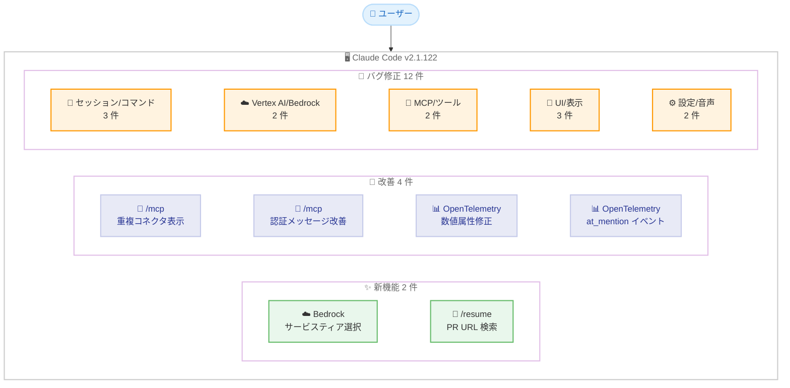
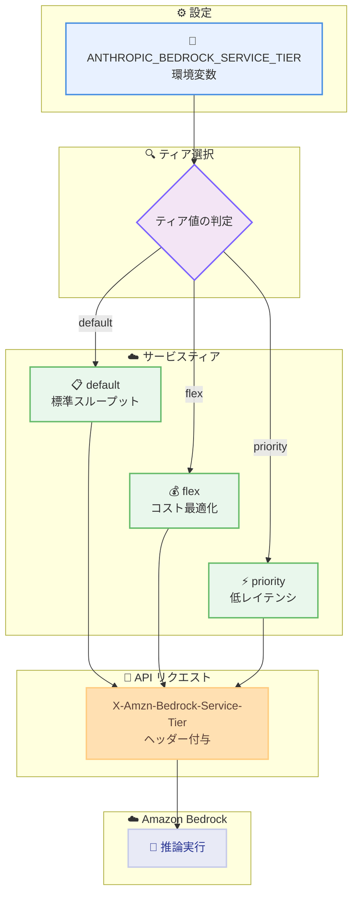
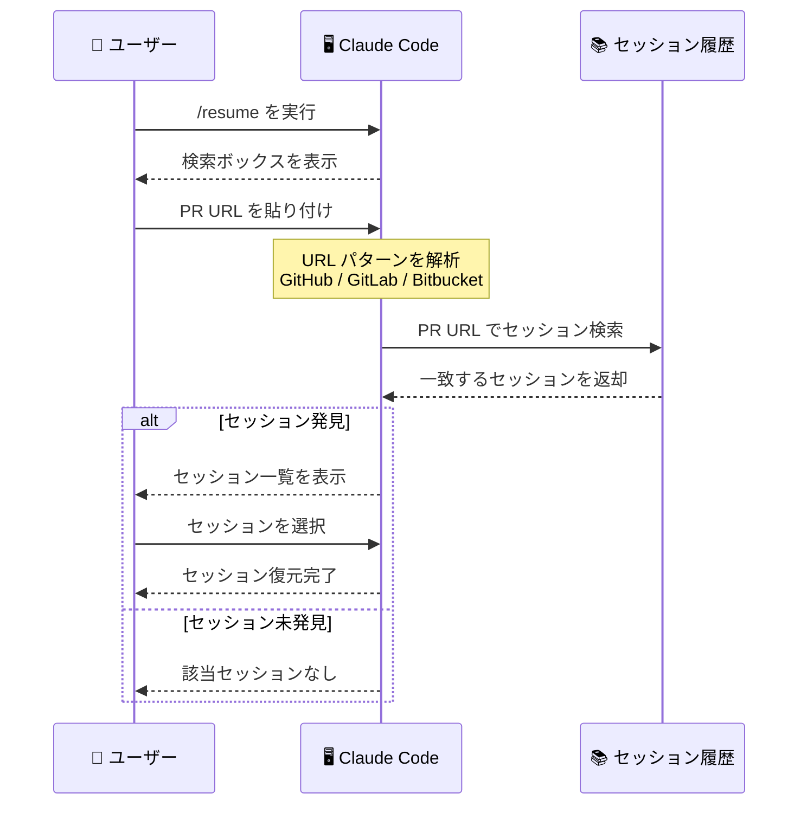

# Claude Code v2.1.122 リリース: Bedrock サービスティア選択、PR URL からのセッション復元、画像リサイズ修正など多数のバグ修正

## メタデータ

| 項目 | 内容 |
|------|------|
| 発表日 | 2026-04-28 |
| ソース | Claude Code Changelog |
| カテゴリ | Claude Code アップデート |
| 公式リンク | https://github.com/anthropics/claude-code/blob/main/CHANGELOG.md |

## 概要

Claude Code v2.1.122 が 2026 年 4 月 28 日にリリースされました。新機能 2 件、改善 4 件、バグ修正 12 件を含むアップデートです。本リリースでは、`ANTHROPIC_BEDROCK_SERVICE_TIER` 環境変数による Bedrock サービスティアの選択機能、PR URL を `/resume` に貼り付けてセッションを復元する機能が新たに追加されました。

バグ修正面では、画像が正しい最大値 2000px ではなく 2576px にリサイズされていた問題、`/branch` でフォークが失敗する問題、Vertex AI / Bedrock での構造化出力クエリエラー、`!exit` / `!quit` が CLI を終了してしまう問題など、12 件の修正が含まれています。

## 詳細

### 背景

Claude Code は Anthropic が提供する CLI ベースの AI 開発支援ツールです。v2.1.122 は前バージョン v2.1.121 (2026 年 4 月 28 日) に続く同日のアップデートであり、Bedrock サービスティア制御の追加、セッション復元の利便性向上、そして多数の安定性改善が行われています。

### 主な変更点

#### 新機能 - 2 件

- **`ANTHROPIC_BEDROCK_SERVICE_TIER` 環境変数の追加**: Amazon Bedrock のサービスティア (`default`、`flex`、`priority`) を選択できる環境変数が追加されました。設定した値は `X-Amzn-Bedrock-Service-Tier` ヘッダーとして送信されます。`flex` ティアを指定することでコスト最適化が可能になり、`priority` ティアで低レイテンシを確保するなど、ワークロードに応じた柔軟なリソース割り当てが実現します
- **PR URL による `/resume` セッション検索**: `/resume` の検索ボックスに PR URL を貼り付けると、その PR を作成したセッションが自動的に検索されるようになりました。GitHub、GitHub Enterprise、GitLab、Bitbucket に対応しています。PR のレビュー対応やフォローアップ作業時に、関連するセッションを素早く復元できます

#### 改善 - 4 件

- **`/mcp` の重複コネクタ表示**: `/mcp` コマンドで、手動追加したサーバーと同じ URL を持つ claude.ai コネクタが隠されている場合に表示されるようになりました。重複を解消するための削除ヒントも表示されます
- **`/mcp` の認証エラーメッセージ改善**: ブラウザサインインフロー後も MCP サーバーが未認可の場合に表示されるメッセージが明確化されました
- **OpenTelemetry 数値属性の型修正**: `api_request` / `api_error` ログイベントの数値属性が文字列ではなく数値として出力されるようになりました。監視ツールでの集計やフィルタリングが正確に行えます
- **OpenTelemetry `claude_code.at_mention` イベント追加**: `@` メンション解決時の `claude_code.at_mention` ログイベントが追加されました。メンション機能の利用状況を監視・分析できるようになります

#### バグ修正 - 12 件

##### セッション/コマンド修正 - 3 件

- **`/branch` のフォーク失敗修正**: 巻き戻し済みタイムラインのエントリを含むソースセッションから `/branch` でフォークすると、"tool_use ids were found without tool_result blocks" エラーで失敗する問題が修正されました
- **`/model` の Effort オプション表示修正**: Bedrock アプリケーション推論プロファイル ARN に対して `/model` で Effort オプションが表示されず、`output_config.effort` も設定されない問題が修正されました
- **`!exit` / `!quit` の動作修正**: bash モードで `!exit` / `!quit` を実行すると CLI 自体が終了してしまう問題が修正され、シェルコマンドとして実行されるようになりました

##### Vertex AI / Bedrock 修正 - 2 件

- **構造化出力クエリエラー修正**: Vertex AI / Bedrock でセッションタイトル生成やその他の構造化出力クエリ時に `invalid_request_error: output_config: Extra inputs are not permitted` エラーが返される問題が修正されました
- **Vertex AI `count_tokens` エンドポイントエラー修正**: プロキシゲートウェイを経由するユーザーで Vertex AI の `count_tokens` エンドポイントが 400 エラーを返す問題が修正されました

##### MCP/ツール修正 - 2 件

- **MCP ツールの検出漏れ修正**: nonblocking モードでセッション開始後に接続した MCP ツールが ToolSearch で検出されない問題が修正されました
- **`spinnerTipsOverride.excludeDefault` の動作修正**: `spinnerTipsOverride.excludeDefault` 設定が時間ベースのスピナーティップスを抑制しない問題が修正されました

##### UI/表示修正 - 3 件

- **画像リサイズの最大値修正**: 新しいモデルに送信される画像が、正しい最大値 2000px ではなく 2576px にリサイズされていた問題が修正されました。不必要に大きな画像が送信されることによるトークン消費の増加を防ぎます
- **リモートコントロールセッションの再描画修正**: リモートコントロールセッションのアイドルステータスが毎秒 2 回再描画され、`tmux -CC` コントロールパイプを溢れさせてターミナルが停止する問題が修正されました
- **アシスタントメッセージの空白表示修正**: 古いビュー設定により一部のセッションでアシスタントメッセージが空白で表示される問題が修正されました

##### 設定修正 - 1 件

- **`settings.json` の不正な hooks エントリ修正**: `settings.json` 内の不正な形式の hooks エントリが設定ファイル全体を無効化していた問題が修正されました。不正なエントリがあっても他の設定は正常に読み込まれるようになりました

##### 音声モード - 1 件

- **Caps Lock キーバインドのエラー表示**: 音声モードで Caps Lock にバインドされたキーバインドに対してエラーが表示されるようになりました。ターミナルは Caps Lock をキーイベントとして配信しないため、バインドが機能しないことをユーザーに通知します

### 技術的な詳細

#### Bedrock サービスティアの仕組み

Amazon Bedrock では、推論リクエストのサービスティアを選択することで、コストとパフォーマンスのトレードオフを制御できます。v2.1.122 で追加された `ANTHROPIC_BEDROCK_SERVICE_TIER` 環境変数は、以下の 3 つの値をサポートします。

- **`default`**: 標準のサービスティア。デフォルトのスループットとレイテンシで動作します
- **`flex`**: コスト最適化ティア。レイテンシの保証は低くなりますが、コストが削減されます。バッチ処理や時間に余裕のあるタスクに適しています
- **`priority`**: 優先ティア。低レイテンシが保証され、リアルタイム性が求められるワークロードに適しています

設定された値は HTTP ヘッダー `X-Amzn-Bedrock-Service-Tier` として Bedrock API に送信されます。

#### PR URL によるセッション復元の対応プラットフォーム

`/resume` コマンドの PR URL 検索は、以下のプラットフォームの URL パターンを認識します。

- **GitHub**: `https://github.com/{owner}/{repo}/pull/{number}`
- **GitHub Enterprise**: カスタムドメインの PR URL
- **GitLab**: `https://gitlab.com/{group}/{project}/-/merge_requests/{number}`
- **Bitbucket**: `https://bitbucket.org/{workspace}/{repo}/pull-requests/{number}`

Claude Code はセッション履歴内の git 操作やプッシュ先ブランチ情報と PR URL を照合して、該当するセッションを特定します。

#### 画像リサイズの修正

Claude API の新しいモデルでは、画像の最大サイズが 1 辺 2000px に制限されています。v2.1.121 以前のバージョンでは、リサイズロジックに誤りがあり 2576px にリサイズされていました。この修正により、正しいサイズで画像が送信されるようになり、不必要なトークン消費を防ぎます。

## 開発者への影響

### 対象

- **Bedrock ユーザー**: `ANTHROPIC_BEDROCK_SERVICE_TIER` 環境変数でサービスティアを制御し、コストとパフォーマンスのバランスを最適化できます。また、推論プロファイル ARN での Effort オプション表示と構造化出力クエリのエラーが修正されました
- **全ての Claude Code ユーザー**: 画像リサイズの修正によりトークン消費が適正化され、`/branch` のフォーク失敗やアシスタントメッセージの空白表示が修正されました
- **Vertex AI ユーザー**: `count_tokens` エンドポイントのプロキシゲートウェイ対応と構造化出力クエリのエラー修正が含まれます
- **MCP サーバー利用者**: nonblocking モードでの MCP ツール検出漏れの修正と `/mcp` の重複コネクタ表示改善が含まれます
- **リモートセッション/tmux ユーザー**: アイドルステータスの再描画頻度修正により、`tmux -CC` コントロールパイプの溢れが解消されました
- **OpenTelemetry 監視利用者**: 数値属性の型修正と `@` メンションイベントの追加により、監視データの精度と範囲が向上しました

### 必要なアクション

以下のコマンドで最新バージョンに更新できます。

```bash
# npm でのアップデート
npm update -g @anthropic-ai/claude-code

# Homebrew でのアップデート
brew upgrade claude-code

# 現在のバージョン確認
claude --version
```

**確認が推奨される項目:**

- **Bedrock ユーザー**: `ANTHROPIC_BEDROCK_SERVICE_TIER` 環境変数の設定を検討してください。特にコスト最適化が必要な場合は `flex` ティアの利用が有効です
- **画像を含むワークフロー**: 画像リサイズの修正により、送信される画像サイズとトークン消費が変化する可能性があります
- **`settings.json` に hooks を設定しているユーザー**: 不正な形式のエントリがあっても設定ファイル全体が無効化されなくなりましたが、エントリの形式を見直すことを推奨します
- **PR レビューワークフロー**: `/resume` に PR URL を貼り付けてセッションを復元する新しいワークフローを活用してください

### 移行ガイド

#### Bedrock サービスティアの設定

環境変数を設定するだけで利用できます。設定しない場合は従来通りのデフォルト動作です。

```bash
# コスト最適化ティア
export ANTHROPIC_BEDROCK_SERVICE_TIER=flex

# 優先ティア (低レイテンシ)
export ANTHROPIC_BEDROCK_SERVICE_TIER=priority

# デフォルトティア (明示的に指定する場合)
export ANTHROPIC_BEDROCK_SERVICE_TIER=default
```

## コード例

### Bedrock サービスティアの設定

```bash
# 環境変数でサービスティアを指定して Claude Code を起動
ANTHROPIC_BEDROCK_SERVICE_TIER=flex claude

# .bashrc や .zshrc に追加して永続化
echo 'export ANTHROPIC_BEDROCK_SERVICE_TIER=flex' >> ~/.bashrc

# AWS プロファイルと組み合わせて使用
AWS_PROFILE=my-bedrock-profile ANTHROPIC_BEDROCK_SERVICE_TIER=priority claude
```

この環境変数は `X-Amzn-Bedrock-Service-Tier` ヘッダーとして Bedrock API リクエストに付与されます。

### PR URL からセッションを復元

```bash
# Claude Code 起動後、/resume コマンドを使用
# 検索ボックスに PR URL を貼り付け
/resume
# → https://github.com/myorg/myrepo/pull/123 を貼り付け
# → その PR を作成したセッションが検索結果に表示される
```

GitHub、GitHub Enterprise、GitLab、Bitbucket の PR/MR URL に対応しています。

### アップデートとバージョン確認

```bash
# Claude Code を最新バージョンに更新
npm update -g @anthropic-ai/claude-code

# バージョン確認
claude --version
# Claude Code v2.1.122
```

## アーキテクチャ図

### v2.1.122 主要変更の全体像



### Bedrock サービスティア選択の動作フロー



### PR URL によるセッション復元フロー



## 関連リンク

- [Claude Code Changelog](https://github.com/anthropics/claude-code/blob/main/CHANGELOG.md)
- [Claude Code GitHub リポジトリ](https://github.com/anthropics/claude-code)
- [Claude Code npm パッケージ](https://www.npmjs.com/package/@anthropic-ai/claude-code)
- [Claude Code ドキュメント](https://docs.anthropic.com/en/docs/claude-code)
- [Amazon Bedrock ドキュメント](https://docs.aws.amazon.com/bedrock/)
- [Claude Code v2.1.121 レポート](./2026-04-28-claude-code-v2-1-121.md)
- [Claude Code v2.1.120 レポート](./2026-04-25-claude-code-v2-1-120.md)

## まとめ

Claude Code v2.1.122 は、新機能 2 件、改善 4 件、バグ修正 12 件を含むリリースです。変更は大きく 3 つのテーマにまとめられます。

第一に、**Bedrock サービスティアの制御機能** です。新しい `ANTHROPIC_BEDROCK_SERVICE_TIER` 環境変数により、`default`、`flex`、`priority` の 3 つのサービスティアから選択できるようになりました。コスト最適化が必要な場合は `flex` を、低レイテンシが求められる場合は `priority` を指定でき、ワークロードに応じた柔軟なリソース管理が実現します。

第二に、**セッション復元とワークフロー改善** です。`/resume` コマンドに PR URL を貼り付けることで、その PR を作成したセッションを即座に検索・復元できるようになりました。GitHub、GitHub Enterprise、GitLab、Bitbucket に対応しており、PR レビューやフォローアップ作業の効率が向上します。また、`/mcp` コマンドの重複コネクタ表示や認証メッセージの改善、OpenTelemetry の数値属性修正とイベント追加により、運用の利便性と可観測性が強化されています。

第三に、**多数のバグ修正による安定性向上** です。画像リサイズの最大値が 2576px から正しい 2000px に修正され、不要なトークン消費が削減されます。`/branch` のフォーク失敗、Vertex AI / Bedrock の構造化出力エラー、`!exit` / `!quit` の誤動作、リモートコントロールセッションの再描画問題、`settings.json` の不正な hooks エントリによるファイル全体の無効化など、幅広い領域で安定性が改善されました。

全ての Claude Code ユーザーに対してアップデートを推奨します。特に Bedrock ユーザーは新しいサービスティア機能の活用を検討してください。画像を多用するワークフローでは、リサイズ修正によるトークン消費の適正化の恩恵を受けられます。
