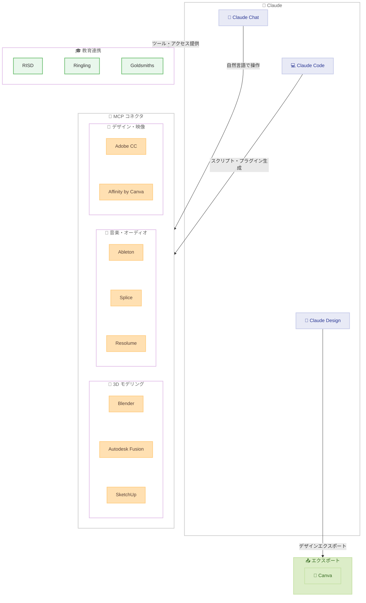

# Claude for Creative Work -- クリエイティブ業界向け MCP コネクタ群を主要パートナーと共同リリース

## メタデータ

| 項目 | 内容 |
|------|------|
| 発表日 | 2026-04-28 |
| ソース | [Anthropic News](https://www.anthropic.com/news) |
| カテゴリ | プロダクト / クリエイティブ |
| 公式リンク | [Claude for Creative Work](https://www.anthropic.com/news/claude-for-creative-work) |

## 概要

2026 年 4 月 28 日、Anthropic は Blender、Autodesk、Adobe、Ableton、Splice をはじめとする主要クリエイティブソフトウェア企業と提携し、Claude をクリエイティブプロフェッショナルが日常的に使用するソフトウェアと連携させるコネクタ群をリリースしました。

これらのコネクタは MCP (Model Context Protocol) をベースとしており、Claude が外部のプラットフォームやツールに直接アクセスすることを可能にします。3D モデリング、音楽制作、映像編集、グラフィックデザインなど、クリエイティブワークの幅広い領域をカバーする 8 つのコネクタが新たに提供されます。

また、Anthropic は Blender Development Fund にパトロンとして参加し、Blender の Python API 開発を支援することも発表しました。さらに、Anthropic Labs の新プロダクト「Claude Design」が Canva へのエクスポートに対応し、アイデア探索からデザインツールへのハンドオフを実現する機能も紹介されています。

教育分野では、Rhode Island School of Design、Ringling College of Art and Design、Goldsmiths, University of London の 3 つの美術・デザイン教育機関との連携も発表されました。

## 詳細

### 背景

クリエイティブプロフェッショナルは、テクノロジーを活用して表現の可能性を広げることを常に追求しています。AI はクリエイターの審美眼や想像力を代替するものではありませんが、アイデアの高速かつ大規模な展開、スキルセットの拡張、大規模プロジェクトへの対応力強化、そして反復的な作業の自動化による創造的時間の確保に貢献できます。

この目標を達成するために最も重要なのは、Claude をクリエイティブ業界が既に信頼し使い慣れているツールに統合することです。Anthropic はこれまでも MCP を通じた外部ツール連携を推進してきましたが、今回のリリースはクリエイティブ分野に特化した大規模なコネクタ群の提供として、大きな一歩となります。

### 新しいコネクタ一覧

今回リリースされた 8 つのコネクタは以下のとおりです。

| コネクタ | パートナー | 機能 |
|----------|------------|------|
| Ableton | Ableton | Live と Push の公式プロダクトドキュメントに基づいた回答を Claude が提供 |
| Adobe for creativity | Adobe | Photoshop、Premiere、Express など Creative Cloud 50 以上のツールを活用した画像・映像・デザイン制作 |
| Affinity by Canva | Canva | バッチ画像調整、レイヤーリネーム、ファイルエクスポートなどプロ向けクリエイティブワークフローの自動化 |
| Autodesk Fusion | Autodesk | Fusion サブスクリプションユーザーが Claude との対話で 3D モデルを作成・修正 |
| Blender | Blender Foundation | Python API への自然言語インターフェースを提供し、複雑なセットアップの理解やドキュメントへのアクセスを容易に |
| Resolume Arena / Wire | Resolume | VJ やライブビジュアルアーティストが自然言語でリアルタイムにパフォーマンスを制御 |
| SketchUp | Trimble | Claude との対話から 3D モデリングの出発点を生成し、SketchUp で精緻化 |
| Splice | Splice | Claude 内から Splice のロイヤリティフリーサンプルカタログを検索 |

### Claude を活用したクリエイティブワークの 5 つの領域

Anthropic は、Claude によるクリエイティブワーク支援を以下の 5 つの領域に整理しています。

1. **クリエイティブツールの学習とマスター**: Claude が複雑なソフトウェアのオンデマンドチューターとして機能。モディファイアスタック、シンセサイズ技法、未知の機能の解説をリアルタイムで提供
2. **コードによるツール拡張**: Claude Code がスクリプト、プラグイン、ジェネラティブシステムを作成。カスタムシェーダー、プロシージャルアニメーション、パラメトリックモデルの生成コードを提供し、再利用と修正が可能
3. **パイプラインでのツール間連携**: フォーマット変換、データ再構成、プロジェクト全体でのアセット同期を実現し、デザイン・3D・オーディオツール間の手動ハンドオフを不要に
4. **迅速な探索とハンドオフ**: Anthropic Labs の新プロダクト「Claude Design」によるソフトウェア体験のアイデア探索。フィードバックに基づくイテレーションと、Canva を皮切りとした他ツールへのエクスポートが可能
5. **反復的なプロダクション作業の自動化**: アセットのバッチ処理、プロジェクトスキャフォールディングの設定、シーン全体へのプロシージャル変更適用など、マルチステップタスクの処理

### Claude と Blender の連携

Blender はインディーゲーム開発、モーショングラフィックス、建築ビジュアライゼーション、映画制作など幅広い業界で利用されている、無料のオープンソース 3D 制作スイートです。

今回の発表における主なポイントは以下のとおりです。

- **Blender 公式 MCP コネクタ**: Blender 開発チームが Claude 向けに公式 MCP コネクタを作成。3D アーティストは Blender シーン全体の分析・デバッグ、オブジェクトへのバッチ変更スクリプトの構築、Blender の Python API を通じた新ツールの直接追加が可能に
- **Blender Development Fund への参加**: Anthropic がパトロンとして Blender Development Fund に参加し、MCP 連携を可能にする Python API の継続的な開発を支援
- **オープンソースとの親和性**: コネクタは MCP 上に構築されているため、Claude 以外の LLM からもアクセスが可能。Blender のオープンソースと相互運用性へのコミットメントを反映

### 教育機関との連携

Anthropic はクリエイティブコンピュテーションを含むカリキュラムを支援するため、以下の 3 つの美術・デザイン教育プログラムとの連携を発表しました。

| 教育機関 | プログラム |
|----------|------------|
| Rhode Island School of Design (RISD) | Art and Computation |
| Ringling College of Art and Design | Fundamentals of AI for Creatives |
| Goldsmiths, University of London | MA/MFA Computational Arts |

学生と教員には Claude と新しいコネクタへのアクセスが提供され、クリエイティブ実践者がこれらのツールに何を求めているかを理解するためのフィードバックが収集されます。今後、プログラムをさらに多くの教育機関に拡大する予定です。

### 技術的な詳細

#### MCP コネクタの仕組み

今回のコネクタは MCP (Model Context Protocol) をベースに構築されています。MCP は Anthropic が推進するオープンプロトコルで、LLM と外部ツール・データソース間の標準的なインターフェースを提供します。

コネクタの主な技術的特徴は以下のとおりです。

- **双方向アクセス**: Claude がクリエイティブツールのデータを読み取るだけでなく、ツール上で操作を実行可能
- **自然言語インターフェース**: Blender の Python API のように、プログラミング知識がなくてもコマンドを自然言語で指示可能
- **相互運用性**: MCP 上に構築されているため、Claude 以外の LLM からもアクセスが可能

#### Claude Design と Canva 連携

Anthropic Labs のプロダクト「Claude Design」は、ソフトウェア体験のアイデアを探索するためのツールです。ユーザーのフィードバックに基づいてオプションを視覚化し、イテレーションを重ねることができます。Canva を最初のエクスポート先として、Claude Design で作成したデザインを他のツールへハンドオフできます。

## ユーザーへの影響

### 対象

- **3D アーティスト・モデラー**: Blender、Autodesk Fusion、SketchUp のコネクタにより、3D 制作ワークフローに Claude を直接統合可能
- **音楽プロデューサー・DJ**: Ableton コネクタによる公式ドキュメント参照と、Splice コネクタによるサンプル検索で音楽制作を効率化
- **映像・グラフィックデザイナー**: Adobe Creative Cloud 50 以上のツールとの連携、および Affinity by Canva でのプロダクションワーク自動化
- **ライブビジュアルアーティスト**: Resolume Arena/Wire コネクタによる自然言語でのリアルタイムライブパフォーマンス制御
- **デザイナー・プロダクトマネージャー**: Claude Design と Canva の連携によるアイデア探索とプロトタイピングの迅速化
- **美術・デザイン教育関係者**: RISD、Ringling、Goldsmiths との教育プログラム連携

### 必要なアクション

1. **クリエイティブプロフェッショナル**: 利用しているソフトウェアに対応するコネクタが提供されているか確認し、Claude との連携をセットアップ。各コネクタの接続方法は公式ドキュメントを参照
2. **Blender ユーザー**: 公式 MCP コネクタをインストールし、シーン分析、バッチスクリプト、カスタムツール追加などの連携を開始
3. **Autodesk Fusion ユーザー**: Fusion サブスクリプションを保有していることを確認の上、コネクタを接続
4. **教育機関関係者**: 連携プログラムの今後の拡大に注目し、参加を検討

## アーキテクチャ図

### Claude for Creative Work の全体像

## 関連リンク

- [Claude for Creative Work](https://www.anthropic.com/news/claude-for-creative-work) - 公式発表
- [Claude Design - Anthropic Labs](https://www.anthropic.com/news/claude-design-anthropic-labs) - Claude Design のリサーチプレビュー公開
- [Claude Design レポート](./2026-04-17-claude-design-anthropic-labs.md) - Claude Design に関する詳細レポート
- [Model Context Protocol](https://modelcontextprotocol.io/) - MCP 公式サイト
- [Blender](https://www.blender.org/) - Blender 公式サイト
- [Anthropic News](https://www.anthropic.com/news) - Anthropic ニュース一覧

## まとめ

Anthropic は Blender、Autodesk、Adobe、Ableton、Splice をはじめとする主要クリエイティブソフトウェア企業と提携し、Claude をクリエイティブプロフェッショナルの日常業務に統合する 8 つの MCP コネクタをリリースしました。これにより、3D モデリング、音楽制作、映像編集、グラフィックデザイン、ライブビジュアルパフォーマンスなど、クリエイティブワークの幅広い領域で Claude を直接活用できるようになります。

特に注目すべきは、Blender 開発チームが公式 MCP コネクタを作成し、Anthropic が Blender Development Fund にパトロンとして参加した点です。コネクタが MCP 上に構築されているため Claude 以外の LLM からもアクセス可能であり、オープンソースコミュニティとの健全な関係構築が示されています。

また、Anthropic Labs のプロダクト「Claude Design」が Canva へのエクスポートに対応し、アイデアの探索からデザインツールへのハンドオフという一連のワークフローを実現しました。教育分野では RISD、Ringling College、Goldsmiths の 3 つの美術・デザイン教育機関との連携が開始され、クリエイティブコンピュテーション教育への AI 統合が進められます。

今回の発表は、Claude をコーディングやテキスト生成だけでなく、クリエイティブ分野全体をカバーする総合的な AI アシスタントへと進化させる Anthropic の戦略を明確に示しています。MCP をベースとしたオープンなコネクタアーキテクチャにより、今後さらに多くのクリエイティブツールとの連携が拡大していくことが期待されます。
