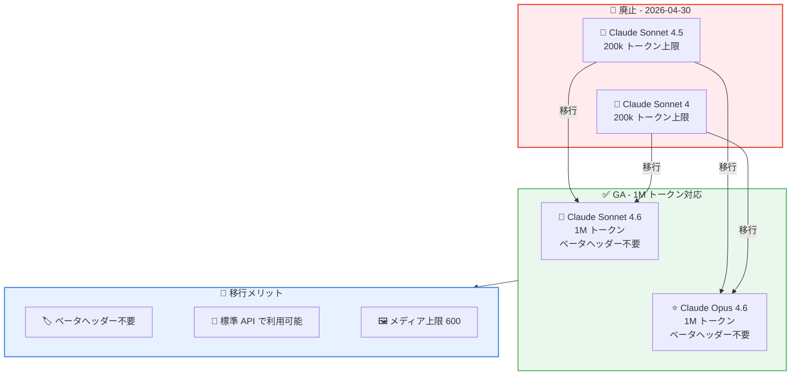
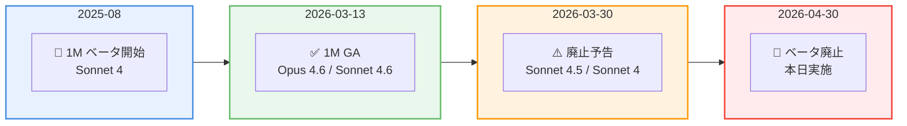
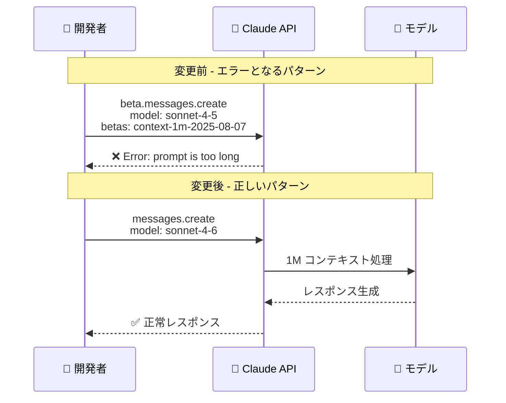

# Claude Sonnet 4.5 / Sonnet 4 の 1M トークンコンテキストウィンドウベータが廃止

## メタデータ

| 項目 | 内容 |
|------|------|
| 発表日 | 2026-04-30 |
| ソース | Claude Developer Platform Release Notes |
| カテゴリ | API アップデート (Breaking Change) |
| 公式リンク | https://platform.claude.com/docs/en/release-notes/overview |

## 概要

Anthropic は 2026 年 4 月 30 日、Claude Sonnet 4.5 および Claude Sonnet 4 向けの 1M トークンコンテキストウィンドウベータ (`context-1m-2025-08-07`) を正式に廃止しました。これにより、これらのモデルでベータヘッダーを指定しても効果がなくなり、標準の 200k トークンコンテキストウィンドウを超えるリクエストはエラーを返すようになります。1M トークンコンテキストウィンドウを引き続き利用するには、Claude Sonnet 4.6 または Claude Opus 4.6 への移行が必要です。これらのモデルでは 1M コンテキストが GA (正式リリース) として標準価格で提供されており、ベータヘッダーは不要です。

## 詳細

### 背景

1M トークンコンテキストウィンドウは、2025 年 8 月 12 日に Claude Sonnet 4 向けのベータ機能として初めて提供されました。その後、Claude Sonnet 4.5 でも利用可能になり、`context-1m-2025-08-07` ベータヘッダーを指定することで 200k トークンを超えるリクエストを送信できました。

2026 年 3 月 13 日に Claude Opus 4.6 と Sonnet 4.6 で 1M コンテキストウィンドウが GA となり、ベータヘッダー不要で利用可能になりました。これに伴い、2026 年 3 月 30 日に Sonnet 4.5 / Sonnet 4 向けベータの廃止が予告され、移行期間として 1 か月が設けられていました。本日 2026 年 4 月 30 日をもって、予告通りベータが正式に廃止されました。

### 主な変更点

1. **ベータヘッダーの無効化**: Claude Sonnet 4.5 および Sonnet 4 に対して `context-1m-2025-08-07` ベータヘッダーを指定しても、効果がなくなりました
2. **200k 超リクエストのエラー化**: これらのモデルで標準の 200k トークンコンテキストウィンドウを超えるリクエストを送信すると、エラーが返されます
3. **移行先の明確化**: 1M コンテキストウィンドウの利用には Claude Sonnet 4.6 または Claude Opus 4.6 への移行が必要です

### 技術的な詳細

#### モデル別コンテキストウィンドウの状況 (2026 年 4 月 30 日以降)

| モデル | 最大コンテキスト | ベータヘッダー | ステータス |
|--------|-----------------|---------------|-----------|
| Claude Opus 4.6 | 1M トークン | 不要 | GA |
| Claude Sonnet 4.6 | 1M トークン | 不要 | GA |
| Claude Sonnet 4.5 | 200k トークン | 無効 | ベータ廃止 |
| Claude Sonnet 4 | 200k トークン | 無効 | ベータ廃止 |
| Claude Haiku 4.5 | 200k トークン | - | 標準 |

#### タイムライン

| 日付 | イベント |
|------|---------|
| 2025 年 8 月 12 日 | 1M コンテキストベータ開始 (Sonnet 4) |
| 2026 年 3 月 13 日 | Opus 4.6 / Sonnet 4.6 で 1M コンテキスト GA |
| 2026 年 3 月 30 日 | Sonnet 4.5 / Sonnet 4 向けベータ廃止予告 |
| 2026 年 4 月 30 日 | ベータ正式廃止 (本日) |

#### エラーレスポンス

廃止後、Sonnet 4.5 / Sonnet 4 で 200k トークンを超えるリクエストを送信すると、以下のようなエラーが返されます。

```json
{
  "type": "error",
  "error": {
    "type": "invalid_request_error",
    "message": "prompt is too long: xxxxxx tokens > 200000 maximum"
  }
}
```

## 開発者への影響

### 対象

- Claude Sonnet 4.5 または Sonnet 4 で `context-1m-2025-08-07` ベータヘッダーを使用して 1M コンテキストウィンドウを利用していた開発者
- 200k トークンを超える長文ドキュメント処理を行うアプリケーションを運用している開発者
- 大量の画像や PDF を 1 リクエストで処理していた開発者

### 必要なアクション

**即時対応が必要です。** 本日以降、Sonnet 4.5 / Sonnet 4 で 200k トークンを超えるリクエストはエラーとなります。

1. **モデルの移行**: `claude-sonnet-4-5-20250929` または `claude-sonnet-4-20250514` を使用している箇所を、`claude-sonnet-4-6-20260226` または `claude-opus-4-6-20260205` に変更
2. **ベータヘッダーの削除**: `betas=["context-1m-2025-08-07"]` の指定を削除 (移行先モデルでは不要)
3. **API クライアントの変更**: `client.beta.messages.create()` から `client.messages.create()` へ変更
4. **テストの実行**: 移行後のリクエストが正常に処理されることを確認

### 移行ガイド

#### ステップ 1: モデル名の変更

| 変更前 | 変更後 |
|--------|--------|
| `claude-sonnet-4-5-20250929` | `claude-sonnet-4-6-20260226` |
| `claude-sonnet-4-20250514` | `claude-sonnet-4-6-20260226` |
| (高性能が必要な場合) | `claude-opus-4-6-20260205` |

#### ステップ 2: ベータヘッダーの削除

移行先モデルでは 1M コンテキストウィンドウが標準機能として提供されるため、ベータヘッダーの指定は不要です。

#### ステップ 3: API クライアントコードの更新

`client.beta.messages.create()` を `client.messages.create()` に変更し、`betas` パラメータを削除します。

#### 注意事項

- 200k トークンを超える入力には Long Context Pricing が適用されます
- 1M コンテキスト使用時のメディアリミットは最大 600 画像 / PDF ページです
- Sonnet 4.6 と Opus 4.6 では 1M 専用のレートリミットはなく、アカウントの標準レートリミットが適用されます

## コード例

### 変更前: Sonnet 4.5 + ベータヘッダー (動作しなくなったコード)

```python
import anthropic

client = anthropic.Anthropic()

# 2026 年 4 月 30 日以降、このコードはエラーを返す
message = client.beta.messages.create(
    model="claude-sonnet-4-5-20250929",
    betas=["context-1m-2025-08-07"],
    max_tokens=16384,
    messages=[
        {
            "role": "user",
            "content": [
                {
                    "type": "text",
                    "text": large_document_text  # 200k トークン超のドキュメント
                },
                {
                    "type": "text",
                    "text": "この文書の要点をまとめてください。"
                }
            ]
        }
    ]
)
```

### 変更後: Sonnet 4.6 (ベータヘッダー不要)

```python
import anthropic

client = anthropic.Anthropic()

# Sonnet 4.6 では 1M コンテキストが GA - ベータヘッダー不要
message = client.messages.create(
    model="claude-sonnet-4-6-20260226",
    max_tokens=16384,
    messages=[
        {
            "role": "user",
            "content": [
                {
                    "type": "text",
                    "text": large_document_text  # 200k トークン超のドキュメント
                },
                {
                    "type": "text",
                    "text": "この文書の要点をまとめてください。"
                }
            ]
        }
    ]
)

print(message.content[0].text)
```

### 変更後: Opus 4.6 (高性能モデル)

```python
import anthropic

client = anthropic.Anthropic()

# Opus 4.6 では 1M コンテキストが GA - ベータヘッダー不要
message = client.messages.create(
    model="claude-opus-4-6-20260205",
    max_tokens=16384,
    messages=[
        {
            "role": "user",
            "content": [
                {
                    "type": "text",
                    "text": large_document_text  # 200k トークン超のドキュメント
                },
                {
                    "type": "text",
                    "text": "この文書の要点をまとめてください。"
                }
            ]
        }
    ]
)

print(message.content[0].text)
```

### curl での移行例

**変更前:**

```bash
curl https://api.anthropic.com/v1/messages \
     --header "x-api-key: $ANTHROPIC_API_KEY" \
     --header "anthropic-version: 2023-06-01" \
     --header "anthropic-beta: context-1m-2025-08-07" \
     --header "content-type: application/json" \
     --data '{
    "model": "claude-sonnet-4-5-20250929",
    "max_tokens": 16384,
    "messages": [
        {
            "role": "user",
            "content": "..."
        }
    ]
}'
```

**変更後:**

```bash
curl https://api.anthropic.com/v1/messages \
     --header "x-api-key: $ANTHROPIC_API_KEY" \
     --header "anthropic-version: 2023-06-01" \
     --header "content-type: application/json" \
     --data '{
    "model": "claude-sonnet-4-6-20260226",
    "max_tokens": 16384,
    "messages": [
        {
            "role": "user",
            "content": "..."
        }
    ]
}'
```

## アーキテクチャ図

### 移行パス



### 廃止のタイムライン



### API コールの変更



## 関連リンク

- [Claude Developer Platform Release Notes](https://platform.claude.com/docs/en/release-notes/overview)
- [Context Windows ドキュメント](https://platform.claude.com/docs/en/build-with-claude/context-windows)
- [Long Context Pricing](https://platform.claude.com/docs/en/about-claude/pricing#long-context-pricing)
- [Claude Models Overview](https://platform.claude.com/docs/en/about-claude/models/overview)
- [Beta Headers](https://platform.claude.com/docs/en/api/beta-headers)
- [1M コンテキスト GA レポート (2026-03-13)](./2026-03-13-1m-context-window-ga.md)
- [ベータ廃止予告レポート (2026-03-30)](./2026-03-30-batch-api-300k-and-1m-context-retirement.md)

## まとめ

2026 年 4 月 30 日をもって、Claude Sonnet 4.5 および Sonnet 4 向けの 1M トークンコンテキストウィンドウベータ (`context-1m-2025-08-07`) が正式に廃止されました。これは 2026 年 3 月 30 日に予告された Breaking Change であり、対象モデルでは 200k トークンを超えるリクエストがエラーを返すようになります。

1M トークンコンテキストウィンドウを引き続き利用するには、Claude Sonnet 4.6 または Claude Opus 4.6 への移行が必要です。移行先モデルでは 1M コンテキストが GA として標準価格で提供されており、ベータヘッダーの指定も不要です。移行により、`client.beta.messages.create()` から `client.messages.create()` へのシンプルな API コールに変更でき、コードの保守性も向上します。

まだ移行が完了していない場合は、即時対応が必要です。モデル名の変更、ベータヘッダーの削除、API クライアントメソッドの変更の 3 点を実施し、200k トークンを超えるリクエストが正常に処理されることを確認してください。
