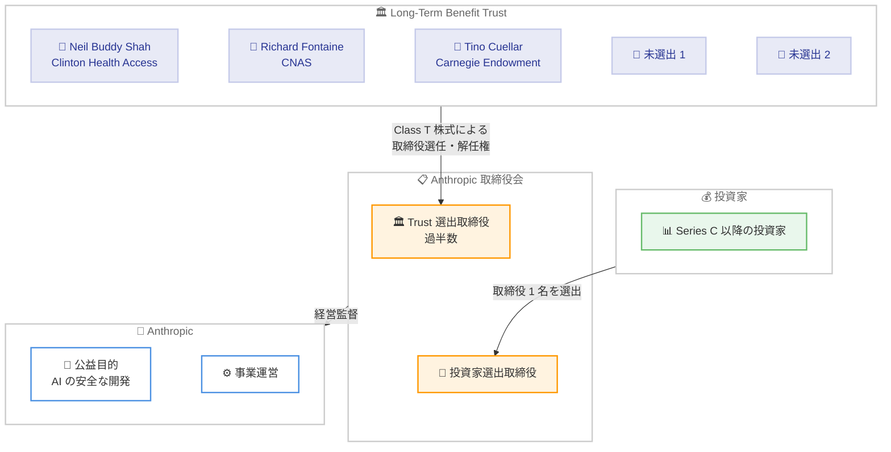

# Anthropic の Long-Term Benefit Trust (LTBT) - 独立ガバナンス機構の詳細公開

## メタデータ

| 項目 | 内容 |
|------|------|
| 発表日 | 2026-04-30 |
| ソース | [Anthropic News](https://www.anthropic.com/news) |
| カテゴリ | Announcements / コーポレートガバナンス |
| 公式リンク | [The Long-Term Benefit Trust](https://www.anthropic.com/news/the-long-term-benefit-trust) |

## 概要

Anthropic は、同社のコーポレートガバナンスの中核を担う独立機構「Long-Term Benefit Trust (LTBT)」に関する詳細情報を公開した。LTBT は AI の安全性、国家安全保障、公共政策、社会事業の分野で専門知識を持つ 5 名の Trustees で構成される独立機関であり、特別なクラスの株式 (Class T) を保有することで Anthropic の取締役の選任および解任権限を持つ。

この仕組みは、変革的な AI 技術がもたらす固有の課題に対応するために設計されたものであり、公益と株主利益のバランスを取ることを目的としている。Trust は 4 年以内に Anthropic の取締役会の過半数を選出する予定であり、AI 企業のガバナンスにおける新たな実験として注目される。

## 詳細

### 背景

Anthropic は、AI の影響が産業革命や科学革命に匹敵する可能性があると考えている。同社が特に重視するリスクは 2 つある。

1. **技術的アラインメント問題**: 設計者よりも賢いシステムを安全に構築することの困難さ
2. **社会的混乱**: 急速な AI の進歩に伴う社会構造への影響

これらのリスクに対応するため、従来の企業統治構造では不十分であると判断し、独自のガバナンス機構として LTBT を設立した。Anthropic はデラウェア州公益法人 (Public Benefit Corporation, PBC) として登記されており、LTBT はその公益目的を長期的に担保する役割を果たす。

### 主な内容

1. **LTBT の基本構造**: AI 安全性、国家安全保障、公共政策、社会事業の専門家 5 名で構成される独立機関
2. **権限**: Class T 株式を通じた取締役の選任・解任権
3. **タイムライン**: 4 年以内に取締役会の過半数を Trust が選出
4. **投資家の役割**: Series C 以降の投資家が選出する新たな取締役枠を設置
5. **設計思想**: 財務的利害から隔離された Trustees による長期的視点での監督
6. **実験的性格**: Anthropic 自身がこの構造を「熟慮された仮説」と位置付け

### LTBT の構造と仕組み

LTBT の設計における主要な原則は以下の通りである。

**独立性の確保**: Trustees は Anthropic に対する財務的利害関係から隔離されている。これにより、短期的な利益追求に左右されない判断が可能となる。

**迂回防止の設計**: 構造は「エンドラン」(正規のプロセスを迂回する試み) に対して耐性を持つよう設計されている。

**長期的視点**: Trust は日常的な経営判断ではなく、長期的な課題や極端な事態に焦点を当てる。

**法的設計チーム**: Yale Law School の John Morley 教授、Wilson Sonsini の David Berger および Amy Simmerman、Harvard Law School の Noah Feldman、Ethical Compass Advisors の Seth Berman が構造設計に関与した。

### 現在の Trustees

| 名前 | 役職 | 就任時期 |
|------|------|----------|
| Neil Buddy Shah | Clinton Health Access Initiative CEO | 設立時 |
| Richard Fontaine | Center for a New American Security CEO | 2025 年 5 月 |
| Mariano-Florentino (Tino) Cuellar | Carnegie Endowment for International Peace 総裁 | 2026 年 1 月 |
| (未選出) | Trustees により選出予定 | - |
| (未選出) | Trustees により選出予定 | - |

**過去の Trustees**:

- **Jason Matheny**: 2023 年 12 月に RAND Corporation との利益相反のため退任
- **Paul Christiano**: 2024 年 4 月に退任、米国 AI Safety Institute の Head of AI Safety に就任
- **Kanika Bahl**: 2026 年 1 月に退任、AI Access Initiative 非営利団体を設立
- **Zach Robinson**: 2026 年 1 月に退任、非営利・慈善活動へ転向

## 社会・業界への影響

### 対象

- **AI 業界全体**: AI 企業のガバナンスモデルの先例として
- **投資家**: Anthropic への投資判断における重要な要素として
- **政策立案者**: AI 規制の枠組み検討における参考事例として
- **一般市民**: AI の安全性と公益性を担保する仕組みとして

### AI ガバナンスへの影響

LTBT は AI 企業のガバナンスにおいて以下の点で重要な先例を作る可能性がある。

1. **利益と安全性の分離**: 財務的利害から独立した監督機関を設置することで、AI の安全性に関する判断が市場圧力に影響されにくくなる
2. **長期的視点の制度化**: 四半期ごとの業績ではなく、数年から数十年単位での影響を考慮する構造
3. **外部専門家の関与**: AI 技術だけでなく、国家安全保障や公共政策の専門家が意思決定に参画する枠組み
4. **実験的アプローチの明示**: 完璧な解決策ではなく、反復的に改善していく姿勢を公式に宣言

## アーキテクチャ図

## 関連リンク

- [The Long-Term Benefit Trust - Anthropic](https://www.anthropic.com/news/the-long-term-benefit-trust)
- [Anthropic News](https://www.anthropic.com/news)
- [Anthropic のコーポレート構造 - Delaware PBC](https://www.anthropic.com/company)

## まとめ

Anthropic の LTBT は、AI 企業が直面する「利益追求と安全性確保の両立」という根本的な課題に対する構造的な解答の試みである。財務的利害から隔離された独立 Trustees が取締役会の過半数を選出するという仕組みは、従来の企業統治モデルにはない革新的なアプローチであり、AI 業界全体にとって重要な先例となる可能性がある。

同時に、Anthropic 自身がこの構造を「実験」と位置付けていることは注目に値する。完璧なガバナンスモデルが存在しないことを認めつつ、透明性を持って反復的に改善していく姿勢は、急速に進化する AI 技術のガバナンスにおいて現実的かつ責任あるアプローチと言える。今後、残り 2 名の Trustees がどのような人物で構成されるか、また Trust が取締役会の過半数を実際に選出する際にどのような基準で判断するかが、この実験の成否を占う重要な要素となるだろう。
