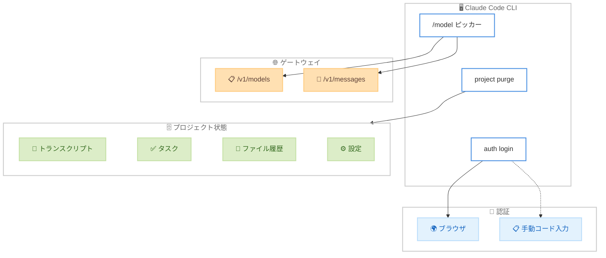

# Claude Code v2.1.126 リリース: ゲートウェイモデル選択、プロジェクト状態パージ、Windows 対応強化

## メタデータ

| 項目 | 内容 |
|------|------|
| 発表日 | 2026-05-01 |
| ソース | Claude Code Changelog |
| カテゴリ | Claude Code アップデート |
| 公式リンク | https://github.com/anthropics/claude-code/blob/main/CHANGELOG.md |

## 概要

Claude Code v2.1.126 が 2026 年 5 月 1 日にリリースされました。本リリースは、Anthropic 互換ゲートウェイからのモデル一覧取得、プロジェクト状態の完全パージコマンド、Windows 環境での大幅な改善、セキュリティ修正、そして多数のバグ修正を含む大規模アップデートです。特にエンタープライズ環境でのゲートウェイ連携と Windows 開発者向けの改善が注目されます。

## 詳細

### 背景

Claude Code はターミナルベースの AI 開発支援ツールとして、多様な環境 (macOS、Linux、WSL2、Windows、SSH、コンテナ) での利用が拡大しています。v2.1.126 では、エンタープライズ環境でのカスタムゲートウェイ連携の強化、プロジェクト管理の利便性向上、Windows ネイティブ対応の改善に重点が置かれています。

### 主な変更点

#### 新機能 - 10 件

1. **ゲートウェイモデルピッカー**: `/model` コマンドが `ANTHROPIC_BASE_URL` で指定されたゲートウェイの `/v1/models` エンドポイントからモデル一覧を取得して表示するようになりました。カスタムゲートウェイ経由でアクセス可能なモデルを直接選択できます

2. **`claude project purge` コマンド**: プロジェクトの Claude Code 状態 (トランスクリプト、タスク、ファイル履歴、設定エントリ) を完全に削除する新コマンドが追加されました。`--dry-run`、`-y/--yes`、`-i/--interactive`、`--all` オプションに対応しています

3. **`--dangerously-skip-permissions` の拡張**: `.claude/`、`.git/`、`.vscode/`、シェル設定ファイルなど、従来保護されていたパスへの書き込みプロンプトもバイパスするようになりました。ただし、壊滅的な削除コマンドは安全対策としてプロンプトが維持されます

4. **OAuth コード手動入力対応**: `claude auth login` でブラウザコールバックが localhost に到達できない環境 (WSL2、SSH、コンテナ) で、OAuth コードをターミナルに貼り付けて認証できるようになりました

5. **OpenTelemetry スキルイベント拡張**: `claude_code.skill_activated` イベントがユーザーのスラッシュコマンドでも発火するようになり、新しい `invocation_trigger` 属性 (`"user-slash"`、`"claude-proactive"`、`"nested-skill"`) が追加されました

6. **Auto モード権限チェック表示改善**: スピナーが権限チェックで停滞した際に赤色に変化するようになり、ツール実行中との区別が容易になりました

7. **ホスト管理デプロイメントのアナリティクス**: `CLAUDE_CODE_PROVIDER_MANAGED_BY_HOST` を使用するデプロイメントで、Bedrock/Vertex/Foundry 上でもアナリティクスが自動無効化されなくなりました

8. **Windows PowerShell 検出改善**: Microsoft Store、PATH なし MSI、.NET グローバルツールでインストールされた PowerShell 7 が検出されるようになりました

9. **Windows PowerShell 優先シェル**: PowerShell ツールが有効な場合、Bash ではなく PowerShell がプライマリシェルとして使用されます

10. **Read ツールのマルウェア評価削除**: レガシーモデルで不要な拒否や「これはマルウェアではありません」コメントを引き起こしていたファイルごとのマルウェア評価リマインダーが削除されました

#### セキュリティ修正 - 1 件

- **`allowManagedDomainsOnly` / `allowManagedReadPathsOnly` 修正**: 優先度の高いマネージド設定ソースに `sandbox` ブロックが含まれていない場合、これらの制限設定が無視される問題が修正されました。マルチテナント環境でのセキュリティポリシーの一貫性が確保されます

#### バグ修正 - 21 件

- **大型画像ペースト時のセッション破損修正**: 2000px を超える画像のペースト時にセッションが壊れる問題が修正されました。画像はペースト時にダウンスケールされ、履歴内のオーバーサイズ画像は自動削除・リトライされます
- **OAuth ログイン画面表示修正**: 「組織で OAuth が許可されていない」エラー時に管理者への連絡案内が表示されるようになりました
- **OAuth タイムアウト修正**: 低速接続、プロキシ経由、IPv6 専用 devcontainer、localhost 到達不可環境でのタイムアウトが修正されました
- **OAuth リフレッシュトークン消失修正**: 並行した資格情報書き込みで有効なリフレッシュトークンがクリアされるレースコンディションが修正されました
- **API リトライカウントダウン修正**: リトライ間隔が「0s」で停止する表示バグが修正されました
- **Mac スリープ復帰時のタイムアウト修正**: リクエスト中にスリープから復帰した際の「Stream idle timeout」エラーが修正されました
- **バックグラウンド/リモートセッションのタイムアウト修正**: 長時間のモデル思考中に誤って「Stream idle timeout」で中断される問題が修正されました
- **空ターン後のハング修正**: アシスタントが思考を完了しても出力が表示されないハングが修正されました
- **高速トラックパッドスクロール修正**: Cursor と VS Code 1.92-1.104 の統合ターミナルでの問題が修正されました
- **claude.ai MCP コネクタ修正**: needs-auth 状態のサーバーによって MCP コネクタが抑制される問題が修正されました
- **日本語/韓国語/中国語文字化け修正**: Windows の no-flicker モードでの文字化けが修正されました
- **`Ctrl+L` 動作修正**: プロンプト入力がクリアされる問題が修正され、readline 準拠の画面再描画のみになりました
- **Deferred ツール利用可能性修正**: `context: fork` を持つスキルやサブエージェントの初回ターンで WebSearch、WebFetch 等が利用可能になりました
- **Plan モードツール修正**: `--channels` で起動したインタラクティブセッションで Plan モードツールが利用可能になりました
- **リモートセッショントランスクリプト修正**: 特定のメッセージングツールが利用不可の場合の空トランスクリプトが修正されました
- **`/plugin` Uninstall 表示修正**: 「Enabled」ではなく正しく「Uninstalled」と表示されるようになりました
- **Linter 修正リマインダーの制限**: Linter が多数のファイルに触れた際のリマインダー合計サイズが制限されました
- **`/remote-control` リトライ表示修正**: 各リトライの結果が表示されるようになり、未登録のデバイスエラーが事前にキャッチされます
- **Remote Control 接続失敗通知修正**: 初回接続失敗時のエラー理由が通知に表示されるようになりました
- **Windows クリップボード修正**: コピー内容がプロセスコマンドライン引数に露出する問題が修正され、22KB 超のクリップボード書き込みも正常に動作します
- **PowerShell `--` トークン誤検出修正**: `git diff -- file` のような bare `--` が `--%` (stop-parsing token) として誤認されなくなりました
- **Agent SDK ハング修正**: モデルが並列ツール呼び出しバッチで不正なツール名を出力した際のハングが修正されました

#### Windows 対応改善 (まとめ)

Windows 固有の改善点が複数含まれています。

- PowerShell 7 の多様なインストール方法への対応
- PowerShell をプライマリシェルとして認識
- クリップボード書き込みのセキュリティ改善 (EDR/SIEM 対策)
- 日本語/韓国語/中国語の文字化け修正
- PowerShell の `--` トークン誤検出修正

### 技術的な詳細

**ゲートウェイモデルピッカー**: `ANTHROPIC_BASE_URL` が設定されている場合、Claude Code は `{ANTHROPIC_BASE_URL}/v1/models` に対して GET リクエストを送信し、利用可能なモデルの一覧を取得します。これにより、プロキシやゲートウェイを経由してアクセス制御されたモデルセットが `/model` ピッカーに動的に反映されます。

**`claude project purge` コマンド**: プロジェクトごとに蓄積される以下の状態データを一括削除します。

- トランスクリプト (会話履歴)
- タスク履歴
- ファイル変更履歴
- プロジェクト設定エントリ

`--all` オプションを使用すると、全プロジェクトの状態を一括でパージできます。

**セキュリティ修正の詳細**: マネージド設定の優先度チェーンにおいて、高優先度のソースに `sandbox` ブロックが存在しない場合でも、低優先度のソースに定義された `allowManagedDomainsOnly` / `allowManagedReadPathsOnly` 制限が正しく適用されるようになりました。

## 開発者への影響

### 対象

- **エンタープライズ環境のユーザー**: ゲートウェイモデルピッカーとマネージド設定のセキュリティ修正が直接的に影響します
- **Windows 開発者**: PowerShell 対応の強化、文字化け修正、クリップボードセキュリティ改善により使用体験が向上します
- **WSL2/SSH/コンテナユーザー**: OAuth コード手動入力に対応し、認証の柔軟性が向上します
- **CI/CD パイプラインユーザー**: `--dangerously-skip-permissions` の拡張と `claude project purge` により自動化スクリプトの管理が容易になります
- **全ユーザー**: Mac スリープ復帰時のタイムアウト修正、大型画像ペースト修正など、安定性が全般的に向上します

### 必要なアクション

以下のコマンドで最新バージョンに更新できます。

```bash
# npm でのアップデート
npm update -g @anthropic-ai/claude-code

# Homebrew でのアップデート
brew upgrade claude-code

# 現在のバージョン確認
claude --version
```

**セキュリティ修正が含まれているため、マネージド設定で `allowManagedDomainsOnly` または `allowManagedReadPathsOnly` を使用している環境では速やかなアップデートを推奨します。**

### 移行ガイド (該当する場合)

- **`Ctrl+L` の動作変更**: 以前はプロンプト入力をクリアしていましたが、v2.1.126 からは画面再描画のみになります。プロンプトクリアに `Ctrl+L` を使用していた場合は、別のキーバインドを設定する必要があります
- **Windows PowerShell ユーザー**: PowerShell ツールが有効な場合、自動的に PowerShell がプライマリシェルになります。Bash を引き続き使用したい場合は設定の確認が必要です

## コード例

```bash
# プロジェクト状態のパージ (ドライラン - 実際には削除しない)
claude project purge /path/to/project --dry-run

# プロジェクト状態のパージ (確認なし)
claude project purge /path/to/project --yes

# インタラクティブモードでパージ (削除対象を選択)
claude project purge /path/to/project --interactive

# 全プロジェクトの状態をパージ
claude project purge --all

# カスタムゲートウェイの設定例
export ANTHROPIC_BASE_URL="https://gateway.example.com/api"
claude
# /model コマンドでゲートウェイのモデル一覧が表示される

# WSL2/SSH 環境での OAuth ログイン
claude auth login
# ブラウザが開くが localhost に到達できない場合、
# ターミナルに OAuth コードを貼り付けて認証を完了
```

## アーキテクチャ図 (該当する場合)



## 関連リンク

- [Claude Code Changelog](https://github.com/anthropics/claude-code/blob/main/CHANGELOG.md)
- [Claude Code GitHub リポジトリ](https://github.com/anthropics/claude-code)
- [Claude Code npm パッケージ](https://www.npmjs.com/package/@anthropic-ai/claude-code)
- [Claude Code v2.1.123 レポート](./2026-04-29-claude-code-v2-1-123.md)

## まとめ

Claude Code v2.1.126 は、新機能 10 件、セキュリティ修正 1 件、バグ修正 21 件を含む大規模リリースです。

主なハイライトは以下の通りです。

- **ゲートウェイ統合**: `/model` ピッカーがカスタムゲートウェイのモデル一覧を動的に取得し、エンタープライズ環境での利便性が向上
- **プロジェクト管理**: `claude project purge` コマンドにより、プロジェクト状態の完全なクリーンアップが可能に
- **Windows 対応強化**: PowerShell 検出・優先シェル化、文字化け修正、クリップボードセキュリティ改善
- **認証の柔軟性**: WSL2、SSH、コンテナなど localhost 到達不可環境での OAuth 認証に対応
- **安定性向上**: Mac スリープ復帰、大型画像ペースト、バックグラウンドセッションのタイムアウトなど、多数の安定性改善

セキュリティ修正が含まれるため、特にマネージド設定を使用するエンタープライズ環境では速やかなアップデートを推奨します。
