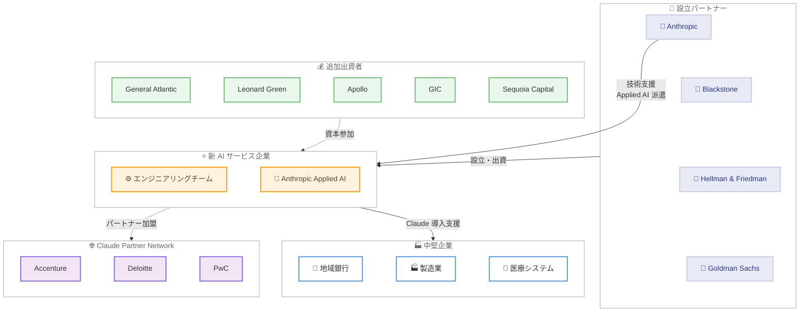

# Blackstone、Hellman & Friedman、Goldman Sachs と共同でエンタープライズ AI サービス企業を設立

## メタデータ

| 項目 | 内容 |
|------|------|
| 発表日 | 2026-05-04 |
| ソース | [Anthropic News](https://www.anthropic.com/news) |
| カテゴリ | パートナーシップ / 事業展開 |
| 公式リンク | [Building a new enterprise AI services company](https://www.anthropic.com/news/enterprise-ai-services-company) |

## 概要

Anthropic は Blackstone、Hellman & Friedman、Goldman Sachs と共同で、新たな AI サービス企業の設立を発表した。この新会社は、中堅企業を対象に Claude を基幹業務に導入するための専門的なエンジニアリング支援を提供する。Anthropic の Applied AI エンジニアが新会社のエンジニアリングチームと連携し、各企業において Claude が最も効果を発揮する領域を特定し、カスタムソリューションの構築と長期的なサポートを行う。

設立パートナーに加え、General Atlantic、Leonard Green、Apollo Global Management、GIC、Sequoia Capital を含む大手オルタナティブ資産運用会社のコンソーシアムが出資している。

## 詳細

### 背景

Claude をエンタープライズの基幹業務に導入するには、実践的なエンジニアリング作業と各事業に対する深い理解が必要となる。現在、Claude Partner Network に所属するシステムインテグレーターが大企業向けにこの業務を担っているが、中堅企業には異なる課題が存在する。

地域の銀行、中規模製造業、地方の医療システムなど、AI から大きな恩恵を受ける可能性のある企業が多数存在する一方で、これらの企業にはフロンティア AI のデプロイメントを自社で構築・運用するためのリソースが不足している。この需給ギャップを埋めるために新会社が設立された。

### 主な変更点

1. **新会社の設立**: Anthropic、Blackstone、Hellman & Friedman、Goldman Sachs による合弁 AI サービス企業
2. **対象市場の拡大**: 大企業向けに加え、中堅企業への Claude 導入を専門的に支援
3. **デリバリー能力の拡張**: 既存のシステムインテグレーターパートナーシップを補完する形での新たな導入支援チャネル
4. **Claude Partner Network への参加**: 新会社は Accenture、Deloitte、PwC 等と並ぶパートナーとして位置付け
5. **大規模な資本基盤**: 複数の大手オルタナティブ資産運用会社による出資

### 技術的な詳細

**典型的なエンゲージメントの流れ**:

新会社のサービス提供モデルは以下のステップで構成される。

1. **アセスメント**: 少人数のチームが顧客と密接に連携し、Claude が最大のインパクトを発揮できる領域を特定
2. **ソリューション開発**: 新会社のエンジニアと Anthropic Applied AI スタッフが連携し、各組織のオペレーションに最適化された Claude ベースのシステムを開発
3. **長期サポート**: 導入後の運用支援と継続的な最適化

**ユースケース例: 複数拠点の医療サービスグループ**

臨床医が日々多大な時間を費やしている業務に対して、Claude ベースのソリューションを構築する。

- ドキュメンテーション (診療記録の作成)
- 医療コーディング
- 事前承認 (Prior Authorization) の処理
- コンプライアンスレビュー

エンジニアリングチームが臨床医と IT スタッフと共に、既存のワークフローに自然に組み込まれるツールを設計・構築する。

## 開発者への影響

### 対象

- **中堅企業の IT 部門**: AI 導入を検討しているがリソースが限られている組織
- **Claude を活用したソリューション開発者**: 新たなパートナーシップチャネルを通じた案件拡大の機会
- **Claude Partner Network のパートナー**: エコシステム全体の拡大による市場拡大
- **ヘルスケア、金融、製造業の技術リーダー**: 業界固有のワークフローに Claude を統合する機会

### 必要なアクション

- **中堅企業**: 自社の業務プロセスにおいて AI による効率化が見込まれる領域の棚卸し
- **開発者**: Claude Partner Network を通じた協業機会の検討
- **既存パートナー**: 大企業向けサービスとの棲み分けを確認し、中堅企業セグメントでの連携を模索

### 移行ガイド (該当する場合)

該当なし。本発表は新規事業の設立であり、既存のサービスやパートナーシップへの変更は伴わない。

## コード例

該当なし

本発表はビジネスパートナーシップに関するものであり、API の変更やコードレベルの影響はない。

## アーキテクチャ図

## 関連リンク

- [Building a new enterprise AI services company - Anthropic](https://www.anthropic.com/news/enterprise-ai-services-company)
- [Anthropic News](https://www.anthropic.com/news)
- [Claude Partner Network](https://www.anthropic.com/partners)

## まとめ

Anthropic が Blackstone、Hellman & Friedman、Goldman Sachs と共同で設立する新たな AI サービス企業は、Claude のエンタープライズ展開における重要な戦略的拡張である。Anthropic CFO の Krishna Rao 氏が「Claude に対するエンタープライズ需要は、単一のデリバリーモデルを大幅に上回っている」と述べているように、既存のシステムインテグレーターパートナーシップだけではカバーしきれない市場ニーズに応える形での取り組みとなる。

特に注目すべきは、大手オルタナティブ資産運用会社による大規模な資本投入と、中堅企業という明確なターゲットセグメントの設定である。AI 導入の恩恵を受けうるものの自社リソースが不足している企業層に対して、Anthropic の技術力とパートナーの資本力・事業運営ノウハウを組み合わせることで、Claude のエコシステムを大幅に拡大する狙いがある。今後、Claude Partner Network 全体の成長と中堅企業における AI 活用の加速が期待される。
