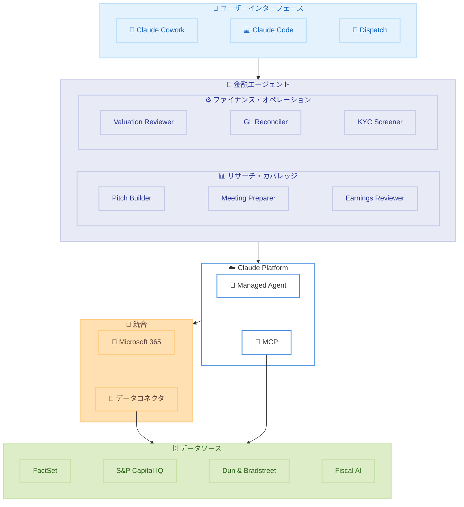

# 金融サービス向けエージェント - 10 種の新プラグインと Microsoft 365 統合

## メタデータ

| 項目 | 内容 |
|------|------|
| 発表日 | 2026-05-05 |
| ソース | Anthropic News |
| カテゴリ | 製品・サービス発表 |
| 公式リンク | [Agents for financial services](https://www.anthropic.com/news/finance-agents) |

## 概要

Anthropic は金融サービスおよび保険業界向けに、10 種類の新しい Cowork / Claude Code プラグインをリリースした。これに加え、Microsoft 365 スイート (Excel、PowerPoint、Word、Outlook) との統合、新しいデータコネクタ、および金融機関向け MCP アプリを提供する。

本リリースにより、投資銀行のピッチブック作成から KYC スクリーニングまで、金融業務の幅広い領域で AI エージェントを活用できるようになる。

## 詳細

### 背景

金融サービス業界では、リサーチ、モデル構築、コンプライアンス対応、月次決算など、多くの業務が高度な専門知識と大量のデータ処理を必要とする。これらの業務は定型的なワークフローに沿って行われることが多く、AI エージェントによる自動化・支援に適している。

Anthropic は既に Daloopa などの金融データプロバイダーとのコネクタを提供していたが、今回のリリースでは、より包括的な金融業務支援エコシステムを構築し、エンドツーエンドのワークフロー自動化を実現する。

### 主な変更点

#### リサーチ・クライアントカバレッジ (5 種)

以下のエージェントが新たに利用可能になった。

1. **Pitch builder**: ターゲットリストの作成、類似案件の分析、クライアントミーティング用ピッチブックの作成
2. **Meeting preparer**: 通話前のクライアント・カウンターパーティブリーフの作成
3. **Earnings reviewer**: 決算トランスクリプト・開示書類の読解、モデル更新、投資テーシスに関連する変化のフラグ付け
4. **Model builder**: 開示書類、データフィード、アナリストインプットからの財務モデル構築・維持
5. **Market researcher**: セクター・発行体の動向追跡、ニュース・開示書類・ブローカーリサーチの統合

#### ファイナンス・オペレーション (5 種)

6. **Valuation reviewer**: 類似案件・手法・社内レビュー基準に対するバリュエーション検証
7. **General ledger reconciler**: 総勘定元帳の照合および NAV (純資産価値) 計算
8. **Month-end closer**: 月次決算チェックリストの実行、仕訳入力、決算レポート作成
9. **Statement auditor**: 財務諸表の一貫性・完全性・監査準備状況のレビュー
10. **KYC screener**: エンティティファイルの作成、ソースドキュメントのレビュー、コンプライアンス向けエスカレーションパッケージの作成

#### デプロイモード

2 つのデプロイモードを提供する。

- **Claude Cowork / Claude Code プラグイン**: アナリストと並行して作業するアシスタントとして動作
- **Claude Managed Agent**: Claude Platform 上で自律的に動作するエージェントとして実行

#### Microsoft 365 統合

- **Excel**: 財務モデルの構築、数式の監査、感度分析の実行
- **PowerPoint**: 自動更新される数値を含むデッキの作成
- **Word**: 社内テンプレートに基づくクレジットメモの編集
- **Outlook**: チーフオブスタッフとして受信トレイのトリアージ、会議調整、返信作成

Claude は 4 つのプラットフォーム間でナレッジ・コンテキストを共有し、Dispatch 機能によりテキストまたは音声でどこからでもタスクを割り当てることが可能。

#### 新規データコネクタ

既存のコネクタに加え、以下が新たに追加された。

- **Dun & Bradstreet** (新規): 検証済みビジネスアイデンティティの提供、システムオブレコードの接続
- **Fiscal AI** (新規): リサーチ機能の拡張

既存コネクタ: FactSet、S&P Capital IQ、MSCI、PitchBook、Morningstar、Chronograph、LSEG、Daloopa

### 技術的な詳細

各エージェントは以下の技術基盤の上に構築されている。

- **MCP (Model Context Protocol)**: 金融データソースとの接続に MCP を使用し、標準化されたインターフェースでデータにアクセス
- **Claude Platform**: Managed Agent モードではプラットフォーム上で自律実行が可能
- **Dispatch**: テキストまたは音声によるタスク割り当てインターフェース
- **コンテキスト共有**: Microsoft 365 アプリケーション間でナレッジとコンテキストを維持

## 開発者への影響

### 対象

- 金融サービス企業 (投資銀行、資産運用、保険) の IT チーム
- 金融機関向けソリューションを構築するシステムインテグレーター
- Claude Cowork / Claude Code を利用するフィナンシャルアナリスト
- コンプライアンス・オペレーション部門

### 必要なアクション

- 既存の Claude Platform 利用企業は、新しいプラグインを Cowork または Claude Code に追加して利用開始可能
- Microsoft 365 統合を利用する場合は、対象テナントでの統合設定が必要
- 新しいデータコネクタ (Dun & Bradstreet、Fiscal AI) を利用する場合は、各データプロバイダーとの契約およびコネクタ設定が必要
- Managed Agent モードで自律実行する場合は、Claude Platform でのエージェント設定とアクセス制御の構成が必要

### 移行ガイド (該当する場合)

既存の Daloopa コネクタや他の金融データコネクタを利用している場合、新しいエージェントはこれらのコネクタと互換性がある。既存のワークフローを維持しながら、新しいエージェントを段階的に導入することが可能。

## コード例

```python
# Claude Platform で金融エージェントを設定する例 (概念的なコード)
from anthropic import Anthropic

client = Anthropic()

# Managed Agent としてピッチビルダーを起動
agent = client.agents.create(
    name="pitch-builder",
    description="ピッチブック作成エージェント",
    tools=[
        {"type": "mcp", "server": "factset"},
        {"type": "mcp", "server": "sp-capital-iq"},
        {"type": "microsoft365", "apps": ["excel", "powerpoint"]},
    ],
    instructions="クライアントミーティング用のピッチブックを作成してください。"
)

# Dispatch でタスクを割り当て
task = client.agents.dispatch(
    agent_id=agent.id,
    message="来週の ABC Corp とのミーティング用にピッチブックを準備してください。"
)
```

## アーキテクチャ図



## 関連リンク

- [Agents for financial services - 公式発表](https://www.anthropic.com/news/finance-agents)
- [Anthropic News](https://www.anthropic.com/news)
- [Claude Platform](https://platform.claude.com/)

## まとめ

Anthropic は金融サービスおよび保険業界向けに、包括的な AI エージェントスイートをリリースした。10 種類の専用プラグインにより、リサーチからコンプライアンスまでの幅広い業務を支援する。Microsoft 365 との深い統合により、既存のワークフローを大きく変更することなく AI を導入でき、Dispatch 機能でどこからでもタスクを指示できる。Dun & Bradstreet や Fiscal AI などの新しいデータコネクタの追加により、より広範なデータソースへのアクセスも実現した。金融機関は Cowork プラグインとしてアナリストの横で使う方法と、Managed Agent として自律的に実行させる方法の 2 つのデプロイモードから選択できる。
