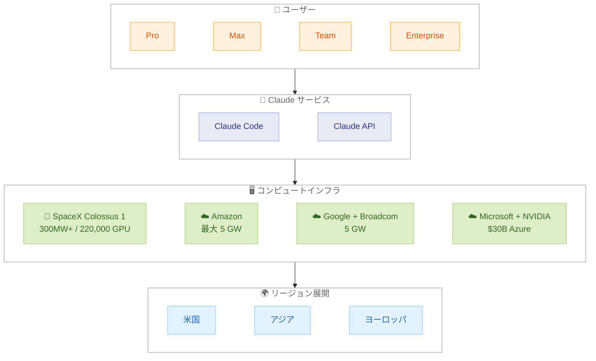

# Claude の使用量上限引き上げと SpaceX とのコンピュート契約

## メタデータ

| 項目 | 内容 |
|------|------|
| 発表日 | 2026-05-06 |
| ソース | Anthropic News |
| カテゴリ | インフラ・価格改定 |
| 公式リンク | https://www.anthropic.com/news/higher-limits-spacex |

## 概要

Anthropic は SpaceX との大規模なコンピュートパートナーシップを発表し、計算能力の大幅な増強を実現した。これにより、Claude Code および Claude API の使用量上限が即座に引き上げられた。SpaceX Colossus 1 データセンターでの 300 メガワット超の新規容量 (220,000 基以上の NVIDIA GPU) が 1 か月以内にオンラインとなり、Pro および Max サブスクライバーの容量を直接改善する。

## 詳細

### 背景

Anthropic は急増するユーザー需要に対応するため、複数の大規模コンピュート契約を締結してきた。今回の SpaceX との提携は、Amazon、Google、Microsoft、Fluidstack との既存の契約に加えて、さらなる計算能力の確保を目的としている。これらの投資により、Claude のサービス品質と可用性を維持しながら、使用量制限を緩和することが可能となった。

### 主な変更点

即時適用される変更点は以下の通り。

1. **Claude Code のレートリミット倍増**: Pro、Max、Team、シートベース Enterprise プランにおいて、5 時間あたりのレートリミットが 2 倍に引き上げ
2. **ピーク時間制限の撤廃**: Pro および Max アカウントにおける Claude Code のピーク時間中のリミット削減を廃止
3. **API レートリミットの大幅引き上げ**: Claude Opus モデルの API レートリミットを大幅に向上

### 技術的な詳細

#### SpaceX パートナーシップ

- SpaceX Colossus 1 データセンターの全コンピュート容量を利用する契約
- 300 メガワット超の新規容量 (220,000 基以上の NVIDIA GPU) を 1 か月以内に確保
- Claude Pro および Claude Max サブスクライバーの容量を直接改善
- 軌道上 AI コンピュート容量 (複数ギガワット規模) の開発にも関心を表明

#### その他のコンピュート契約

| パートナー | 容量 | 時期 |
|-----------|------|------|
| Amazon | 最大 5 GW (2026 年末までに約 1 GW) | 2026 年末 |
| Google + Broadcom | 5 GW | 2027 年 |
| Microsoft + NVIDIA | 300 億ドルの Azure 容量 | - |
| Fluidstack | 500 億ドルの米国 AI インフラ投資 | - |

#### 国際展開

- 規制産業の顧客向けにリージョン内インフラを整備
- Amazon との協力によりアジアおよびヨーロッパでの追加推論を提供
- データセンターに起因する消費者電力価格の上昇分をカバーすることをコミット
- 安全なサプライチェーンを持つ民主主義国とのパートナーシップを推進

## 開発者への影響

### 対象

- Claude Code を利用する全プランのユーザー (Pro、Max、Team、Enterprise)
- Claude API を利用する開発者 (特に Opus モデル利用者)
- 高頻度で Claude を利用するヘビーユーザー

### 必要なアクション

- **即時**: 新しいレートリミットは自動的に適用されるため、特別な対応は不要
- **推奨**: ピーク時間を避けて利用していた開発者は、制限撤廃を受けてワークフローを見直すことが可能
- **API 利用者**: Opus モデルの新しいレートリミットに合わせて、スロットリングロジックの調整を検討

### 移行ガイド (該当する場合)

特別な移行作業は不要。変更は即時適用され、既存のワークフローに影響を与えない。レートリミットの引き上げにより、これまでスロットリングが発生していた処理がスムーズに実行されるようになる。

## コード例

```python
import anthropic

# Claude Opus モデルのレートリミットが大幅に引き上げられたため、
# より高頻度のリクエストが可能に
client = anthropic.Anthropic()

# 以前はレートリミットにより制限されていた並列リクエストが
# より多く処理可能に
response = client.messages.create(
    model="claude-opus-4-6-20260416",
    max_tokens=4096,
    messages=[
        {"role": "user", "content": "大規模なコード分析を実行してください"}
    ]
)
```

## アーキテクチャ図



## 関連リンク

- [公式発表](https://www.anthropic.com/news/higher-limits-spacex)
- [Anthropic と Amazon の 5 GW コンピュート契約](https://www.anthropic.com/news/anthropic-amazon-5gw-compute)
- [Google + Broadcom パートナーシップ](https://www.anthropic.com/news/google-broadcom-partnership-compute)
- [API レートリミット](https://docs.anthropic.com/en/docs/about-claude/models#rate-limits)

## まとめ

今回の発表は、Anthropic が積極的にコンピュートインフラを拡大し、ユーザーの利用体験を直接改善していることを示している。SpaceX との提携により 300 メガワット超の新規容量が追加され、Claude Code のレートリミット倍増やピーク時間制限の撤廃が即時実現された。開発者にとっては、特別な対応なしにより多くのリクエストを処理できるようになる大きなメリットがある。今後も Amazon、Google、Microsoft との大規模契約が順次稼働することで、さらなる容量拡大が期待される。
