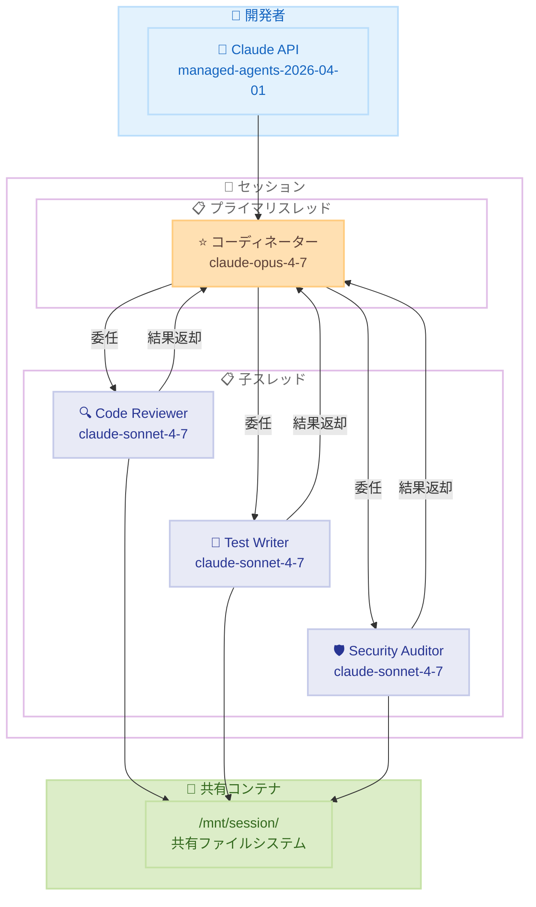
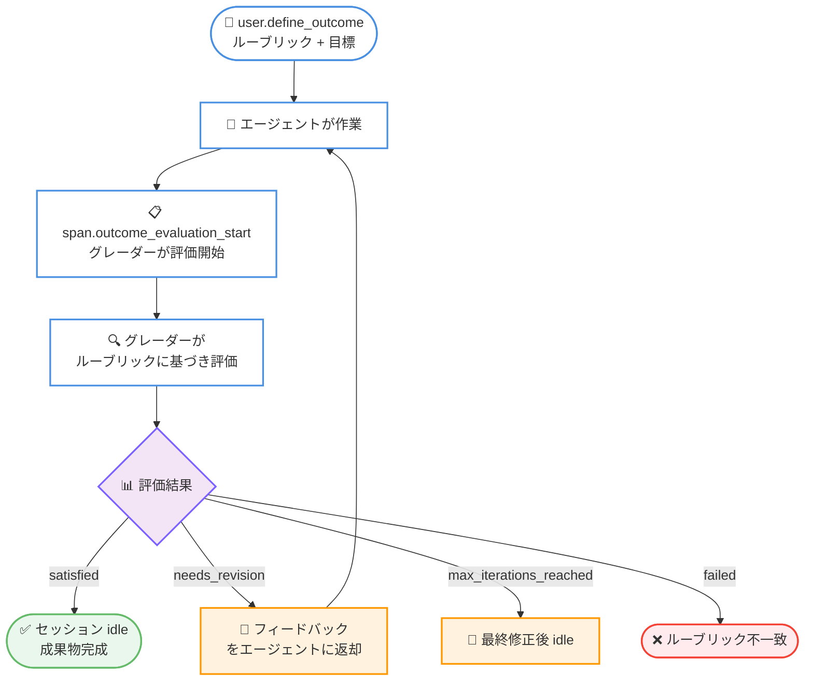
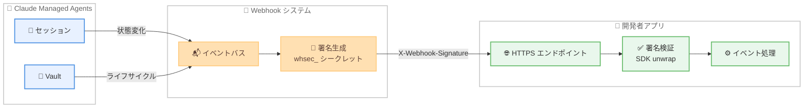

# Claude Managed Agents -- マルチエージェントセッション、Outcomes、Webhooks がパブリックベータに昇格

## メタデータ

| 項目 | 内容 |
|------|------|
| 発表日 | 2026-05-06 |
| ソース | [Claude API Release Notes](https://platform.claude.com/docs/en/release-notes/overview) |
| カテゴリ | API アップデート |
| 公式リンク | [Multiagent Sessions](https://platform.claude.com/docs/en/managed-agents/multi-agent)、[Define Outcomes](https://platform.claude.com/docs/en/managed-agents/define-outcomes)、[Webhooks](https://platform.claude.com/docs/en/managed-agents/webhooks) |

## 概要

2026 年 5 月 6 日、Anthropic は Claude Managed Agents の複数機能をパブリックベータとして正式公開しました。標準の `managed-agents-2026-04-01` ベータヘッダーで利用可能です。

今回のリリースでは、マルチエージェントセッション (複数エージェントの協調動作)、Outcomes (目標駆動型セッション)、Webhooks (イベント通知) の 3 つの主要機能がパブリックベータに昇格しました。これにより、開発者はより複雑で自律的なエージェントワークフローを構築でき、セッションの状態変化をポーリングなしで受信できるようになります。さらに、Vault の `mcp_oauth` クレデンシャルのバックグラウンドリフレッシュ対応や、セッション/イベントのフィルタリング・ソートオプションの追加も含まれています。

## 詳細

### 背景

Claude Managed Agents は 2026 年 4 月 8 日にパブリックベータとしてローンチされ、Claude を自律的なエージェントとして実行するフルマネージドハーネスを提供しています。4 月 23 日には Memory 機能が追加され、セッション横断の記憶保持が可能になりました。

マルチエージェントセッションと Outcomes は当初リサーチプレビューとして提供されており、別途アクセス申請が必要でした。今回のアップデートで標準のベータヘッダーだけで利用可能になり、すべての開発者がこれらの高度な機能にアクセスできるようになりました。

### 主な変更点

1. **マルチエージェントセッションのパブリックベータ化**: コーディネーターエージェントが複数の専門エージェントにタスクを委任し、並列または逐次で協調動作するマルチエージェントオーケストレーションが標準ベータとして利用可能に
2. **Outcomes のパブリックベータ化**: セッションを「会話」から「作業」に昇格させ、ルーブリックに基づく自動評価と反復改善を行う目標駆動型セッションが標準ベータとして利用可能に
3. **Webhooks の新規サポート**: セッションおよび Vault のライフサイクルイベントを HTTPS エンドポイントにプッシュ通知する Webhook 機能が追加
4. **Vault クレデンシャルのバックグラウンドリフレッシュ**: `mcp_oauth` タイプのクレデンシャルが、セッション中およびライフサイクル全体を通じて自動的にトークンをリフレッシュ
5. **フィルタリング・ソートオプションの追加**: セッションをステータスでフィルタ、イベントをタイプや作成時刻でフィルタ可能に

### 技術的な詳細

#### マルチエージェントセッション

マルチエージェントオーケストレーションでは、1 つのコーディネーターエージェントが複数のエージェントに作業を委任します。

- **共有コンテナ**: すべてのエージェントが同じコンテナとファイルシステムを共有
- **独立したスレッド**: 各エージェントは独自のセッションスレッド (コンテキスト分離されたイベントストリーム) で動作
- **永続的なスレッド**: コーディネーターは以前呼び出したエージェントにフォローアップを送信可能
- **最大同時スレッド数**: 25
- **委任可能エージェント数**: `multiagent.agents` に最大 20 のエージェントを登録可能
- **委任の深さ**: 1 レベルのみ (深い階層は無視)

コーディネーターのエージェント定義で `multiagent` フィールドを設定し、委任先エージェントのリストを宣言します。

**適したパターン:**

| パターン | 説明 |
|---------|------|
| 並列化 | 独立したサブタスクを同時に実行し、結果を統合 |
| 専門化 | ドメイン特化のシステムプロンプトとツールを持つエージェントにルーティング |
| エスカレーション | 複雑なサブタスクをより高性能なモデルに委託 |

**プライマリスレッドのイベント:**

| タイプ | 説明 |
|--------|------|
| `session.thread_created` | スレッドが作成された |
| `session.thread_status_running` | スレッドがアクティブになった |
| `session.thread_status_idle` | エージェントが入力待ち |
| `session.thread_status_terminated` | スレッドがアーカイブまたは終了エラー |
| `agent.thread_message_received` | エージェントがコーディネーターに結果を返した |
| `agent.thread_message_sent` | コーディネーターがエージェントにメッセージを送信した |

#### Outcomes

Outcomes はセッションを目標駆動型の作業に変換する機能です。

- **ルーブリック**: マークダウン形式で評価基準を定義。各基準は独立して評価される
- **グレーダー**: 別のコンテキストウィンドウで動作し、メインエージェントの実装に影響されない独立した評価を実施
- **反復改善**: グレーダーのフィードバックに基づいてエージェントが修正を繰り返す
- **最大イテレーション**: `max_iterations` で制御 (デフォルト 3、最大 20)
- **ルーブリックの指定方法**: インラインテキスト (`type: text`) または Files API でアップロードしたファイル (`type: file`)

**評価結果:**

| 結果 | 動作 |
|------|------|
| `satisfied` | セッションが `idle` に遷移 |
| `needs_revision` | エージェントが次のイテレーションを開始 |
| `max_iterations_reached` | 最終修正後にセッションが `idle` に遷移 |
| `failed` | ルーブリックとタスクが根本的に不一致の場合 |
| `interrupted` | ユーザーが中断した場合 |

#### Webhooks

Webhooks はセッションの主要な状態変化をポーリングなしで通知する機能です。

**登録方法**: Console の Manage > Webhooks で HTTPS エンドポイントを登録。署名シークレット (`whsec_` プレフィックス) が生成される。

**セッションイベント:**

| イベント | トリガー |
|---------|---------|
| `session.status_run_started` | エージェント実行開始 |
| `session.status_idled` | エージェントが入力待ち |
| `session.status_rescheduled` | 一時的エラーで自動リトライ |
| `session.status_terminated` | 終了エラー発生 |
| `session.thread_created` | マルチエージェントスレッド作成 |
| `session.thread_idled` | マルチエージェントスレッドが入力待ち |
| `session.thread_terminated` | マルチエージェントスレッドがアーカイブ |
| `session.outcome_evaluation_ended` | Outcome 評価完了 |

**Vault イベント:**

| イベント | トリガー |
|---------|---------|
| `vault.created` | Vault 作成 |
| `vault.archived` | Vault アーカイブ |
| `vault.deleted` | Vault 削除 |
| `vault_credential.created` | クレデンシャル作成 |
| `vault_credential.archived` | クレデンシャルアーカイブ |
| `vault_credential.deleted` | クレデンシャル削除 |
| `vault_credential.refresh_failed` | OAuth リフレッシュ失敗 |

**配信動作:**

- 順序は保証されない (`created_at` タイムスタンプでソート可能)
- 少なくとも 1 回リトライされる (同じ `event.id`)
- リダイレクトは追従しない (3xx は失敗扱い)
- 約 20 回連続失敗で自動無効化

## 開発者への影響

### 対象

- **複雑なワークフローを構築する開発者**: マルチエージェントセッションにより、コードレビュー、テスト作成、セキュリティ監査などを専門エージェントに並列委任可能
- **品質保証が重要なユースケースの開発者**: Outcomes のルーブリック評価により、成果物の品質を自動的に検証・改善
- **非同期処理を行うアプリケーションの開発者**: Webhooks により、長時間実行セッションの完了通知やエラー検知をポーリングなしで実現
- **OAuth 連携を利用する開発者**: Vault のバックグラウンドリフレッシュにより、トークン期限切れを自動的に処理

### 必要なアクション

1. **ベータヘッダーの確認**: `managed-agents-2026-04-01` ヘッダーが設定されていることを確認 (SDK を利用している場合は自動設定)
2. **マルチエージェント構成の設計**: コーディネーターエージェントと専門エージェントの役割分担を設計
3. **ルーブリックの作成**: Outcomes を活用する場合、具体的で採点可能な評価基準をマークダウンで作成
4. **Webhook エンドポイントの設定**: Console で HTTPS エンドポイントを登録し、署名検証ロジックを実装
5. **クレデンシャルリフレッシュの確認**: `mcp_oauth` クレデンシャルに `refresh` ブロックが正しく設定されているか確認

### 移行ガイド

今回のリリースは機能追加であり、破壊的変更はありません。リサーチプレビューからの移行も、ベータヘッダーが同じ `managed-agents-2026-04-01` であるため、コード変更は不要です。

**段階的導入ステップ:**

1. 既存のシングルエージェントセッションはそのまま動作を継続
2. マルチエージェントを導入する場合は、既存エージェントをそのまま専門エージェントとして再利用し、新たにコーディネーターエージェントを作成
3. Outcomes は既存セッションに `user.define_outcome` イベントを送信するだけで有効化可能
4. Webhooks は任意のタイミングで Console から登録可能

## コード例

### Python: マルチエージェントセッションの構築

```python
import anthropic

client = anthropic.Anthropic()

# 専門エージェントを作成
reviewer = client.beta.agents.create(
    name="Code Reviewer",
    model="claude-sonnet-4-7",
    system="You review code for bugs, performance issues, and best practices.",
    tools=[{"type": "agent_toolset_20260401"}],
)

test_writer = client.beta.agents.create(
    name="Test Writer",
    model="claude-sonnet-4-7",
    system="You write comprehensive unit tests for the given code.",
    tools=[{"type": "agent_toolset_20260401"}],
)

# コーディネーターエージェントを作成
coordinator = client.beta.agents.create(
    name="Engineering Lead",
    model="claude-opus-4-7",
    system="You coordinate engineering work. Delegate code review to the reviewer and test writing to the test writer.",
    tools=[{"type": "agent_toolset_20260401"}],
    multiagent={
        "type": "coordinator",
        "agents": [
            {"type": "agent", "id": reviewer.id},
            {"type": "agent", "id": test_writer.id},
        ],
    },
)

# セッションを作成して作業を開始
session = client.beta.sessions.create(
    agent=coordinator.id,
    environment_id=environment.id,
)

# スレッドの状態を確認
for thread in client.beta.sessions.threads.list(session.id):
    print(f"[{thread.agent.name}] {thread.status}")
```

### Python: Outcomes による目標駆動型セッション

```python
import anthropic

client = anthropic.Anthropic()

# セッションを作成
session = client.beta.sessions.create(
    agent=agent.id,
    environment_id=environment.id,
    title="Financial analysis on Costco",
)

# Outcome を定義 -- エージェントが即座に作業を開始
RUBRIC = """
# DCF Model Rubric

## Revenue Projections
- Uses historical revenue data from the last 5 fiscal years
- Projects revenue for at least 5 years forward

## Output Quality
- All figures are in a single .xlsx file with clearly labeled sheets
- Sensitivity analysis on WACC and terminal growth rate is included
"""

client.beta.sessions.events.send(
    session_id=session.id,
    events=[
        {
            "type": "user.define_outcome",
            "description": "Build a DCF model for Costco in .xlsx",
            "rubric": {"type": "text", "content": RUBRIC},
            "max_iterations": 5,
        }
    ],
)

# 評価結果を確認
session = client.beta.sessions.retrieve(session.id)
for outcome in session.outcome_evaluations:
    print(f"{outcome.outcome_id}: {outcome.result}")
```

### Python: Webhook の署名検証

```python
from flask import Flask, request
import anthropic

client = anthropic.Anthropic()  # ANTHROPIC_WEBHOOK_SIGNING_KEY を環境変数から読み込み
app = Flask(__name__)


@app.route("/webhook", methods=["POST"])
def webhook():
    try:
        # unwrap() は署名が無効またはペイロードが古い場合に例外を送出
        event = client.beta.webhooks.unwrap(
            request.get_data(as_text=True),
            headers=dict(request.headers),
        )
    except Exception:
        return "invalid signature", 400

    match event.data.type:
        case "session.status_idled":
            session = client.beta.sessions.retrieve(event.data.id)
            notify_user(session)
        case "vault_credential.refresh_failed":
            handle_refresh_failure(event.data.id)

    return "", 204
```

## アーキテクチャ図

### マルチエージェントセッションの全体構造



### Outcomes の評価フロー



### Webhooks のイベント配信フロー



## 関連リンク

- [Multiagent Sessions](https://platform.claude.com/docs/en/managed-agents/multi-agent) - マルチエージェントセッションのドキュメント
- [Define Outcomes](https://platform.claude.com/docs/en/managed-agents/define-outcomes) - Outcomes のドキュメント
- [Subscribe to Webhooks](https://platform.claude.com/docs/en/managed-agents/webhooks) - Webhooks のドキュメント
- [Authenticate with Vaults](https://platform.claude.com/docs/en/managed-agents/vaults) - Vault 認証のドキュメント
- [Claude API Release Notes](https://platform.claude.com/docs/en/release-notes/overview) - API リリースノート
- [Managed Agents Overview](https://platform.claude.com/docs/en/managed-agents/overview) - Managed Agents の概要

## まとめ

Claude Managed Agents のマルチエージェントセッション、Outcomes、Webhooks がパブリックベータとして正式に利用可能になりました。標準の `managed-agents-2026-04-01` ベータヘッダーで、すべての開発者がこれらの機能にアクセスできます。

マルチエージェントセッションでは、コーディネーターエージェントが最大 20 の専門エージェントにタスクを委任し、最大 25 の同時スレッドで並列処理を実行できます。各エージェントは独立したコンテキストを持ちつつ、共有ファイルシステムを通じて成果物を共有します。並列化、専門化、エスカレーションといったパターンにより、複雑なワークフローの品質と速度を向上させることが期待できます。

Outcomes は、エージェントの作業を「会話」から「目標達成」に昇格させます。マークダウン形式のルーブリックで評価基準を定義すると、独立したグレーダーが成果物を評価し、基準を満たすまでエージェントが反復的に修正を行います。最大 20 回のイテレーションが可能で、人間の介入なしに品質保証を自動化できます。

Webhooks はセッションと Vault のライフサイクルイベントを HTTPS エンドポイントにプッシュ通知し、ポーリングの必要性を排除します。SDK の `unwrap()` ヘルパーによる署名検証が各言語で提供されており、安全なイベント処理を簡潔に実装できます。

さらに、`mcp_oauth` クレデンシャルのバックグラウンドリフレッシュにより、OAuth トークンの期限切れが自動的に処理され、長時間実行セッションの信頼性が向上しました。セッションのステータスフィルタリングやイベントのタイプ/時刻フィルタリングも追加され、大量のセッションを管理するアプリケーションの運用効率が改善されています。
