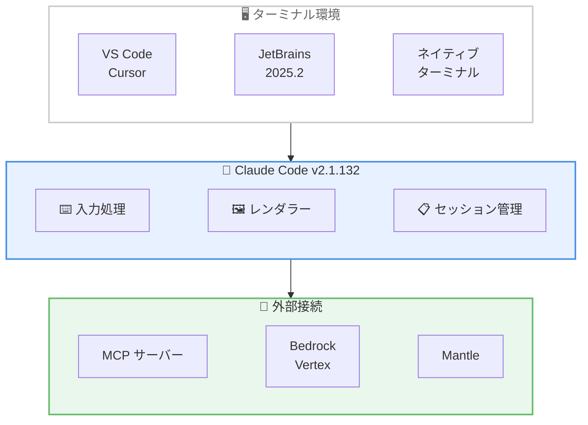

# Claude Code v2.1.131 / v2.1.132 リリース: 安定性改善とバグ修正

## メタデータ

| 項目 | 内容 |
|------|------|
| 発表日 | 2026-05-07 |
| ソース | Claude Code Changelog |
| カテゴリ | Claude Code アップデート |
| 公式リンク | https://github.com/anthropics/claude-code/blob/main/CHANGELOG.md |

## 概要

Claude Code v2.1.131 および v2.1.132 が 2026 年 5 月 7 日にリリースされました。前バージョン v2.1.129 (2026 年 5 月 6 日リリース) からわずか 1 日での更新となります。本リリースはターミナル処理の安定性向上、MCP サーバーの信頼性改善、IDE 互換性の修正に重点を置いた安定性改善とバグ修正が中心のリリースです。v2.1.132 では新しい環境変数 2 件の追加と 30 件以上のバグ修正が含まれ、v2.1.131 では VS Code 拡張機能の Windows 対応修正と Mantle エンドポイント認証の修正が行われています。

## 詳細

### 背景

Claude Code はターミナルベースの AI 開発支援ツールとして、さまざまな IDE やターミナル環境で使用されています。v2.1.129 のリリース後、ターミナルレンダリング、入力処理、MCP サーバー接続に関する多数の安定性問題が報告されていました。v2.1.131 / v2.1.132 はこれらの問題を包括的に解消し、特に VS Code、Cursor、JetBrains IDE 2025.2 などの統合ターミナル環境での使用体験を大幅に改善するリリースです。

### 主な変更点

#### 新機能・環境変数 - 3 件 (v2.1.132)

1. **`CLAUDE_CODE_SESSION_ID` 環境変数の追加**: Bash ツールのサブプロセス環境に `CLAUDE_CODE_SESSION_ID` が設定されるようになりました。フックに渡される `session_id` と一致するため、サブプロセスからセッションを識別できます

2. **`CLAUDE_CODE_DISABLE_ALTERNATE_SCREEN=1` 環境変数の追加**: フルスクリーンの代替画面レンダラーをオプトアウトし、ターミナルのネイティブスクロールバックに会話を保持できるようになりました

3. **「Pasting...」フッターヒントの追加**: Ctrl+V で画像を貼り付ける際、クリップボードから読み取り中であることを示すフッターヒントが表示されるようになりました

#### ターミナル・入力処理の修正 - 10 件 (v2.1.132)

1. **外部 SIGINT のグレースフルシャットダウン修正**: IDE の停止ボタンや `kill -INT` による外部 SIGINT で、ターミナルモードが復元され `--resume` ヒントが表示されるようになりました (以前は突然終了していました)

2. **SSH 切断時の未キャッチ例外修正**: ネイティブビルドでターミナルが閉じられた場合や SSH が切断された場合の未キャッチ例外が修正されました

3. **フルスクリーンモードのスリープ復帰後の空白画面修正**: ラップトップのスリープ/復帰後や Ctrl+Z/`fg` 後にフルスクリーンモードが空白画面を表示する問題が修正されました

4. **カーソル位置のグラフェム処理修正**: Ctrl+E/A/K/U/矢印キー使用時に、Indic 結合文字や ZWJ 絵文字が行をまたぐ場合のカーソル位置のずれが修正されました

5. **Vim オペレータの NFD 文字処理修正**: 分解済み (NFD) アクセント文字を含むテキストで Vim オペレータがテキストを破壊する問題が修正されました

6. **`/` で始まるテキストのペースト修正**: `/` で始まるテキストを貼り付けた際に入力が無視されるか、不明なコマンドとして処理される問題が修正されました

7. **ペースト時のエスケープシーケンス混入修正**: フォーカスイベントやマウストラッキングレポートがブラケットペーストに混入する問題が修正されました

8. **Cursor / VS Code 1.92-1.104 でのマウスホイールスクロール速度修正**: upstream の xterm.js バグによるスクロール速度の問題が修正されました

9. **JetBrains IDE 2025.2 ターミナルでのスクロールホイール処理修正**: 不正な矢印キー、逆方向イベント、暴走加速の問題が修正されました

10. **Windows でのキーボード入力停止修正**: `claude agents` からバックグラウンドセッションを再開した後のキーボード入力停止が修正されました

#### UI/UX 修正 - 8 件 (v2.1.132)

1. **`/usage` Ctrl+S のハング修正**: Linux/X11 でスタッツスクリーンショットをクリップボードにコピーする際のハングが修正されました

2. **`/terminal-setup` の Windows Terminal エラー修正**: Windows Terminal で矛盾するエラーが表示される問題が修正されました (Shift+Enter はネイティブサポートされています)

3. **`/effort` ピッカーの環境変数反映修正**: `CLAUDE_CODE_EFFORT_LEVEL` 環境変数のオーバーライドがピッカーに反映されない問題が修正されました

4. **`/status` のデフォルトモデル表示修正**: 一部のユーザーに対して誤ったデフォルトモデルが表示される問題が修正されました

5. **スラッシュコマンド補完ポップアップの表示修正**: ターミナルの高さに応じてスケールせず、3-5 個のコマンドしか表示されない問題が修正されました

6. **ステータスライン `context_window` トークン数修正**: 累積セッション合計ではなく、現在のコンテキスト使用量を正しく表示するようになりました

7. **Alt+T (thinking トグル) の macOS 修正**: 「Option as Meta」が無効な macOS ターミナル (iTerm2、Terminal.app のデフォルト) で動作しない問題が修正されました

8. **スラッシュコマンドダイアログの視覚的一貫性改善**: `/login`、`/upgrade`、`/extra-usage` ダイアログのスペーシングが改善されました

#### セッション管理の修正 - 2 件 (v2.1.132)

1. **`--resume` のサロゲートペア処理修正**: ツールエラーの切り詰めが絵文字を分割した場合に `no low surrogate in string` エラーで失敗する問題が修正されました。破損したセッションは読み込み時にサニタイズされます

2. **`--permission-mode` フラグの復元修正**: プランモードセッションを `-p --continue`/`--resume` で再開する際に `--permission-mode` フラグが無視される問題と、同一セッション内で `ExitPlanMode` 後にプランモードが再適用されない問題が修正されました

#### MCP サーバーの修正 - 3 件 (v2.1.132)

1. **メモリリークの修正**: stdio MCP サーバーが非プロトコルデータを stdout に書き込んだ際の無制限メモリ増加 (10GB 以上の RSS) が修正されました

2. **`tools/list` 失敗時のリトライ追加**: 接続はするが `tools/list` に失敗する MCP サーバーが 0 ツールとして無言で表示される問題が修正されました。1 回リトライし、失敗時は `/mcp` に "connected - tools fetch failed" を表示します

3. **未認証 MCP コネクターの表示修正**: claude.ai の未認証 MCP コネクターが "needs auth" ではなく "failed" と表示される問題と、ヘッドレス `-p` モードで非一時的な 4xx エラーをリトライし続ける問題が修正されました

#### Bedrock / Vertex 修正 - 1 件 (v2.1.132)

1. **`ENABLE_PROMPT_CACHING_1H` 設定時の 400 エラー修正**: Bedrock および Vertex で `ENABLE_PROMPT_CACHING_1H` が設定されている場合に 400 エラーが発生する問題が修正されました

#### v2.1.131 修正 - 2 件

1. **VS Code 拡張機能の Windows アクティベーション修正**: バンドルされた SDK のハードコードされたビルドパス (`createRequire` ポリフィルバグ) により Windows で VS Code 拡張機能がアクティベーションに失敗する問題が修正されました

2. **Mantle エンドポイント認証修正**: `x-api-key` ヘッダーの欠落により Mantle エンドポイント認証が失敗する問題が修正されました

### 技術的な詳細

**MCP サーバーメモリリークの解消**: stdio ベースの MCP サーバーが JSON-RPC プロトコルに準拠しないデータ (デバッグログ、スタックトレースなど) を stdout に書き込んだ場合、Claude Code がこれらのデータをバッファに蓄積し続け、メモリ使用量が 10GB を超えるケースが報告されていました。v2.1.132 では非プロトコルデータを検知した場合にバッファを適切に破棄するようになりました。

**セッション復元のサニタイズ処理**: セッションデータにはツールエラーの切り詰め時に絵文字のサロゲートペアが分割された不正な UTF-16 文字列が含まれることがありました。v2.1.132 ではセッション読み込み時に不正なサロゲートペアを検出し、置換文字で修復することで `--resume` の信頼性を向上させています。

**フルスクリーンレンダラーの復帰処理**: ラップトップのスリープ/復帰や Ctrl+Z (SIGTSTP) / `fg` (SIGCONT) の後、代替画面バッファの状態が失われます。v2.1.132 では SIGCONT シグナルハンドラーで画面全体を再描画し、次のキー入力やストリーム出力を待たずに即座に表示を復元します。

**JetBrains IDE 2025.2 ターミナル互換性**: JetBrains IDE 2025.2 の統合ターミナルは、マウスホイールイベントを矢印キーのエスケープシーケンスとして報告する場合があり、これによりスクロール方向の逆転や暴走加速が発生していました。v2.1.132 ではターミナルエミュレータの識別に基づいてスクロールイベントの解釈を調整しています。

## 開発者への影響

### 対象

- **全ユーザー**: ターミナル入力処理とセッション管理の安定性が大幅に向上
- **VS Code / Cursor ユーザー**: マウスホイールスクロール速度の正常化
- **JetBrains IDE 2025.2 ユーザー**: スクロールホイール処理の修正により正常な操作が可能に
- **Windows ユーザー**: VS Code 拡張機能のアクティベーション修正、キーボード入力停止の修正
- **macOS ユーザー (iTerm2 / Terminal.app)**: Alt+T の thinking トグルが動作するように
- **MCP サーバー利用者**: メモリリーク修正と接続エラーハンドリングの改善
- **Bedrock / Vertex ユーザー**: `ENABLE_PROMPT_CACHING_1H` 設定時の 400 エラー修正
- **SSH 接続ユーザー**: 切断時の例外処理改善とグレースフルシャットダウン
- **フルスクリーンモード利用者**: `CLAUDE_CODE_DISABLE_ALTERNATE_SCREEN=1` でネイティブスクロールバックを選択可能に

### 必要なアクション

以下のコマンドで最新バージョンに更新できます。

```bash
# npm でのアップデート
npm update -g @anthropic-ai/claude-code

# Homebrew でのアップデート
brew upgrade claude-code

# 現在のバージョン確認
claude --version
```

特別な移行作業は不要です。アップデートのみで全ての修正が適用されます。

### 移行ガイド (該当する場合)

本リリースは主にバグ修正であり、破壊的変更は含まれていません。以下の新機能を利用する場合のみ設定が必要です。

- **代替画面レンダラーのオプトアウト**: ネイティブスクロールバックを使用したい場合は `CLAUDE_CODE_DISABLE_ALTERNATE_SCREEN=1` を設定
- **セッション ID の活用**: フックスクリプトで `CLAUDE_CODE_SESSION_ID` 環境変数を参照してセッション固有の処理を実装可能

## コード例

```bash
# 代替画面レンダラーをオプトアウトしてネイティブスクロールバックを使用
export CLAUDE_CODE_DISABLE_ALTERNATE_SCREEN=1
claude

# セッション ID をフックスクリプトで活用
# hook.sh 内で:
echo "Current session: $CLAUDE_CODE_SESSION_ID"

# 破損したセッションの復元 (自動サニタイズ)
claude --resume <session-id>

# フルスクリーンモードのバナー確認
claude
# /tui fullscreen で起動バナーを確認

# バージョン確認
claude --version
# Expected: 2.1.132
```

## アーキテクチャ図 (該当する場合)



## 関連リンク

- [Claude Code Changelog](https://github.com/anthropics/claude-code/blob/main/CHANGELOG.md)
- [Claude Code GitHub リポジトリ](https://github.com/anthropics/claude-code)
- [Claude Code npm パッケージ](https://www.npmjs.com/package/@anthropic-ai/claude-code)
- [Claude Code v2.1.129 レポート](./2026-05-06-claude-code-v2-1-129.md)

## まとめ

Claude Code v2.1.131 / v2.1.132 は、新機能 3 件、バグ修正 30 件以上を含む安定性重視のリリースです。

主なハイライトは以下の通りです。

- **ターミナル入力処理の包括的修正**: カーソル位置、ペースト処理、Vim オペレータ、マウスホイールスクロールなど、日常的な入力操作に関する多数の問題を解消
- **IDE 互換性の向上**: VS Code / Cursor のスクロール速度修正、JetBrains IDE 2025.2 のスクロールホイール修正、Windows での VS Code 拡張機能アクティベーション修正
- **MCP サーバーの信頼性改善**: 10GB 以上のメモリリーク修正、接続失敗時のリトライとエラー表示改善
- **セッション管理の堅牢化**: `--resume` のサロゲートペア処理修正、`--permission-mode` フラグの復元修正、外部 SIGINT のグレースフルシャットダウン
- **新環境変数の追加**: `CLAUDE_CODE_SESSION_ID` によるサブプロセスからのセッション識別と `CLAUDE_CODE_DISABLE_ALTERNATE_SCREEN` によるレンダラー選択が可能に
- **Bedrock / Vertex の修正**: `ENABLE_PROMPT_CACHING_1H` 設定時の 400 エラーが解消

全般的に、多様なターミナル環境と IDE での安定性を大幅に向上させ、MCP エコシステムの信頼性を強化したメンテナンスリリースとなっています。前日リリースの v2.1.129 と合わせて、エンタープライズ環境での本番利用における信頼性が着実に改善されています。
