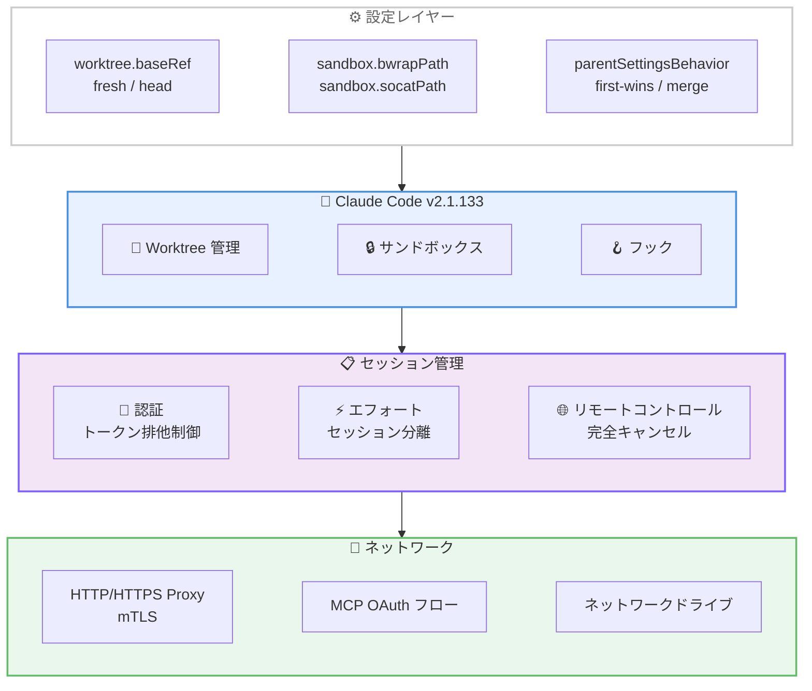

# Claude Code v2.1.133 リリース: Worktree 設定の柔軟化とプロキシ/セッション修正

## メタデータ

| 項目 | 内容 |
|------|------|
| 発表日 | 2026-05-07 |
| ソース | Claude Code Changelog |
| カテゴリ | Claude Code アップデート |
| 公式リンク | https://github.com/anthropics/claude-code/blob/main/CHANGELOG.md |

## 概要

Claude Code v2.1.133 が 2026 年 5 月 7 日にリリースされました。同日リリースの v2.1.131 / v2.1.132 に続く迅速なアップデートです。本リリースでは worktree のブランチ元を制御する `worktree.baseRef` 設定の追加、Linux/WSL 向けサンドボックスバイナリのカスタムパス指定、フックへのエフォートレベル伝達、メモリ使用量の改善など 5 件の新機能が追加されました。また、並列セッションでの 401 認証エラー、プロキシ設定の MCP OAuth フロー未適用、ネットワークドライブの権限問題など 9 件の重要なバグ修正が含まれています。

## 詳細

### 背景

Claude Code v2.1.128 以降、`EnterWorktree` のブランチ元がローカル `HEAD` に変更されていました。これにより未プッシュのコミットを含む状態で新しい worktree を作成できるようになりましたが、一方でクリーンな状態から作業を始めたいユースケースでは不便が生じていました。v2.1.133 ではこの動作を設定可能にし、デフォルトを `origin/<default>` に戻すことで、従来のクリーンな状態からのブランチ作成を標準動作としつつ、必要に応じてローカル HEAD からのブランチ作成も選択できるようにしています。

また、エンタープライズ環境で重要なプロキシ設定の MCP OAuth フロー全体への適用、並列セッション間の認証競合解消、ネットワークドライブの権限処理修正など、本番運用に影響する多数のバグ修正が含まれています。

### 主な変更点

#### 新機能 - 5 件

1. **`worktree.baseRef` 設定の追加**: `fresh` (デフォルト) または `head` を指定可能。`fresh` は `origin/<default>` から、`head` はローカル `HEAD` からブランチを作成します。`--worktree`、`EnterWorktree`、エージェント分離 worktree の全てに適用されます

2. **`sandbox.bwrapPath` / `sandbox.socatPath` 設定の追加**: Linux/WSL 環境で bubblewrap と socat のカスタムバイナリパスを管理設定として指定可能になりました。非標準パスにインストールされたバイナリを使用するエンタープライズ環境で有用です

3. **`parentSettingsBehavior` 管理キーの追加**: 管理者ティアのキーとして `'first-wins'` または `'merge'` を指定可能。SDK の `managedSettings` (親ティア) をポリシーマージに参加させるかどうかを制御します

4. **フックへのエフォートレベル伝達**: フックが `effort.level` JSON 入力フィールドと `$CLAUDE_EFFORT` 環境変数でアクティブなエフォートレベルを受信可能に。Bash ツールコマンドからも `$CLAUDE_EFFORT` を読み取れます

5. **`claude --help` の改善**: `--remote-control` が `--remote-control-session-name-prefix` と並んで一覧に表示されるようになりました

#### 改善 - 2 件

1. **フォーカスモードの動作改善**: フォーカスモードの挙動が改善されました

2. **メモリ使用量の改善**: メモリ圧力下でウォームスペアのバックグラウンドワーカーを解放することで、メモリ使用量が削減されました

#### バグ修正 - 9 件

1. **並列セッションの 401 認証エラー修正**: リフレッシュトークンの競合により共有資格情報が上書きされ、全ての並列セッションが 401 エラーで停止する問題が修正されました

2. **ドライブルート権限ルールの修正**: `Edit`/`Write` の許可ルールが `C:\` や POSIX `/` のようなドライブルートにスコープされている場合、マッチングが不正になり常にプロンプトが表示される問題が修正されました

3. **ECOMPROMISED 未処理例外の修正**: クロックスキューやディスク遅延によりヒストリーファイルやセッションログのファイルロックが侵害された場合の未処理拒否が修正されました

4. **コンパクション中の Esc キー修正**: 会話コンパクション中に Esc を押すと偽のエラー通知「Error compacting conversation」が表示される問題が修正されました

5. **プロキシ設定の MCP OAuth 対応修正**: `HTTP(S)_PROXY` / `NO_PROXY` / mTLS が MCP OAuth フロー全体 (ディスカバリ、動的クライアント登録、トークン交換、トークンリフレッシュ) で適用されるようになりました

6. **ネットワークドライブの Read/Write/Edit 修正**: `--add-dir` / SDK `additionalDirectories` で渡されたマッピングされたネットワークドライブで Read/Write/Edit が拒否される問題が修正されました

7. **リモートコントロールの停止/割り込み修正**: claude.ai からの Remote Control stop/interrupt が CLI セッションを完全にキャンセルせず、スタックしたツールやプロンプトの割り込み後にキューされたメッセージが進まない問題が修正されました

8. **`/effort` のセッション間干渉修正**: 1 つのセッションでの `/effort` 変更が他の同時実行セッションのエフォートレベルを予期せず変更する問題と、IDE からのエフォート変更が無言で破棄される関連問題が修正されました

9. **サブエージェントのスキル発見修正**: サブエージェントが Skill ツールを通じてプロジェクト、ユーザー、プラグインのスキルを発見できない問題が修正されました

#### VS Code 拡張機能修正 - 1 件

1. **`claudeCode.claudeProcessWrapper` の修正**: 拡張機能ビルドが Claude バイナリをバンドルしていない場合に「Unsupported platform」エラーで失敗する問題が修正されました

### 技術的な詳細

**Worktree ブランチ元の制御**: `worktree.baseRef` 設定は Claude Code の worktree 機能全体に影響します。`fresh` (デフォルト) は `origin/<default>` (通常は `origin/main`) からブランチを作成するため、常にリモートの最新状態をベースにした作業が可能です。`head` は現在のローカル HEAD からブランチを作成するため、未プッシュのコミットを新しい worktree に引き継ぎたい場合に使用します。v2.1.128 以降 `head` がデフォルトでしたが、v2.1.133 で `fresh` に戻されたため、既存の `head` 動作に依存しているユーザーは明示的に設定を変更する必要があります。

**並列セッション認証競合の解消**: 複数の Claude Code セッションが同時に動作している場合、OAuth リフレッシュトークンの更新が競合し、1 つのセッションが新しいトークンを取得した際に他のセッションの資格情報が無効化されるレースコンディションが発生していました。v2.1.133 ではトークンリフレッシュの排他制御を改善し、複数セッション間で安全にトークンを共有できるようになりました。

**MCP OAuth プロキシ対応**: エンタープライズ環境ではプロキシ経由でのインターネットアクセスが必須ですが、MCP OAuth フローの一部 (動的クライアント登録、トークン交換、リフレッシュ) が `HTTP(S)_PROXY` 設定を無視していました。v2.1.133 では OAuth フロー全体で一貫してプロキシ設定と mTLS 証明書が適用されるようになり、プロキシ環境での MCP サーバー認証が正常に動作します。

**メモリ圧力対応**: Claude Code はレスポンス速度を向上させるためにバックグラウンドワーカーをウォームスペアとして待機させていますが、メモリ使用量が逼迫した場合にこれらのワーカーを解放するようになりました。これにより、長時間稼働するセッションや複数セッションの同時実行時のメモリ消費が改善されます。

## 開発者への影響

### 対象

- **全ユーザー**: エフォートレベルのセッション間干渉修正、メモリ使用量改善
- **Worktree 利用者**: `worktree.baseRef` 設定の追加とデフォルト変更 (v2.1.128 以降の `head` から `fresh` に戻る)
- **Linux/WSL ユーザー**: `sandbox.bwrapPath` / `sandbox.socatPath` でカスタムバイナリパスを指定可能
- **エンタープライズ管理者**: `parentSettingsBehavior` による SDK 管理設定のポリシーマージ制御
- **プロキシ環境ユーザー**: MCP OAuth フロー全体でプロキシと mTLS が適用
- **並列セッション利用者**: 401 認証エラーの競合解消
- **Windows ユーザー**: ドライブルート権限ルール修正、ネットワークドライブ対応
- **フック開発者**: `$CLAUDE_EFFORT` 環境変数と `effort.level` フィールドでエフォートレベルを取得可能
- **リモートコントロール利用者**: claude.ai からの stop/interrupt が正常に動作
- **マルチエージェント構成**: サブエージェントのスキル発見が正常に動作

### 必要なアクション

以下のコマンドで最新バージョンに更新できます。

```bash
# npm でのアップデート
npm update -g @anthropic-ai/claude-code

# Homebrew でのアップデート
brew upgrade claude-code

# 現在のバージョン確認
claude --version
```

**重要**: v2.1.128 以降の `EnterWorktree` のローカル HEAD ベースの動作に依存している場合は、アップデート後に `worktree.baseRef: "head"` を設定してください。

### 移行ガイド (該当する場合)

v2.1.128 以降、`EnterWorktree` はローカル `HEAD` からブランチを作成していましたが、v2.1.133 でデフォルトが `origin/<default>` に戻されました。未プッシュのコミットを新しい worktree に含めたい場合は、以下の設定を追加してください。

```json
{
  "worktree": {
    "baseRef": "head"
  }
}
```

この設定は `.claude/settings.json` (プロジェクト設定) または `~/.claude/settings.json` (ユーザー設定) に追加できます。

## コード例

```json
// .claude/settings.json - worktree のブランチ元を設定
{
  "worktree": {
    "baseRef": "head"
  }
}
```

```json
// .claude/settings.json - Linux/WSL カスタムサンドボックスパス
{
  "sandbox": {
    "bwrapPath": "/opt/custom/bin/bwrap",
    "socatPath": "/opt/custom/bin/socat"
  }
}
```

```json
// SDK 管理設定のポリシーマージ制御
{
  "parentSettingsBehavior": "merge"
}
```

```bash
# フックスクリプトでエフォートレベルを参照
#!/bin/bash
echo "Current effort level: $CLAUDE_EFFORT"

if [ "$CLAUDE_EFFORT" = "high" ]; then
  # 高エフォートモード時の追加処理
  run_comprehensive_tests
fi
```

```bash
# バージョン確認
claude --version
# Expected: 2.1.133

# リモートコントロールオプションの確認
claude --help | grep remote-control
```

## アーキテクチャ図 (該当する場合)



## 関連リンク

- [Claude Code Changelog](https://github.com/anthropics/claude-code/blob/main/CHANGELOG.md)
- [Claude Code GitHub リポジトリ](https://github.com/anthropics/claude-code)
- [Claude Code npm パッケージ](https://www.npmjs.com/package/@anthropic-ai/claude-code)
- [Claude Code v2.1.131 / v2.1.132 レポート](./2026-05-07-claude-code-v2-1-131-v2-1-132.md)
- [Claude Code v2.1.129 レポート](./2026-05-06-claude-code-v2-1-129.md)

## まとめ

Claude Code v2.1.133 は、新機能 5 件、改善 2 件、バグ修正 10 件を含むリリースです。

主なハイライトは以下の通りです。

- **Worktree ブランチ元の柔軟化**: `worktree.baseRef` 設定により `origin/<default>` (クリーンな状態) またはローカル `HEAD` (未プッシュコミット含む) を選択可能に。デフォルトは v2.1.128 以前の `fresh` に戻される
- **エンタープライズ環境対応の強化**: Linux/WSL のカスタムサンドボックスバイナリパス指定、SDK 管理設定のポリシーマージ制御、プロキシ設定の MCP OAuth フロー全体への適用
- **並列セッションの信頼性向上**: リフレッシュトークン競合による 401 エラー修正、エフォートレベルのセッション間干渉修正
- **フックエコシステムの拡充**: `$CLAUDE_EFFORT` 環境変数と `effort.level` JSON フィールドでエフォートレベルを取得可能に
- **メモリ効率の改善**: メモリ圧力下でウォームスペアワーカーを解放することで長時間セッションのメモリ消費を削減
- **ネットワーク環境の修正**: プロキシ/mTLS の MCP OAuth 対応、ネットワークドライブの権限修正、リモートコントロールの完全キャンセル対応

v2.1.131 / v2.1.132 と同日にリリースされた本バージョンは、特にエンタープライズ環境での並列セッション運用、プロキシ経由の MCP 認証、worktree ベースの開発ワークフローの信頼性を大幅に向上させるリリースとなっています。
