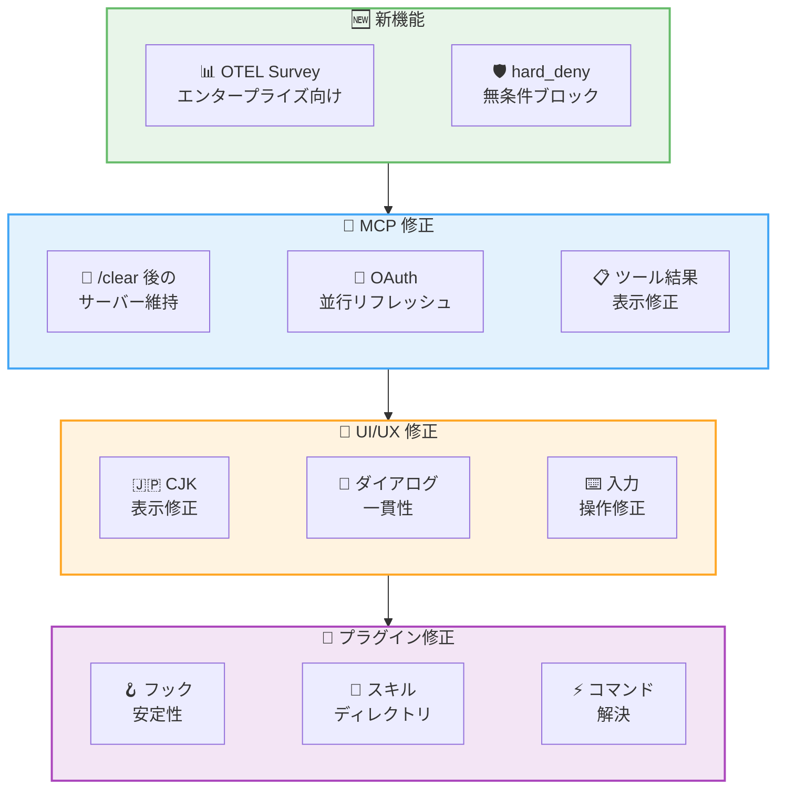

# Claude Code v2.1.136 リリース: MCP 接続安定性の大幅改善と 52 件のバグ修正

## メタデータ

| 項目 | 内容 |
|------|------|
| 発表日 | 2026-05-08 |
| ソース | Claude Code Changelog |
| カテゴリ | Claude Code アップデート |
| 公式リンク | https://github.com/anthropics/claude-code/blob/main/CHANGELOG.md |

## 概要

Claude Code v2.1.136 が 2026 年 5 月 8 日にリリースされました。本リリースは 2 件の新機能、52 件のバグ修正、1 件の動作変更を含む大規模なメンテナンスリリースです。特に MCP サーバーが `/clear` 後に消失する問題の修正、OAuth トークンのリフレッシュ競合解消、拡張思考のエラー修正など、日常的な開発体験に直接影響する重要な修正が多数含まれています。エンタープライズ向けの OTEL フィードバック調査の再有効化設定と、自動モードの強化的なブロック分類ルールが新機能として追加されました。

## 詳細

### 背景

Claude Code は急速に機能拡張を続けており、MCP (Model Context Protocol) サーバー連携、プラグインエコシステム、マルチセッション管理など多くのコンポーネントが統合されています。本リリースでは、これらのコンポーネント間の相互作用で発生していた多数のエッジケースやレースコンディションが修正されました。特に MCP 関連の修正は、VS Code 拡張機能、JetBrains プラグイン、Agent SDK の全プラットフォームに影響する重要な修正です。

### 主な変更点

#### 新機能 - 2 件

1. **`CLAUDE_CODE_ENABLE_FEEDBACK_SURVEY_FOR_OTEL`**: OpenTelemetry 経由でレスポンスをキャプチャしているエンタープライズ環境で、セッション品質サーベイを再有効化するための環境変数が追加されました

2. **`settings.autoMode.hard_deny`**: 自動モードの分類ルールにおいて、ユーザーの意図や許可例外に関わらず無条件でブロックする `hard_deny` ルールが追加されました。セキュリティポリシーの厳格な適用に有用です

#### バグ修正 - 52 件

##### MCP 関連 - 4 件

1. **MCP サーバーの消失修正**: `.mcp.json`、プラグイン、claude.ai コネクタで設定された MCP サーバーが、VS Code 拡張機能、JetBrains プラグイン、Agent SDK で `/clear` 実行後にサイレントに消失する問題が修正されました
2. **MCP OAuth リフレッシュトークンの消失修正**: 複数の MCP サーバーが同時にリフレッシュを行った際にトークンが失われる問題が修正されました。複数のリモート MCP サーバーを使用しているユーザーは、日次の再認証が不要になります
3. **MCP ツール結果の表示修正**: MCP サーバーがコンテンツブロックを返した際にツール結果が不可視になる問題が修正されました
4. **`/doctor` MCP スキーマエラー修正**: 欠落フィールド名やソースファイルパスが表示されるようになりました

##### 認証・セッション管理 - 5 件

5. **ログインループの修正**: 並行する資格情報書き込みが新しくローテーションされた OAuth トークンを上書きし、再ログインを強制するレアなループが修正されました
6. **`--resume` / `--continue` のパス修正**: プロジェクトパスにアンダースコアが含まれる場合にセッションが見つからない問題が修正されました
7. **`/clear <name>` のラベリング修正**: クリアされたセッションが `/resume` 用に正しくラベル付けされるようになりました
8. **`CLAUDE_ENV_FILE` の鮮度修正**: `SessionStart` フックからの環境変数が `/resume` や `/clear` 後に古くなる問題が修正されました
9. **`/branch` のタイトル修正**: 貼り付けられた複数行の名前が複数行のセッションタイトルとして保存される問題が修正されました

##### UI/UX - 16 件

10. **スラッシュコマンドダイアログの視覚的一貫性改善**: フッターヒント、ダイアログ間隔、矢印キースタイリングが標準化され、ダイアログフレームがロード中に即座に表示されるようになりました
11. **Bash 出力のカラー位置修正**: bash コマンド出力とマークダウンコードブロックで色が間違った位置に表示される問題が修正されました
12. **ReasonML 差分表示修正**: 単語差分境界で「undefined」テキストアーティファクトが表示される問題が修正されました
13. **CJK ターミナルのウェルカムバナー修正**: 省略記号がカラムオーバーフローを引き起こす問題が修正されました
14. **「Jump to bottom」オーバーレイ修正**: フルスクリーンモードで CJK 文字にカラーアーティファクトが残る問題が修正されました
15. **ワイドマークダウンテーブル修正**: ストリーミング中にターミナルスクロールバックに古いボーダード描画が残る問題が修正されました
16. **ストリーミング中のコピー修正**: コピーされたターミナル出力に末尾の空白が含まれる問題が修正されました
17. **カラム境界の折り返し修正**: 折り返しテキストの 2 行目に余分な先頭スペースが表示される問題が修正されました
18. **失敗したツールコールの展開修正**: フルスクリーンモードで出力が切り捨てられた際にクリック展開が機能しない問題が修正されました
19. **`/usage` の週次リセット表示修正**: 時刻ではなくカレンダー日付が表示されるようになりました
20. **`/mcp` サーバーリスト修正**: ターミナルに収まらない数のサーバーがある場合にスクロール可能になりました
21. **キーボードショートカットヒント修正**: `keybindings.json` でリバインドされたキーが反映されるようになりました
22. **`/settings` 言語変更修正**: 確認後に Escape で元に戻される問題が修正されました
23. **`/terminal-setup` のオートコンプリート修正**: 部分一致でも表示されるようになりました (以前は完全一致のみ)
24. **ツール折りたたみ分類変更時のクラッシュ修正**: ツールの折りたたみ可能性の分類がセッション中に変更された際のレンダラークラッシュが修正されました
25. **Bash 権限プロンプト修正**: 内部パーサー診断ではなくユーザーが読みやすい説明が表示されるようになりました

##### プラグインシステム - 5 件

26. **プラグイン `Stop`/`UserPromptSubmit` フック修正**: キャッシュクリーンアップが実行中のセッションで使用中のバージョンを削除した際にフックが失敗する問題が修正されました
27. **`skills` エントリのディレクトリ隠蔽修正**: `plugin.json` の `skills` エントリがプラグインのデフォルト `skills/` ディレクトリを隠す問題が修正され、ファイルパスを指定した場合にサイレント失敗ではなくエラーが表示されるようになりました
28. **プラグインのアンインストール/有効化修正**: スラッグの大文字小文字を区別せずにマッチングするようになりました
29. **プラグインスラッシュコマンドのスペース対応修正**: `/myplugin review` のようなスペースを含むコマンドがネームスペース形式に正しく解決されるようになりました
30. **プラグインマーケットプレイス削除キー変更**: 削除キーが `r` (リトライと衝突) から `d` (他の削除操作と統一) に変更されました

##### Plan モード・自動モード - 2 件

31. **Plan モードのファイル書き込みブロック修正**: マッチする `Edit(...)` 許可ルールが存在する場合に Plan モードがファイル書き込みをブロックしない問題が修正されました
32. **スクロール時の自動フォロー修正**: `autoScrollEnabled: false` 設定時に、最下部へのスクロールで自動フォローが再び有効になる問題が修正されました

##### API・拡張思考 - 1 件

33. **拡張思考の 400 エラー修正**: ツールコール後に拡張思考がリダクトされた思考ブロックを出力した際の API エラー (400) が修正されました

##### 入力・キーボード - 5 件

34. **WSL2 画像ペースト対応**: Windows クリップボードからの画像ペーストが、xclip/wl-paste がイメージデータを読み取れない場合に PowerShell フォールバックで動作するようになりました
35. **Backspace/Ctrl+Backspace の入れ替わり修正**: Ctrl+G で外部エディタを開いた後、persistent extended-key モードのターミナルでキーが入れ替わる問題が修正されました
36. **貼り付けテキストのドロップ修正**: 長いプロンプトが自動切り捨てされた際に貼り付けテキストプレースホルダーが含まれるテキストがサイレントに破棄される問題が修正されました
37. **プロンプトサジェスチョンの自動送信修正**: 空の入力で Enter がサジェスチョンを自動送信する代わりに、Tab または矢印キーでの受け入れが必要になりました
38. **入力途中のスラッシュコマンド補完修正**: 最初のスラッシュコマンド後に入力途中のオートコンプリートが機能しない問題が修正されました

##### ファイルピッカー (`@` メンション) - 2 件

39. **セッション中に作成されたファイルの検出修正**: 小規模な非 git ディレクトリでセッション中に作成されたファイルが `@` ファイルピッカーでマッチしない問題が修正されました
40. **100 エントリ超のディレクトリ対応修正**: 100 エントリ以上のディレクトリでファイルが見つからない問題が修正されました

##### Worktree - 2 件

41. **Worktree 退出ダイアログ修正**: worktree 削除後に間違ったディレクトリの未コミットファイルについて警告する問題が修正されました
42. **`--worktree` 衝突時のエラーメッセージ改善**: 既存または古い worktree と衝突した際のエラーメッセージが改善されました

##### その他 - 10 件

43. **IDE シェル統合ロックファイル修正**: `CLAUDE_CONFIG_DIR` が尊重されるようになりました
44. **ツールエラー切り捨てマーカー修正**: サロゲートペア文字列で負の数が表示される問題が修正されました
45. **`/insights` クラッシュ修正**: セッション履歴に不正な入力フィールドを持つツールコールが含まれる場合のクラッシュが修正されました
46. **`AskUserQuestion` 複数選択修正**: 配列として提供された複数選択回答が破棄される問題が修正されました
47. **`CronList` 出力修正**: 修飾子とスケジュールされたプロンプトが表示されるようになりました
48. **「Chat about this」修正**: `AskUserQuestion` ダイアログで質問テキストが消去される問題が修正されました
49. **`/release-notes` 更新修正**: Changelog リフレッシュ失敗後に古いバージョンに固定される問題が修正されました
50. **Esc キーのダイアログ解除修正**: `/install-github-app`、`/desktop`、`/resume`、`/web-setup` でダイアログが解除されるようになりました
51. **入力途中のスラッシュコマンドオートコンプリート修正**: 最初のスラッシュコマンド後にオートコンプリートが動作しない問題が修正されました
52. **`/settings` の Escape 動作修正**: 言語変更確認後の Escape で変更が取り消される問題が修正されました

#### 動作変更 - 1 件

1. **プラグインマーケットプレイス削除キーの変更**: 削除キーが `r` から `d` に変更されました。`d` は他の削除操作と一致し、`r` がリトライと衝突する問題が解消されます

### 技術的な詳細

**MCP サーバー消失問題の修正**: VS Code 拡張機能、JetBrains プラグイン、Agent SDK において、`/clear` コマンド実行時にセッション状態がリセットされる際、MCP サーバーの接続情報が再初期化されないまま破棄されていました。v2.1.136 では `/clear` 後のセッション再構築時に `.mcp.json`、プラグイン、コネクタの MCP 設定を再ロードすることで、サーバー接続が維持されます。

**OAuth トークンの並行リフレッシュ問題**: 複数のリモート MCP サーバーが設定されている環境では、トークンの有効期限が同時に到来した際に並行リフレッシュが発生します。各サーバーが個別にリフレッシュトークンを使用して新しいアクセストークンを取得しようとすると、最初のリフレッシュ成功時にリフレッシュトークン自体が無効化され、後続のリフレッシュが失敗していました。v2.1.136 ではリフレッシュ操作を直列化し、単一のリフレッシュトークンローテーションを全サーバー間で共有する仕組みが導入されました。

**拡張思考のリダクトブロック対応**: Claude API の拡張思考機能では、セキュリティ上の理由から思考内容がリダクトされる場合があります。ツールコール直後にリダクトされた思考ブロックが出力された場合、メッセージの構造が API の期待するスキーマに合致せず 400 エラーが返されていました。v2.1.136 ではリダクトされた思考ブロックの位置を適切にハンドリングし、API リクエストの構造を正規化しています。

**`settings.autoMode.hard_deny` の設計**: 従来の自動モード分類ルールでは、ユーザーの明示的な意図 (例: 「このファイルを削除してください」) があれば deny ルールをオーバーライドできる場合がありました。`hard_deny` はこの例外を許さず、分類に一致した操作を無条件でブロックします。これにより、組織のセキュリティポリシーで禁止された操作 (例: 本番環境への直接デプロイ) がユーザーの意図に関わらず確実にブロックされます。

## 開発者への影響

### 対象

- **全ユーザー**: MCP サーバー消失修正、UI/UX の多数の改善、入力操作の修正
- **MCP 利用者**: `/clear` 後のサーバー消失修正、OAuth リフレッシュトークン消失修正、日次再認証不要化
- **エンタープライズ管理者**: `CLAUDE_CODE_ENABLE_FEEDBACK_SURVEY_FOR_OTEL` によるセッション品質サーベイの再有効化、`settings.autoMode.hard_deny` による厳格なセキュリティポリシー適用
- **プラグイン開発者**: フックの安定性向上、スラッシュコマンドのスペース対応、スキルディレクトリの可視性修正
- **WSL2 ユーザー**: Windows クリップボードからの画像ペースト対応
- **CJK ターミナルユーザー**: ウェルカムバナー、カラーアーティファクト、折り返し表示の修正
- **拡張思考利用者**: リダクトブロック後の API エラー修正

### 必要なアクション

以下のコマンドで最新バージョンに更新できます。

```bash
# npm でのアップデート
npm update -g @anthropic-ai/claude-code

# Homebrew でのアップデート
brew upgrade claude-code

# 現在のバージョン確認
claude --version
```

**注意**: プラグインマーケットプレイスでの削除キーが `r` から `d` に変更されています。`r` キーを使用してプラグインを削除していた場合は、新しいキーバインドに注意してください。

### 移行ガイド (該当する場合)

本リリースには破壊的変更はありません。ただし、以下の点に注意してください。

1. **プラグインマーケットプレイスの削除キー変更**: `r` から `d` に変更。筋肉記憶で `r` を押してもリトライ操作として処理されます

2. **`settings.autoMode.hard_deny` の活用**: セキュリティポリシーを厳格に適用したい場合は、以下の設定を検討してください

```json
{
  "autoMode": {
    "hard_deny": [
      "production deploy without approval",
      "delete database tables",
      "modify authentication configuration"
    ]
  }
}
```

## コード例

```json
// .claude/settings.json - 自動モードの hard_deny 設定
{
  "autoMode": {
    "hard_deny": [
      "production deploy without approval",
      "force push to main branch",
      "delete protected resources"
    ]
  }
}
```

```bash
# OTEL フィードバック調査の有効化 (エンタープライズ向け)
export CLAUDE_CODE_ENABLE_FEEDBACK_SURVEY_FOR_OTEL=1
claude
```

```bash
# バージョン確認
claude --version
# Expected: 2.1.136
```

## アーキテクチャ図 (該当する場合)



## 関連リンク

- [Claude Code Changelog](https://github.com/anthropics/claude-code/blob/main/CHANGELOG.md)
- [Claude Code GitHub リポジトリ](https://github.com/anthropics/claude-code)
- [Claude Code npm パッケージ](https://www.npmjs.com/package/@anthropic-ai/claude-code)
- [MCP (Model Context Protocol) 仕様](https://modelcontextprotocol.io/)
- [Claude Code v2.1.133 レポート](./2026-05-07-claude-code-v2-1-133.md)
- [Claude Code v2.1.131 / v2.1.132 レポート](./2026-05-07-claude-code-v2-1-131-v2-1-132.md)

## まとめ

Claude Code v2.1.136 は、新機能 2 件、バグ修正 52 件、動作変更 1 件を含む大規模なメンテナンスリリースです。

主なハイライトは以下の通りです。

- **MCP 接続の安定性向上**: `/clear` 後のサーバー消失、OAuth リフレッシュトークンの並行処理問題、ツール結果の表示問題が修正され、MCP サーバーとの連携が大幅に安定化しました。複数リモート MCP サーバー利用者は日次再認証が不要になります
- **エンタープライズセキュリティの強化**: `settings.autoMode.hard_deny` により、ユーザーの意図に関わらず特定の操作を無条件でブロック可能に。組織のセキュリティポリシーの厳格な適用が容易になりました
- **UI/UX の大幅改善**: CJK ターミナルでの表示修正、ダイアログの視覚的一貫性向上、カラー表示の位置修正など、16 件の UI 関連修正によりユーザー体験が向上しました
- **入力操作の信頼性向上**: WSL2 での画像ペースト対応、キーバインドの修正、貼り付けテキストのドロップ防止など、入力周りの多数の問題が解消されました
- **プラグインエコシステムの安定化**: フック実行の安定性、スラッシュコマンドの解決、スキルディレクトリの可視性など、プラグイン開発者に影響する 5 件の修正が含まれています
- **認証フローの信頼性向上**: ログインループ、OAuth トークン競合、セッション環境変数の鮮度など、認証とセッション管理の根本的な問題が修正されました

52 件のバグ修正は Claude Code の成熟度向上を示すものであり、特に MCP 連携、プラグインシステム、CJK 対応、エンタープライズ環境での安定性が大幅に改善されています。日常的に Claude Code を使用する全てのユーザーにアップデートを推奨します。
