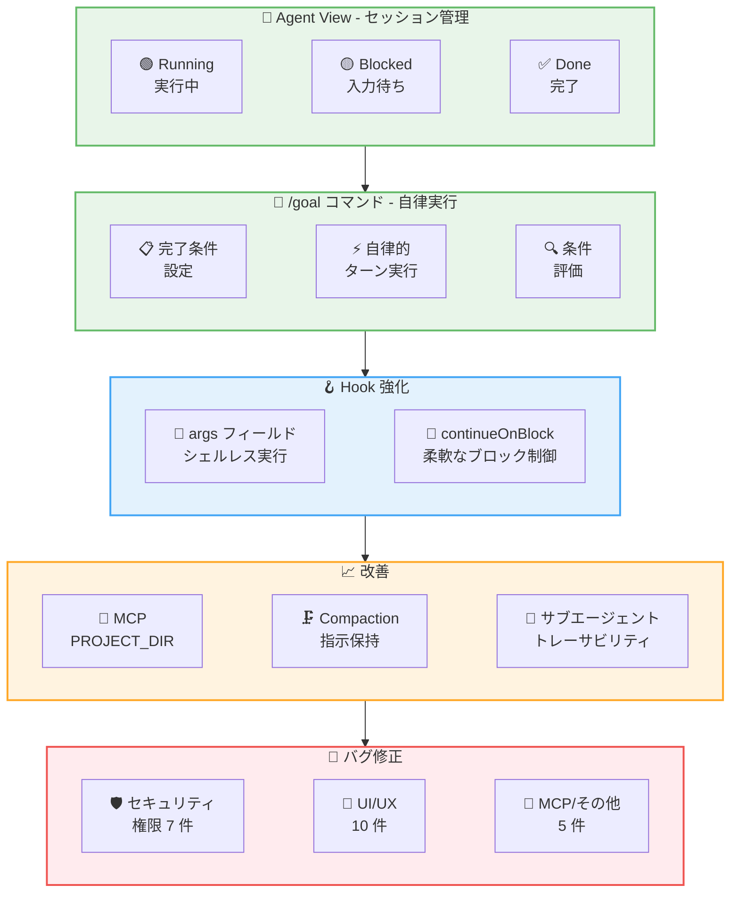
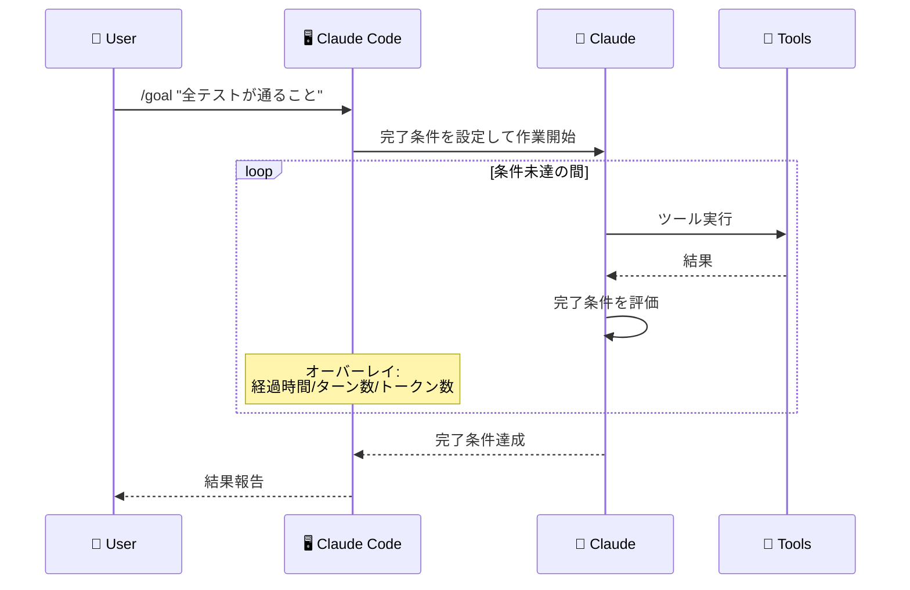

# Claude Code v2.1.139 リリース: Agent View と /goal コマンドによるマルチターン自律実行の実現

## メタデータ

| 項目 | 内容 |
|------|------|
| 発表日 | 2026-05-11 |
| ソース | Claude Code Changelog |
| カテゴリ | Claude Code アップデート |
| 公式リンク | https://github.com/anthropics/claude-code/blob/main/CHANGELOG.md |

## 概要

Claude Code v2.1.139 が 2026 年 5 月 11 日にリリースされました。本リリースは 7 件の新機能、16 件の改善、30 件以上のバグ修正を含む大型リリースです。最大の目玉は **Agent View** (Research Preview) と **`/goal` コマンド**の 2 つです。Agent View は全 Claude Code セッションを一覧管理できるダッシュボード機能であり、`/goal` コマンドは完了条件を設定して Claude に複数ターンにわたる自律的な作業を委任できる機能です。これらにより、Claude Code が単なるインタラクティブツールから、複数セッションを並行管理するエージェントオーケストレーターへと進化しました。さらに、Hook の `args` フィールドによるシェルレス実行、`continueOnBlock` による柔軟なフック制御、プラグインのトークンコスト可視化など、パワーユーザー向けの機能も多数追加されています。

## 詳細

### 背景

Claude Code は v2.1.136 以降、MCP 接続の安定性やプラグインエコシステムの成熟に注力してきました。v2.1.139 では安定性の土台の上に、エージェント指向のワークフローを本格的に実現する新機能群が投入されています。特に、複数のタスクを同時に進行させ、各セッションの状態を一元管理するニーズに応えるため、Agent View が Research Preview として導入されました。また、`/goal` コマンドにより「完了条件の宣言的指定」が可能になり、Claude Code のヘッドレス運用 (`-p` フラグ) や Remote Control モードとの親和性が大幅に向上しています。

### 主な変更点

#### 新機能 - 7 件

1. **Agent View (Research Preview)**: 全 Claude Code セッションを単一リストで管理するダッシュボード機能。実行中、ユーザー入力待ち、完了済みのセッションを一覧表示できます。`claude agents` コマンドで起動します

2. **`/goal` コマンド**: 完了条件を設定すると、Claude がその条件を満たすまで複数ターンにわたって自律的に作業を継続します。インタラクティブモード、`-p` フラグ、Remote Control の全モードで動作し、経過時間・ターン数・トークン数をオーバーレイパネルでリアルタイム表示します

3. **`/scroll-speed` コマンド**: マウスホイールのスクロール速度をライブプレビュー付きで調整可能

4. **`claude plugin details <name>`**: プラグインのコンポーネント構成とセッションあたりの推定トークンコストを表示

5. **Transcript View ナビゲーション**: `?` でキーボードショートカット表示、`{`/`}` でユーザープロンプト間ジャンプ、`v` でショートカットパネル切り替え

6. **Hook `args: string[]` フィールド**: exec 形式でコマンドを直接実行し、シェルを経由しないためパスプレースホルダーのクォートが不要

7. **Hook `continueOnBlock` オプション**: `PostToolUse` フックに設定すると、フックの拒否理由を Claude にフィードバックしてターンを継続。従来のブロック動作ではなく「理由付き再試行」が可能に

#### 改善 - 16 件

8. **MCP stdio サーバーへの `CLAUDE_PROJECT_DIR` 提供**: フックと同様に MCP stdio サーバーの環境変数に `CLAUDE_PROJECT_DIR` が設定されるようになりました。プラグイン設定で `${CLAUDE_PROJECT_DIR}` を参照可能です

9. **Compaction プロンプトの改善**: モデルに対して、ユーザーの重要な指示を保持するよう Compaction プロンプトが最適化されました

10. **`/mcp` Reconnect の改善**: `.mcp.json` の編集を再起動なしで反映可能に。再接続失敗時に HTTP ステータスと URL を表示します

11. **`/context all` トークン見積もりの改善**: モデルのトークナイザーを考慮した正確な値を丸めて表示

12. **`claude plugin install <name>@<marketplace>` の改善**: マーケットプレイスの自動リフレッシュとリトライ機能を追加

13. **`/plugin` インストール済みプラグイン詳細の改善**: フックイベント名と MCP サーバー名を整理して表示

14. **`/context` のプラグインソース表示**: プラグイン由来のスキルに対してプラグイン名を表示

15. **リモート MCP サーバーのリトライ**: 一時的な障害時の再接続リトライが全ユーザーに有効化

16. **サブエージェントの API ヘッダー追加**: `x-claude-code-agent-id` / `x-claude-code-parent-agent-id` ヘッダーが追加され、OTEL スパンにも `agent_id` / `parent_agent_id` 属性が含まれるようになりました

17. **API キー設定時の機能制限**: `ANTHROPIC_API_KEY` / `apiKeyHelper` / `ANTHROPIC_AUTH_TOKEN` 設定時に、Remote Control、`/schedule`、claude.ai MCP コネクタ、通知設定が無効化されます (Claude.ai ログインが存在する場合でも)

18. **`/resume` フィルターの改善**: フィルターヒントラベルの改善、プロジェクト名・worktree 名・ブランチ名をフィルターインジケーターに表示

19. **フッターインジケーターの改善**: Focus や通知インジケーターがモードインジケーター行に収まるよう修正

20. **`/agents` のタブレイアウト**: タブ形式のレイアウトに改善

21. **`/reload-plugins` の改善**: プラグイン由来のスキルを再起動なしで反映

22. **Vim モードの改善**: 各種 Vim 操作の改善

23. **Accept Edits モードの改善**: 安全な環境変数プレフィックスやプロセス置換を含むファイルシステムコマンドを自動承認

#### バグ修正 (セキュリティ/権限) - 7 件

24. **認証デッドロックの修正**: 期限切れの資格情報と `forceRemoteSettingsRefresh` ポリシーが組み合わさり、`claude auth login`/`logout`/`status` がブロックされて回復不能になる問題が修正されました

25. **`autoAllowBashIfSandboxed` のシェル展開対応**: `$VAR` や `$(cmd)` を含むコマンドが自動承認されない問題が修正されました

26. **権限関連の各種修正**: Bash ツールの権限バイパス、複合コマンド、環境変数プレフィックス、`/dev/tcp` リダイレクト、`grep -f` などに関する問題が修正されました

27. **`Skill(name *)` ワイルドカードの修正**: ワイルドカード形式がプレフィックスマッチとして正しく動作するようになりました

28. **`--dangerously-skip-permissions` のサイレントダウングレード修正**: accept-edits モードにサイレントに降格される問題が修正されました

29. **管理設定の許可ルール修正**: 管理者が削除した許可ルールがセッション中にアクティブなまま残る問題が修正されました

30. **`permissions.additionalDirectories` の即時反映**: 変更がセッション中に適用されない問題が修正されました

#### バグ修正 (MCP/プラグイン) - 2 件

31. **MCP メモリリークの修正**: HTTP/SSE MCP サーバーが非プロトコルデータをストリーミングした際の無制限メモリ増加を修正。レスポンスボディが SSE フレームあたり 16 MB に制限されました

32. **切断サーバーのリソース残留修正**: 切断された MCP サーバーのリソースが `@server:` オートコンプリートに残り続ける問題が修正されました

#### バグ修正 (UI/UX) - 10 件

33. **フックのターミナル破損修正**: フックがターミナルに書き込むことでインタラクティブプロンプトが破損する問題が修正されました。フックはターミナルアクセスなしで実行されるようになりました

34. **ホットリロードのシンボリックリンク対応**: シンボリックリンクされた `~/.claude/settings.json` への編集が検知されない問題が修正されました

35. **ストリームアイドルタイムアウトの誤検知修正**: レスポンス完了後 5 分で発生する不正なタイムアウトが修正されました

36. **複数画像の貼り付け修正**: 複数画像を貼り付けまたはドロップした際に最後の 1 枚のみが挿入される問題が修正されました

37. **ハイパーリンクの色修正**: ダークテーマで読みにくいダークネイビーが使用される問題が修正されました

38. **マウスホイールスクロール速度の修正**: Cursor および VS Code 1.92-1.104 でのスクロール速度が修正されました

39. **バックグラウンドセッションのスクロール修正**: Windows Terminal および VS Code でバックグラウンドセッション接続時のスクロール動作が修正されました

40. **大文字の小文字化修正**: xterm および VS Code 統合ターミナルで大文字が小文字に変換される問題が修正されました

41. **macOS テキスト置換の修正**: トリガーワードが置換テキストの代わりに削除される問題が修正されました

42. **[VS Code] Cmd/Ctrl+Shift+T**: 最後に閉じたセッションタブを再度開く機能が追加されました

#### バグ修正 (その他) - 3 件

43. **バックグラウンドサブエージェントのエラー報告修正**: エラーで失敗したバックグラウンドサブエージェントが部分的な進捗を親エージェントに報告しない問題が修正されました

44. **各種 UI 修正**: カーソル点滅、トランスクリプトショートカット、履歴、画像、CJK/絵文字テキスト、プログレスバーなどの問題が修正されました

45. **設定ホットリロードの修正**: シンボリックリンクされた設定ファイルの変更検知が修正されました

### 技術的な詳細

**Agent View のアーキテクチャ**: Agent View は `claude agents` コマンドで起動する独立したプロセスで、ローカルのセッションストアを監視し、各セッションの状態 (Running / Blocked / Done) をリアルタイムに反映します。既存の `/resume` や Remote Control API と統合されており、ブロック状態のセッションに対してはワンクリックで入力を提供できます。これにより、複数の長時間タスクを同時に走らせ、必要なときだけ介入するワークフローが実現します。

**`/goal` コマンドの動作原理**: `/goal` で設定された完了条件は、各ターン終了時に Claude 自身が評価します。条件が未達の場合、Claude は自動的に次のアクションを計画・実行し、新しいターンを開始します。オーバーレイパネルには経過時間、実行ターン数、消費トークン数がリアルタイムで表示され、ユーザーはいつでも Ctrl+C で中断できます。`-p` フラグとの組み合わせにより、CI/CD パイプラインでの自律的なタスク実行にも対応します。

**Hook `args` フィールドの設計**: 従来のフック定義では `command` フィールドにシェルコマンド文字列を指定していたため、ファイルパスにスペースや特殊文字が含まれる場合にクォートが必要でした。新しい `args: string[]` フィールドでは exec 形式 (配列) でコマンドと引数を直接指定し、シェルを経由せずにプロセスを起動します。これにより `$CLAUDE_FILE_PATH` などのプレースホルダーがそのまま安全に展開されます。

**`continueOnBlock` の動作**: `PostToolUse` フックで `continueOnBlock: true` を設定すると、フックがツール使用をブロックした際にエラーとして処理されるのではなく、拒否理由がコンテキストとして Claude にフィードバックされます。Claude はその理由を踏まえて代替アプローチを試み、ターンを継続します。これにより、ガードレール付きの自律実行が可能になります。

**MCP メモリリーク修正の詳細**: HTTP/SSE MCP サーバーが非プロトコルデータ (デバッグログ、エラーメッセージなど) をストリーミングした場合、従来はレスポンスボディが無制限にメモリに蓄積されていました。v2.1.139 では SSE フレームあたり 16 MB のキャップが導入され、超過分は破棄されます。

## 開発者への影響

### 対象

- **全ユーザー**: Agent View によるセッション管理、`/goal` コマンドによる自律実行、スクロール速度調整、UI 修正全般
- **ヘッドレス運用者**: `/goal` と `-p` フラグの組み合わせによる CI/CD パイプラインでの自律タスク実行
- **マルチセッション運用者**: Agent View による複数セッションの一元管理、サブエージェントのトレーサビリティ向上
- **Hook 開発者**: `args` フィールドによるシェルレス実行、`continueOnBlock` による柔軟なブロック制御
- **プラグイン開発者**: `CLAUDE_PROJECT_DIR` の MCP サーバー提供、トークンコスト可視化、`/reload-plugins` の改善
- **エンタープライズ管理者**: API キー設定時の機能制限強化、権限関連の多数の修正
- **MCP 利用者**: メモリリーク修正、リモートサーバーのリトライ有効化、`.mcp.json` のホットリロード
- **VS Code ユーザー**: スクロール速度修正、Cmd/Ctrl+Shift+T によるセッションタブ復元

### 必要なアクション

以下のコマンドで最新バージョンに更新できます。

```bash
# npm でのアップデート
npm update -g @anthropic-ai/claude-code

# Homebrew でのアップデート
brew upgrade claude-code

# 現在のバージョン確認
claude --version
```

Agent View を試すには以下を実行してください。

```bash
# Agent View の起動
claude agents
```

### 移行ガイド (該当する場合)

本リリースには破壊的変更はありません。ただし、以下の動作変更に注意してください。

1. **API キー設定時の機能制限**: `ANTHROPIC_API_KEY`、`apiKeyHelper`、`ANTHROPIC_AUTH_TOKEN` のいずれかが設定されている場合、Claude.ai ログインが存在しても Remote Control、`/schedule`、claude.ai MCP コネクタ、通知設定が無効化されます。これらの機能が必要な場合は API キー環境変数を設定せず、Claude.ai 認証を使用してください

2. **フックのターミナルアクセス無効化**: フックはターミナルアクセスなしで実行されるようになりました。ターミナルに出力していたフックは、代わりにファイルやログに書き込むよう変更が必要です

3. **Hook `args` フィールドへの移行推奨**: 既存の `command` フィールドは引き続き動作しますが、パスにスペースや特殊文字が含まれるケースでは `args` フィールドへの移行を推奨します

## コード例

```bash
# Agent View の起動 - 全セッションを一覧表示
claude agents
```

```bash
# /goal コマンドの使用例 (インタラクティブモード)
claude
> /goal すべてのテストが通り、リンターエラーがゼロになること

# -p フラグとの組み合わせ (CI/CD 向け)
claude -p "このプロジェクトのテストを全て通してください" --goal "全テストが通り、カバレッジが80%以上であること"
```

```json
// .claude/settings.json - Hook args フィールド (シェルレス実行)
{
  "hooks": {
    "PostToolUse": [
      {
        "matcher": "Write",
        "args": ["python3", "/path/to/lint_check.py", "$CLAUDE_FILE_PATH"],
        "continueOnBlock": true
      }
    ]
  }
}
```

```json
// .claude/settings.json - Hook continueOnBlock の設定
{
  "hooks": {
    "PostToolUse": [
      {
        "matcher": "Bash",
        "command": "check-security-policy.sh",
        "continueOnBlock": true
      }
    ]
  }
}
```

```bash
# プラグインのトークンコスト確認
claude plugin details my-plugin
# 出力例:
# Components: 3 skills, 2 hooks, 1 MCP server
# Estimated token cost per session: ~2,400 tokens

# スクロール速度の調整
claude
> /scroll-speed
```

```json
// .mcp.json - CLAUDE_PROJECT_DIR の活用
{
  "mcpServers": {
    "my-server": {
      "command": "${CLAUDE_PROJECT_DIR}/tools/my-mcp-server",
      "args": ["--config", "${CLAUDE_PROJECT_DIR}/.config/mcp.json"]
    }
  }
}
```

## アーキテクチャ図 (該当する場合)





## 関連リンク

- [Claude Code Changelog](https://github.com/anthropics/claude-code/blob/main/CHANGELOG.md)
- [Agent View ドキュメント](https://code.claude.com/docs/en/agent-view)
- [Claude Code GitHub リポジトリ](https://github.com/anthropics/claude-code)
- [Claude Code npm パッケージ](https://www.npmjs.com/package/@anthropic-ai/claude-code)
- [MCP (Model Context Protocol) 仕様](https://modelcontextprotocol.io/)
- [Claude Code v2.1.136 レポート](./2026-05-08-claude-code-v2-1-136.md)

## まとめ

Claude Code v2.1.139 は、新機能 7 件、改善 16 件、バグ修正 30 件以上を含む大型リリースです。

主なハイライトは以下の通りです。

- **Agent View による統合セッション管理**: `claude agents` コマンドで全セッションを一覧表示し、実行中・入力待ち・完了のステータスを一目で確認可能に。複数の長時間タスクを同時に管理するワークフローが実現しました
- **`/goal` コマンドによる自律実行**: 完了条件を宣言的に設定するだけで、Claude が複数ターンにわたって自律的に作業を継続。CI/CD パイプラインでの活用や、Remote Control との統合により、ヘッドレスでの高度なタスク自動化が可能になりました
- **Hook システムの強化**: `args` フィールドによるシェルレス実行で安全性が向上し、`continueOnBlock` オプションによりブロック時の柔軟な制御が可能に。ガードレール付き自律実行の基盤が強化されました
- **MCP エコシステムの改善**: `CLAUDE_PROJECT_DIR` の MCP サーバー提供、`.mcp.json` のホットリロード、リモートサーバーリトライの全ユーザー有効化により、MCP 連携の利便性と信頼性が向上しました
- **セキュリティ/権限の修正**: 認証デッドロック、`--dangerously-skip-permissions` のサイレントダウングレード、管理設定の許可ルール残留など、7 件のセキュリティ関連修正により堅牢性が向上しました
- **サブエージェントのトレーサビリティ**: API リクエストへのエージェント ID ヘッダー追加と OTEL スパンへの属性追加により、マルチエージェント構成でのデバッグとモニタリングが容易になりました

本リリースは Claude Code を「インタラクティブなコーディングアシスタント」から「マルチセッション対応のエージェントオーケストレーター」へと進化させる重要なマイルストーンです。Agent View と `/goal` コマンドの組み合わせにより、複数のタスクを並行して自律実行させ、必要なときだけ介入するという新しいワークフローが可能になりました。全ユーザーにアップデートを推奨します。
