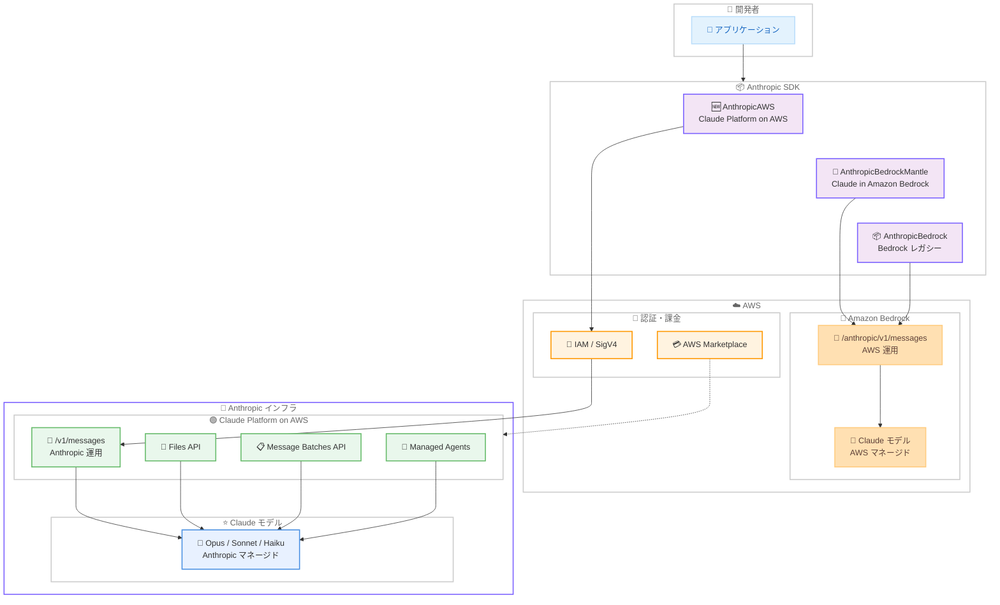

# Claude Platform on AWS の提供開始

## メタデータ

| 項目 | 内容 |
|------|------|
| 発表日 | 2026-05-11 |
| ソース | Claude API Release Notes |
| カテゴリ | API / プラットフォーム |
| 公式リンク | https://platform.claude.com/docs/en/release-notes/overview |

## 概要

Anthropic は 2026 年 5 月 11 日、**Claude Platform on AWS** の提供開始を発表しました。これは Anthropic が運用するインフラストラクチャを AWS 経由でアクセスできる新しいプラットフォームオプションであり、AWS Marketplace 課金と IAM 認証に対応しています。

Claude Platform on AWS では、Messages API、Files API、Message Batches API、Claude Managed Agents、Agent Skills、コード実行、ツール使用など、Anthropic プラットフォームの全機能をネイティブ AWS エンドポイント経由で利用できます。既存の「Claude in Amazon Bedrock」(AWS が運用) とは異なり、Anthropic が推論スタックを運用する点が最大の特徴であり、ベータ機能を含む最新機能への即日アクセスが可能です。

## 詳細

### 背景

AWS 上で Claude を利用する方法は、これまで主に 2 つ存在していました。

1. **Amazon Bedrock (レガシー)**: AWS が運用する `InvokeModel` / Converse API による統合
2. **Claude in Amazon Bedrock**: AWS が運用する Anthropic Messages API 互換エンドポイント (`/anthropic/v1/messages`)

いずれも AWS がインフラを運用・管理するため、新機能の提供は Bedrock のリリーススケジュールに依存し、ベータ機能は利用できないという制約がありました。また、Files API、Message Batches API、Claude Managed Agents、Agent Skills、コード実行といった Anthropic プラットフォーム固有の高度な機能は Bedrock 経由では提供されていませんでした。

Claude Platform on AWS は、これらの制約を解消する第 3 のオプションとして誕生しました。Anthropic が推論インフラを運用しつつ、認証と課金を AWS に委任することで、AWS エコシステム内にいながら Anthropic プラットフォームの全機能を利用できる環境を実現しています。

### 主な変更点

- **Anthropic 運用のインフラ**: AWS ではなく Anthropic が推論スタックを運用。最新機能への即日アクセスが可能
- **フルプラットフォーム体験**: Messages API、Files API、Message Batches API、Claude Managed Agents、Agent Skills、コード実行、ツール使用のすべてに対応
- **ベータヘッダー対応**: `anthropic-beta` ヘッダーによるベータ機能の利用が可能
- **AWS 認証・課金**: SigV4 または API キーによる認証、IAM ベースのアクセス制御、AWS Marketplace 経由の課金
- **独立したキャパシティプール**: ファーストパーティ Claude API とも Amazon Bedrock とも別のキャパシティプールで動作
- **AWS PrivateLink 対応**: プライベートネットワーク経由でのアクセスが可能
- **プラットフォーム専用 SDK クライアント**: Python SDK の `AnthropicAWS` クラス (ベータ)

### 技術的な詳細

**3 つの AWS 統合オプションの比較**:

| 項目 | Claude Platform on AWS | Claude in Amazon Bedrock | Amazon Bedrock (レガシー) |
|------|------------------------|--------------------------|--------------------------|
| 運用者 | Anthropic | AWS | AWS |
| API | `/v1/messages` | `/anthropic/v1/messages` | Converse / InvokeModel |
| 機能提供速度 | 通常即日 | Bedrock リリーススケジュール | Bedrock リリーススケジュール |
| ベータヘッダー | 対応 | 非対応 | 非対応 |
| 認証 | AWS IAM / SigV4 または API キー | IAM / SigV4 | IAM / SigV4 またはベアラートークン |
| 課金 | AWS Marketplace | AWS ネイティブ課金 | AWS ネイティブ課金 |
| SDK クライアント | `AnthropicAWS` (ベータ) | `AnthropicBedrockMantle` | `AnthropicBedrock` |

**データ処理と保管**:

- **データプロセッサ**: Anthropic がデータプロセッサとして機能
- **データレジデンシ**: データは AWS 内に留まるとは限らない。推論は Anthropic のプライマリクラウドにルーティングされる場合がある
- **サブサービス**: 予告なく変更される可能性がある

**セットアップの 4 フェーズ**:

1. AWS Console でサインアップ
2. Anthropic 組織セットアップを完了
3. ワークスペース ID を記録
4. Claude Console にサインイン

**Bedrock を選択すべきケース**:

FedRAMP High、IL4、IL5、HIPAA など規制産業で AWS を唯一のデータプロセッサとする必要がある場合は、引き続き Amazon Bedrock を使用してください。

## 開発者への影響

### 対象

- AWS エコシステムで Claude を利用しており、ベータ機能や最新機能への即日アクセスを求める開発者
- Files API、Message Batches API、Claude Managed Agents、Agent Skills を AWS 課金で利用したい企業
- AWS Marketplace を通じた一元的な課金管理を希望する組織
- Anthropic プラットフォームの全機能を AWS 認証基盤で利用したいエンタープライズ顧客

### 必要なアクション

1. **セットアップ開始**: AWS Console から Claude Platform on AWS にサインアップ
2. **組織セットアップ**: Anthropic の組織セットアップを完了し、ワークスペース ID を取得
3. **SDK のインストール**: Anthropic SDK の最新バージョンをインストールし、`AnthropicAWS` クライアントを使用
4. **認証の設定**: AWS IAM / SigV4 認証または API キー認証を設定
5. **エンドポイントの更新**: 既存コードのエンドポイントを Claude Platform on AWS 向けに変更

### 移行ガイド

**ファーストパーティ Claude API からの移行**:

- クライアントクラスを `Anthropic` から `AnthropicAWS` に変更
- 認証を API キーから AWS 認証 (SigV4 または API キー) に切り替え
- リクエストボディやレスポンス処理のロジックは変更不要
- 全機能 (Files API、Batches API、Managed Agents 等) がそのまま利用可能

**Amazon Bedrock からの移行**:

- クライアントクラスを `AnthropicBedrock` / `AnthropicBedrockMantle` から `AnthropicAWS` に変更
- エンドポイントが自動的に Claude Platform on AWS 向けに設定される
- ベータヘッダーの使用が可能になるため、最新機能を即座に活用可能
- Files API、Message Batches API、Claude Managed Agents が新たに利用可能

## コード例

### Python SDK を使用した基本的なリクエスト

```python
from anthropic import AnthropicAWS

# Claude Platform on AWS クライアント (ベータ)
client = AnthropicAWS(
    aws_region="us-east-1",
    # AWS 認証情報は環境変数または IAM ロールから自動取得
)

# Messages API の呼び出し
message = client.messages.create(
    model="claude-opus-4-6-20250410",
    max_tokens=1024,
    messages=[
        {"role": "user", "content": "Hello, Claude on AWS!"}
    ],
)
print(message.content[0].text)
```

### ベータ機能の利用

```python
from anthropic import AnthropicAWS

client = AnthropicAWS(aws_region="us-east-1")

# ベータヘッダーを使用して最新機能にアクセス
message = client.messages.create(
    model="claude-opus-4-6-20250410",
    max_tokens=4096,
    betas=["code-execution-2025-05-01"],
    messages=[
        {"role": "user", "content": "Calculate the first 20 Fibonacci numbers using code execution."}
    ],
)
print(message.content[0].text)
```

### Files API の利用

```python
from anthropic import AnthropicAWS

client = AnthropicAWS(aws_region="us-east-1")

# ファイルのアップロード
with open("document.pdf", "rb") as f:
    file = client.files.create(
        file=f,
        purpose="messages",
    )

# アップロードしたファイルを参照してメッセージ送信
message = client.messages.create(
    model="claude-opus-4-6-20250410",
    max_tokens=2048,
    messages=[
        {
            "role": "user",
            "content": [
                {
                    "type": "file",
                    "source": {"type": "file", "file_id": file.id},
                },
                {
                    "type": "text",
                    "text": "Summarize this document.",
                },
            ],
        }
    ],
)
print(message.content[0].text)
```

### curl での直接リクエスト

```bash
curl https://api.anthropic.com/v1/messages \
  --aws-sigv4 "aws:amz:us-east-1:anthropic" \
  --user "$AWS_ACCESS_KEY_ID:$AWS_SECRET_ACCESS_KEY" \
  -H "x-amz-security-token: $AWS_SESSION_TOKEN" \
  -H "content-type: application/json" \
  -H "anthropic-version: 2023-06-01" \
  -d '{
    "model": "claude-opus-4-6-20250410",
    "max_tokens": 1024,
    "messages": [
      {"role": "user", "content": "Hello, Claude Platform on AWS!"}
    ]
  }'
```

## アーキテクチャ図



## 関連リンク

- [Claude Platform on AWS ドキュメント](https://platform.claude.com/docs/en/build-with-claude/claude-platform-on-aws)
- [Claude API Release Notes](https://platform.claude.com/docs/en/release-notes/overview)
- [Claude in Amazon Bedrock ドキュメント](https://platform.claude.com/docs/en/build-with-claude/claude-in-amazon-bedrock)
- [Claude on Amazon Bedrock - レガシー統合](https://platform.claude.com/docs/en/build-with-claude/claude-on-amazon-bedrock)
- [Anthropic Client SDK](https://platform.claude.com/docs/en/api/client-sdks)
- [AWS Marketplace](https://aws.amazon.com/marketplace/)

## まとめ

Claude Platform on AWS は、AWS エコシステム内で Anthropic プラットフォームの全機能にアクセスできる新しい統合オプションです。Anthropic が推論インフラを運用するため、ベータ機能を含む最新機能への即日アクセスが可能であり、Files API、Message Batches API、Claude Managed Agents、Agent Skills、コード実行など、これまで Bedrock 経由では利用できなかった高度な機能をすべてサポートしています。

AWS IAM / SigV4 認証と AWS Marketplace 課金に対応しているため、既存の AWS アカウント管理・課金フローをそのまま活用できます。独立したキャパシティプールで動作し、AWS PrivateLink にも対応しているため、エンタープライズ環境にも適しています。ただし、データは Anthropic のインフラにルーティングされる場合があるため、FedRAMP High や IL4/IL5 などの厳格な規制要件がある場合は、引き続き Amazon Bedrock の利用を推奨します。開発者は `AnthropicAWS` クライアント (ベータ) を使用して、最小限のコード変更で Claude Platform on AWS への接続を開始できます。
