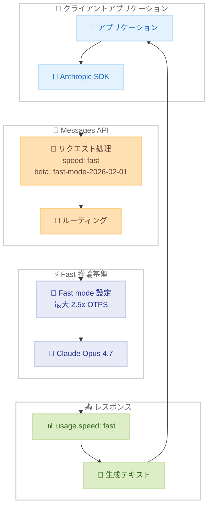

# Fast mode が Claude Opus 4.7 をサポート

## メタデータ

| 項目 | 内容 |
|------|------|
| 発表日 | 2026-05-12 |
| ソース | Claude API Release Notes |
| カテゴリ | API アップデート |
| 公式リンク | https://platform.claude.com/docs/en/release-notes/overview |

## 概要

Claude API の Fast mode (research preview) が Claude Opus 4.7 をサポートした。API リクエストで `speed: "fast"` を指定し、`fast-mode-2026-02-01` ベータヘッダーを含めることで、標準モードと比較して最大 2.5 倍の出力トークン生成速度を実現する。料金は標準 Opus の 6 倍 (入力 $30/MTok、出力 $150/MTok) となる。

Fast mode は 2026 年 2 月 7 日に Claude Opus 4.6 向けに初めてリリースされた機能であり、今回のアップデートにより最新の Opus 4.7 モデルでも利用可能となった。レイテンシが重要なワークフローやエージェントワークフローに最適化されている。

## 詳細

### 背景

Fast mode は、出力トークン生成速度 (OTPS) を大幅に向上させることで、レイテンシに敏感なアプリケーションのパフォーマンスを改善するための機能である。2026 年 2 月 7 日に Claude Opus 4.6 向けの research preview として初めて公開され、エージェントワークフローやリアルタイム応答が求められるユースケースで活用されてきた。

今回のアップデートにより、より高性能な Claude Opus 4.7 モデルでも Fast mode が利用可能となり、最新モデルの能力と高速な応答速度を両立できるようになった。

### 主な変更点

- **対応モデル拡張**: Claude Opus 4.7 (`claude-opus-4-7`) が Fast mode の対象モデルに追加
- **同一のベータヘッダー**: 既存の `fast-mode-2026-02-01` ヘッダーをそのまま使用可能
- **料金据え置き**: Opus 4.6 の Fast mode と同じ料金体系 (標準の 6 倍)
- **レート制限据え置き**: Opus 4.6 の Fast mode と同じ専用レート制限

### 技術的な詳細

**対応モデル一覧:**

| モデル | モデル ID |
|--------|----------|
| Claude Opus 4.7 | `claude-opus-4-7` |
| Claude Opus 4.6 | `claude-opus-4-6` |

**パフォーマンス特性:**

- 標準モードと比較して最大 2.5 倍の出力トークン毎秒 (OTPS)
- 速度改善は OTPS に焦点を当てており、TTFT (最初のトークンまでの時間) ではない
- 同一のモデルウェイトと動作 (別モデルではない)

**料金体系:**

| 項目 | 料金 |
|------|------|
| 入力トークン | $30/MTok (標準の 6 倍) |
| 出力トークン | $150/MTok (標準の 6 倍) |

- プロンプトキャッシュの乗数と併用可能
- データレジデンシの乗数と併用可能

**レート制限:**

- 標準 Opus とは別の専用レート制限枠
- カスタムヘッダーで制限値を確認可能。
  - `anthropic-fast-input-tokens-limit`
  - `anthropic-fast-output-tokens-limit`
- レート制限超過時は 429 エラーと `retry-after` ヘッダーを返却

**レスポンス:**

- `usage` オブジェクト内に `speed` フィールドが含まれ、`"fast"` または `"standard"` を返す

**制限事項:**

- Fast mode と Standard mode を切り替えるとプロンプトキャッシュが無効化される
- Batch API では利用不可
- Priority Tier では利用不可
- Claude Platform on AWS では利用不可

## 開発者への影響

### 対象

- レイテンシが重要なリアルタイムアプリケーションを開発している開発者
- エージェントワークフローで高速な応答を必要とする開発者
- 既に Claude Opus 4.6 の Fast mode を利用しており、Opus 4.7 への移行を検討している開発者
- コーディング支援やリファクタリングなど、大量の出力トークンを高速に生成したいユースケース

### 必要なアクション

1. **モデル ID の変更**: `model` パラメータを `"claude-opus-4-7"` に更新
2. **ベータヘッダーの確認**: `fast-mode-2026-02-01` ヘッダーが設定されていることを確認
3. **speed パラメータの指定**: `speed: "fast"` をリクエストに含める
4. **ウェイトリストへの参加**: まだ Fast mode にアクセスできない場合は、ウェイトリストに参加

### 移行ガイド (該当する場合)

既に Opus 4.6 の Fast mode を利用している場合、移行は最小限の変更で完了する。

**変更前 (Opus 4.6):**

```python
response = client.beta.messages.create(
    model="claude-opus-4-6",
    speed="fast",
    betas=["fast-mode-2026-02-01"],
    ...
)
```

**変更後 (Opus 4.7):**

```python
response = client.beta.messages.create(
    model="claude-opus-4-7",
    speed="fast",
    betas=["fast-mode-2026-02-01"],
    ...
)
```

注意: モデルを切り替えるとプロンプトキャッシュは無効化されるため、キャッシュの再構築が必要となる。

## コード例

### 基本的な使用方法

```python
import anthropic

client = anthropic.Anthropic()

response = client.beta.messages.create(
    model="claude-opus-4-7",
    max_tokens=4096,
    speed="fast",
    betas=["fast-mode-2026-02-01"],
    messages=[
        {"role": "user", "content": "Refactor this module to use dependency injection"}
    ],
)

print(response.content[0].text)
```

### Fast mode フォールバックパターン

レート制限に達した場合に標準モードにフォールバックする実装例。

```python
def create_message_with_fast_fallback(max_retries=None, max_attempts=3, **params):
    try:
        return client.beta.messages.create(**params, max_retries=max_retries)
    except anthropic.RateLimitError:
        if params.get("speed") == "fast":
            del params["speed"]
            return create_message_with_fast_fallback(**params)
        raise
```

## アーキテクチャ図



## 関連リンク

- [Fast mode ドキュメント](https://platform.claude.com/docs/en/build-with-claude/fast-mode)
- [Fast mode 料金](https://platform.claude.com/docs/en/about-claude/pricing#fast-mode-pricing)
- [レート制限](https://platform.claude.com/docs/en/api/rate-limits)
- [ウェイトリスト](https://claude.com/fast-mode)
- [Claude API Release Notes](https://platform.claude.com/docs/en/release-notes/overview)

## まとめ

Fast mode の Claude Opus 4.7 サポートにより、最新モデルの高い能力を維持しながら、最大 2.5 倍の出力速度を実現できるようになった。エージェントワークフローやリアルタイムアプリケーションなど、レイテンシが重要なユースケースにおいて大きな恩恵がある。

既存の Fast mode ユーザーにとっては、モデル ID を `claude-opus-4-7` に変更するだけで移行が完了するため、導入障壁は低い。ただし、標準の 6 倍の料金設定、プロンプトキャッシュの無効化、Batch API や Priority Tier での非対応など、制限事項を考慮した上で採用を検討する必要がある。
