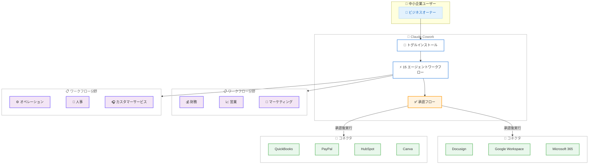

# Claude for Small Business: 中小企業向け AI ワークフローパッケージの発表

## メタデータ

| 項目 | 内容 |
|------|------|
| 発表日 | 2026-05-13 |
| ソース | Anthropic News |
| カテゴリ | Product Launch / Announcements |
| 公式リンク | https://www.anthropic.com/news/claude-for-small-business |

## 概要

Anthropic は 2026 年 5 月 13 日、中小企業向けの新製品「Claude for Small Business」を発表した。この製品は、中小企業が日常的に使用するツールに Claude を統合するコネクタとすぐに実行可能なワークフローのパッケージである。Claude Cowork 内のトグルインストールにより、既存のビジネスツールとシームレスに接続し、財務、オペレーション、営業、マーケティング、人事、カスタマーサービスの 6 分野にわたる 15 のエージェントワークフローを提供する。

中小企業は米国 GDP の 44% を占め、民間部門の労働力のほぼ半数を雇用しているにもかかわらず、AI 導入は大企業に比べて遅れている。Claude for Small Business は、この格差を埋めるために設計された製品である。

## 詳細

### 背景

米国経済において中小企業は極めて重要な役割を果たしている。GDP の 44% を生み出し、民間部門の労働力のほぼ半数を雇用している。しかし、AI の導入に関しては大企業に大きく後れを取っているのが現状である。大企業が専門の AI チームやカスタムインテグレーションを構築できる一方、中小企業にはそのようなリソースがなく、日常業務の自動化が進んでいなかった。

Claude for Small Business は、中小企業オーナーが最も時間を取られていると報告した反復的なタスクに基づいて設計されており、技術的な専門知識がなくても導入できるソリューションとして提供される。

### 主な変更点

#### 統合ツール

以下の主要ビジネスツールとのコネクタが提供される。

- **Intuit QuickBooks**: 会計・財務管理
- **PayPal**: 決済・送金
- **HubSpot**: CRM・マーケティングオートメーション
- **Canva**: デザイン・コンテンツ作成
- **Docusign**: 電子署名・契約管理
- **Google Workspace**: メール・ドキュメント・カレンダー
- **Microsoft 365**: Office アプリケーション・コラボレーション

#### 15 のエージェントワークフロー

財務、オペレーション、営業、マーケティング、人事、カスタマーサービスの 6 分野にわたる 15 のすぐに実行可能なワークフローが提供される。主なワークフローは以下の通りである。

| 分野 | ワークフロー例 |
|------|--------------|
| 財務 | 給与計算の準備、月次決算、マージン分析、税務シーズンの整理 |
| 営業 | 営業キャンペーン、リードのトリアージ |
| オペレーション | 請求書の督促、契約書レビュー |
| マーケティング | コンテンツ戦略 |

### 技術的な詳細

#### 導入方法

Claude Cowork 内のトグルインストールで有効化する。既存のツールへの接続は、各ツールの認証情報を使用して設定される。

#### セキュリティとプライバシー

- **Human-in-the-loop**: ユーザーは送信、投稿、支払いなどのアクションの前に必ず計画を承認する
- **既存の権限の維持**: QuickBooks や Drive で従業員がアクセスできないデータには、Claude を通じてもアクセスできない
- **データの取り扱い**: Team プランおよび Enterprise プランでは、デフォルトでデータはトレーニングに使用されない

#### パートナーシップ

PayPal との提携により「AI Fluency for Small Business」という無料オンラインコースが提供される。中小企業の AI リテラシー向上を目的としたプログラムである。

## ビジネスへの影響

### 対象

- 中小企業のオーナーおよび経営者
- 中小企業の経理、営業、マーケティング担当者
- 中小企業向けソリューションを開発するパートナー企業
- Anthropic の Team プランおよび Enterprise プランのユーザー

### 期待される効果

1. **業務効率化**: 反復的なタスクの自動化により、経営者がより戦略的な業務に集中できるようになる
2. **コスト削減**: 専門の AI チームを雇用することなく、AI の恩恵を受けられる
3. **導入障壁の低減**: トグルインストールにより、技術的な専門知識がなくても即座に利用を開始できる
4. **セキュリティの確保**: 既存の権限モデルを維持しつつ、AI を活用できる

### パートナーの声

- **Intuit QuickBooks** (Joe Preston, VP Product Management): QuickBooks との統合による中小企業の財務管理効率化への期待を表明
- **HubSpot** (Angela DeFranco, GM and VP Product): CRM とマーケティングオートメーションにおける AI 活用の可能性を支持
- **Canva** (Anwar Haneef, GM and Head of Ecosystem): デザインとコンテンツ作成における中小企業支援の強化を歓迎

## アーキテクチャ図

## 関連リンク

- [Claude for Small Business 公式発表](https://www.anthropic.com/news/claude-for-small-business)
- [Claude Cowork](https://www.anthropic.com/products/claude-cowork)
- [Anthropic Team プラン](https://www.anthropic.com/pricing)
- [AI Fluency for Small Business - PayPal パートナーシップ](https://www.paypal.com)

## まとめ

Claude for Small Business は、Anthropic が中小企業市場に本格的に参入する重要な製品である。米国 GDP の 44% を占める中小企業の AI 導入格差を解消するため、技術的なハードルを極力排除した設計となっている。

特筆すべき点は以下の 3 つである。

1. **即座に利用可能な設計**: Claude Cowork 内のトグルインストールで、複雑なセットアップなしに 7 つの主要ビジネスツールと接続できる
2. **安全性への配慮**: Human-in-the-loop の承認フロー、既存の権限モデルの維持、Team/Enterprise プランでのデータ非学習ポリシーにより、中小企業が安心して導入できる
3. **エコシステムの構築**: Intuit QuickBooks、HubSpot、Canva、PayPal など主要パートナーとの協力関係により、中小企業の業務全体をカバーするソリューションを実現している

Daniela Amodei (共同創業者兼社長) のリーダーシップのもと、Anthropic は AI の恩恵を大企業だけでなく中小企業にも届けることを目指しており、Claude for Small Business はその戦略の重要な柱となる製品である。
