# Claude Code v2.1.141 - エージェント機能強化と MCP 信頼性向上

## メタデータ

| 項目 | 内容 |
|------|------|
| 発表日 | 2026-05-14 |
| ソース | Claude Code Changelog |
| カテゴリ | Claude Code Update |
| 公式リンク | https://github.com/anthropics/claude-code/blob/main/CHANGELOG.md |

## 概要

Claude Code v2.1.141 は、エージェント管理機能の大幅な強化、MCP/プラグインエコシステムの信頼性向上、および多数の UI/UX 改善を含む大規模アップデートである。特に、バックグラウンドエージェントのパーミッションモード保持、ワークスペース ID による認証スコーピング、プラグインの HTTPS クローン対応など、企業環境での運用を意識した改善が目立つ。また、Bedrock/Vertex/Foundry 環境でのモデルフォールバック問題の修正により、マルチプロバイダー環境での安定性が大きく向上している。

## 詳細

### 背景

Claude Code v2.1.136 以降、マークダウンテーブルのレイアウト崩れや MCP サーバーの接続安定性に関する報告が増加していた。v2.1.141 では、これらのリグレッション修正に加え、エージェントワークフローの改善と企業向け機能の追加が行われている。

### 主な変更点

#### 新機能 (12 項目)

**エージェント管理の強化:**

- `claude agents --cwd <path>` でディレクトリスコープのセッションリスト表示が可能に
- バックグラウンドエージェント (`/bg` または `<<`) が現在のパーミッションモードを保持
- 完了したエージェントがバックグラウンドシェルを残している場合、Working ではなく Completed に移動

**環境変数の追加:**

- `CLAUDE_CODE_PLUGIN_PREFER_HTTPS`: GitHub プラグインソースを SSH ではなく HTTPS でクローン
- `ANTHROPIC_WORKSPACE_ID`: ワークロード ID フェデレーションでトークンのスコープを特定ワークスペースに限定

**UX 改善:**

- Rewind メニューに "Summarize up to here" を追加 (コンテキスト圧縮)
- `/feedback` で過去 24 時間または 7 日間のセッションを含めて送信可能に
- スピナーが 10 秒経過後にアンバー色に変化し、思考継続を視覚的にフィードバック
- Auto モードのパーミッションダイアログに `permissions.ask` ルール由来の説明を表示
- IDE 接続時にファイル編集パーミッションプロンプトで "view diff in your IDE" オプションを復元
- Hook の JSON 出力に `terminalSequence` フィールドを追加 (デスクトップ通知、ウィンドウタイトル、ベル)
- プラグインメニューナビゲーション改善 (Tab/矢印キー切替、クリック対応)

#### 重大なバグ修正 (10 項目)

- **Bedrock/Vertex/Foundry でのモデルフォールバック修正**: バックグラウンドサイドクエリが利用不可能な Haiku モデル ID を送信していた問題を修正。`ANTHROPIC_SMALL_FAST_MODEL` 未設定時にメインループモデルへフォールバック
- **Windows デーモンパイプ修正**: `claude daemon status` と `/doctor` がパイプキーファイルのロック時にエラーを投げる問題を修正
- **セッション間の閾値干渉修正**: `/model` コマンドが他の並行セッションの autocompact 閾値を変更してしまう問題を修正
- **Vim モード中の Ctrl+C 修正**: INSERT/VISUAL モードでの実行中断が効かない問題を修正
- **マークダウンテーブル修正**: セル折り返し時に縦レイアウトにフォールバックするリグレッション (v2.1.136) を修正
- **パーミッションプロンプト修正**: プロンプト表示中の Enter キーが入力ボックスにも送信される問題を修正
- **Hook パス修正**: `EnterWorktree` 後に存在しない `transcript_path` が Hook に渡される問題を修正
- **カスタムゲートウェイ修正**: カスタム `ANTHROPIC_BASE_URL` でのバックグラウンドジョブの自動命名失敗を修正
- **エージェントダッシュボード修正**: ラッパー経由起動時にダッシュボードではなくエージェントタイプリストが表示される問題を修正
- **パーミッションモード切替修正**: ツールパーミッションプロンプト表示中のモード切替で自動解除されない問題を修正

#### MCP/プラグイン修正 (8 項目)

- HTTP/SSE サーバーの 403 エラーを "failed" ではなく "needs auth" と正しく表示
- リモート MCP サーバーのオプショナルイベントストリーム再接続失敗時の不要な切断を修正
- Remote Control MCP のワーカーセッショントークンローテーション時の 401 エラーを修正
- Remote Control の信頼済みデバイス再登録問題を修正
- プラグイン詳細ペインで `.mcp.json` 宣言の MCP サーバーが 0 表示される問題を修正
- 未設定の設定変数を持つ MCP サーバーのエラーメッセージを改善
- POSIX シェルパラメータ展開が誤って環境変数未設定と判定される問題を修正
- `claude plugin install` で upstream に `ref` が存在しない場合の `sha` ピン留めフォールバックを修正

#### UI/UX 修正 (14 項目)

- キャンセルしたプロンプトが矢印キー履歴から削除される問題を修正
- `chat:submit` の代替キーバインドが `enter` リバインド時に動作しない問題を修正
- 出力スタイル設定時にプロンプトサジェッションが無効化される問題を修正
- AskUserQuestion ポップアップがチャットコンテンツの最終行を隠す問題を修正
- Web Search ステータスの "Did 0 searches" 表示問題を修正
- マルチラインステータスラインの行破損問題を修正
- light-ansi テーマの diff コンテキスト行が見えない問題を修正
- エラーオーバーレイのミニファイされたソース表示問題を修正
- フィードバック評価入力後の Enter キーがチャットメッセージとして送信される問題を修正
- エージェントパネルでの `x` キー入力がプロンプトに入力される問題を修正
- セッションタイトルがプラグインモニター通知から派生される問題を修正
- Bedrock/Vertex/Foundry での "API Usage Billing" バナー表示を修正
- Windows での Alt+V 画像貼り付け問題を修正
- プロンプトサジェッション無効化のサイレント問題を修正

#### プラットフォーム固有の修正 (4 項目)

- **Bedrock**: `awsCredentialExport` がアンビエント AWS 認証情報存在時にスキップされる問題を修正
- **Linux SDK**: glibc と musl の両パッケージインストール時の "native binary not found" エラーを修正
- **VSCode**: マイク入力が無音時にフィードバックが表示されない問題を修正
- **VSCode/WSL**: 音声モードで WSLg ユーザー向けに `sox libsox-fmt-pulse` のインストール提案を追加

### 技術的な詳細

#### terminalSequence フィールド

Hook の JSON 出力に新たに `terminalSequence` フィールドが追加された。これにより、制御端末がない環境でもデスクトップ通知やウィンドウタイトル変更が可能になる。

```json
{
  "event": "tool_result",
  "tool": "Bash",
  "result": "success",
  "terminalSequence": "]9;4;3;100\\"
}
```

#### ワークロード ID フェデレーション

`ANTHROPIC_WORKSPACE_ID` 環境変数により、フェデレーションルールが複数ワークスペースをカバーする場合にトークンのスコープを限定できる。

```bash
# ワークスペース ID を指定してトークンスコープを限定
export ANTHROPIC_WORKSPACE_ID="ws_abc123"

# SSH キーがない環境でプラグインを HTTPS クローン
export CLAUDE_CODE_PLUGIN_PREFER_HTTPS=1
```

#### エージェントセッション管理

```bash
# 特定ディレクトリのエージェントセッションのみ表示
claude agents --cwd /path/to/project

# バックグラウンドエージェントはパーミッションモードを保持
# (以前はデフォルトに戻っていた)
/bg "テストを実行して結果を報告"
```

## 開発者への影響

### 対象

- Claude Code を日常的に使用する開発者全般
- マルチプロバイダー環境 (Bedrock/Vertex/Foundry) で運用しているチーム
- MCP サーバーやプラグインを開発・利用しているエコシステム参加者
- CI/CD パイプラインでバックグラウンドエージェントを活用しているチーム
- Windows/WSL 環境で Claude Code を使用する開発者

### 必要なアクション

1. **Bedrock/Vertex/Foundry ユーザー**: v2.1.141 へのアップデートを推奨。サイドクエリのモデルフォールバック問題が修正されており、`ANTHROPIC_SMALL_FAST_MODEL` を設定していない環境での安定性が大幅に向上
2. **プラグイン開発者**: `.mcp.json` 宣言のサーバー表示問題が修正されたため、既存プラグインの再確認は不要
3. **Hook 利用者**: `terminalSequence` フィールドを活用したデスクトップ通知の実装が可能に
4. **企業環境**: `ANTHROPIC_WORKSPACE_ID` でワークスペーススコーピングを設定し、セキュリティポリシーに準拠した運用が可能に

### 移行ガイド (該当する場合)

特別な移行作業は不要。v2.1.136 からのリグレッション (マークダウンテーブルレイアウト) は自動的に修正される。

## コード例

### 環境変数の設定

```bash
# GitHub SSH キーがない環境 (CI/CD など) でプラグインを HTTPS クローン
export CLAUDE_CODE_PLUGIN_PREFER_HTTPS=1

# ワークロード ID フェデレーションのスコーピング
export ANTHROPIC_WORKSPACE_ID="ws_production_team_01"

# Bedrock 環境でのサイドクエリモデル明示指定 (オプション)
export ANTHROPIC_SMALL_FAST_MODEL="claude-haiku-4-5-20250415"
```

### エージェント管理コマンド

```bash
# 特定プロジェクトのエージェントセッションを表示
claude agents --cwd ~/projects/my-app

# バックグラウンドエージェントの起動 (パーミッションモード保持)
# Auto モードで作業中に /bg を使うと、バックグラウンドも Auto モードで動作
/bg "lint エラーを修正して PR を作成"
```

### Hook での terminalSequence 活用

```json
{
  "hooks": {
    "tool_result": {
      "command": "node notify.js",
      "output": {
        "terminalSequence": "]9;4;3;100\\"
      }
    }
  }
}
```

## アーキテクチャ図

```mermaid
flowchart TD
    subgraph AgentEnhancements["🤖 エージェント機能強化"]
        direction LR
        CWD["📂 --cwd スコーピング"]
        BG["⚡ パーミッション保持"]
        Complete["✅ 完了状態管理"]
        CWD ~~~ BG ~~~ Complete
    end

    subgraph EnvVars["🔑 新規環境変数"]
        direction LR
        HTTPS["🔒 PLUGIN_PREFER_HTTPS"]
        WS["🏢 WORKSPACE_ID"]
        HTTPS ~~~ WS
    end

    subgraph MCPFixes["🔌 MCP/プラグイン信頼性"]
        direction LR
        Auth["🔐 認証エラー改善"]
        Reconnect["🔄 再接続安定化"]
        Config["⚙️ 設定検証改善"]
        Auth ~~~ Reconnect ~~~ Config
    end

    subgraph PlatformFixes["💻 プラットフォーム修正"]
        direction LR
        Bedrock["☁️ Bedrock フォールバック"]
        Windows["🪟 Windows デーモン"]
        Linux["🐧 Linux SDK"]
        Bedrock ~~~ Windows ~~~ Linux
    end

    subgraph UXImprovements["🎨 UX 改善"]
        direction LR
        Spinner["🔄 スピナー改善"]
        Rewind["⏪ Summarize up to here"]
        Vim["📝 Vim モード修正"]
        Spinner ~~~ Rewind ~~~ Vim
    end

    User(["👤 開発者"]) --> AgentEnhancements
    User --> EnvVars
    User --> MCPFixes
    AgentEnhancements --> PlatformFixes
    MCPFixes --> PlatformFixes
    EnvVars --> UXImprovements

    classDef platform fill:none,stroke:#CCCCCC,stroke-width:2px,color:#666666
    classDef agent fill:#E8EAF6,stroke:#C5CAE9,stroke-width:2px,color:#283593
    classDef env fill:#DCEDC8,stroke:#C5E1A5,stroke-width:2px,color:#33691E
    classDef mcp fill:#FFE0B2,stroke:#FFCC80,stroke-width:2px,color:#5D4037
    classDef fix fill:#FFEBEE,stroke:#FFCDD2,stroke-width:2px,color:#B71C1C
    classDef ux fill:#F3E5F5,stroke:#E1BEE7,stroke-width:2px,color:#4A148C
    classDef user fill:#E3F2FD,stroke:#BBDEFB,stroke-width:2px,color:#1565C0

    class AgentEnhancements agent
    class EnvVars env
    class MCPFixes mcp
    class PlatformFixes fix
    class UXImprovements ux
    class User user
```



## 関連リンク

- [Claude Code Changelog](https://github.com/anthropics/claude-code/blob/main/CHANGELOG.md)
- [Claude Code ドキュメント](https://docs.anthropic.com/en/docs/claude-code)
- [MCP 仕様](https://modelcontextprotocol.io/)
- [Claude Code GitHub リポジトリ](https://github.com/anthropics/claude-code)

## まとめ

Claude Code v2.1.141 は、エージェントワークフロー、MCP エコシステム、マルチプラットフォーム対応の 3 軸で大幅な改善を実現したリリースである。特に以下の 3 点が開発者に大きな恩恵をもたらす。

1. **エージェント運用の安定化**: バックグラウンドエージェントのパーミッションモード保持と `--cwd` スコーピングにより、複数プロジェクトでの並行作業が実用的になった
2. **MCP/プラグインの信頼性向上**: 認証エラーの適切な表示、再接続の安定化、設定検証の改善により、プラグインエコシステムの日常的な利用におけるフラストレーションが大幅に低減
3. **企業環境対応の強化**: `ANTHROPIC_WORKSPACE_ID` によるトークンスコーピングと `CLAUDE_CODE_PLUGIN_PREFER_HTTPS` により、SSH キーの配布なしにプラグイン管理が可能になり、セキュリティポリシーへの準拠が容易に

合計 48 件の変更 (新機能 12 件、バグ修正 36 件) を含む本リリースは、安定性とエンタープライズ対応を重視した堅実なアップデートと言える。
