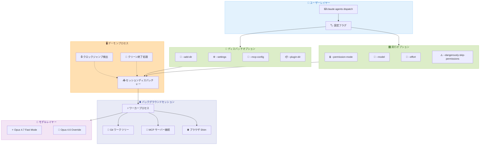

# Claude Code v2.1.142 - エージェントディスパッチ設定の大幅拡張と Fast Mode の Opus 4.7 移行

## メタデータ

| 項目 | 内容 |
|------|------|
| 発表日 | 2026-05-14 |
| ソース | Claude Code Changelog |
| カテゴリ | Claude Code Update |
| 公式リンク | https://github.com/anthropics/claude-code/blob/main/CHANGELOG.md |

## 概要

Claude Code v2.1.142 は、`claude agents` コマンドへの 8 つの新フラグ追加によるバックグラウンドセッション設定の柔軟化、Fast Mode のデフォルトモデルを Opus 4.7 へ切り替える重要な変更、プラグインスキル検出の簡素化を含むアップデートである。また、macOS スリープ復帰後のデーモン再接続失敗、MCP ツールタイムアウトの無視、バイナリアップグレード後のデーモン残留など、バックグラウンドエージェントの安定性に関わる重大なバグが多数修正されている。合計 26 件の変更 (新機能 5 件、バグ修正 18 件、改善 3 件) を含む本リリースは、エージェントワークフローの本番運用における信頼性を大きく向上させる。

## 詳細

### 背景

Claude Code v2.1.141 でバックグラウンドエージェントのパーミッションモード保持が導入されたが、ディスパッチ時に設定可能なパラメータは依然として限定的であった。チームでの運用においては、モデル選択、作業ディレクトリの追加、MCP 設定の指定などをディスパッチ時に一括指定したいという需要が高まっていた。また、v2.1.139 で報告された macOS スリープ復帰後のデーモン切断問題や、`brew upgrade` 後のクラッシュループなど、長時間稼働における安定性の課題が残されていた。

### 主な変更点

#### 新機能 (5 項目)

**エージェントディスパッチの設定フラグ:**

- `claude agents` に 8 つの新フラグを追加。`--add-dir`、`--settings`、`--mcp-config`、`--plugin-dir`、`--permission-mode`、`--model`、`--effort`、`--dangerously-skip-permissions` でバックグラウンドセッションの構成を完全に制御可能に

**Fast Mode のモデル移行:**

- Fast Mode のデフォルトモデルが Opus 4.7 に変更 (以前は Opus 4.6)。環境変数 `CLAUDE_CODE_OPUS_4_6_FAST_MODE_OVERRIDE=1` を設定することで Opus 4.6 に固定可能

**プラグインスキル検出の簡素化:**

- ルートレベルに `SKILL.md` を持ち、`skills/` サブディレクトリを持たないプラグインが自動的にスキルとして検出されるように変更

**プラグイン詳細の拡張:**

- `/plugin` 詳細ペインと `claude plugin details` コマンドでプラグインが提供する LSP サーバーを表示

**Web セットアップの安全性向上:**

- `/web-setup` が既存の GitHub App 接続を置換する前に警告を表示

#### バグ修正 (18 項目)

**デーモン/バックグラウンドセッション (8 件):**

- **macOS スリープ復帰後の接続問題修正**: デーモンがクロックジャンプを経過したアイドル時間として扱い、セッションが消失する問題を修正。デーモンがクロックジャンプを検出するロジックに変更
- **バイナリアップグレード後のクラッシュループ修正**: `brew upgrade` などでバイナリが更新された後、旧デーモンがクリーンに終了せず、ディスパッチされたエージェントが削除済みパスで起動を繰り返す問題を修正
- **Git ワークツリー認識問題修正**: バックグラウンドセッションが既存の Git ワークツリーを認識せず、Edit がブロックされる一方で EnterWorktree が重複作成を拒否する問題を修正
- **Chrome 拡張接続時のクラッシュ修正**: Claude-in-Chrome 拡張が共有タブなしで接続された状態でバックグラウンドエージェントがクラッシュループする問題を修正
- **`--dangerously-skip-permissions` の永続化修正**: `claude --bg --dangerously-skip-permissions` がリタイア/ウェイクのサイクルで失われる問題を修正
- **Windows ネットワークドライブでのデッドロック修正**: ネットワークドライブ上の作業ディレクトリで `claude agents` がデッドロックし、Ctrl+C が起動中に機能しない問題を修正
- **ヘッドレスブラウザ Shim の修正**: アタッチ済み `claude agents` セッションでリンクをクリックした際、バックグラウンドワーカーのヘッドレスブラウザ Shim が適用される問題を修正
- **エディタ設定の修正**: `claude agents` の "v to open in editor" がシェルの `$EDITOR`/`$VISUAL` ではなくデーモンのデフォルトエディタを使用する問題を修正

**MCP/プラグイン (4 件):**

- **MCP ツールタイムアウト修正**: `MCP_TOOL_TIMEOUT` がリモート HTTP/SSE MCP サーバーのリクエストごとのフェッチタイムアウトを引き上げず、設定値に関わらず 60 秒で打ち切られる問題を修正
- **プラグインスキルパスエラー修正**: `skills: ["./"]` を使用するプラグインで偽の "path escapes plugin directory" エラーが表示される問題を修正
- **プラグインキャッシュクリーンアップ修正**: インストールメタデータが存在しない場合にアクティブなプラグインバージョンディレクトリが削除される問題を修正
- **プラグインアドバイザリ修正**: デフォルトフォルダをシャドウする `plugin.json` キーをすべて名前付きで表示するように修正

**UI/UX (6 件):**

- **256 色ターミナルでの背景色ブリード修正**: Apple Terminal などの 256 色専用ターミナルで `claude agents` セッションにアタッチした際の表示崩れを修正
- **セッションタイトル修正**: 最初のメッセージがリンクの場合にセッションタイトルが URL から派生される問題を修正
- **重複モデルリクエスト修正**: リモートクライアントからの冗長な `set_model` リクエストがトランスクリプトに重複した `/model` ブレッドクラムを挿入する問題を修正
- **プラグインインストール数表示修正**: `/plugin` ブラウズペインで新規公開プラグインが "0 installs" と表示される問題を修正

### 技術的な詳細

#### `claude agents` フラグの詳細

新たに追加された 8 つのフラグにより、バックグラウンドセッションのディスパッチ時に以下の設定が可能になる。

| フラグ | 説明 |
|--------|------|
| `--add-dir` | セッションに追加の作業ディレクトリを指定 |
| `--settings` | カスタム設定ファイルのパスを指定 |
| `--mcp-config` | MCP サーバー設定ファイルのパスを指定 |
| `--plugin-dir` | プラグインディレクトリのパスを指定 |
| `--permission-mode` | パーミッションモードを指定 |
| `--model` | 使用するモデルを指定 |
| `--effort` | モデルの推論エフォートレベルを指定 |
| `--dangerously-skip-permissions` | パーミッションチェックをスキップ |

#### Fast Mode のモデル変更

Fast Mode は、応答速度を優先するモードとして導入されたが、Opus 4.7 の推論速度向上により、品質を維持しつつ応答速度も改善される。Opus 4.6 での動作が必要な場合は環境変数でオーバーライドが可能。

#### デーモンのクロックジャンプ検出

従来のデーモンは、タイマーベースでアイドル時間を測定していたため、macOS のスリープ中の経過時間がアイドルタイムとして加算されていた。v2.1.142 ではシステムクロックのジャンプを検出し、スリープ期間を除外する仕組みに変更された。

#### リアクティブコンパクションの改善

最初の要約試行が元のリクエストのオーバーフローサイズをシードとして使用するようになり、コンテキストがほぼ満杯の状態での無駄なリトライを回避する。これにより、長時間セッションでのコンパクション効率が向上する。

## 開発者への影響

### 対象

- `claude agents` でバックグラウンドエージェントを運用している開発者
- Fast Mode を日常的に利用している開発者
- macOS 環境で長時間 Claude Code を稼働させているユーザー
- MCP サーバーと連携してツール呼び出しを行っている開発者
- プラグインを開発・公開しているエコシステム参加者
- CI/CD パイプラインでバックグラウンドエージェントを自動化しているチーム

### 必要なアクション

1. **Fast Mode ユーザー**: デフォルトモデルが Opus 4.7 に変更されたため、動作確認を推奨。Opus 4.6 での動作を維持する場合は `CLAUDE_CODE_OPUS_4_6_FAST_MODE_OVERRIDE=1` を設定
2. **macOS ユーザー**: v2.1.142 へのアップデートにより、スリープ復帰後のセッション消失問題が解消される。速やかなアップデートを推奨
3. **Homebrew ユーザー**: バイナリアップグレード後のクラッシュループ問題が修正されたため、`brew upgrade` を安全に実行可能に
4. **MCP タイムアウト設定利用者**: `MCP_TOOL_TIMEOUT` が正しく適用されるようになったため、60 秒以上のツール呼び出しが正常に動作する
5. **プラグイン開発者**: ルートレベルの `SKILL.md` のみでスキルとして認識されるため、シンプルなプラグイン構造の場合に `skills/` ディレクトリが不要に

### 移行ガイド

**Fast Mode のモデル変更に関して:**

特別な移行作業は不要。デフォルトの動作変更であり、オプトアウトが環境変数で提供されている。Opus 4.6 固定が必要な場合は以下を設定する。

```bash
export CLAUDE_CODE_OPUS_4_6_FAST_MODE_OVERRIDE=1
```

**プラグインスキル検出の変更に関して:**

既存の `skills/` ディレクトリ構造を持つプラグインには影響しない。ルートレベルに `SKILL.md` のみを持つプラグインが新たにスキルとして認識されるようになる追加的な変更である。

## コード例

### `claude agents` の新フラグを活用したディスパッチ

```bash
# カスタム設定でバックグラウンドエージェントをディスパッチ
claude agents dispatch "テストスイートを実行して結果を報告" \
  --add-dir /path/to/shared-libs \
  --settings /team/claude-settings.json \
  --mcp-config /team/mcp-servers.json \
  --permission-mode auto \
  --model opus-4-7 \
  --effort high

# プラグインディレクトリを指定してディスパッチ
claude agents dispatch "コードレビューを実施" \
  --plugin-dir /team/plugins \
  --model opus-4-7

# CI/CD 環境向け: パーミッションスキップ付きディスパッチ
claude agents dispatch "ビルドとデプロイを実行" \
  --dangerously-skip-permissions \
  --mcp-config ./ci/mcp-config.json \
  --effort medium
```

### Fast Mode のモデルオーバーライド

```bash
# Opus 4.6 に固定する場合
export CLAUDE_CODE_OPUS_4_6_FAST_MODE_OVERRIDE=1

# 確認: Fast Mode で使用されるモデル
claude config get fast_mode_model

# 環境変数を解除して Opus 4.7 に戻す
unset CLAUDE_CODE_OPUS_4_6_FAST_MODE_OVERRIDE
```

### プラグインのスキル検出 (シンプル構造)

```
my-plugin/
├── plugin.json
├── SKILL.md          # ルートレベルに SKILL.md があれば自動検出
└── src/
    └── index.ts
```

```json
// plugin.json - skills/ ディレクトリなしでスキルが認識される
{
  "name": "my-simple-plugin",
  "version": "1.0.0",
  "description": "A simple plugin with a single skill",
  "main": "src/index.ts"
}
```

### MCP タイムアウトの設定

```bash
# MCP ツールタイムアウトを 5 分に設定 (修正前は 60 秒で打ち切られていた)
export MCP_TOOL_TIMEOUT=300000

# リモート MCP サーバーへの長時間ツール呼び出しが正常に動作
claude "大規模データセットの分析を実行して"
```

## アーキテクチャ図



## 関連リンク

- [Claude Code Changelog](https://github.com/anthropics/claude-code/blob/main/CHANGELOG.md)
- [Claude Code ドキュメント](https://docs.anthropic.com/en/docs/claude-code)
- [Claude Code GitHub リポジトリ](https://github.com/anthropics/claude-code)
- [MCP 仕様](https://modelcontextprotocol.io/)

## まとめ

Claude Code v2.1.142 は、バックグラウンドエージェントの「構成可能性」と「運用安定性」の両面で大きな前進を実現したリリースである。以下の 3 点が特に重要である。

1. **エージェントディスパッチの完全制御**: 8 つの新フラグにより、モデル選択、MCP 設定、パーミッションモード、作業ディレクトリなどをディスパッチ時に一括指定できるようになった。これにより、CI/CD パイプラインやチーム運用で異なる設定のエージェントを柔軟に起動することが可能に
2. **Fast Mode の Opus 4.7 移行**: デフォルトモデルが Opus 4.7 に変更され、推論品質と速度の両方が向上する。Opus 4.6 への固定オプションも環境変数で提供されており、移行リスクは最小限
3. **デーモンの堅牢性向上**: macOS スリープ復帰後のセッション消失、バイナリアップグレード後のクラッシュループ、Windows ネットワークドライブでのデッドロックなど、長時間運用で顕在化していた問題が包括的に修正された

合計 26 件の変更を含む本リリースは、バックグラウンドエージェントを本番環境で安定的に運用するための基盤を確立するアップデートと位置付けられる。
