# Anthropic とゲイツ財団が 2 億ドルのパートナーシップを発表 - グローバルヘルス・教育・経済的モビリティに AI を活用

## メタデータ

| 項目 | 内容 |
|------|------|
| 発表日 | 2026-05-14 |
| ソース | Anthropic News |
| カテゴリ | パートナーシップ / 社会貢献 |
| 公式リンク | https://www.anthropic.com/news/gates-foundation-partnership |

## 概要

Anthropic とビル&メリンダ・ゲイツ財団 (Bill & Melinda Gates Foundation) は、4 年間にわたる 2 億ドル規模のパートナーシップを発表した。本パートナーシップは、助成金、Claude 利用クレジット、および技術支援を組み合わせたものであり、グローバルヘルス、ライフサイエンス、教育、経済的モビリティの 4 分野に焦点を当てている。

Anthropic の Beneficial Deployments チームが主導するこのプログラムは、世界で 46 億人が基本的な医療サービスにアクセスできていない現状に対応し、低中所得国 (LMICs) における AI 活用を促進することを目的としている。これは Anthropic にとって過去最大規模の社会貢献パートナーシップであり、AI 技術が商業利用を超えて人類全体の福祉に貢献できることを実証する取り組みとなる。

## 詳細

### 背景

世界保健機関 (WHO) の推計によれば、世界で約 46 億人が基本的な医療サービスへのアクセスを欠いている。特に低中所得国では、医療従事者の不足、サプライチェーンの非効率性、疾病の早期検知における課題が深刻である。教育分野においても、サブサハラアフリカやインドでは質の高い教育リソースへのアクセスが限られており、経済的モビリティの面では 20 億人の小規模農家が技術支援を十分に受けられていない状況にある。

こうした課題に対し、AI 技術、特に大規模言語モデル (LLM) の活用が有望視されてきたが、実際の展開にはローカライゼーション、評価フレームワーク、インフラ整備など多くの障壁が存在していた。本パートナーシップは、これらの障壁を体系的に解消し、AI の社会的インパクトを最大化することを目指している。

### 主な変更点

#### 投資規模と構成

- **総額**: 2 億ドル (4 年間)
- **構成要素**: 助成金、Claude 利用クレジット、技術支援の 3 本柱
- **推進体制**: Anthropic の Beneficial Deployments チームが主導
- **対象地域**: 低中所得国 (LMICs) を中心としたグローバル展開

#### グローバルヘルス分野

本パートナーシップの最も大きな柱であるグローバルヘルス分野では、以下の取り組みが計画されている。

**インフラ構築:**

- 医療 AI 向けコネクタ、ベンチマーク、評価フレームワークの開発
- 各国保健省との連携による意思決定支援: 医療従事者の配置最適化、サプライチェーン管理、アウトブレイク検知

**現場支援:**

- フロントライン医療従事者向けの AI ツール開発
- 患者向けのヘルスケアアクセス改善
- 地域の医療リソースに適応したローカライズ

**疾病研究:**

- 高負荷疾病および顧みられない疾病 (Neglected Diseases) への取り組み
- ポリオ、HPV、子癇/子癇前症 (eclampsia/preeclampsia) に対する研究支援
- HPV は年間約 350,000 人の死亡原因であり、その 90% が LMICs に集中

**疾病モデリング:**

- Institute for Disease Modeling (IDM) とのパートナーシップ
- マラリアおよび結核 (TB) の予測モデリング
- AI を活用した疫学データ分析と介入戦略の最適化

#### 教育分野

教育分野では、米国、サブサハラアフリカ、インドを対象とした K-12 ツールの開発が計画されている。

**公共財としてのリソース開発:**

- 数学チュータリング向けベンチマーク、データセット、ナレッジグラフ
- 大学進学アドバイジングツール
- カリキュラム設計支援ツール

**リテラシーとニューメラシーの向上:**

- AI を活用した読み書き能力向上アプリケーション
- 数的思考力向上アプリケーション
- Global AI for Learning Alliance (GAILA) の一環として推進

#### 経済的モビリティ分野

経済的モビリティ分野では、以下の 4 つの重点領域が設定されている。

**農業 AI:**

- 世界 20 億人の小規模農家 (smallholder farmers) 向け AI ツール
- 作物管理、市場情報、気候適応に関する意思決定支援
- 地域特有の農業知識とベストプラクティスの AI 活用

**ポータブルスキル記録:**

- スキルおよび資格認定の移植可能な電子記録システム
- 国境を超えた資格の相互認証支援
- 学習成果の可視化と証明

**キャリアガイダンス:**

- AI を活用したキャリアパス提案ツール
- 地域の労働市場データに基づいた職業案内
- スキルギャップ分析と学習推奨

**トレーニング成果測定:**

- トレーニングから雇用までの成果測定ツール
- プログラムの効果検証と改善サイクルの構築
- エビデンスに基づいた政策立案支援

### 技術的な詳細

#### 非営利・教育機関向けの特別支援

本パートナーシップの一環として、非営利団体および教育機関に対して Claude の割引アクセスが提供される。これにより、資金的制約のある組織でも最先端の AI 技術を活用した研究・サービス開発が可能になる。

#### 評価フレームワーク

グローバルヘルス分野で開発される評価フレームワークは、以下の要素を含む。

- 医療 AI の正確性と安全性のベンチマーク
- 多言語対応の品質基準
- 低リソース環境 (限られたインターネット接続、低スペックデバイス) での動作要件
- 文化的感受性と地域適合性の評価指標

#### コネクタの役割

各国の医療情報システムと Claude を接続するコネクタは、既存のヘルスデータインフラストラクチャ (DHIS2、OpenMRS など) との相互運用性を確保し、データプライバシーとセキュリティを維持しながら AI 機能を提供する設計となる。

## 開発者への影響

### 対象

- グローバルヘルス分野で AI アプリケーションを開発する技術者
- 教育テクノロジー (EdTech) 分野の開発者
- 非営利団体で技術プロジェクトに携わるエンジニア
- 農業技術 (AgriTech) ソリューションを構築する開発者
- LMICs 向けのローカライズされた AI システムを構築する開発者
- Claude API を活用したソーシャルインパクトプロジェクトに関心のある開発者

### 必要なアクション

1. **非営利・教育機関の開発者**: 割引アクセスプログラムの詳細が公開され次第、申請手続きの確認を推奨
2. **ヘルスケア AI 開発者**: 公開予定のベンチマークと評価フレームワークを自プロジェクトの品質基準として活用検討
3. **EdTech 開発者**: GAILA のリソース (ベンチマーク、データセット、ナレッジグラフ) が公共財として公開予定のため、統合計画の検討を推奨
4. **AgriTech 開発者**: 小規模農家向け AI ツールの開発フレームワークや API 連携の仕様公開を注視

### 移行ガイド

本発表は新規パートナーシップの告知であり、既存の Claude API やサービスへの変更は含まれない。今後、各プログラム分野でのリソース公開に伴い、追加の技術ドキュメントやガイドラインが提供される見込みである。

## アーキテクチャ図

```mermaid
flowchart TD
    subgraph Partnership["🤝 Anthropic - ゲイツ財団パートナーシップ"]
        direction LR
        Grant["💰 助成金"]
        Credits["🎫 Claude クレジット"]
        Support["🛠️ 技術支援"]
        Grant ~~~ Credits ~~~ Support
    end

    subgraph Health["🏥 グローバルヘルス"]
        direction LR
        Infra["🔗 コネクタ/ベンチマーク"]
        Ministry["🏛️ 保健省支援"]
        Frontline["👨‍⚕️ 現場医療従事者"]
        Disease["🔬 疾病研究"]
        Infra ~~~ Ministry ~~~ Frontline ~~~ Disease
    end

    subgraph Education["📚 教育"]
        direction LR
        K12["🎓 K-12 ツール"]
        PublicGoods["📊 公共財リソース"]
        GAILA["🌍 GAILA リテラシー"]
        K12 ~~~ PublicGoods ~~~ GAILA
    end

    subgraph Mobility["💼 経済的モビリティ"]
        direction LR
        Agri["🌾 農業 AI"]
        Skills["📋 スキル記録"]
        Career["🧭 キャリアガイダンス"]
        Measure["📈 成果測定"]
        Agri ~~~ Skills ~~~ Career ~~~ Measure
    end

    subgraph Claude["🤖 Claude プラットフォーム"]
        direction LR
        API["🔌 Claude API"]
        Models["⭐ Claude モデル"]
        Safety["🛡️ 安全性フレームワーク"]
        API ~~~ Models ~~~ Safety
    end

    subgraph Impact["🌏 対象地域・人口"]
        direction LR
        LMICs["🏘️ 低中所得国"]
        Farmers["🧑‍🌾 20 億人の小規模農家"]
        Students["👩‍🎓 米国/アフリカ/インド"]
        LMICs ~~~ Farmers ~~~ Students
    end

    Partnership --> Health
    Partnership --> Education
    Partnership --> Mobility

    Claude --> Health
    Claude --> Education
    Claude --> Mobility

    Health --> Impact
    Education --> Impact
    Mobility --> Impact

    classDef partnership fill:#E8EAF6,stroke:#C5CAE9,stroke-width:2px,color:#283593
    classDef health fill:#FFEBEE,stroke:#FFCDD2,stroke-width:2px,color:#B71C1C
    classDef education fill:#E8F5E9,stroke:#C8E6C9,stroke-width:2px,color:#1B5E20
    classDef mobility fill:#FFF3E0,stroke:#FFE0B2,stroke-width:2px,color:#E65100
    classDef claude fill:#F3E5F5,stroke:#E1BEE7,stroke-width:2px,color:#4A148C
    classDef impact fill:#E3F2FD,stroke:#BBDEFB,stroke-width:2px,color:#1565C0

    class Partnership partnership
    class Health health
    class Education education
    class Mobility mobility
    class Claude claude
    class Impact impact
```

## 関連リンク

- [Anthropic - Gates Foundation Partnership 発表](https://www.anthropic.com/news/gates-foundation-partnership)
- [Anthropic 公式サイト](https://www.anthropic.com/)
- [Bill & Melinda Gates Foundation](https://www.gatesfoundation.org/)
- [Institute for Disease Modeling](https://www.idmod.org/)
- [Global AI for Learning Alliance](https://www.anthropic.com/news/gates-foundation-partnership)
- [Claude API ドキュメント](https://docs.anthropic.com/)

## まとめ

Anthropic とゲイツ財団の 2 億ドルパートナーシップは、AI 技術の社会的インパクトに関する重要なマイルストーンである。以下の 3 点が特に注目に値する。

1. **規模と期間**: 4 年間で 2 億ドルという投資規模は、AI 企業による社会貢献プログラムとしては過去最大級であり、助成金・利用クレジット・技術支援を組み合わせた包括的なアプローチが採用されている

2. **グローバルヘルスへの深い関与**: HPV による年間 350,000 人の死亡 (90% が LMICs) や 46 億人の医療アクセス不足という課題に対し、コネクタ開発、評価フレームワーク構築、疾病モデリングという多層的なアプローチで臨んでいる。IDM との連携によるマラリア/TB 予測モデリングは、AI が公衆衛生に与えうるインパクトの具体例である

3. **公共財としてのアプローチ**: 教育分野でのベンチマーク、データセット、ナレッジグラフの公開や、非営利・教育機関向けの割引アクセスは、AI の恩恵を広く民主化する取り組みであり、開発者コミュニティ全体にとって有益なリソースとなる

本パートナーシップは、Anthropic が掲げる「AI の安全で有益な展開」というミッションを具現化するものであり、商業的成功と社会的責任の両立を目指す AI 業界全体のモデルケースとなる可能性を持っている。
