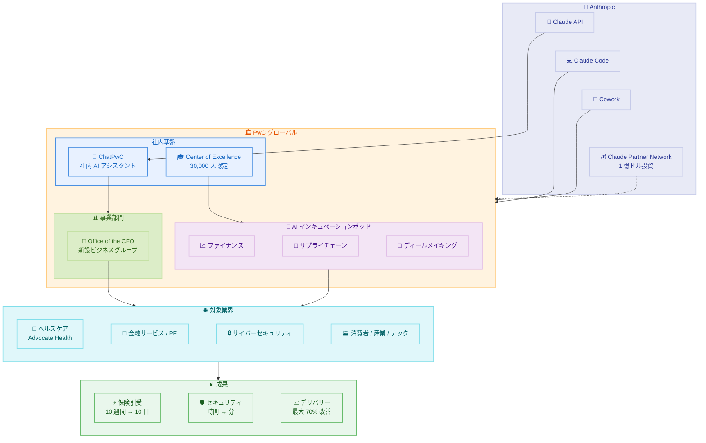

# Anthropic と PwC の戦略的パートナーシップ拡大 - Claude を活用したエンタープライズ変革

## メタデータ

| 項目 | 内容 |
|------|------|
| 発表日 | 2026-05-14 |
| ソース | Anthropic News |
| カテゴリ | パートナーシップ / エンタープライズ |
| 公式リンク | https://www.anthropic.com/news/pwc-expanded-partnership |

## 概要

Anthropic と PwC は、既存の戦略的アライアンスの大幅な拡大を発表した。本パートナーシップにより、PwC は Claude Code および Cowork を米国チームから展開開始し、数十万人規模のグローバル専門職へと拡大する。共同 Center of Excellence の設立、30,000 人の PwC プロフェッショナルへの Claude 認定トレーニングプログラム、そして Claude Partner Network (1 億ドル投資) の一環としての 3 つの AI インキュベーションポッドの運営が含まれる。

PwC は、Anthropic の技術を基盤とした初の独立事業部門となる新しいファイナンスビジネスグループ (Office of the CFO) を設立する。これは、コンサルティングファームが AI ネイティブなアプローチで事業単位を構築する画期的な事例である。既に本番環境で稼働する Claude は、保険引受業務 (10 週間から 10 日への短縮)、サイバーセキュリティ (時間単位から分単位への短縮) など、最大 70% のデリバリー改善を実現している。

## 詳細

### 背景

Anthropic と PwC のパートナーシップは、Claude Partner Network (1 億ドル規模の投資プログラム) の一環として位置づけられている。PwC は世界四大会計事務所の一つであり、数十万人の専門職を擁するグローバルプロフェッショナルサービスファームである。AI の企業導入が加速する中、単なるツール提供を超えた戦略的パートナーシップが、大規模な組織変革の鍵となっている。

本拡大は、既存のパートナーシップでの実績を基盤としている。Claude は既に PwC の社内 AI アシスタント「ChatPwC」に統合されており、プロフェッショナルスポーツ運営、保険引受、メインフレームモダナイゼーション、HR トランスフォーメーション、サイバーセキュリティなど、多岐にわたる領域で本番稼働している。

### 主な変更点

#### 1. グローバル規模での Claude 展開

**Claude Code と Cowork の全社展開:**

- 米国チームから展開を開始し、グローバルの数十万人規模の専門職へ拡大
- PwC の社内 AI アシスタント「ChatPwC」への Claude 統合を継続強化
- エージェント型ワークフローを活用した業務プロセスの根本的な再設計

#### 2. 人材育成プログラム

**共同 Center of Excellence:**

- Anthropic と PwC の共同運営による専門知識センターの設立
- 30,000 人の PwC プロフェッショナルに対する Claude 認定トレーニングプログラム
- AI ネイティブな業務手法の体系的な教育と認定

#### 3. 3 つの重点分野

本パートナーシップは以下の 3 つの戦略的フォーカスエリアで展開される。

1. **エージェント型テクノロジーの構築 (Agentic Technology Build)**: Claude のエージェント機能を活用した自律型ワークフローの設計と実装
2. **AI ネイティブなディールメイキング (AI-Native Deal-Making)**: M&A、プライベートエクイティなどの取引業務における AI 活用の革新
3. **エンタープライズ機能の再発明 (Reinvention of the Enterprise Function)**: 財務、サプライチェーン、HR などの基幹機能を AI 前提で再設計

#### 4. 新事業部門の設立

**Office of the CFO (ファイナンスビジネスグループ):**

- Anthropic の技術を基盤とした PwC 初の独立事業部門
- パートナー企業が AI 技術にアンカーした独立事業ユニットを構築する初の事例
- CFO 向けの AI ネイティブなファイナンスソリューションの提供

#### 5. AI インキュベーションポッド

3 つのアクティブなインキュベーションポッドが運営されている。

- **ファイナンスポッド**: 財務業務の自動化と高度化
- **サプライチェーンポッド**: サプライチェーン最適化の AI 化
- **ディールメイキングポッド**: 取引業務の AI ネイティブ化

### 技術的な詳細

#### 本番環境での Claude 活用実績

PwC が Claude を本番環境で活用しているユースケースは以下の通りである。

| 領域 | 改善内容 | 効果 |
|------|----------|------|
| 保険引受 | リスク評価プロセスの自動化 | 10 週間 → 10 日 |
| サイバーセキュリティ | 脅威分析と対応 | 時間単位 → 分単位 |
| プロフェッショナルスポーツ運営 | 運営効率化 | - |
| メインフレームモダナイゼーション | レガシーシステム移行支援 | - |
| HR トランスフォーメーション | 人事業務の再設計 | - |
| 全体的なデリバリー | プロジェクト遂行効率 | 最大 70% 改善 |

#### 対象業界

Claude を活用したソリューションは以下の業界に展開されている。

- **ヘルスケア**: Advocate Health (167,000 人の従業員を擁する米国最大級の医療システム) が導入
- **ライフサイエンス**: 研究開発、規制対応の効率化
- **金融サービス / プライベートエクイティ**: ディールメイキング、リスク分析
- **消費者 / 産業 / テクノロジー**: 業界横断的なソリューション提供

#### Claude Partner Network との連携

本パートナーシップは、Anthropic が 1 億ドルを投資する Claude Partner Network の重要な構成要素である。このネットワークは、パートナー企業が Claude を活用したソリューションを構築・展開するためのエコシステムであり、PwC はその中核パートナーとして位置づけられている。

#### エグゼクティブコメント

**Dario Amodei (CEO, Anthropic)**: PwC との拡大パートナーシップが、エンタープライズ AI の実用化と大規模展開において重要なマイルストーンであることを強調。

**Paul Griggs (CEO, PwC)**: Claude を基盤とした業務変革が、クライアントへの価値提供を根本的に変えるものであると表明。

## 開発者への影響

### 対象

- PwC のグローバルプロフェッショナルサービスチーム (数十万人規模)
- Claude Partner Network に参加する開発者・コンサルタント
- エンタープライズ環境で Claude Code / Cowork を活用する開発チーム
- 金融、ヘルスケア、サイバーセキュリティ分野のソリューション開発者
- AI ネイティブなビジネスプロセスを設計するアーキテクト

### 必要なアクション

1. **PwC プロフェッショナル向け**: Claude 認定トレーニングプログラムへの参加登録。30,000 人枠の認定プログラムを通じて、Claude の効果的な活用方法を習得
2. **エンタープライズ開発者**: Claude Code と Cowork のエンタープライズ展開に備え、エージェント型ワークフローの設計パターンを理解
3. **パートナーネットワーク参加者**: Claude Partner Network を通じた共同ソリューション開発の機会を活用
4. **既存 PwC クライアント**: Claude を活用した新しいサービス提供モデルについて、担当チームとの協議を開始

### 移行ガイド

本発表はビジネスパートナーシップの拡大であり、技術的な移行作業は不要である。ただし、PwC プロフェッショナルは以下のステップで Claude の活用を開始できる。

1. ChatPwC を通じた Claude へのアクセス確認
2. Center of Excellence が提供するトレーニングリソースの確認
3. 所属チームでの Claude Code / Cowork 展開スケジュールの確認
4. 業務プロセスにおける AI 活用機会の特定

## アーキテクチャ図

## 関連リンク

- [Anthropic と PwC のパートナーシップ拡大発表](https://www.anthropic.com/news/pwc-expanded-partnership)
- [Claude Partner Network](https://www.anthropic.com/news/claude-partner-network)
- [Claude Code ドキュメント](https://docs.anthropic.com/en/docs/claude-code)
- [Anthropic Enterprise](https://www.anthropic.com/enterprise)
- [PwC AI サービス](https://www.pwc.com/ai)

## まとめ

Anthropic と PwC の戦略的パートナーシップ拡大は、エンタープライズ AI 導入の新たなフェーズを象徴する発表である。以下の 3 つの観点で特に重要な意義を持つ。

1. **規模と速度**: 数十万人規模のグローバル専門職への Claude Code / Cowork 展開は、エンタープライズ AI の採用規模として過去最大級。30,000 人の認定プログラムは、AI リテラシーの組織的な底上げを実現する
2. **事業モデルの革新**: PwC が Anthropic の技術を基盤に独立事業部門 (Office of the CFO) を設立することは、AI がコンサルティングファームの事業構造そのものを変革する先例となる。単なるツール導入ではなく、AI ネイティブなビジネスユニットの構築という点で画期的である
3. **実証された価値**: 保険引受の 10 週間から 10 日への短縮 (約 86% 削減)、サイバーセキュリティの時間から分への短縮、全体的なデリバリー最大 70% 改善という具体的な数値は、Claude の大規模エンタープライズ環境での実用性を明確に示している

Advocate Health (167,000 人の従業員) のような大規模クライアント事例は、AI が単なるパイロットプロジェクトの段階を超え、ミッションクリティカルな業務で本番稼働する段階に到達していることを証明している。Claude Partner Network の 1 億ドル投資と合わせて、Anthropic のエンタープライズ戦略が着実に実行されていることが伺える。
