# Claude Code v2.1.143 - プラグイン依存関係管理とバックグラウンドセッション設定永続化の包括的強化

## メタデータ

| 項目 | 内容 |
|------|------|
| 発表日 | 2026-05-16 |
| ソース | Claude Code Changelog |
| カテゴリ | Claude Code Update |
| 公式リンク | https://github.com/anthropics/claude-code/blob/main/CHANGELOG.md |

## 概要

Claude Code v2.1.143 は、プラグインエコシステムの依存関係管理強化、バックグラウンドセッション (`/bg` および `claude agents`) の設定永続化の大幅改善、Windows/PowerShell 環境での利便性向上を含む大規模アップデートである。合計 33 件の変更 (新機能 10 件、バグ修正 19 件、改善 4 件) を含み、特にバックグラウンドセッションがフォーク・リスポーン時に設定を失わなくなった点は、エージェントワークフローの本番運用信頼性を飛躍的に高める。また、ストップフックの無限ループ防止、macOS の Full Disk Access 問題の修正、ワークツリークリーンアップの安全性向上など、長期運用で顕在化していた致命的な問題が包括的に修正されている。

## 詳細

### 背景

Claude Code v2.1.142 で `claude agents` のディスパッチフラグが拡張されたが、`/bg` コマンドやデタッチ操作でバックグラウンドに移行する際に、MCP 設定やフォールバックモデルなどの重要な設定が失われる問題が残されていた。また、プラグインエコシステムの成熟に伴い、プラグイン間の依存関係を適切に管理する仕組みの必要性が高まっていた。Windows 環境では PowerShell ツールの実行ポリシーによる制約や、Windows Terminal での操作上の問題が報告されていた。

### 主な変更点

#### 新機能 (10 項目)

**プラグイン依存関係の強制:**

- `claude plugin disable` が、他の有効なプラグインが対象プラグインに依存している場合に無効化を拒否するようになった。依存チェーンを一括で無効化するためのコピーペースト可能なコマンドヒントが表示される
- `claude plugin enable` が、トランジティブな依存関係 (推移的依存) を自動的に有効化するようになった

**プラグインマーケットプレイスのコスト表示:**

- `/plugin` マーケットプレイスブラウズペインに、プラグインの予測コンテキストコスト (ターンあたりおよび呼び出しあたりのトークン推定値) が表示されるようになった

**ワークツリーバイパス設定:**

- `worktree.bgIsolation: "none"` 設定を追加。バックグラウンドセッションが `EnterWorktree` なしで直接作業コピーを編集可能に。ワークツリーが実用的でないリポジトリ向け

**PowerShell ツールの改善:**

- PowerShell ツールが `-ExecutionPolicy Bypass` を自動付与。環境変数 `CLAUDE_CODE_POWERSHELL_RESPECT_EXECUTION_POLICY=1` でオプトアウト可能
- PowerShell ツールが Windows 上の Bedrock、Vertex、Foundry ユーザーでデフォルト有効化。`CLAUDE_CODE_USE_POWERSHELL_TOOL=0` でオプトアウト可能

**バックグラウンドセッションの設定保持:**

- バックグラウンドセッションがアイドル復帰後もモデルとエフォートレベルを保持するようになった
- `/bg` がフォーク時に `--mcp-config`、`--settings`、`--add-dir`、`--plugin-dir`、`--strict-mcp-config` を保持
- `/bg` およびデタッチ操作がフォーク時に `--fallback-model` を保持
- `/bg` およびデタッチ操作がフォーク時に `--allow-dangerously-skip-permissions` を保持

**`claude agents` の追加フラグ:**

- `claude agents` が `--add-dir`、`--settings`、`--mcp-config`、`--plugin-dir` を受け付け、ダッシュボードおよびディスパッチされるバックグラウンドセッションに適用
- `claude agents` が `--permission-mode`、`--model`、`--effort`、`--dangerously-skip-permissions` を受け付け、ディスパッチセッションのデフォルトとして設定

**Shift+Tab のサイクル拡張:**

- アタッチされたエージェントセッションで Shift+Tab が auto モードをサイクルに含むようになった

#### バグ修正 (19 項目)

**認証/起動 (1 件):**

- `.credentials.json` の `scopes` 値が配列でない場合に CLI がハングするか OAuth トークンリフレッシュがサイレントに中断する問題を修正

**バックグラウンドセッション/デーモン (9 件):**

- ストップフックが繰り返しブロックする際に無限ループする問題を修正。8 回連続ブロック後にターンが警告付きで終了するように変更 (環境変数 `CLAUDE_CODE_STOP_HOOK_BLOCK_CAP` でオーバーライド可能)
- `/goal` エバリュエーターがバックグラウンドシェルや委任サブエージェントの実行中に発火する問題を修正
- `/bg` がプロンプトなしで実行された場合にフォークされたセッションに "continue" が送信される問題を修正。フォークが入力待ちになるよう変更
- バックグラウンドセッションが IDE ファイル参照をウォームスペアの入力にサイレントにキャプチャし、`claude agents` からディスパッチされる次のプロンプトに参照が先頭に付加される問題を修正
- `claude agents` からランチされたバックグラウンドセッションが settings.json の `permissions.defaultMode` を無視し、auto モードでオーバーライドされる問題を修正
- `claude --bg --dangerously-skip-permissions` がリタイア/ウェイクで永続化されるよう修正
- `claude agents --allow-dangerously-skip-permissions` がディスパッチセッションをバイパスモードにデフォルト設定する問題を修正 (パーミッションサイクルで利用可能にするのが正しい動作)
- バックグラウンドデーモンスポーンが `~/.local/bin/claude` ランチャーが存在しないか非実行可能な場合に実行中バイナリにフォールバックするよう修正
- バックグラウンドエージェントがホストスリープまたは macOS App Nap 後にワーカーストール検出の偽陽性ストームを起こす問題を修正

**macOS (1 件):**

- macOS でバックグラウンドジョブセッションが `~/Documents`、`~/Desktop`、`~/Downloads` 配下のファイル読み取り時に Full Disk Access が許可されていても "Operation not permitted" エラーになる問題を修正

**Windows/PowerShell (4 件):**

- `claude agents` での右クリックペーストが Windows Terminal および WSL で動作しない問題を修正
- エージェントビューが Windows でセッション一覧表示時に PowerShell プロセスを繰り返しスポーンする問題を修正
- Windows Terminal でアタッチされたバックグラウンドセッションのスクロール時にステールフラグメントがレンダリングされる問題を修正
- Windows で `claude agents` のレスポンスストリーミング中に左矢印キーを押すとエージェントリストが全入力に対して無応答になる問題を修正

**CLI/UI (4 件):**

- Esc/Ctrl+C が Claude のアイドル中に保留中の `/loop` ウェイクアップをキャンセルできない問題を修正
- `NO_COLOR`/`FORCE_COLOR` を settings.json の `env` に設定すると Claude Code 自体の UI カラーも除去される問題を修正。サブプロセスにのみ適用されるよう変更
- `--agent <name>` がプラグイン提供エージェントを `plugin:` プレフィックスなしで検出できない問題を修正
- エージェントビューからセッションを削除してもトランスクリプトファイルが残る問題を修正

**その他 (1 件):**

- 5xx エラーメッセージが設定されたゲートウェイやクラウドプロバイダーではなく status.claude.com を指していた問題を修正

#### 改善 (4 項目)

**ワークツリークリーンアップの安全性向上:**

- ワークツリークリーンアップが `git worktree remove` 失敗時に `rm -rf` にフォールバックしなくなった。gitignore されたファイルや作業中のファイルの損失を防止

**`claude agents` の設定伝播:**

- `claude agents` に渡されたフラグがダッシュボードとディスパッチセッションの両方に適用されるようになった

**`/bg` の設定保持:**

- バックグラウンドセッションがリスポーン時に MCP サーバーと設定を維持するようになった

**エラーメッセージの改善:**

- 5xx エラーが正しいプロバイダー名を表示するようになった

### 技術的な詳細

#### プラグイン依存関係の強制メカニズム

プラグイン間の依存関係がグラフとして管理され、無効化操作時にトポロジカル順序で依存チェーンが検証される。依存される側のプラグインを無効化しようとすると、依存チェーン全体を無効化するコマンドが提示される。

#### ストップフックのブロックキャップ

従来はストップフックがターンの終了を繰り返しブロックできたため、特定の条件下で無限ループが発生していた。v2.1.143 では 8 回連続でブロックされた場合にターンを強制終了する安全機構が導入された。この上限は `CLAUDE_CODE_STOP_HOOK_BLOCK_CAP` 環境変数でカスタマイズ可能。

#### macOS Full Disk Access の修正

macOS のバックグラウンドジョブセッションは、デーモンプロセスとして起動されるため、ユーザーのアクセス権限 (TCC: Transparency, Consent, and Control) が正しく継承されていなかった。v2.1.143 ではデーモンが TCC 権限を適切に継承する仕組みに変更された。

#### NO_COLOR/FORCE_COLOR のスコープ分離

settings.json の `env` セクションに `NO_COLOR` や `FORCE_COLOR` を設定した場合、従来は Claude Code 自体の UI レンダリングにも影響していた。v2.1.143 では環境変数のスコープが分離され、これらの設定はサブプロセス (ユーザーのツール実行) にのみ適用される。

#### ワークツリーバイパスの動作

`worktree.bgIsolation: "none"` を設定すると、バックグラウンドセッションが `EnterWorktree` ツールを呼び出さずに直接作業コピーを編集する。これはモノレポやサブモジュールが多用されるリポジトリで、ワークツリー作成に時間がかかりすぎるケース向けの設定である。

## 開発者への影響

### 対象

- プラグインを開発・利用している全ユーザー
- バックグラウンドセッション (`/bg`、`claude agents`) を運用している開発者
- Windows/PowerShell 環境で Claude Code を使用しているユーザー
- macOS でバックグラウンドジョブを長時間実行しているユーザー
- ストップフックをカスタマイズしている開発者
- ワークツリーが実用的でない大規模リポジトリを扱うチーム
- CI/CD パイプラインでエージェントを自動化しているチーム

### 必要なアクション

1. **プラグイン開発者**: 依存関係が正しく宣言されているか確認。他のプラグインに依存している場合、無効化時の挙動が変更されている
2. **Windows ユーザー**: PowerShell ツールがデフォルトで有効化されたため、動作を確認。不要な場合は `CLAUDE_CODE_USE_POWERSHELL_TOOL=0` を設定
3. **バックグラウンドセッション利用者**: `/bg` やデタッチ時の設定保持が改善されたため、以前のワークアラウンドが不要になる可能性あり
4. **macOS ユーザー**: `~/Documents`、`~/Desktop`、`~/Downloads` へのアクセス問題が修正されたため、アップデートを推奨
5. **ストップフック利用者**: 8 回連続ブロックでターンが終了する新しい安全機構を認識しておく。必要に応じて `CLAUDE_CODE_STOP_HOOK_BLOCK_CAP` で調整

### 移行ガイド

**PowerShell ExecutionPolicy の変更に関して:**

Windows 環境で PowerShell の ExecutionPolicy を尊重する必要がある場合は、以下の環境変数を設定する。

```bash
export CLAUDE_CODE_POWERSHELL_RESPECT_EXECUTION_POLICY=1
```

**ワークツリーバイパスの設定に関して:**

ワークツリーが実用的でないリポジトリでは、settings.json に以下を追加する。

```json
{
  "worktree": {
    "bgIsolation": "none"
  }
}
```

**ストップフックブロックキャップの調整:**

デフォルトの 8 回では不足する場合は環境変数で調整する。

```bash
export CLAUDE_CODE_STOP_HOOK_BLOCK_CAP=16
```

## コード例

### プラグイン依存関係管理

```bash
# プラグイン B がプラグイン A に依存している場合
claude plugin disable plugin-a
# エラー: "plugin-b" depends on "plugin-a"
# Hint: claude plugin disable plugin-b && claude plugin disable plugin-a

# 依存チェーンを含めて無効化
claude plugin disable plugin-b && claude plugin disable plugin-a

# プラグインを有効化 (推移的依存を自動有効化)
claude plugin enable plugin-b
# "plugin-a" was automatically enabled as a dependency of "plugin-b"
```

### ワークツリーバイパスの設定

```json
// .claude/settings.json
{
  "worktree": {
    "bgIsolation": "none"
  }
}
```

```bash
# ワークツリーなしでバックグラウンドセッションを起動
claude --bg "大規模リファクタリングを実行"
# EnterWorktree なしで直接作業コピーを編集
```

### `/bg` での設定永続化

```bash
# MCP 設定とフォールバックモデルを指定して起動
claude --mcp-config ./my-mcp.json --fallback-model sonnet-4-6

# /bg でバックグラウンドに移行 (設定が保持される)
/bg テスト実行を続けて

# バックグラウンドセッションは以下を保持:
# - --mcp-config ./my-mcp.json
# - --fallback-model sonnet-4-6
# - --settings, --add-dir, --plugin-dir (指定されていた場合)
```

### `claude agents` のデフォルト設定

```bash
# モデルとパーミッションモードを指定してエージェントダッシュボードを起動
claude agents \
  --model opus-4-7 \
  --effort high \
  --permission-mode plan \
  --mcp-config ./team-mcp.json \
  --add-dir /shared/libs

# ダッシュボードからディスパッチされるすべてのセッションに
# これらの設定がデフォルトとして適用される
```

### PowerShell ツールの制御

```bash
# PowerShell ツールを無効化 (Windows)
export CLAUDE_CODE_USE_POWERSHELL_TOOL=0

# ExecutionPolicy を尊重する場合
export CLAUDE_CODE_POWERSHELL_RESPECT_EXECUTION_POLICY=1
```

### ストップフックブロックキャップ

```bash
# デフォルト: 8 回連続ブロックでターン終了
# カスタム: 16 回に引き上げ
export CLAUDE_CODE_STOP_HOOK_BLOCK_CAP=16

# ストップフック設定例 (.claude/settings.json)
{
  "hooks": {
    "stop": [
      {
        "command": "npm test",
        "block_on_failure": true
      }
    ]
  }
}
# テストが 8 回連続失敗した場合、ターンが警告付きで終了
```

## アーキテクチャ図

```mermaid
flowchart TD
    subgraph PluginManagement["🔌 プラグイン依存関係管理"]
        direction LR
        PluginA["📦 Plugin A"]
        PluginB["📦 Plugin B"]
        PluginC["📦 Plugin C"]
        PluginA ~~~ PluginB ~~~ PluginC
    end

    subgraph DependencyCheck["🔍 依存関係チェック"]
        Disable["❌ disable 要求"]
        DepGraph["🗺️ 依存グラフ検証"]
        Block["🚫 ブロック + ヒント表示"]
        Allow["✅ 無効化許可"]
    end

    subgraph BackgroundSession["🌐 バックグラウンドセッション"]
        BgFork["/bg フォーク"]
        Detach["← デタッチ"]
        AgentsDispatch["agents ディスパッチ"]
    end

    subgraph PreservedSettings["💾 永続化される設定"]
        direction LR
        MCPConfig["🔌 --mcp-config"]
        FallbackModel["🤖 --fallback-model"]
        SettingsFile["⚙️ --settings"]
        Permissions["🔒 --allow-dangerously-skip-permissions"]
        MCPConfig ~~~ FallbackModel ~~~ SettingsFile ~~~ Permissions
    end

    subgraph SafetyMechanisms["🛡️ 安全機構"]
        StopHookCap["⏱️ ストップフック<br/>ブロックキャップ"]
        WorktreeCleanup["🌳 ワークツリー<br/>安全クリーンアップ"]
        CredentialFix["🔑 認証情報<br/>バリデーション"]
    end

    subgraph Platform["💻 プラットフォーム対応"]
        direction LR
        PowerShell["⚡ PowerShell ツール"]
        MacOS["🍎 macOS TCC 修正"]
        WinTerminal["🪟 Windows Terminal 修正"]
        PowerShell ~~~ MacOS ~~~ WinTerminal
    end

    PluginB -->|"depends on"| PluginA
    PluginC -->|"depends on"| PluginB
    Disable --> DepGraph
    DepGraph -->|"依存あり"| Block
    DepGraph -->|"依存なし"| Allow

    BgFork --> PreservedSettings
    Detach --> PreservedSettings
    AgentsDispatch --> PreservedSettings

    StopHookCap -.->|"8 回で終了"| BackgroundSession
    WorktreeCleanup -.->|"rm -rf 禁止"| BackgroundSession

    classDef plugin fill:#E8EAF6,stroke:#C5CAE9,stroke-width:2px,color:#283593
    classDef check fill:#FFF3E0,stroke:#FFE0B2,stroke-width:2px,color:#E65100
    classDef session fill:#E3F2FD,stroke:#BBDEFB,stroke-width:2px,color:#1565C0
    classDef settings fill:#DCEDC8,stroke:#C5E1A5,stroke-width:2px,color:#33691E
    classDef safety fill:#FFEBEE,stroke:#FFCDD2,stroke-width:2px,color:#B71C1C
    classDef platform fill:#F3E5F5,stroke:#E1BEE7,stroke-width:2px,color:#4A148C

    class PluginManagement plugin
    class DependencyCheck check
    class BackgroundSession session
    class PreservedSettings settings
    class SafetyMechanisms safety
    class Platform platform
```



## 関連リンク

- [Claude Code Changelog](https://github.com/anthropics/claude-code/blob/main/CHANGELOG.md)
- [Claude Code ドキュメント](https://docs.anthropic.com/en/docs/claude-code)
- [Claude Code GitHub リポジトリ](https://github.com/anthropics/claude-code)
- [MCP 仕様](https://modelcontextprotocol.io/)

## まとめ

Claude Code v2.1.143 は、プラグインエコシステムの成熟とバックグラウンドセッションの本番運用信頼性において大きな前進を実現したリリースである。以下の 4 点が特に重要である。

1. **プラグイン依存関係の強制管理**: `disable`/`enable` 操作時にトランジティブな依存関係が自動的に検証・解決されるようになった。これにより、依存するプラグインが動作不能になる事故を防止し、プラグインエコシステムの安全性が向上した

2. **バックグラウンドセッションの設定永続化**: `/bg` やデタッチ操作でバックグラウンドに移行する際に、`--mcp-config`、`--fallback-model`、`--settings`、`--allow-dangerously-skip-permissions` など重要な設定が保持されるようになった。従来はフォーク時にこれらの設定が失われるため手動での再設定が必要だったが、この問題が完全に解消された

3. **安全機構の強化**: ストップフックの無限ループ防止 (8 回ブロックキャップ)、ワークツリークリーンアップでの `rm -rf` フォールバック廃止、認証情報ファイルのバリデーション改善など、長期運用で致命的な問題を引き起こしていた不具合が修正された

4. **Windows/macOS プラットフォーム対応の改善**: PowerShell ツールのデフォルト有効化と ExecutionPolicy バイパス、macOS の TCC 権限継承修正、Windows Terminal での多数の操作不具合修正により、クロスプラットフォームでの利用体験が大幅に向上した

合計 33 件の変更を含む本リリースは、エージェントワークフローを構成する各レイヤー (プラグイン管理、セッション設定、安全機構、プラットフォーム互換性) を横断的に強化するアップデートと位置付けられる。
